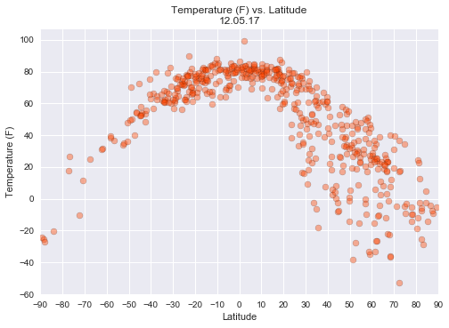
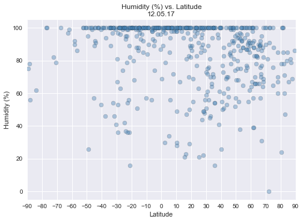
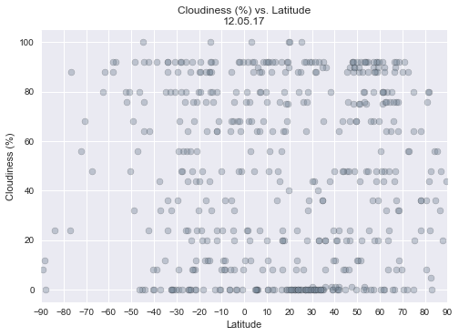
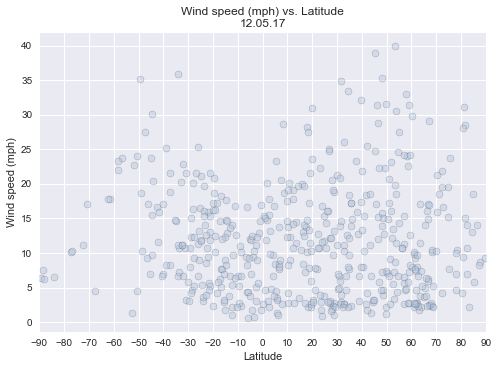

```python
from citipy import citipy
import pandas as pd
import matplotlib.pyplot as plt
import random
```


```python
# Prep request from OpenWeatherMap

import requests as req
import json

url = "http://api.openweathermap.org/data/2.5/weather"
api_key = "ab24206853f319ea96c17f7f686fb5a7"
```


```python
# Empty lists to fill

lats = []
longs = []
cities = []
temps = []
humids = []
clouds = []
winds = []
coords = []
```


```python
# Coordinates of random cities

while len(cities) < 500:
    # Store coords - Lat (-90 to +90) and long(-180 to +180)
    lat = random.randrange(-9000, 9000)/100
    long = random.randrange(-18000, 18000)/100
    # Store city name
    city = citipy.nearest_city(lat, long)
    if cities.count(city.city_name) == 0:
        cities.append(city.city_name)
        lats.append(lat)
        longs.append(long)
        coords.append([lat,long])
```


```python
# Get weather info and print log

for i, [lat, long] in enumerate(coords):
# Store temps
    temp = req.get(url, params = {
        "appid": api_key, "lat": lat, "lon": long,
        "units": "imperial"
        })
    temps.append(temp.json()["main"]["temp"])
    print("Processing city " + str((i + 1)) + "/500: ", cities[i],
          " | Temperature (F)\n", temp.url)
# Store humidity
    humid  = req.get(url, params = {
        "appid": api_key, "lat": lat, "lon": long
    })
    humids.append(humid.json()["main"]["humidity"])
    print("Processing city " + str((i + 1)) + "/500: ", cities[i],
          " | Humidity (%)\n", humid.url)
# Store cloudiness
    cloud  = req.get(url, params = {
        "appid": api_key, "lat": lat, "lon": long
    })
    clouds.append(cloud.json()["clouds"]["all"])
    print("Processing city " + str((i + 1)) + "/500: ", cities[i],
          " | Cloudiness (%)\n", cloud.url)
# Store windspeed
    wind  = req.get(url, params = {
        "appid": api_key, "lat": lat, "lon": long,
        "units": "imperial"
    })
    winds.append(wind.json()["wind"]["speed"])
    print("Processing city " + str((i + 1)) + "/500: ", cities[i],
          " | Wind speed (mph)\n", wind.url, "\n")
```

    Processing city 1/500:  vardo  | Temperature (F)
     http://api.openweathermap.org/data/2.5/weather?appid=ab24206853f319ea96c17f7f686fb5a7&lat=84.63&lon=34.38&units=imperial
    Processing city 1/500:  vardo  | Humidity (%)
     http://api.openweathermap.org/data/2.5/weather?appid=ab24206853f319ea96c17f7f686fb5a7&lat=84.63&lon=34.38
    Processing city 1/500:  vardo  | Cloudiness (%)
     http://api.openweathermap.org/data/2.5/weather?appid=ab24206853f319ea96c17f7f686fb5a7&lat=84.63&lon=34.38
    Processing city 1/500:  vardo  | Wind speed (mph)
     http://api.openweathermap.org/data/2.5/weather?appid=ab24206853f319ea96c17f7f686fb5a7&lat=84.63&lon=34.38&units=imperial 
    
    Processing city 2/500:  albany  | Temperature (F)
     http://api.openweathermap.org/data/2.5/weather?appid=ab24206853f319ea96c17f7f686fb5a7&lat=-61.75&lon=103.25&units=imperial
    Processing city 2/500:  albany  | Humidity (%)
     http://api.openweathermap.org/data/2.5/weather?appid=ab24206853f319ea96c17f7f686fb5a7&lat=-61.75&lon=103.25
    Processing city 2/500:  albany  | Cloudiness (%)
     http://api.openweathermap.org/data/2.5/weather?appid=ab24206853f319ea96c17f7f686fb5a7&lat=-61.75&lon=103.25
    Processing city 2/500:  albany  | Wind speed (mph)
     http://api.openweathermap.org/data/2.5/weather?appid=ab24206853f319ea96c17f7f686fb5a7&lat=-61.75&lon=103.25&units=imperial 
    
    Processing city 3/500:  rikitea  | Temperature (F)
     http://api.openweathermap.org/data/2.5/weather?appid=ab24206853f319ea96c17f7f686fb5a7&lat=-14.97&lon=-119.24&units=imperial
    Processing city 3/500:  rikitea  | Humidity (%)
     http://api.openweathermap.org/data/2.5/weather?appid=ab24206853f319ea96c17f7f686fb5a7&lat=-14.97&lon=-119.24
    Processing city 3/500:  rikitea  | Cloudiness (%)
     http://api.openweathermap.org/data/2.5/weather?appid=ab24206853f319ea96c17f7f686fb5a7&lat=-14.97&lon=-119.24
    Processing city 3/500:  rikitea  | Wind speed (mph)
     http://api.openweathermap.org/data/2.5/weather?appid=ab24206853f319ea96c17f7f686fb5a7&lat=-14.97&lon=-119.24&units=imperial 
    
    Processing city 4/500:  illoqqortoormiut  | Temperature (F)
     http://api.openweathermap.org/data/2.5/weather?appid=ab24206853f319ea96c17f7f686fb5a7&lat=75.07&lon=-20.88&units=imperial
    Processing city 4/500:  illoqqortoormiut  | Humidity (%)
     http://api.openweathermap.org/data/2.5/weather?appid=ab24206853f319ea96c17f7f686fb5a7&lat=75.07&lon=-20.88
    Processing city 4/500:  illoqqortoormiut  | Cloudiness (%)
     http://api.openweathermap.org/data/2.5/weather?appid=ab24206853f319ea96c17f7f686fb5a7&lat=75.07&lon=-20.88
    Processing city 4/500:  illoqqortoormiut  | Wind speed (mph)
     http://api.openweathermap.org/data/2.5/weather?appid=ab24206853f319ea96c17f7f686fb5a7&lat=75.07&lon=-20.88&units=imperial 
    
    Processing city 5/500:  nanortalik  | Temperature (F)
     http://api.openweathermap.org/data/2.5/weather?appid=ab24206853f319ea96c17f7f686fb5a7&lat=53.3&lon=-34.79&units=imperial
    Processing city 5/500:  nanortalik  | Humidity (%)
     http://api.openweathermap.org/data/2.5/weather?appid=ab24206853f319ea96c17f7f686fb5a7&lat=53.3&lon=-34.79
    Processing city 5/500:  nanortalik  | Cloudiness (%)
     http://api.openweathermap.org/data/2.5/weather?appid=ab24206853f319ea96c17f7f686fb5a7&lat=53.3&lon=-34.79
    Processing city 5/500:  nanortalik  | Wind speed (mph)
     http://api.openweathermap.org/data/2.5/weather?appid=ab24206853f319ea96c17f7f686fb5a7&lat=53.3&lon=-34.79&units=imperial 
    
    Processing city 6/500:  carnarvon  | Temperature (F)
     http://api.openweathermap.org/data/2.5/weather?appid=ab24206853f319ea96c17f7f686fb5a7&lat=-19.77&lon=106.58&units=imperial
    Processing city 6/500:  carnarvon  | Humidity (%)
     http://api.openweathermap.org/data/2.5/weather?appid=ab24206853f319ea96c17f7f686fb5a7&lat=-19.77&lon=106.58
    Processing city 6/500:  carnarvon  | Cloudiness (%)
     http://api.openweathermap.org/data/2.5/weather?appid=ab24206853f319ea96c17f7f686fb5a7&lat=-19.77&lon=106.58
    Processing city 6/500:  carnarvon  | Wind speed (mph)
     http://api.openweathermap.org/data/2.5/weather?appid=ab24206853f319ea96c17f7f686fb5a7&lat=-19.77&lon=106.58&units=imperial 
    
    Processing city 7/500:  vaini  | Temperature (F)
     http://api.openweathermap.org/data/2.5/weather?appid=ab24206853f319ea96c17f7f686fb5a7&lat=-76.83&lon=-179.61&units=imperial
    Processing city 7/500:  vaini  | Humidity (%)
     http://api.openweathermap.org/data/2.5/weather?appid=ab24206853f319ea96c17f7f686fb5a7&lat=-76.83&lon=-179.61
    Processing city 7/500:  vaini  | Cloudiness (%)
     http://api.openweathermap.org/data/2.5/weather?appid=ab24206853f319ea96c17f7f686fb5a7&lat=-76.83&lon=-179.61
    Processing city 7/500:  vaini  | Wind speed (mph)
     http://api.openweathermap.org/data/2.5/weather?appid=ab24206853f319ea96c17f7f686fb5a7&lat=-76.83&lon=-179.61&units=imperial 
    
    Processing city 8/500:  bathsheba  | Temperature (F)
     http://api.openweathermap.org/data/2.5/weather?appid=ab24206853f319ea96c17f7f686fb5a7&lat=16.52&lon=-54.24&units=imperial
    Processing city 8/500:  bathsheba  | Humidity (%)
     http://api.openweathermap.org/data/2.5/weather?appid=ab24206853f319ea96c17f7f686fb5a7&lat=16.52&lon=-54.24
    Processing city 8/500:  bathsheba  | Cloudiness (%)
     http://api.openweathermap.org/data/2.5/weather?appid=ab24206853f319ea96c17f7f686fb5a7&lat=16.52&lon=-54.24
    Processing city 8/500:  bathsheba  | Wind speed (mph)
     http://api.openweathermap.org/data/2.5/weather?appid=ab24206853f319ea96c17f7f686fb5a7&lat=16.52&lon=-54.24&units=imperial 
    
    Processing city 9/500:  lorengau  | Temperature (F)
     http://api.openweathermap.org/data/2.5/weather?appid=ab24206853f319ea96c17f7f686fb5a7&lat=6.75&lon=146.51&units=imperial
    Processing city 9/500:  lorengau  | Humidity (%)
     http://api.openweathermap.org/data/2.5/weather?appid=ab24206853f319ea96c17f7f686fb5a7&lat=6.75&lon=146.51
    Processing city 9/500:  lorengau  | Cloudiness (%)
     http://api.openweathermap.org/data/2.5/weather?appid=ab24206853f319ea96c17f7f686fb5a7&lat=6.75&lon=146.51
    Processing city 9/500:  lorengau  | Wind speed (mph)
     http://api.openweathermap.org/data/2.5/weather?appid=ab24206853f319ea96c17f7f686fb5a7&lat=6.75&lon=146.51&units=imperial 
    
    Processing city 10/500:  palabuhanratu  | Temperature (F)
     http://api.openweathermap.org/data/2.5/weather?appid=ab24206853f319ea96c17f7f686fb5a7&lat=-19.53&lon=98.7&units=imperial
    Processing city 10/500:  palabuhanratu  | Humidity (%)
     http://api.openweathermap.org/data/2.5/weather?appid=ab24206853f319ea96c17f7f686fb5a7&lat=-19.53&lon=98.7
    Processing city 10/500:  palabuhanratu  | Cloudiness (%)
     http://api.openweathermap.org/data/2.5/weather?appid=ab24206853f319ea96c17f7f686fb5a7&lat=-19.53&lon=98.7
    Processing city 10/500:  palabuhanratu  | Wind speed (mph)
     http://api.openweathermap.org/data/2.5/weather?appid=ab24206853f319ea96c17f7f686fb5a7&lat=-19.53&lon=98.7&units=imperial 
    
    Processing city 11/500:  hobart  | Temperature (F)
     http://api.openweathermap.org/data/2.5/weather?appid=ab24206853f319ea96c17f7f686fb5a7&lat=-56.78&lon=147.88&units=imperial
    Processing city 11/500:  hobart  | Humidity (%)
     http://api.openweathermap.org/data/2.5/weather?appid=ab24206853f319ea96c17f7f686fb5a7&lat=-56.78&lon=147.88
    Processing city 11/500:  hobart  | Cloudiness (%)
     http://api.openweathermap.org/data/2.5/weather?appid=ab24206853f319ea96c17f7f686fb5a7&lat=-56.78&lon=147.88
    Processing city 11/500:  hobart  | Wind speed (mph)
     http://api.openweathermap.org/data/2.5/weather?appid=ab24206853f319ea96c17f7f686fb5a7&lat=-56.78&lon=147.88&units=imperial 
    
    Processing city 12/500:  barentsburg  | Temperature (F)
     http://api.openweathermap.org/data/2.5/weather?appid=ab24206853f319ea96c17f7f686fb5a7&lat=81.63&lon=7.53&units=imperial
    Processing city 12/500:  barentsburg  | Humidity (%)
     http://api.openweathermap.org/data/2.5/weather?appid=ab24206853f319ea96c17f7f686fb5a7&lat=81.63&lon=7.53
    Processing city 12/500:  barentsburg  | Cloudiness (%)
     http://api.openweathermap.org/data/2.5/weather?appid=ab24206853f319ea96c17f7f686fb5a7&lat=81.63&lon=7.53
    Processing city 12/500:  barentsburg  | Wind speed (mph)
     http://api.openweathermap.org/data/2.5/weather?appid=ab24206853f319ea96c17f7f686fb5a7&lat=81.63&lon=7.53&units=imperial 
    
    Processing city 13/500:  mortka  | Temperature (F)
     http://api.openweathermap.org/data/2.5/weather?appid=ab24206853f319ea96c17f7f686fb5a7&lat=59.15&lon=66.24&units=imperial
    Processing city 13/500:  mortka  | Humidity (%)
     http://api.openweathermap.org/data/2.5/weather?appid=ab24206853f319ea96c17f7f686fb5a7&lat=59.15&lon=66.24
    Processing city 13/500:  mortka  | Cloudiness (%)
     http://api.openweathermap.org/data/2.5/weather?appid=ab24206853f319ea96c17f7f686fb5a7&lat=59.15&lon=66.24
    Processing city 13/500:  mortka  | Wind speed (mph)
     http://api.openweathermap.org/data/2.5/weather?appid=ab24206853f319ea96c17f7f686fb5a7&lat=59.15&lon=66.24&units=imperial 
    
    Processing city 14/500:  katsuura  | Temperature (F)
     http://api.openweathermap.org/data/2.5/weather?appid=ab24206853f319ea96c17f7f686fb5a7&lat=22.29&lon=151.74&units=imperial
    Processing city 14/500:  katsuura  | Humidity (%)
     http://api.openweathermap.org/data/2.5/weather?appid=ab24206853f319ea96c17f7f686fb5a7&lat=22.29&lon=151.74
    Processing city 14/500:  katsuura  | Cloudiness (%)
     http://api.openweathermap.org/data/2.5/weather?appid=ab24206853f319ea96c17f7f686fb5a7&lat=22.29&lon=151.74
    Processing city 14/500:  katsuura  | Wind speed (mph)
     http://api.openweathermap.org/data/2.5/weather?appid=ab24206853f319ea96c17f7f686fb5a7&lat=22.29&lon=151.74&units=imperial 
    
    Processing city 15/500:  zhuhai  | Temperature (F)
     http://api.openweathermap.org/data/2.5/weather?appid=ab24206853f319ea96c17f7f686fb5a7&lat=19.11&lon=114.66&units=imperial
    Processing city 15/500:  zhuhai  | Humidity (%)
     http://api.openweathermap.org/data/2.5/weather?appid=ab24206853f319ea96c17f7f686fb5a7&lat=19.11&lon=114.66
    Processing city 15/500:  zhuhai  | Cloudiness (%)
     http://api.openweathermap.org/data/2.5/weather?appid=ab24206853f319ea96c17f7f686fb5a7&lat=19.11&lon=114.66
    Processing city 15/500:  zhuhai  | Wind speed (mph)
     http://api.openweathermap.org/data/2.5/weather?appid=ab24206853f319ea96c17f7f686fb5a7&lat=19.11&lon=114.66&units=imperial 
    
    Processing city 16/500:  le port  | Temperature (F)
     http://api.openweathermap.org/data/2.5/weather?appid=ab24206853f319ea96c17f7f686fb5a7&lat=-20.14&lon=54.63&units=imperial
    Processing city 16/500:  le port  | Humidity (%)
     http://api.openweathermap.org/data/2.5/weather?appid=ab24206853f319ea96c17f7f686fb5a7&lat=-20.14&lon=54.63
    Processing city 16/500:  le port  | Cloudiness (%)
     http://api.openweathermap.org/data/2.5/weather?appid=ab24206853f319ea96c17f7f686fb5a7&lat=-20.14&lon=54.63
    Processing city 16/500:  le port  | Wind speed (mph)
     http://api.openweathermap.org/data/2.5/weather?appid=ab24206853f319ea96c17f7f686fb5a7&lat=-20.14&lon=54.63&units=imperial 
    
    Processing city 17/500:  butaritari  | Temperature (F)
     http://api.openweathermap.org/data/2.5/weather?appid=ab24206853f319ea96c17f7f686fb5a7&lat=28.22&lon=169.4&units=imperial
    Processing city 17/500:  butaritari  | Humidity (%)
     http://api.openweathermap.org/data/2.5/weather?appid=ab24206853f319ea96c17f7f686fb5a7&lat=28.22&lon=169.4
    Processing city 17/500:  butaritari  | Cloudiness (%)
     http://api.openweathermap.org/data/2.5/weather?appid=ab24206853f319ea96c17f7f686fb5a7&lat=28.22&lon=169.4
    Processing city 17/500:  butaritari  | Wind speed (mph)
     http://api.openweathermap.org/data/2.5/weather?appid=ab24206853f319ea96c17f7f686fb5a7&lat=28.22&lon=169.4&units=imperial 
    
    Processing city 18/500:  anadyr  | Temperature (F)
     http://api.openweathermap.org/data/2.5/weather?appid=ab24206853f319ea96c17f7f686fb5a7&lat=60.41&lon=172.62&units=imperial
    Processing city 18/500:  anadyr  | Humidity (%)
     http://api.openweathermap.org/data/2.5/weather?appid=ab24206853f319ea96c17f7f686fb5a7&lat=60.41&lon=172.62
    Processing city 18/500:  anadyr  | Cloudiness (%)
     http://api.openweathermap.org/data/2.5/weather?appid=ab24206853f319ea96c17f7f686fb5a7&lat=60.41&lon=172.62
    Processing city 18/500:  anadyr  | Wind speed (mph)
     http://api.openweathermap.org/data/2.5/weather?appid=ab24206853f319ea96c17f7f686fb5a7&lat=60.41&lon=172.62&units=imperial 
    
    Processing city 19/500:  tuktoyaktuk  | Temperature (F)
     http://api.openweathermap.org/data/2.5/weather?appid=ab24206853f319ea96c17f7f686fb5a7&lat=82.36&lon=-126.22&units=imperial
    Processing city 19/500:  tuktoyaktuk  | Humidity (%)
     http://api.openweathermap.org/data/2.5/weather?appid=ab24206853f319ea96c17f7f686fb5a7&lat=82.36&lon=-126.22
    Processing city 19/500:  tuktoyaktuk  | Cloudiness (%)
     http://api.openweathermap.org/data/2.5/weather?appid=ab24206853f319ea96c17f7f686fb5a7&lat=82.36&lon=-126.22
    Processing city 19/500:  tuktoyaktuk  | Wind speed (mph)
     http://api.openweathermap.org/data/2.5/weather?appid=ab24206853f319ea96c17f7f686fb5a7&lat=82.36&lon=-126.22&units=imperial 
    
    Processing city 20/500:  hendrina  | Temperature (F)
     http://api.openweathermap.org/data/2.5/weather?appid=ab24206853f319ea96c17f7f686fb5a7&lat=-26.11&lon=29.52&units=imperial
    Processing city 20/500:  hendrina  | Humidity (%)
     http://api.openweathermap.org/data/2.5/weather?appid=ab24206853f319ea96c17f7f686fb5a7&lat=-26.11&lon=29.52
    Processing city 20/500:  hendrina  | Cloudiness (%)
     http://api.openweathermap.org/data/2.5/weather?appid=ab24206853f319ea96c17f7f686fb5a7&lat=-26.11&lon=29.52
    Processing city 20/500:  hendrina  | Wind speed (mph)
     http://api.openweathermap.org/data/2.5/weather?appid=ab24206853f319ea96c17f7f686fb5a7&lat=-26.11&lon=29.52&units=imperial 
    
    Processing city 21/500:  yar-sale  | Temperature (F)
     http://api.openweathermap.org/data/2.5/weather?appid=ab24206853f319ea96c17f7f686fb5a7&lat=66.24&lon=69.79&units=imperial
    Processing city 21/500:  yar-sale  | Humidity (%)
     http://api.openweathermap.org/data/2.5/weather?appid=ab24206853f319ea96c17f7f686fb5a7&lat=66.24&lon=69.79
    Processing city 21/500:  yar-sale  | Cloudiness (%)
     http://api.openweathermap.org/data/2.5/weather?appid=ab24206853f319ea96c17f7f686fb5a7&lat=66.24&lon=69.79
    Processing city 21/500:  yar-sale  | Wind speed (mph)
     http://api.openweathermap.org/data/2.5/weather?appid=ab24206853f319ea96c17f7f686fb5a7&lat=66.24&lon=69.79&units=imperial 
    
    Processing city 22/500:  atuona  | Temperature (F)
     http://api.openweathermap.org/data/2.5/weather?appid=ab24206853f319ea96c17f7f686fb5a7&lat=-11.22&lon=-139.77&units=imperial
    Processing city 22/500:  atuona  | Humidity (%)
     http://api.openweathermap.org/data/2.5/weather?appid=ab24206853f319ea96c17f7f686fb5a7&lat=-11.22&lon=-139.77
    Processing city 22/500:  atuona  | Cloudiness (%)
     http://api.openweathermap.org/data/2.5/weather?appid=ab24206853f319ea96c17f7f686fb5a7&lat=-11.22&lon=-139.77
    Processing city 22/500:  atuona  | Wind speed (mph)
     http://api.openweathermap.org/data/2.5/weather?appid=ab24206853f319ea96c17f7f686fb5a7&lat=-11.22&lon=-139.77&units=imperial 
    
    Processing city 23/500:  lufilufi  | Temperature (F)
     http://api.openweathermap.org/data/2.5/weather?appid=ab24206853f319ea96c17f7f686fb5a7&lat=-4.55&lon=-166.64&units=imperial
    Processing city 23/500:  lufilufi  | Humidity (%)
     http://api.openweathermap.org/data/2.5/weather?appid=ab24206853f319ea96c17f7f686fb5a7&lat=-4.55&lon=-166.64
    Processing city 23/500:  lufilufi  | Cloudiness (%)
     http://api.openweathermap.org/data/2.5/weather?appid=ab24206853f319ea96c17f7f686fb5a7&lat=-4.55&lon=-166.64
    Processing city 23/500:  lufilufi  | Wind speed (mph)
     http://api.openweathermap.org/data/2.5/weather?appid=ab24206853f319ea96c17f7f686fb5a7&lat=-4.55&lon=-166.64&units=imperial 
    
    Processing city 24/500:  camacha  | Temperature (F)
     http://api.openweathermap.org/data/2.5/weather?appid=ab24206853f319ea96c17f7f686fb5a7&lat=39.63&lon=-16.13&units=imperial
    Processing city 24/500:  camacha  | Humidity (%)
     http://api.openweathermap.org/data/2.5/weather?appid=ab24206853f319ea96c17f7f686fb5a7&lat=39.63&lon=-16.13
    Processing city 24/500:  camacha  | Cloudiness (%)
     http://api.openweathermap.org/data/2.5/weather?appid=ab24206853f319ea96c17f7f686fb5a7&lat=39.63&lon=-16.13
    Processing city 24/500:  camacha  | Wind speed (mph)
     http://api.openweathermap.org/data/2.5/weather?appid=ab24206853f319ea96c17f7f686fb5a7&lat=39.63&lon=-16.13&units=imperial 
    
    Processing city 25/500:  longyearbyen  | Temperature (F)
     http://api.openweathermap.org/data/2.5/weather?appid=ab24206853f319ea96c17f7f686fb5a7&lat=87.79&lon=20.69&units=imperial
    Processing city 25/500:  longyearbyen  | Humidity (%)
     http://api.openweathermap.org/data/2.5/weather?appid=ab24206853f319ea96c17f7f686fb5a7&lat=87.79&lon=20.69
    Processing city 25/500:  longyearbyen  | Cloudiness (%)
     http://api.openweathermap.org/data/2.5/weather?appid=ab24206853f319ea96c17f7f686fb5a7&lat=87.79&lon=20.69
    Processing city 25/500:  longyearbyen  | Wind speed (mph)
     http://api.openweathermap.org/data/2.5/weather?appid=ab24206853f319ea96c17f7f686fb5a7&lat=87.79&lon=20.69&units=imperial 
    
    Processing city 26/500:  saint-philippe  | Temperature (F)
     http://api.openweathermap.org/data/2.5/weather?appid=ab24206853f319ea96c17f7f686fb5a7&lat=-23.45&lon=56.34&units=imperial
    Processing city 26/500:  saint-philippe  | Humidity (%)
     http://api.openweathermap.org/data/2.5/weather?appid=ab24206853f319ea96c17f7f686fb5a7&lat=-23.45&lon=56.34
    Processing city 26/500:  saint-philippe  | Cloudiness (%)
     http://api.openweathermap.org/data/2.5/weather?appid=ab24206853f319ea96c17f7f686fb5a7&lat=-23.45&lon=56.34
    Processing city 26/500:  saint-philippe  | Wind speed (mph)
     http://api.openweathermap.org/data/2.5/weather?appid=ab24206853f319ea96c17f7f686fb5a7&lat=-23.45&lon=56.34&units=imperial 
    
    Processing city 27/500:  jumla  | Temperature (F)
     http://api.openweathermap.org/data/2.5/weather?appid=ab24206853f319ea96c17f7f686fb5a7&lat=28.84&lon=82.98&units=imperial
    Processing city 27/500:  jumla  | Humidity (%)
     http://api.openweathermap.org/data/2.5/weather?appid=ab24206853f319ea96c17f7f686fb5a7&lat=28.84&lon=82.98
    Processing city 27/500:  jumla  | Cloudiness (%)
     http://api.openweathermap.org/data/2.5/weather?appid=ab24206853f319ea96c17f7f686fb5a7&lat=28.84&lon=82.98
    Processing city 27/500:  jumla  | Wind speed (mph)
     http://api.openweathermap.org/data/2.5/weather?appid=ab24206853f319ea96c17f7f686fb5a7&lat=28.84&lon=82.98&units=imperial 
    
    Processing city 28/500:  ushuaia  | Temperature (F)
     http://api.openweathermap.org/data/2.5/weather?appid=ab24206853f319ea96c17f7f686fb5a7&lat=-58.25&lon=-61.02&units=imperial
    Processing city 28/500:  ushuaia  | Humidity (%)
     http://api.openweathermap.org/data/2.5/weather?appid=ab24206853f319ea96c17f7f686fb5a7&lat=-58.25&lon=-61.02
    Processing city 28/500:  ushuaia  | Cloudiness (%)
     http://api.openweathermap.org/data/2.5/weather?appid=ab24206853f319ea96c17f7f686fb5a7&lat=-58.25&lon=-61.02
    Processing city 28/500:  ushuaia  | Wind speed (mph)
     http://api.openweathermap.org/data/2.5/weather?appid=ab24206853f319ea96c17f7f686fb5a7&lat=-58.25&lon=-61.02&units=imperial 
    
    Processing city 29/500:  hilo  | Temperature (F)
     http://api.openweathermap.org/data/2.5/weather?appid=ab24206853f319ea96c17f7f686fb5a7&lat=18.69&lon=-134.68&units=imperial
    Processing city 29/500:  hilo  | Humidity (%)
     http://api.openweathermap.org/data/2.5/weather?appid=ab24206853f319ea96c17f7f686fb5a7&lat=18.69&lon=-134.68
    Processing city 29/500:  hilo  | Cloudiness (%)
     http://api.openweathermap.org/data/2.5/weather?appid=ab24206853f319ea96c17f7f686fb5a7&lat=18.69&lon=-134.68
    Processing city 29/500:  hilo  | Wind speed (mph)
     http://api.openweathermap.org/data/2.5/weather?appid=ab24206853f319ea96c17f7f686fb5a7&lat=18.69&lon=-134.68&units=imperial 
    
    Processing city 30/500:  kavieng  | Temperature (F)
     http://api.openweathermap.org/data/2.5/weather?appid=ab24206853f319ea96c17f7f686fb5a7&lat=2.41&lon=151.63&units=imperial
    Processing city 30/500:  kavieng  | Humidity (%)
     http://api.openweathermap.org/data/2.5/weather?appid=ab24206853f319ea96c17f7f686fb5a7&lat=2.41&lon=151.63
    Processing city 30/500:  kavieng  | Cloudiness (%)
     http://api.openweathermap.org/data/2.5/weather?appid=ab24206853f319ea96c17f7f686fb5a7&lat=2.41&lon=151.63
    Processing city 30/500:  kavieng  | Wind speed (mph)
     http://api.openweathermap.org/data/2.5/weather?appid=ab24206853f319ea96c17f7f686fb5a7&lat=2.41&lon=151.63&units=imperial 
    
    Processing city 31/500:  honningsvag  | Temperature (F)
     http://api.openweathermap.org/data/2.5/weather?appid=ab24206853f319ea96c17f7f686fb5a7&lat=80.89&lon=26.06&units=imperial
    Processing city 31/500:  honningsvag  | Humidity (%)
     http://api.openweathermap.org/data/2.5/weather?appid=ab24206853f319ea96c17f7f686fb5a7&lat=80.89&lon=26.06
    Processing city 31/500:  honningsvag  | Cloudiness (%)
     http://api.openweathermap.org/data/2.5/weather?appid=ab24206853f319ea96c17f7f686fb5a7&lat=80.89&lon=26.06
    Processing city 31/500:  honningsvag  | Wind speed (mph)
     http://api.openweathermap.org/data/2.5/weather?appid=ab24206853f319ea96c17f7f686fb5a7&lat=80.89&lon=26.06&units=imperial 
    
    Processing city 32/500:  punta arenas  | Temperature (F)
     http://api.openweathermap.org/data/2.5/weather?appid=ab24206853f319ea96c17f7f686fb5a7&lat=-88.11&lon=-116.99&units=imperial
    Processing city 32/500:  punta arenas  | Humidity (%)
     http://api.openweathermap.org/data/2.5/weather?appid=ab24206853f319ea96c17f7f686fb5a7&lat=-88.11&lon=-116.99
    Processing city 32/500:  punta arenas  | Cloudiness (%)
     http://api.openweathermap.org/data/2.5/weather?appid=ab24206853f319ea96c17f7f686fb5a7&lat=-88.11&lon=-116.99
    Processing city 32/500:  punta arenas  | Wind speed (mph)
     http://api.openweathermap.org/data/2.5/weather?appid=ab24206853f319ea96c17f7f686fb5a7&lat=-88.11&lon=-116.99&units=imperial 
    
    Processing city 33/500:  broome  | Temperature (F)
     http://api.openweathermap.org/data/2.5/weather?appid=ab24206853f319ea96c17f7f686fb5a7&lat=-22.97&lon=124.68&units=imperial
    Processing city 33/500:  broome  | Humidity (%)
     http://api.openweathermap.org/data/2.5/weather?appid=ab24206853f319ea96c17f7f686fb5a7&lat=-22.97&lon=124.68
    Processing city 33/500:  broome  | Cloudiness (%)
     http://api.openweathermap.org/data/2.5/weather?appid=ab24206853f319ea96c17f7f686fb5a7&lat=-22.97&lon=124.68
    Processing city 33/500:  broome  | Wind speed (mph)
     http://api.openweathermap.org/data/2.5/weather?appid=ab24206853f319ea96c17f7f686fb5a7&lat=-22.97&lon=124.68&units=imperial 
    
    Processing city 34/500:  nogent-le-rotrou  | Temperature (F)
     http://api.openweathermap.org/data/2.5/weather?appid=ab24206853f319ea96c17f7f686fb5a7&lat=48.54&lon=0.67&units=imperial
    Processing city 34/500:  nogent-le-rotrou  | Humidity (%)
     http://api.openweathermap.org/data/2.5/weather?appid=ab24206853f319ea96c17f7f686fb5a7&lat=48.54&lon=0.67
    Processing city 34/500:  nogent-le-rotrou  | Cloudiness (%)
     http://api.openweathermap.org/data/2.5/weather?appid=ab24206853f319ea96c17f7f686fb5a7&lat=48.54&lon=0.67
    Processing city 34/500:  nogent-le-rotrou  | Wind speed (mph)
     http://api.openweathermap.org/data/2.5/weather?appid=ab24206853f319ea96c17f7f686fb5a7&lat=48.54&lon=0.67&units=imperial 
    
    Processing city 35/500:  busselton  | Temperature (F)
     http://api.openweathermap.org/data/2.5/weather?appid=ab24206853f319ea96c17f7f686fb5a7&lat=-34.9&lon=115.55&units=imperial
    Processing city 35/500:  busselton  | Humidity (%)
     http://api.openweathermap.org/data/2.5/weather?appid=ab24206853f319ea96c17f7f686fb5a7&lat=-34.9&lon=115.55
    Processing city 35/500:  busselton  | Cloudiness (%)
     http://api.openweathermap.org/data/2.5/weather?appid=ab24206853f319ea96c17f7f686fb5a7&lat=-34.9&lon=115.55
    Processing city 35/500:  busselton  | Wind speed (mph)
     http://api.openweathermap.org/data/2.5/weather?appid=ab24206853f319ea96c17f7f686fb5a7&lat=-34.9&lon=115.55&units=imperial 
    
    Processing city 36/500:  batemans bay  | Temperature (F)
     http://api.openweathermap.org/data/2.5/weather?appid=ab24206853f319ea96c17f7f686fb5a7&lat=-38.92&lon=153.16&units=imperial
    Processing city 36/500:  batemans bay  | Humidity (%)
     http://api.openweathermap.org/data/2.5/weather?appid=ab24206853f319ea96c17f7f686fb5a7&lat=-38.92&lon=153.16
    Processing city 36/500:  batemans bay  | Cloudiness (%)
     http://api.openweathermap.org/data/2.5/weather?appid=ab24206853f319ea96c17f7f686fb5a7&lat=-38.92&lon=153.16
    Processing city 36/500:  batemans bay  | Wind speed (mph)
     http://api.openweathermap.org/data/2.5/weather?appid=ab24206853f319ea96c17f7f686fb5a7&lat=-38.92&lon=153.16&units=imperial 
    
    Processing city 37/500:  paradwip  | Temperature (F)
     http://api.openweathermap.org/data/2.5/weather?appid=ab24206853f319ea96c17f7f686fb5a7&lat=17.74&lon=88.32&units=imperial
    Processing city 37/500:  paradwip  | Humidity (%)
     http://api.openweathermap.org/data/2.5/weather?appid=ab24206853f319ea96c17f7f686fb5a7&lat=17.74&lon=88.32
    Processing city 37/500:  paradwip  | Cloudiness (%)
     http://api.openweathermap.org/data/2.5/weather?appid=ab24206853f319ea96c17f7f686fb5a7&lat=17.74&lon=88.32
    Processing city 37/500:  paradwip  | Wind speed (mph)
     http://api.openweathermap.org/data/2.5/weather?appid=ab24206853f319ea96c17f7f686fb5a7&lat=17.74&lon=88.32&units=imperial 
    
    Processing city 38/500:  nuevo progreso  | Temperature (F)
     http://api.openweathermap.org/data/2.5/weather?appid=ab24206853f319ea96c17f7f686fb5a7&lat=23.99&lon=-95.81&units=imperial
    Processing city 38/500:  nuevo progreso  | Humidity (%)
     http://api.openweathermap.org/data/2.5/weather?appid=ab24206853f319ea96c17f7f686fb5a7&lat=23.99&lon=-95.81
    Processing city 38/500:  nuevo progreso  | Cloudiness (%)
     http://api.openweathermap.org/data/2.5/weather?appid=ab24206853f319ea96c17f7f686fb5a7&lat=23.99&lon=-95.81
    Processing city 38/500:  nuevo progreso  | Wind speed (mph)
     http://api.openweathermap.org/data/2.5/weather?appid=ab24206853f319ea96c17f7f686fb5a7&lat=23.99&lon=-95.81&units=imperial 
    
    Processing city 39/500:  nizwa  | Temperature (F)
     http://api.openweathermap.org/data/2.5/weather?appid=ab24206853f319ea96c17f7f686fb5a7&lat=23.77&lon=57.32&units=imperial
    Processing city 39/500:  nizwa  | Humidity (%)
     http://api.openweathermap.org/data/2.5/weather?appid=ab24206853f319ea96c17f7f686fb5a7&lat=23.77&lon=57.32
    Processing city 39/500:  nizwa  | Cloudiness (%)
     http://api.openweathermap.org/data/2.5/weather?appid=ab24206853f319ea96c17f7f686fb5a7&lat=23.77&lon=57.32
    Processing city 39/500:  nizwa  | Wind speed (mph)
     http://api.openweathermap.org/data/2.5/weather?appid=ab24206853f319ea96c17f7f686fb5a7&lat=23.77&lon=57.32&units=imperial 
    
    Processing city 40/500:  monrovia  | Temperature (F)
     http://api.openweathermap.org/data/2.5/weather?appid=ab24206853f319ea96c17f7f686fb5a7&lat=4.59&lon=-11.62&units=imperial
    Processing city 40/500:  monrovia  | Humidity (%)
     http://api.openweathermap.org/data/2.5/weather?appid=ab24206853f319ea96c17f7f686fb5a7&lat=4.59&lon=-11.62
    Processing city 40/500:  monrovia  | Cloudiness (%)
     http://api.openweathermap.org/data/2.5/weather?appid=ab24206853f319ea96c17f7f686fb5a7&lat=4.59&lon=-11.62
    Processing city 40/500:  monrovia  | Wind speed (mph)
     http://api.openweathermap.org/data/2.5/weather?appid=ab24206853f319ea96c17f7f686fb5a7&lat=4.59&lon=-11.62&units=imperial 
    
    Processing city 41/500:  richards bay  | Temperature (F)
     http://api.openweathermap.org/data/2.5/weather?appid=ab24206853f319ea96c17f7f686fb5a7&lat=-28.47&lon=32.23&units=imperial
    Processing city 41/500:  richards bay  | Humidity (%)
     http://api.openweathermap.org/data/2.5/weather?appid=ab24206853f319ea96c17f7f686fb5a7&lat=-28.47&lon=32.23
    Processing city 41/500:  richards bay  | Cloudiness (%)
     http://api.openweathermap.org/data/2.5/weather?appid=ab24206853f319ea96c17f7f686fb5a7&lat=-28.47&lon=32.23
    Processing city 41/500:  richards bay  | Wind speed (mph)
     http://api.openweathermap.org/data/2.5/weather?appid=ab24206853f319ea96c17f7f686fb5a7&lat=-28.47&lon=32.23&units=imperial 
    
    Processing city 42/500:  seymchan  | Temperature (F)
     http://api.openweathermap.org/data/2.5/weather?appid=ab24206853f319ea96c17f7f686fb5a7&lat=62.79&lon=153.65&units=imperial
    Processing city 42/500:  seymchan  | Humidity (%)
     http://api.openweathermap.org/data/2.5/weather?appid=ab24206853f319ea96c17f7f686fb5a7&lat=62.79&lon=153.65
    Processing city 42/500:  seymchan  | Cloudiness (%)
     http://api.openweathermap.org/data/2.5/weather?appid=ab24206853f319ea96c17f7f686fb5a7&lat=62.79&lon=153.65
    Processing city 42/500:  seymchan  | Wind speed (mph)
     http://api.openweathermap.org/data/2.5/weather?appid=ab24206853f319ea96c17f7f686fb5a7&lat=62.79&lon=153.65&units=imperial 
    
    Processing city 43/500:  meulaboh  | Temperature (F)
     http://api.openweathermap.org/data/2.5/weather?appid=ab24206853f319ea96c17f7f686fb5a7&lat=1.57&lon=94.25&units=imperial
    Processing city 43/500:  meulaboh  | Humidity (%)
     http://api.openweathermap.org/data/2.5/weather?appid=ab24206853f319ea96c17f7f686fb5a7&lat=1.57&lon=94.25
    Processing city 43/500:  meulaboh  | Cloudiness (%)
     http://api.openweathermap.org/data/2.5/weather?appid=ab24206853f319ea96c17f7f686fb5a7&lat=1.57&lon=94.25
    Processing city 43/500:  meulaboh  | Wind speed (mph)
     http://api.openweathermap.org/data/2.5/weather?appid=ab24206853f319ea96c17f7f686fb5a7&lat=1.57&lon=94.25&units=imperial 
    
    Processing city 44/500:  mugur-aksy  | Temperature (F)
     http://api.openweathermap.org/data/2.5/weather?appid=ab24206853f319ea96c17f7f686fb5a7&lat=49.59&lon=90.82&units=imperial
    Processing city 44/500:  mugur-aksy  | Humidity (%)
     http://api.openweathermap.org/data/2.5/weather?appid=ab24206853f319ea96c17f7f686fb5a7&lat=49.59&lon=90.82
    Processing city 44/500:  mugur-aksy  | Cloudiness (%)
     http://api.openweathermap.org/data/2.5/weather?appid=ab24206853f319ea96c17f7f686fb5a7&lat=49.59&lon=90.82
    Processing city 44/500:  mugur-aksy  | Wind speed (mph)
     http://api.openweathermap.org/data/2.5/weather?appid=ab24206853f319ea96c17f7f686fb5a7&lat=49.59&lon=90.82&units=imperial 
    
    Processing city 45/500:  tsihombe  | Temperature (F)
     http://api.openweathermap.org/data/2.5/weather?appid=ab24206853f319ea96c17f7f686fb5a7&lat=-52.05&lon=50.23&units=imperial
    Processing city 45/500:  tsihombe  | Humidity (%)
     http://api.openweathermap.org/data/2.5/weather?appid=ab24206853f319ea96c17f7f686fb5a7&lat=-52.05&lon=50.23
    Processing city 45/500:  tsihombe  | Cloudiness (%)
     http://api.openweathermap.org/data/2.5/weather?appid=ab24206853f319ea96c17f7f686fb5a7&lat=-52.05&lon=50.23
    Processing city 45/500:  tsihombe  | Wind speed (mph)
     http://api.openweathermap.org/data/2.5/weather?appid=ab24206853f319ea96c17f7f686fb5a7&lat=-52.05&lon=50.23&units=imperial 
    
    Processing city 46/500:  chicama  | Temperature (F)
     http://api.openweathermap.org/data/2.5/weather?appid=ab24206853f319ea96c17f7f686fb5a7&lat=-12.27&lon=-85.45&units=imperial
    Processing city 46/500:  chicama  | Humidity (%)
     http://api.openweathermap.org/data/2.5/weather?appid=ab24206853f319ea96c17f7f686fb5a7&lat=-12.27&lon=-85.45
    Processing city 46/500:  chicama  | Cloudiness (%)
     http://api.openweathermap.org/data/2.5/weather?appid=ab24206853f319ea96c17f7f686fb5a7&lat=-12.27&lon=-85.45
    Processing city 46/500:  chicama  | Wind speed (mph)
     http://api.openweathermap.org/data/2.5/weather?appid=ab24206853f319ea96c17f7f686fb5a7&lat=-12.27&lon=-85.45&units=imperial 
    
    Processing city 47/500:  east london  | Temperature (F)
     http://api.openweathermap.org/data/2.5/weather?appid=ab24206853f319ea96c17f7f686fb5a7&lat=-42.52&lon=36.29&units=imperial
    Processing city 47/500:  east london  | Humidity (%)
     http://api.openweathermap.org/data/2.5/weather?appid=ab24206853f319ea96c17f7f686fb5a7&lat=-42.52&lon=36.29
    Processing city 47/500:  east london  | Cloudiness (%)
     http://api.openweathermap.org/data/2.5/weather?appid=ab24206853f319ea96c17f7f686fb5a7&lat=-42.52&lon=36.29
    Processing city 47/500:  east london  | Wind speed (mph)
     http://api.openweathermap.org/data/2.5/weather?appid=ab24206853f319ea96c17f7f686fb5a7&lat=-42.52&lon=36.29&units=imperial 
    
    Processing city 48/500:  hervey bay  | Temperature (F)
     http://api.openweathermap.org/data/2.5/weather?appid=ab24206853f319ea96c17f7f686fb5a7&lat=-24.92&lon=157.76&units=imperial
    Processing city 48/500:  hervey bay  | Humidity (%)
     http://api.openweathermap.org/data/2.5/weather?appid=ab24206853f319ea96c17f7f686fb5a7&lat=-24.92&lon=157.76
    Processing city 48/500:  hervey bay  | Cloudiness (%)
     http://api.openweathermap.org/data/2.5/weather?appid=ab24206853f319ea96c17f7f686fb5a7&lat=-24.92&lon=157.76
    Processing city 48/500:  hervey bay  | Wind speed (mph)
     http://api.openweathermap.org/data/2.5/weather?appid=ab24206853f319ea96c17f7f686fb5a7&lat=-24.92&lon=157.76&units=imperial 
    
    Processing city 49/500:  ossora  | Temperature (F)
     http://api.openweathermap.org/data/2.5/weather?appid=ab24206853f319ea96c17f7f686fb5a7&lat=59.51&lon=162.92&units=imperial
    Processing city 49/500:  ossora  | Humidity (%)
     http://api.openweathermap.org/data/2.5/weather?appid=ab24206853f319ea96c17f7f686fb5a7&lat=59.51&lon=162.92
    Processing city 49/500:  ossora  | Cloudiness (%)
     http://api.openweathermap.org/data/2.5/weather?appid=ab24206853f319ea96c17f7f686fb5a7&lat=59.51&lon=162.92
    Processing city 49/500:  ossora  | Wind speed (mph)
     http://api.openweathermap.org/data/2.5/weather?appid=ab24206853f319ea96c17f7f686fb5a7&lat=59.51&lon=162.92&units=imperial 
    
    Processing city 50/500:  thompson  | Temperature (F)
     http://api.openweathermap.org/data/2.5/weather?appid=ab24206853f319ea96c17f7f686fb5a7&lat=63.63&lon=-89.61&units=imperial
    Processing city 50/500:  thompson  | Humidity (%)
     http://api.openweathermap.org/data/2.5/weather?appid=ab24206853f319ea96c17f7f686fb5a7&lat=63.63&lon=-89.61
    Processing city 50/500:  thompson  | Cloudiness (%)
     http://api.openweathermap.org/data/2.5/weather?appid=ab24206853f319ea96c17f7f686fb5a7&lat=63.63&lon=-89.61
    Processing city 50/500:  thompson  | Wind speed (mph)
     http://api.openweathermap.org/data/2.5/weather?appid=ab24206853f319ea96c17f7f686fb5a7&lat=63.63&lon=-89.61&units=imperial 
    
    Processing city 51/500:  mataura  | Temperature (F)
     http://api.openweathermap.org/data/2.5/weather?appid=ab24206853f319ea96c17f7f686fb5a7&lat=-49.38&lon=-148.07&units=imperial
    Processing city 51/500:  mataura  | Humidity (%)
     http://api.openweathermap.org/data/2.5/weather?appid=ab24206853f319ea96c17f7f686fb5a7&lat=-49.38&lon=-148.07
    Processing city 51/500:  mataura  | Cloudiness (%)
     http://api.openweathermap.org/data/2.5/weather?appid=ab24206853f319ea96c17f7f686fb5a7&lat=-49.38&lon=-148.07
    Processing city 51/500:  mataura  | Wind speed (mph)
     http://api.openweathermap.org/data/2.5/weather?appid=ab24206853f319ea96c17f7f686fb5a7&lat=-49.38&lon=-148.07&units=imperial 
    
    Processing city 52/500:  verkhnyaya inta  | Temperature (F)
     http://api.openweathermap.org/data/2.5/weather?appid=ab24206853f319ea96c17f7f686fb5a7&lat=66.06&lon=60.69&units=imperial
    Processing city 52/500:  verkhnyaya inta  | Humidity (%)
     http://api.openweathermap.org/data/2.5/weather?appid=ab24206853f319ea96c17f7f686fb5a7&lat=66.06&lon=60.69
    Processing city 52/500:  verkhnyaya inta  | Cloudiness (%)
     http://api.openweathermap.org/data/2.5/weather?appid=ab24206853f319ea96c17f7f686fb5a7&lat=66.06&lon=60.69
    Processing city 52/500:  verkhnyaya inta  | Wind speed (mph)
     http://api.openweathermap.org/data/2.5/weather?appid=ab24206853f319ea96c17f7f686fb5a7&lat=66.06&lon=60.69&units=imperial 
    
    Processing city 53/500:  mys shmidta  | Temperature (F)
     http://api.openweathermap.org/data/2.5/weather?appid=ab24206853f319ea96c17f7f686fb5a7&lat=89.47&lon=-178.03&units=imperial
    Processing city 53/500:  mys shmidta  | Humidity (%)
     http://api.openweathermap.org/data/2.5/weather?appid=ab24206853f319ea96c17f7f686fb5a7&lat=89.47&lon=-178.03
    Processing city 53/500:  mys shmidta  | Cloudiness (%)
     http://api.openweathermap.org/data/2.5/weather?appid=ab24206853f319ea96c17f7f686fb5a7&lat=89.47&lon=-178.03
    Processing city 53/500:  mys shmidta  | Wind speed (mph)
     http://api.openweathermap.org/data/2.5/weather?appid=ab24206853f319ea96c17f7f686fb5a7&lat=89.47&lon=-178.03&units=imperial 
    
    Processing city 54/500:  olafsvik  | Temperature (F)
     http://api.openweathermap.org/data/2.5/weather?appid=ab24206853f319ea96c17f7f686fb5a7&lat=63.53&lon=-27.65&units=imperial
    Processing city 54/500:  olafsvik  | Humidity (%)
     http://api.openweathermap.org/data/2.5/weather?appid=ab24206853f319ea96c17f7f686fb5a7&lat=63.53&lon=-27.65
    Processing city 54/500:  olafsvik  | Cloudiness (%)
     http://api.openweathermap.org/data/2.5/weather?appid=ab24206853f319ea96c17f7f686fb5a7&lat=63.53&lon=-27.65
    Processing city 54/500:  olafsvik  | Wind speed (mph)
     http://api.openweathermap.org/data/2.5/weather?appid=ab24206853f319ea96c17f7f686fb5a7&lat=63.53&lon=-27.65&units=imperial 
    
    Processing city 55/500:  luderitz  | Temperature (F)
     http://api.openweathermap.org/data/2.5/weather?appid=ab24206853f319ea96c17f7f686fb5a7&lat=-33.8&lon=2.83&units=imperial
    Processing city 55/500:  luderitz  | Humidity (%)
     http://api.openweathermap.org/data/2.5/weather?appid=ab24206853f319ea96c17f7f686fb5a7&lat=-33.8&lon=2.83
    Processing city 55/500:  luderitz  | Cloudiness (%)
     http://api.openweathermap.org/data/2.5/weather?appid=ab24206853f319ea96c17f7f686fb5a7&lat=-33.8&lon=2.83
    Processing city 55/500:  luderitz  | Wind speed (mph)
     http://api.openweathermap.org/data/2.5/weather?appid=ab24206853f319ea96c17f7f686fb5a7&lat=-33.8&lon=2.83&units=imperial 
    
    Processing city 56/500:  coquimbo  | Temperature (F)
     http://api.openweathermap.org/data/2.5/weather?appid=ab24206853f319ea96c17f7f686fb5a7&lat=-28.74&lon=-79.54&units=imperial
    Processing city 56/500:  coquimbo  | Humidity (%)
     http://api.openweathermap.org/data/2.5/weather?appid=ab24206853f319ea96c17f7f686fb5a7&lat=-28.74&lon=-79.54
    Processing city 56/500:  coquimbo  | Cloudiness (%)
     http://api.openweathermap.org/data/2.5/weather?appid=ab24206853f319ea96c17f7f686fb5a7&lat=-28.74&lon=-79.54
    Processing city 56/500:  coquimbo  | Wind speed (mph)
     http://api.openweathermap.org/data/2.5/weather?appid=ab24206853f319ea96c17f7f686fb5a7&lat=-28.74&lon=-79.54&units=imperial 
    
    Processing city 57/500:  tura  | Temperature (F)
     http://api.openweathermap.org/data/2.5/weather?appid=ab24206853f319ea96c17f7f686fb5a7&lat=67.97&lon=101.35&units=imperial
    Processing city 57/500:  tura  | Humidity (%)
     http://api.openweathermap.org/data/2.5/weather?appid=ab24206853f319ea96c17f7f686fb5a7&lat=67.97&lon=101.35
    Processing city 57/500:  tura  | Cloudiness (%)
     http://api.openweathermap.org/data/2.5/weather?appid=ab24206853f319ea96c17f7f686fb5a7&lat=67.97&lon=101.35
    Processing city 57/500:  tura  | Wind speed (mph)
     http://api.openweathermap.org/data/2.5/weather?appid=ab24206853f319ea96c17f7f686fb5a7&lat=67.97&lon=101.35&units=imperial 
    
    Processing city 58/500:  mayo  | Temperature (F)
     http://api.openweathermap.org/data/2.5/weather?appid=ab24206853f319ea96c17f7f686fb5a7&lat=63.9&lon=-132.42&units=imperial
    Processing city 58/500:  mayo  | Humidity (%)
     http://api.openweathermap.org/data/2.5/weather?appid=ab24206853f319ea96c17f7f686fb5a7&lat=63.9&lon=-132.42
    Processing city 58/500:  mayo  | Cloudiness (%)
     http://api.openweathermap.org/data/2.5/weather?appid=ab24206853f319ea96c17f7f686fb5a7&lat=63.9&lon=-132.42
    Processing city 58/500:  mayo  | Wind speed (mph)
     http://api.openweathermap.org/data/2.5/weather?appid=ab24206853f319ea96c17f7f686fb5a7&lat=63.9&lon=-132.42&units=imperial 
    
    Processing city 59/500:  coihaique  | Temperature (F)
     http://api.openweathermap.org/data/2.5/weather?appid=ab24206853f319ea96c17f7f686fb5a7&lat=-48.48&lon=-75.88&units=imperial
    Processing city 59/500:  coihaique  | Humidity (%)
     http://api.openweathermap.org/data/2.5/weather?appid=ab24206853f319ea96c17f7f686fb5a7&lat=-48.48&lon=-75.88
    Processing city 59/500:  coihaique  | Cloudiness (%)
     http://api.openweathermap.org/data/2.5/weather?appid=ab24206853f319ea96c17f7f686fb5a7&lat=-48.48&lon=-75.88
    Processing city 59/500:  coihaique  | Wind speed (mph)
     http://api.openweathermap.org/data/2.5/weather?appid=ab24206853f319ea96c17f7f686fb5a7&lat=-48.48&lon=-75.88&units=imperial 
    
    Processing city 60/500:  fort nelson  | Temperature (F)
     http://api.openweathermap.org/data/2.5/weather?appid=ab24206853f319ea96c17f7f686fb5a7&lat=60.27&lon=-121.29&units=imperial
    Processing city 60/500:  fort nelson  | Humidity (%)
     http://api.openweathermap.org/data/2.5/weather?appid=ab24206853f319ea96c17f7f686fb5a7&lat=60.27&lon=-121.29
    Processing city 60/500:  fort nelson  | Cloudiness (%)
     http://api.openweathermap.org/data/2.5/weather?appid=ab24206853f319ea96c17f7f686fb5a7&lat=60.27&lon=-121.29
    Processing city 60/500:  fort nelson  | Wind speed (mph)
     http://api.openweathermap.org/data/2.5/weather?appid=ab24206853f319ea96c17f7f686fb5a7&lat=60.27&lon=-121.29&units=imperial 
    
    Processing city 61/500:  lasa  | Temperature (F)
     http://api.openweathermap.org/data/2.5/weather?appid=ab24206853f319ea96c17f7f686fb5a7&lat=31.02&lon=90.22&units=imperial
    Processing city 61/500:  lasa  | Humidity (%)
     http://api.openweathermap.org/data/2.5/weather?appid=ab24206853f319ea96c17f7f686fb5a7&lat=31.02&lon=90.22
    Processing city 61/500:  lasa  | Cloudiness (%)
     http://api.openweathermap.org/data/2.5/weather?appid=ab24206853f319ea96c17f7f686fb5a7&lat=31.02&lon=90.22
    Processing city 61/500:  lasa  | Wind speed (mph)
     http://api.openweathermap.org/data/2.5/weather?appid=ab24206853f319ea96c17f7f686fb5a7&lat=31.02&lon=90.22&units=imperial 
    
    Processing city 62/500:  kieta  | Temperature (F)
     http://api.openweathermap.org/data/2.5/weather?appid=ab24206853f319ea96c17f7f686fb5a7&lat=0.6&lon=158.83&units=imperial
    Processing city 62/500:  kieta  | Humidity (%)
     http://api.openweathermap.org/data/2.5/weather?appid=ab24206853f319ea96c17f7f686fb5a7&lat=0.6&lon=158.83
    Processing city 62/500:  kieta  | Cloudiness (%)
     http://api.openweathermap.org/data/2.5/weather?appid=ab24206853f319ea96c17f7f686fb5a7&lat=0.6&lon=158.83
    Processing city 62/500:  kieta  | Wind speed (mph)
     http://api.openweathermap.org/data/2.5/weather?appid=ab24206853f319ea96c17f7f686fb5a7&lat=0.6&lon=158.83&units=imperial 
    
    Processing city 63/500:  puerto ayora  | Temperature (F)
     http://api.openweathermap.org/data/2.5/weather?appid=ab24206853f319ea96c17f7f686fb5a7&lat=-28.08&lon=-102.67&units=imperial
    Processing city 63/500:  puerto ayora  | Humidity (%)
     http://api.openweathermap.org/data/2.5/weather?appid=ab24206853f319ea96c17f7f686fb5a7&lat=-28.08&lon=-102.67
    Processing city 63/500:  puerto ayora  | Cloudiness (%)
     http://api.openweathermap.org/data/2.5/weather?appid=ab24206853f319ea96c17f7f686fb5a7&lat=-28.08&lon=-102.67
    Processing city 63/500:  puerto ayora  | Wind speed (mph)
     http://api.openweathermap.org/data/2.5/weather?appid=ab24206853f319ea96c17f7f686fb5a7&lat=-28.08&lon=-102.67&units=imperial 
    
    Processing city 64/500:  kavaratti  | Temperature (F)
     http://api.openweathermap.org/data/2.5/weather?appid=ab24206853f319ea96c17f7f686fb5a7&lat=12.17&lon=71.16&units=imperial
    Processing city 64/500:  kavaratti  | Humidity (%)
     http://api.openweathermap.org/data/2.5/weather?appid=ab24206853f319ea96c17f7f686fb5a7&lat=12.17&lon=71.16
    Processing city 64/500:  kavaratti  | Cloudiness (%)
     http://api.openweathermap.org/data/2.5/weather?appid=ab24206853f319ea96c17f7f686fb5a7&lat=12.17&lon=71.16
    Processing city 64/500:  kavaratti  | Wind speed (mph)
     http://api.openweathermap.org/data/2.5/weather?appid=ab24206853f319ea96c17f7f686fb5a7&lat=12.17&lon=71.16&units=imperial 
    
    Processing city 65/500:  hithadhoo  | Temperature (F)
     http://api.openweathermap.org/data/2.5/weather?appid=ab24206853f319ea96c17f7f686fb5a7&lat=-8.64&lon=70.69&units=imperial
    Processing city 65/500:  hithadhoo  | Humidity (%)
     http://api.openweathermap.org/data/2.5/weather?appid=ab24206853f319ea96c17f7f686fb5a7&lat=-8.64&lon=70.69
    Processing city 65/500:  hithadhoo  | Cloudiness (%)
     http://api.openweathermap.org/data/2.5/weather?appid=ab24206853f319ea96c17f7f686fb5a7&lat=-8.64&lon=70.69
    Processing city 65/500:  hithadhoo  | Wind speed (mph)
     http://api.openweathermap.org/data/2.5/weather?appid=ab24206853f319ea96c17f7f686fb5a7&lat=-8.64&lon=70.69&units=imperial 
    
    Processing city 66/500:  provideniya  | Temperature (F)
     http://api.openweathermap.org/data/2.5/weather?appid=ab24206853f319ea96c17f7f686fb5a7&lat=51.95&lon=-174.21&units=imperial
    Processing city 66/500:  provideniya  | Humidity (%)
     http://api.openweathermap.org/data/2.5/weather?appid=ab24206853f319ea96c17f7f686fb5a7&lat=51.95&lon=-174.21
    Processing city 66/500:  provideniya  | Cloudiness (%)
     http://api.openweathermap.org/data/2.5/weather?appid=ab24206853f319ea96c17f7f686fb5a7&lat=51.95&lon=-174.21
    Processing city 66/500:  provideniya  | Wind speed (mph)
     http://api.openweathermap.org/data/2.5/weather?appid=ab24206853f319ea96c17f7f686fb5a7&lat=51.95&lon=-174.21&units=imperial 
    
    Processing city 67/500:  acapulco  | Temperature (F)
     http://api.openweathermap.org/data/2.5/weather?appid=ab24206853f319ea96c17f7f686fb5a7&lat=9.72&lon=-102.72&units=imperial
    Processing city 67/500:  acapulco  | Humidity (%)
     http://api.openweathermap.org/data/2.5/weather?appid=ab24206853f319ea96c17f7f686fb5a7&lat=9.72&lon=-102.72
    Processing city 67/500:  acapulco  | Cloudiness (%)
     http://api.openweathermap.org/data/2.5/weather?appid=ab24206853f319ea96c17f7f686fb5a7&lat=9.72&lon=-102.72
    Processing city 67/500:  acapulco  | Wind speed (mph)
     http://api.openweathermap.org/data/2.5/weather?appid=ab24206853f319ea96c17f7f686fb5a7&lat=9.72&lon=-102.72&units=imperial 
    
    Processing city 68/500:  mar del plata  | Temperature (F)
     http://api.openweathermap.org/data/2.5/weather?appid=ab24206853f319ea96c17f7f686fb5a7&lat=-46.52&lon=-52.83&units=imperial
    Processing city 68/500:  mar del plata  | Humidity (%)
     http://api.openweathermap.org/data/2.5/weather?appid=ab24206853f319ea96c17f7f686fb5a7&lat=-46.52&lon=-52.83
    Processing city 68/500:  mar del plata  | Cloudiness (%)
     http://api.openweathermap.org/data/2.5/weather?appid=ab24206853f319ea96c17f7f686fb5a7&lat=-46.52&lon=-52.83
    Processing city 68/500:  mar del plata  | Wind speed (mph)
     http://api.openweathermap.org/data/2.5/weather?appid=ab24206853f319ea96c17f7f686fb5a7&lat=-46.52&lon=-52.83&units=imperial 
    
    Processing city 69/500:  bereznik  | Temperature (F)
     http://api.openweathermap.org/data/2.5/weather?appid=ab24206853f319ea96c17f7f686fb5a7&lat=63.38&lon=42.57&units=imperial
    Processing city 69/500:  bereznik  | Humidity (%)
     http://api.openweathermap.org/data/2.5/weather?appid=ab24206853f319ea96c17f7f686fb5a7&lat=63.38&lon=42.57
    Processing city 69/500:  bereznik  | Cloudiness (%)
     http://api.openweathermap.org/data/2.5/weather?appid=ab24206853f319ea96c17f7f686fb5a7&lat=63.38&lon=42.57
    Processing city 69/500:  bereznik  | Wind speed (mph)
     http://api.openweathermap.org/data/2.5/weather?appid=ab24206853f319ea96c17f7f686fb5a7&lat=63.38&lon=42.57&units=imperial 
    
    Processing city 70/500:  alofi  | Temperature (F)
     http://api.openweathermap.org/data/2.5/weather?appid=ab24206853f319ea96c17f7f686fb5a7&lat=-26.21&lon=-166.17&units=imperial
    Processing city 70/500:  alofi  | Humidity (%)
     http://api.openweathermap.org/data/2.5/weather?appid=ab24206853f319ea96c17f7f686fb5a7&lat=-26.21&lon=-166.17
    Processing city 70/500:  alofi  | Cloudiness (%)
     http://api.openweathermap.org/data/2.5/weather?appid=ab24206853f319ea96c17f7f686fb5a7&lat=-26.21&lon=-166.17
    Processing city 70/500:  alofi  | Wind speed (mph)
     http://api.openweathermap.org/data/2.5/weather?appid=ab24206853f319ea96c17f7f686fb5a7&lat=-26.21&lon=-166.17&units=imperial 
    
    Processing city 71/500:  verkh-usugli  | Temperature (F)
     http://api.openweathermap.org/data/2.5/weather?appid=ab24206853f319ea96c17f7f686fb5a7&lat=52.55&lon=114.45&units=imperial
    Processing city 71/500:  verkh-usugli  | Humidity (%)
     http://api.openweathermap.org/data/2.5/weather?appid=ab24206853f319ea96c17f7f686fb5a7&lat=52.55&lon=114.45
    Processing city 71/500:  verkh-usugli  | Cloudiness (%)
     http://api.openweathermap.org/data/2.5/weather?appid=ab24206853f319ea96c17f7f686fb5a7&lat=52.55&lon=114.45
    Processing city 71/500:  verkh-usugli  | Wind speed (mph)
     http://api.openweathermap.org/data/2.5/weather?appid=ab24206853f319ea96c17f7f686fb5a7&lat=52.55&lon=114.45&units=imperial 
    
    Processing city 72/500:  ghatanji  | Temperature (F)
     http://api.openweathermap.org/data/2.5/weather?appid=ab24206853f319ea96c17f7f686fb5a7&lat=20.32&lon=78.31&units=imperial
    Processing city 72/500:  ghatanji  | Humidity (%)
     http://api.openweathermap.org/data/2.5/weather?appid=ab24206853f319ea96c17f7f686fb5a7&lat=20.32&lon=78.31
    Processing city 72/500:  ghatanji  | Cloudiness (%)
     http://api.openweathermap.org/data/2.5/weather?appid=ab24206853f319ea96c17f7f686fb5a7&lat=20.32&lon=78.31
    Processing city 72/500:  ghatanji  | Wind speed (mph)
     http://api.openweathermap.org/data/2.5/weather?appid=ab24206853f319ea96c17f7f686fb5a7&lat=20.32&lon=78.31&units=imperial 
    
    Processing city 73/500:  palmer  | Temperature (F)
     http://api.openweathermap.org/data/2.5/weather?appid=ab24206853f319ea96c17f7f686fb5a7&lat=59.28&lon=-146.81&units=imperial
    Processing city 73/500:  palmer  | Humidity (%)
     http://api.openweathermap.org/data/2.5/weather?appid=ab24206853f319ea96c17f7f686fb5a7&lat=59.28&lon=-146.81
    Processing city 73/500:  palmer  | Cloudiness (%)
     http://api.openweathermap.org/data/2.5/weather?appid=ab24206853f319ea96c17f7f686fb5a7&lat=59.28&lon=-146.81
    Processing city 73/500:  palmer  | Wind speed (mph)
     http://api.openweathermap.org/data/2.5/weather?appid=ab24206853f319ea96c17f7f686fb5a7&lat=59.28&lon=-146.81&units=imperial 
    
    Processing city 74/500:  asau  | Temperature (F)
     http://api.openweathermap.org/data/2.5/weather?appid=ab24206853f319ea96c17f7f686fb5a7&lat=-12.25&lon=174.81&units=imperial
    Processing city 74/500:  asau  | Humidity (%)
     http://api.openweathermap.org/data/2.5/weather?appid=ab24206853f319ea96c17f7f686fb5a7&lat=-12.25&lon=174.81
    Processing city 74/500:  asau  | Cloudiness (%)
     http://api.openweathermap.org/data/2.5/weather?appid=ab24206853f319ea96c17f7f686fb5a7&lat=-12.25&lon=174.81
    Processing city 74/500:  asau  | Wind speed (mph)
     http://api.openweathermap.org/data/2.5/weather?appid=ab24206853f319ea96c17f7f686fb5a7&lat=-12.25&lon=174.81&units=imperial 
    
    Processing city 75/500:  jamestown  | Temperature (F)
     http://api.openweathermap.org/data/2.5/weather?appid=ab24206853f319ea96c17f7f686fb5a7&lat=-22.02&lon=-14.63&units=imperial
    Processing city 75/500:  jamestown  | Humidity (%)
     http://api.openweathermap.org/data/2.5/weather?appid=ab24206853f319ea96c17f7f686fb5a7&lat=-22.02&lon=-14.63
    Processing city 75/500:  jamestown  | Cloudiness (%)
     http://api.openweathermap.org/data/2.5/weather?appid=ab24206853f319ea96c17f7f686fb5a7&lat=-22.02&lon=-14.63
    Processing city 75/500:  jamestown  | Wind speed (mph)
     http://api.openweathermap.org/data/2.5/weather?appid=ab24206853f319ea96c17f7f686fb5a7&lat=-22.02&lon=-14.63&units=imperial 
    
    Processing city 76/500:  bethel  | Temperature (F)
     http://api.openweathermap.org/data/2.5/weather?appid=ab24206853f319ea96c17f7f686fb5a7&lat=56.98&lon=-163.9&units=imperial
    Processing city 76/500:  bethel  | Humidity (%)
     http://api.openweathermap.org/data/2.5/weather?appid=ab24206853f319ea96c17f7f686fb5a7&lat=56.98&lon=-163.9
    Processing city 76/500:  bethel  | Cloudiness (%)
     http://api.openweathermap.org/data/2.5/weather?appid=ab24206853f319ea96c17f7f686fb5a7&lat=56.98&lon=-163.9
    Processing city 76/500:  bethel  | Wind speed (mph)
     http://api.openweathermap.org/data/2.5/weather?appid=ab24206853f319ea96c17f7f686fb5a7&lat=56.98&lon=-163.9&units=imperial 
    
    Processing city 77/500:  ziro  | Temperature (F)
     http://api.openweathermap.org/data/2.5/weather?appid=ab24206853f319ea96c17f7f686fb5a7&lat=27.65&lon=93.54&units=imperial
    Processing city 77/500:  ziro  | Humidity (%)
     http://api.openweathermap.org/data/2.5/weather?appid=ab24206853f319ea96c17f7f686fb5a7&lat=27.65&lon=93.54
    Processing city 77/500:  ziro  | Cloudiness (%)
     http://api.openweathermap.org/data/2.5/weather?appid=ab24206853f319ea96c17f7f686fb5a7&lat=27.65&lon=93.54
    Processing city 77/500:  ziro  | Wind speed (mph)
     http://api.openweathermap.org/data/2.5/weather?appid=ab24206853f319ea96c17f7f686fb5a7&lat=27.65&lon=93.54&units=imperial 
    
    Processing city 78/500:  taltal  | Temperature (F)
     http://api.openweathermap.org/data/2.5/weather?appid=ab24206853f319ea96c17f7f686fb5a7&lat=-24.73&lon=-76.07&units=imperial
    Processing city 78/500:  taltal  | Humidity (%)
     http://api.openweathermap.org/data/2.5/weather?appid=ab24206853f319ea96c17f7f686fb5a7&lat=-24.73&lon=-76.07
    Processing city 78/500:  taltal  | Cloudiness (%)
     http://api.openweathermap.org/data/2.5/weather?appid=ab24206853f319ea96c17f7f686fb5a7&lat=-24.73&lon=-76.07
    Processing city 78/500:  taltal  | Wind speed (mph)
     http://api.openweathermap.org/data/2.5/weather?appid=ab24206853f319ea96c17f7f686fb5a7&lat=-24.73&lon=-76.07&units=imperial 
    
    Processing city 79/500:  inyonga  | Temperature (F)
     http://api.openweathermap.org/data/2.5/weather?appid=ab24206853f319ea96c17f7f686fb5a7&lat=-6.34&lon=32.47&units=imperial
    Processing city 79/500:  inyonga  | Humidity (%)
     http://api.openweathermap.org/data/2.5/weather?appid=ab24206853f319ea96c17f7f686fb5a7&lat=-6.34&lon=32.47
    Processing city 79/500:  inyonga  | Cloudiness (%)
     http://api.openweathermap.org/data/2.5/weather?appid=ab24206853f319ea96c17f7f686fb5a7&lat=-6.34&lon=32.47
    Processing city 79/500:  inyonga  | Wind speed (mph)
     http://api.openweathermap.org/data/2.5/weather?appid=ab24206853f319ea96c17f7f686fb5a7&lat=-6.34&lon=32.47&units=imperial 
    
    Processing city 80/500:  nikolskoye  | Temperature (F)
     http://api.openweathermap.org/data/2.5/weather?appid=ab24206853f319ea96c17f7f686fb5a7&lat=47.95&lon=178.85&units=imperial
    Processing city 80/500:  nikolskoye  | Humidity (%)
     http://api.openweathermap.org/data/2.5/weather?appid=ab24206853f319ea96c17f7f686fb5a7&lat=47.95&lon=178.85
    Processing city 80/500:  nikolskoye  | Cloudiness (%)
     http://api.openweathermap.org/data/2.5/weather?appid=ab24206853f319ea96c17f7f686fb5a7&lat=47.95&lon=178.85
    Processing city 80/500:  nikolskoye  | Wind speed (mph)
     http://api.openweathermap.org/data/2.5/weather?appid=ab24206853f319ea96c17f7f686fb5a7&lat=47.95&lon=178.85&units=imperial 
    
    Processing city 81/500:  taolanaro  | Temperature (F)
     http://api.openweathermap.org/data/2.5/weather?appid=ab24206853f319ea96c17f7f686fb5a7&lat=-47.41&lon=55.1&units=imperial
    Processing city 81/500:  taolanaro  | Humidity (%)
     http://api.openweathermap.org/data/2.5/weather?appid=ab24206853f319ea96c17f7f686fb5a7&lat=-47.41&lon=55.1
    Processing city 81/500:  taolanaro  | Cloudiness (%)
     http://api.openweathermap.org/data/2.5/weather?appid=ab24206853f319ea96c17f7f686fb5a7&lat=-47.41&lon=55.1
    Processing city 81/500:  taolanaro  | Wind speed (mph)
     http://api.openweathermap.org/data/2.5/weather?appid=ab24206853f319ea96c17f7f686fb5a7&lat=-47.41&lon=55.1&units=imperial 
    
    Processing city 82/500:  victoria  | Temperature (F)
     http://api.openweathermap.org/data/2.5/weather?appid=ab24206853f319ea96c17f7f686fb5a7&lat=-0.98&lon=52.08&units=imperial
    Processing city 82/500:  victoria  | Humidity (%)
     http://api.openweathermap.org/data/2.5/weather?appid=ab24206853f319ea96c17f7f686fb5a7&lat=-0.98&lon=52.08
    Processing city 82/500:  victoria  | Cloudiness (%)
     http://api.openweathermap.org/data/2.5/weather?appid=ab24206853f319ea96c17f7f686fb5a7&lat=-0.98&lon=52.08
    Processing city 82/500:  victoria  | Wind speed (mph)
     http://api.openweathermap.org/data/2.5/weather?appid=ab24206853f319ea96c17f7f686fb5a7&lat=-0.98&lon=52.08&units=imperial 
    
    Processing city 83/500:  marsa matruh  | Temperature (F)
     http://api.openweathermap.org/data/2.5/weather?appid=ab24206853f319ea96c17f7f686fb5a7&lat=31.08&lon=27.7&units=imperial
    Processing city 83/500:  marsa matruh  | Humidity (%)
     http://api.openweathermap.org/data/2.5/weather?appid=ab24206853f319ea96c17f7f686fb5a7&lat=31.08&lon=27.7
    Processing city 83/500:  marsa matruh  | Cloudiness (%)
     http://api.openweathermap.org/data/2.5/weather?appid=ab24206853f319ea96c17f7f686fb5a7&lat=31.08&lon=27.7
    Processing city 83/500:  marsa matruh  | Wind speed (mph)
     http://api.openweathermap.org/data/2.5/weather?appid=ab24206853f319ea96c17f7f686fb5a7&lat=31.08&lon=27.7&units=imperial 
    
    Processing city 84/500:  koslan  | Temperature (F)
     http://api.openweathermap.org/data/2.5/weather?appid=ab24206853f319ea96c17f7f686fb5a7&lat=64.45&lon=50.5&units=imperial
    Processing city 84/500:  koslan  | Humidity (%)
     http://api.openweathermap.org/data/2.5/weather?appid=ab24206853f319ea96c17f7f686fb5a7&lat=64.45&lon=50.5
    Processing city 84/500:  koslan  | Cloudiness (%)
     http://api.openweathermap.org/data/2.5/weather?appid=ab24206853f319ea96c17f7f686fb5a7&lat=64.45&lon=50.5
    Processing city 84/500:  koslan  | Wind speed (mph)
     http://api.openweathermap.org/data/2.5/weather?appid=ab24206853f319ea96c17f7f686fb5a7&lat=64.45&lon=50.5&units=imperial 
    
    Processing city 85/500:  nishihara  | Temperature (F)
     http://api.openweathermap.org/data/2.5/weather?appid=ab24206853f319ea96c17f7f686fb5a7&lat=19.79&lon=135.86&units=imperial
    Processing city 85/500:  nishihara  | Humidity (%)
     http://api.openweathermap.org/data/2.5/weather?appid=ab24206853f319ea96c17f7f686fb5a7&lat=19.79&lon=135.86
    Processing city 85/500:  nishihara  | Cloudiness (%)
     http://api.openweathermap.org/data/2.5/weather?appid=ab24206853f319ea96c17f7f686fb5a7&lat=19.79&lon=135.86
    Processing city 85/500:  nishihara  | Wind speed (mph)
     http://api.openweathermap.org/data/2.5/weather?appid=ab24206853f319ea96c17f7f686fb5a7&lat=19.79&lon=135.86&units=imperial 
    
    Processing city 86/500:  dikson  | Temperature (F)
     http://api.openweathermap.org/data/2.5/weather?appid=ab24206853f319ea96c17f7f686fb5a7&lat=75.44&lon=80.36&units=imperial
    Processing city 86/500:  dikson  | Humidity (%)
     http://api.openweathermap.org/data/2.5/weather?appid=ab24206853f319ea96c17f7f686fb5a7&lat=75.44&lon=80.36
    Processing city 86/500:  dikson  | Cloudiness (%)
     http://api.openweathermap.org/data/2.5/weather?appid=ab24206853f319ea96c17f7f686fb5a7&lat=75.44&lon=80.36
    Processing city 86/500:  dikson  | Wind speed (mph)
     http://api.openweathermap.org/data/2.5/weather?appid=ab24206853f319ea96c17f7f686fb5a7&lat=75.44&lon=80.36&units=imperial 
    
    Processing city 87/500:  sentyabrskiy  | Temperature (F)
     http://api.openweathermap.org/data/2.5/weather?appid=ab24206853f319ea96c17f7f686fb5a7&lat=32.82&lon=155.77&units=imperial
    Processing city 87/500:  sentyabrskiy  | Humidity (%)
     http://api.openweathermap.org/data/2.5/weather?appid=ab24206853f319ea96c17f7f686fb5a7&lat=32.82&lon=155.77
    Processing city 87/500:  sentyabrskiy  | Cloudiness (%)
     http://api.openweathermap.org/data/2.5/weather?appid=ab24206853f319ea96c17f7f686fb5a7&lat=32.82&lon=155.77
    Processing city 87/500:  sentyabrskiy  | Wind speed (mph)
     http://api.openweathermap.org/data/2.5/weather?appid=ab24206853f319ea96c17f7f686fb5a7&lat=32.82&lon=155.77&units=imperial 
    
    Processing city 88/500:  ilulissat  | Temperature (F)
     http://api.openweathermap.org/data/2.5/weather?appid=ab24206853f319ea96c17f7f686fb5a7&lat=83.07&lon=-43.53&units=imperial
    Processing city 88/500:  ilulissat  | Humidity (%)
     http://api.openweathermap.org/data/2.5/weather?appid=ab24206853f319ea96c17f7f686fb5a7&lat=83.07&lon=-43.53
    Processing city 88/500:  ilulissat  | Cloudiness (%)
     http://api.openweathermap.org/data/2.5/weather?appid=ab24206853f319ea96c17f7f686fb5a7&lat=83.07&lon=-43.53
    Processing city 88/500:  ilulissat  | Wind speed (mph)
     http://api.openweathermap.org/data/2.5/weather?appid=ab24206853f319ea96c17f7f686fb5a7&lat=83.07&lon=-43.53&units=imperial 
    
    Processing city 89/500:  ancud  | Temperature (F)
     http://api.openweathermap.org/data/2.5/weather?appid=ab24206853f319ea96c17f7f686fb5a7&lat=-42.37&lon=-94.4&units=imperial
    Processing city 89/500:  ancud  | Humidity (%)
     http://api.openweathermap.org/data/2.5/weather?appid=ab24206853f319ea96c17f7f686fb5a7&lat=-42.37&lon=-94.4
    Processing city 89/500:  ancud  | Cloudiness (%)
     http://api.openweathermap.org/data/2.5/weather?appid=ab24206853f319ea96c17f7f686fb5a7&lat=-42.37&lon=-94.4
    Processing city 89/500:  ancud  | Wind speed (mph)
     http://api.openweathermap.org/data/2.5/weather?appid=ab24206853f319ea96c17f7f686fb5a7&lat=-42.37&lon=-94.4&units=imperial 
    
    Processing city 90/500:  sao filipe  | Temperature (F)
     http://api.openweathermap.org/data/2.5/weather?appid=ab24206853f319ea96c17f7f686fb5a7&lat=12.41&lon=-27.0&units=imperial
    Processing city 90/500:  sao filipe  | Humidity (%)
     http://api.openweathermap.org/data/2.5/weather?appid=ab24206853f319ea96c17f7f686fb5a7&lat=12.41&lon=-27.0
    Processing city 90/500:  sao filipe  | Cloudiness (%)
     http://api.openweathermap.org/data/2.5/weather?appid=ab24206853f319ea96c17f7f686fb5a7&lat=12.41&lon=-27.0
    Processing city 90/500:  sao filipe  | Wind speed (mph)
     http://api.openweathermap.org/data/2.5/weather?appid=ab24206853f319ea96c17f7f686fb5a7&lat=12.41&lon=-27.0&units=imperial 
    
    Processing city 91/500:  qom  | Temperature (F)
     http://api.openweathermap.org/data/2.5/weather?appid=ab24206853f319ea96c17f7f686fb5a7&lat=34.47&lon=50.68&units=imperial
    Processing city 91/500:  qom  | Humidity (%)
     http://api.openweathermap.org/data/2.5/weather?appid=ab24206853f319ea96c17f7f686fb5a7&lat=34.47&lon=50.68
    Processing city 91/500:  qom  | Cloudiness (%)
     http://api.openweathermap.org/data/2.5/weather?appid=ab24206853f319ea96c17f7f686fb5a7&lat=34.47&lon=50.68
    Processing city 91/500:  qom  | Wind speed (mph)
     http://api.openweathermap.org/data/2.5/weather?appid=ab24206853f319ea96c17f7f686fb5a7&lat=34.47&lon=50.68&units=imperial 
    
    Processing city 92/500:  tuatapere  | Temperature (F)
     http://api.openweathermap.org/data/2.5/weather?appid=ab24206853f319ea96c17f7f686fb5a7&lat=-58.23&lon=157.84&units=imperial
    Processing city 92/500:  tuatapere  | Humidity (%)
     http://api.openweathermap.org/data/2.5/weather?appid=ab24206853f319ea96c17f7f686fb5a7&lat=-58.23&lon=157.84
    Processing city 92/500:  tuatapere  | Cloudiness (%)
     http://api.openweathermap.org/data/2.5/weather?appid=ab24206853f319ea96c17f7f686fb5a7&lat=-58.23&lon=157.84
    Processing city 92/500:  tuatapere  | Wind speed (mph)
     http://api.openweathermap.org/data/2.5/weather?appid=ab24206853f319ea96c17f7f686fb5a7&lat=-58.23&lon=157.84&units=imperial 
    
    Processing city 93/500:  bloemfontein  | Temperature (F)
     http://api.openweathermap.org/data/2.5/weather?appid=ab24206853f319ea96c17f7f686fb5a7&lat=-29.37&lon=26.22&units=imperial
    Processing city 93/500:  bloemfontein  | Humidity (%)
     http://api.openweathermap.org/data/2.5/weather?appid=ab24206853f319ea96c17f7f686fb5a7&lat=-29.37&lon=26.22
    Processing city 93/500:  bloemfontein  | Cloudiness (%)
     http://api.openweathermap.org/data/2.5/weather?appid=ab24206853f319ea96c17f7f686fb5a7&lat=-29.37&lon=26.22
    Processing city 93/500:  bloemfontein  | Wind speed (mph)
     http://api.openweathermap.org/data/2.5/weather?appid=ab24206853f319ea96c17f7f686fb5a7&lat=-29.37&lon=26.22&units=imperial 
    
    Processing city 94/500:  tazovskiy  | Temperature (F)
     http://api.openweathermap.org/data/2.5/weather?appid=ab24206853f319ea96c17f7f686fb5a7&lat=71.05&lon=76.2&units=imperial
    Processing city 94/500:  tazovskiy  | Humidity (%)
     http://api.openweathermap.org/data/2.5/weather?appid=ab24206853f319ea96c17f7f686fb5a7&lat=71.05&lon=76.2
    Processing city 94/500:  tazovskiy  | Cloudiness (%)
     http://api.openweathermap.org/data/2.5/weather?appid=ab24206853f319ea96c17f7f686fb5a7&lat=71.05&lon=76.2
    Processing city 94/500:  tazovskiy  | Wind speed (mph)
     http://api.openweathermap.org/data/2.5/weather?appid=ab24206853f319ea96c17f7f686fb5a7&lat=71.05&lon=76.2&units=imperial 
    
    Processing city 95/500:  sorland  | Temperature (F)
     http://api.openweathermap.org/data/2.5/weather?appid=ab24206853f319ea96c17f7f686fb5a7&lat=70.27&lon=6.13&units=imperial
    Processing city 95/500:  sorland  | Humidity (%)
     http://api.openweathermap.org/data/2.5/weather?appid=ab24206853f319ea96c17f7f686fb5a7&lat=70.27&lon=6.13
    Processing city 95/500:  sorland  | Cloudiness (%)
     http://api.openweathermap.org/data/2.5/weather?appid=ab24206853f319ea96c17f7f686fb5a7&lat=70.27&lon=6.13
    Processing city 95/500:  sorland  | Wind speed (mph)
     http://api.openweathermap.org/data/2.5/weather?appid=ab24206853f319ea96c17f7f686fb5a7&lat=70.27&lon=6.13&units=imperial 
    
    Processing city 96/500:  kampot  | Temperature (F)
     http://api.openweathermap.org/data/2.5/weather?appid=ab24206853f319ea96c17f7f686fb5a7&lat=9.84&lon=102.89&units=imperial
    Processing city 96/500:  kampot  | Humidity (%)
     http://api.openweathermap.org/data/2.5/weather?appid=ab24206853f319ea96c17f7f686fb5a7&lat=9.84&lon=102.89
    Processing city 96/500:  kampot  | Cloudiness (%)
     http://api.openweathermap.org/data/2.5/weather?appid=ab24206853f319ea96c17f7f686fb5a7&lat=9.84&lon=102.89
    Processing city 96/500:  kampot  | Wind speed (mph)
     http://api.openweathermap.org/data/2.5/weather?appid=ab24206853f319ea96c17f7f686fb5a7&lat=9.84&lon=102.89&units=imperial 
    
    Processing city 97/500:  puerto del rosario  | Temperature (F)
     http://api.openweathermap.org/data/2.5/weather?appid=ab24206853f319ea96c17f7f686fb5a7&lat=25.43&lon=-11.67&units=imperial
    Processing city 97/500:  puerto del rosario  | Humidity (%)
     http://api.openweathermap.org/data/2.5/weather?appid=ab24206853f319ea96c17f7f686fb5a7&lat=25.43&lon=-11.67
    Processing city 97/500:  puerto del rosario  | Cloudiness (%)
     http://api.openweathermap.org/data/2.5/weather?appid=ab24206853f319ea96c17f7f686fb5a7&lat=25.43&lon=-11.67
    Processing city 97/500:  puerto del rosario  | Wind speed (mph)
     http://api.openweathermap.org/data/2.5/weather?appid=ab24206853f319ea96c17f7f686fb5a7&lat=25.43&lon=-11.67&units=imperial 
    
    Processing city 98/500:  bambous virieux  | Temperature (F)
     http://api.openweathermap.org/data/2.5/weather?appid=ab24206853f319ea96c17f7f686fb5a7&lat=-22.2&lon=63.29&units=imperial
    Processing city 98/500:  bambous virieux  | Humidity (%)
     http://api.openweathermap.org/data/2.5/weather?appid=ab24206853f319ea96c17f7f686fb5a7&lat=-22.2&lon=63.29
    Processing city 98/500:  bambous virieux  | Cloudiness (%)
     http://api.openweathermap.org/data/2.5/weather?appid=ab24206853f319ea96c17f7f686fb5a7&lat=-22.2&lon=63.29
    Processing city 98/500:  bambous virieux  | Wind speed (mph)
     http://api.openweathermap.org/data/2.5/weather?appid=ab24206853f319ea96c17f7f686fb5a7&lat=-22.2&lon=63.29&units=imperial 
    
    Processing city 99/500:  todos santos  | Temperature (F)
     http://api.openweathermap.org/data/2.5/weather?appid=ab24206853f319ea96c17f7f686fb5a7&lat=23.24&lon=-111.06&units=imperial
    Processing city 99/500:  todos santos  | Humidity (%)
     http://api.openweathermap.org/data/2.5/weather?appid=ab24206853f319ea96c17f7f686fb5a7&lat=23.24&lon=-111.06
    Processing city 99/500:  todos santos  | Cloudiness (%)
     http://api.openweathermap.org/data/2.5/weather?appid=ab24206853f319ea96c17f7f686fb5a7&lat=23.24&lon=-111.06
    Processing city 99/500:  todos santos  | Wind speed (mph)
     http://api.openweathermap.org/data/2.5/weather?appid=ab24206853f319ea96c17f7f686fb5a7&lat=23.24&lon=-111.06&units=imperial 
    
    Processing city 100/500:  bluff  | Temperature (F)
     http://api.openweathermap.org/data/2.5/weather?appid=ab24206853f319ea96c17f7f686fb5a7&lat=-50.64&lon=168.94&units=imperial
    Processing city 100/500:  bluff  | Humidity (%)
     http://api.openweathermap.org/data/2.5/weather?appid=ab24206853f319ea96c17f7f686fb5a7&lat=-50.64&lon=168.94
    Processing city 100/500:  bluff  | Cloudiness (%)
     http://api.openweathermap.org/data/2.5/weather?appid=ab24206853f319ea96c17f7f686fb5a7&lat=-50.64&lon=168.94
    Processing city 100/500:  bluff  | Wind speed (mph)
     http://api.openweathermap.org/data/2.5/weather?appid=ab24206853f319ea96c17f7f686fb5a7&lat=-50.64&lon=168.94&units=imperial 
    
    Processing city 101/500:  belushya guba  | Temperature (F)
     http://api.openweathermap.org/data/2.5/weather?appid=ab24206853f319ea96c17f7f686fb5a7&lat=86.45&lon=47.86&units=imperial
    Processing city 101/500:  belushya guba  | Humidity (%)
     http://api.openweathermap.org/data/2.5/weather?appid=ab24206853f319ea96c17f7f686fb5a7&lat=86.45&lon=47.86
    Processing city 101/500:  belushya guba  | Cloudiness (%)
     http://api.openweathermap.org/data/2.5/weather?appid=ab24206853f319ea96c17f7f686fb5a7&lat=86.45&lon=47.86
    Processing city 101/500:  belushya guba  | Wind speed (mph)
     http://api.openweathermap.org/data/2.5/weather?appid=ab24206853f319ea96c17f7f686fb5a7&lat=86.45&lon=47.86&units=imperial 
    
    Processing city 102/500:  yellowknife  | Temperature (F)
     http://api.openweathermap.org/data/2.5/weather?appid=ab24206853f319ea96c17f7f686fb5a7&lat=81.69&lon=-111.94&units=imperial
    Processing city 102/500:  yellowknife  | Humidity (%)
     http://api.openweathermap.org/data/2.5/weather?appid=ab24206853f319ea96c17f7f686fb5a7&lat=81.69&lon=-111.94
    Processing city 102/500:  yellowknife  | Cloudiness (%)
     http://api.openweathermap.org/data/2.5/weather?appid=ab24206853f319ea96c17f7f686fb5a7&lat=81.69&lon=-111.94
    Processing city 102/500:  yellowknife  | Wind speed (mph)
     http://api.openweathermap.org/data/2.5/weather?appid=ab24206853f319ea96c17f7f686fb5a7&lat=81.69&lon=-111.94&units=imperial 
    
    Processing city 103/500:  norman wells  | Temperature (F)
     http://api.openweathermap.org/data/2.5/weather?appid=ab24206853f319ea96c17f7f686fb5a7&lat=62.66&lon=-126.16&units=imperial
    Processing city 103/500:  norman wells  | Humidity (%)
     http://api.openweathermap.org/data/2.5/weather?appid=ab24206853f319ea96c17f7f686fb5a7&lat=62.66&lon=-126.16
    Processing city 103/500:  norman wells  | Cloudiness (%)
     http://api.openweathermap.org/data/2.5/weather?appid=ab24206853f319ea96c17f7f686fb5a7&lat=62.66&lon=-126.16
    Processing city 103/500:  norman wells  | Wind speed (mph)
     http://api.openweathermap.org/data/2.5/weather?appid=ab24206853f319ea96c17f7f686fb5a7&lat=62.66&lon=-126.16&units=imperial 
    
    Processing city 104/500:  new norfolk  | Temperature (F)
     http://api.openweathermap.org/data/2.5/weather?appid=ab24206853f319ea96c17f7f686fb5a7&lat=-72.4&lon=125.64&units=imperial
    Processing city 104/500:  new norfolk  | Humidity (%)
     http://api.openweathermap.org/data/2.5/weather?appid=ab24206853f319ea96c17f7f686fb5a7&lat=-72.4&lon=125.64
    Processing city 104/500:  new norfolk  | Cloudiness (%)
     http://api.openweathermap.org/data/2.5/weather?appid=ab24206853f319ea96c17f7f686fb5a7&lat=-72.4&lon=125.64
    Processing city 104/500:  new norfolk  | Wind speed (mph)
     http://api.openweathermap.org/data/2.5/weather?appid=ab24206853f319ea96c17f7f686fb5a7&lat=-72.4&lon=125.64&units=imperial 
    
    Processing city 105/500:  quatre cocos  | Temperature (F)
     http://api.openweathermap.org/data/2.5/weather?appid=ab24206853f319ea96c17f7f686fb5a7&lat=-16.88&lon=69.14&units=imperial
    Processing city 105/500:  quatre cocos  | Humidity (%)
     http://api.openweathermap.org/data/2.5/weather?appid=ab24206853f319ea96c17f7f686fb5a7&lat=-16.88&lon=69.14
    Processing city 105/500:  quatre cocos  | Cloudiness (%)
     http://api.openweathermap.org/data/2.5/weather?appid=ab24206853f319ea96c17f7f686fb5a7&lat=-16.88&lon=69.14
    Processing city 105/500:  quatre cocos  | Wind speed (mph)
     http://api.openweathermap.org/data/2.5/weather?appid=ab24206853f319ea96c17f7f686fb5a7&lat=-16.88&lon=69.14&units=imperial 
    
    Processing city 106/500:  vondrozo  | Temperature (F)
     http://api.openweathermap.org/data/2.5/weather?appid=ab24206853f319ea96c17f7f686fb5a7&lat=-22.98&lon=46.65&units=imperial
    Processing city 106/500:  vondrozo  | Humidity (%)
     http://api.openweathermap.org/data/2.5/weather?appid=ab24206853f319ea96c17f7f686fb5a7&lat=-22.98&lon=46.65
    Processing city 106/500:  vondrozo  | Cloudiness (%)
     http://api.openweathermap.org/data/2.5/weather?appid=ab24206853f319ea96c17f7f686fb5a7&lat=-22.98&lon=46.65
    Processing city 106/500:  vondrozo  | Wind speed (mph)
     http://api.openweathermap.org/data/2.5/weather?appid=ab24206853f319ea96c17f7f686fb5a7&lat=-22.98&lon=46.65&units=imperial 
    
    Processing city 107/500:  half moon bay  | Temperature (F)
     http://api.openweathermap.org/data/2.5/weather?appid=ab24206853f319ea96c17f7f686fb5a7&lat=29.92&lon=-137.25&units=imperial
    Processing city 107/500:  half moon bay  | Humidity (%)
     http://api.openweathermap.org/data/2.5/weather?appid=ab24206853f319ea96c17f7f686fb5a7&lat=29.92&lon=-137.25
    Processing city 107/500:  half moon bay  | Cloudiness (%)
     http://api.openweathermap.org/data/2.5/weather?appid=ab24206853f319ea96c17f7f686fb5a7&lat=29.92&lon=-137.25
    Processing city 107/500:  half moon bay  | Wind speed (mph)
     http://api.openweathermap.org/data/2.5/weather?appid=ab24206853f319ea96c17f7f686fb5a7&lat=29.92&lon=-137.25&units=imperial 
    
    Processing city 108/500:  te anau  | Temperature (F)
     http://api.openweathermap.org/data/2.5/weather?appid=ab24206853f319ea96c17f7f686fb5a7&lat=-40.62&lon=165.79&units=imperial
    Processing city 108/500:  te anau  | Humidity (%)
     http://api.openweathermap.org/data/2.5/weather?appid=ab24206853f319ea96c17f7f686fb5a7&lat=-40.62&lon=165.79
    Processing city 108/500:  te anau  | Cloudiness (%)
     http://api.openweathermap.org/data/2.5/weather?appid=ab24206853f319ea96c17f7f686fb5a7&lat=-40.62&lon=165.79
    Processing city 108/500:  te anau  | Wind speed (mph)
     http://api.openweathermap.org/data/2.5/weather?appid=ab24206853f319ea96c17f7f686fb5a7&lat=-40.62&lon=165.79&units=imperial 
    
    Processing city 109/500:  kirakira  | Temperature (F)
     http://api.openweathermap.org/data/2.5/weather?appid=ab24206853f319ea96c17f7f686fb5a7&lat=-15.38&lon=161.55&units=imperial
    Processing city 109/500:  kirakira  | Humidity (%)
     http://api.openweathermap.org/data/2.5/weather?appid=ab24206853f319ea96c17f7f686fb5a7&lat=-15.38&lon=161.55
    Processing city 109/500:  kirakira  | Cloudiness (%)
     http://api.openweathermap.org/data/2.5/weather?appid=ab24206853f319ea96c17f7f686fb5a7&lat=-15.38&lon=161.55
    Processing city 109/500:  kirakira  | Wind speed (mph)
     http://api.openweathermap.org/data/2.5/weather?appid=ab24206853f319ea96c17f7f686fb5a7&lat=-15.38&lon=161.55&units=imperial 
    
    Processing city 110/500:  faanui  | Temperature (F)
     http://api.openweathermap.org/data/2.5/weather?appid=ab24206853f319ea96c17f7f686fb5a7&lat=-13.15&lon=-153.62&units=imperial
    Processing city 110/500:  faanui  | Humidity (%)
     http://api.openweathermap.org/data/2.5/weather?appid=ab24206853f319ea96c17f7f686fb5a7&lat=-13.15&lon=-153.62
    Processing city 110/500:  faanui  | Cloudiness (%)
     http://api.openweathermap.org/data/2.5/weather?appid=ab24206853f319ea96c17f7f686fb5a7&lat=-13.15&lon=-153.62
    Processing city 110/500:  faanui  | Wind speed (mph)
     http://api.openweathermap.org/data/2.5/weather?appid=ab24206853f319ea96c17f7f686fb5a7&lat=-13.15&lon=-153.62&units=imperial 
    
    Processing city 111/500:  souillac  | Temperature (F)
     http://api.openweathermap.org/data/2.5/weather?appid=ab24206853f319ea96c17f7f686fb5a7&lat=-62.49&lon=77.19&units=imperial
    Processing city 111/500:  souillac  | Humidity (%)
     http://api.openweathermap.org/data/2.5/weather?appid=ab24206853f319ea96c17f7f686fb5a7&lat=-62.49&lon=77.19
    Processing city 111/500:  souillac  | Cloudiness (%)
     http://api.openweathermap.org/data/2.5/weather?appid=ab24206853f319ea96c17f7f686fb5a7&lat=-62.49&lon=77.19
    Processing city 111/500:  souillac  | Wind speed (mph)
     http://api.openweathermap.org/data/2.5/weather?appid=ab24206853f319ea96c17f7f686fb5a7&lat=-62.49&lon=77.19&units=imperial 
    
    Processing city 112/500:  marawi  | Temperature (F)
     http://api.openweathermap.org/data/2.5/weather?appid=ab24206853f319ea96c17f7f686fb5a7&lat=21.05&lon=30.95&units=imperial
    Processing city 112/500:  marawi  | Humidity (%)
     http://api.openweathermap.org/data/2.5/weather?appid=ab24206853f319ea96c17f7f686fb5a7&lat=21.05&lon=30.95
    Processing city 112/500:  marawi  | Cloudiness (%)
     http://api.openweathermap.org/data/2.5/weather?appid=ab24206853f319ea96c17f7f686fb5a7&lat=21.05&lon=30.95
    Processing city 112/500:  marawi  | Wind speed (mph)
     http://api.openweathermap.org/data/2.5/weather?appid=ab24206853f319ea96c17f7f686fb5a7&lat=21.05&lon=30.95&units=imperial 
    
    Processing city 113/500:  plouzane  | Temperature (F)
     http://api.openweathermap.org/data/2.5/weather?appid=ab24206853f319ea96c17f7f686fb5a7&lat=48.41&lon=-5.82&units=imperial
    Processing city 113/500:  plouzane  | Humidity (%)
     http://api.openweathermap.org/data/2.5/weather?appid=ab24206853f319ea96c17f7f686fb5a7&lat=48.41&lon=-5.82
    Processing city 113/500:  plouzane  | Cloudiness (%)
     http://api.openweathermap.org/data/2.5/weather?appid=ab24206853f319ea96c17f7f686fb5a7&lat=48.41&lon=-5.82
    Processing city 113/500:  plouzane  | Wind speed (mph)
     http://api.openweathermap.org/data/2.5/weather?appid=ab24206853f319ea96c17f7f686fb5a7&lat=48.41&lon=-5.82&units=imperial 
    
    Processing city 114/500:  aksarka  | Temperature (F)
     http://api.openweathermap.org/data/2.5/weather?appid=ab24206853f319ea96c17f7f686fb5a7&lat=70.13&lon=67.86&units=imperial
    Processing city 114/500:  aksarka  | Humidity (%)
     http://api.openweathermap.org/data/2.5/weather?appid=ab24206853f319ea96c17f7f686fb5a7&lat=70.13&lon=67.86
    Processing city 114/500:  aksarka  | Cloudiness (%)
     http://api.openweathermap.org/data/2.5/weather?appid=ab24206853f319ea96c17f7f686fb5a7&lat=70.13&lon=67.86
    Processing city 114/500:  aksarka  | Wind speed (mph)
     http://api.openweathermap.org/data/2.5/weather?appid=ab24206853f319ea96c17f7f686fb5a7&lat=70.13&lon=67.86&units=imperial 
    
    Processing city 115/500:  chapais  | Temperature (F)
     http://api.openweathermap.org/data/2.5/weather?appid=ab24206853f319ea96c17f7f686fb5a7&lat=53.74&lon=-72.58&units=imperial
    Processing city 115/500:  chapais  | Humidity (%)
     http://api.openweathermap.org/data/2.5/weather?appid=ab24206853f319ea96c17f7f686fb5a7&lat=53.74&lon=-72.58
    Processing city 115/500:  chapais  | Cloudiness (%)
     http://api.openweathermap.org/data/2.5/weather?appid=ab24206853f319ea96c17f7f686fb5a7&lat=53.74&lon=-72.58
    Processing city 115/500:  chapais  | Wind speed (mph)
     http://api.openweathermap.org/data/2.5/weather?appid=ab24206853f319ea96c17f7f686fb5a7&lat=53.74&lon=-72.58&units=imperial 
    
    Processing city 116/500:  vaitupu  | Temperature (F)
     http://api.openweathermap.org/data/2.5/weather?appid=ab24206853f319ea96c17f7f686fb5a7&lat=-8.73&lon=-174.71&units=imperial
    Processing city 116/500:  vaitupu  | Humidity (%)
     http://api.openweathermap.org/data/2.5/weather?appid=ab24206853f319ea96c17f7f686fb5a7&lat=-8.73&lon=-174.71
    Processing city 116/500:  vaitupu  | Cloudiness (%)
     http://api.openweathermap.org/data/2.5/weather?appid=ab24206853f319ea96c17f7f686fb5a7&lat=-8.73&lon=-174.71
    Processing city 116/500:  vaitupu  | Wind speed (mph)
     http://api.openweathermap.org/data/2.5/weather?appid=ab24206853f319ea96c17f7f686fb5a7&lat=-8.73&lon=-174.71&units=imperial 
    
    Processing city 117/500:  hamilton  | Temperature (F)
     http://api.openweathermap.org/data/2.5/weather?appid=ab24206853f319ea96c17f7f686fb5a7&lat=28.65&lon=-64.35&units=imperial
    Processing city 117/500:  hamilton  | Humidity (%)
     http://api.openweathermap.org/data/2.5/weather?appid=ab24206853f319ea96c17f7f686fb5a7&lat=28.65&lon=-64.35
    Processing city 117/500:  hamilton  | Cloudiness (%)
     http://api.openweathermap.org/data/2.5/weather?appid=ab24206853f319ea96c17f7f686fb5a7&lat=28.65&lon=-64.35
    Processing city 117/500:  hamilton  | Wind speed (mph)
     http://api.openweathermap.org/data/2.5/weather?appid=ab24206853f319ea96c17f7f686fb5a7&lat=28.65&lon=-64.35&units=imperial 
    
    Processing city 118/500:  pevek  | Temperature (F)
     http://api.openweathermap.org/data/2.5/weather?appid=ab24206853f319ea96c17f7f686fb5a7&lat=66.78&lon=170.41&units=imperial
    Processing city 118/500:  pevek  | Humidity (%)
     http://api.openweathermap.org/data/2.5/weather?appid=ab24206853f319ea96c17f7f686fb5a7&lat=66.78&lon=170.41
    Processing city 118/500:  pevek  | Cloudiness (%)
     http://api.openweathermap.org/data/2.5/weather?appid=ab24206853f319ea96c17f7f686fb5a7&lat=66.78&lon=170.41
    Processing city 118/500:  pevek  | Wind speed (mph)
     http://api.openweathermap.org/data/2.5/weather?appid=ab24206853f319ea96c17f7f686fb5a7&lat=66.78&lon=170.41&units=imperial 
    
    Processing city 119/500:  cabo san lucas  | Temperature (F)
     http://api.openweathermap.org/data/2.5/weather?appid=ab24206853f319ea96c17f7f686fb5a7&lat=10.94&lon=-126.6&units=imperial
    Processing city 119/500:  cabo san lucas  | Humidity (%)
     http://api.openweathermap.org/data/2.5/weather?appid=ab24206853f319ea96c17f7f686fb5a7&lat=10.94&lon=-126.6
    Processing city 119/500:  cabo san lucas  | Cloudiness (%)
     http://api.openweathermap.org/data/2.5/weather?appid=ab24206853f319ea96c17f7f686fb5a7&lat=10.94&lon=-126.6
    Processing city 119/500:  cabo san lucas  | Wind speed (mph)
     http://api.openweathermap.org/data/2.5/weather?appid=ab24206853f319ea96c17f7f686fb5a7&lat=10.94&lon=-126.6&units=imperial 
    
    Processing city 120/500:  akdepe  | Temperature (F)
     http://api.openweathermap.org/data/2.5/weather?appid=ab24206853f319ea96c17f7f686fb5a7&lat=40.94&lon=59.12&units=imperial
    Processing city 120/500:  akdepe  | Humidity (%)
     http://api.openweathermap.org/data/2.5/weather?appid=ab24206853f319ea96c17f7f686fb5a7&lat=40.94&lon=59.12
    Processing city 120/500:  akdepe  | Cloudiness (%)
     http://api.openweathermap.org/data/2.5/weather?appid=ab24206853f319ea96c17f7f686fb5a7&lat=40.94&lon=59.12
    Processing city 120/500:  akdepe  | Wind speed (mph)
     http://api.openweathermap.org/data/2.5/weather?appid=ab24206853f319ea96c17f7f686fb5a7&lat=40.94&lon=59.12&units=imperial 
    
    Processing city 121/500:  lebu  | Temperature (F)
     http://api.openweathermap.org/data/2.5/weather?appid=ab24206853f319ea96c17f7f686fb5a7&lat=-37.22&lon=-105.86&units=imperial
    Processing city 121/500:  lebu  | Humidity (%)
     http://api.openweathermap.org/data/2.5/weather?appid=ab24206853f319ea96c17f7f686fb5a7&lat=-37.22&lon=-105.86
    Processing city 121/500:  lebu  | Cloudiness (%)
     http://api.openweathermap.org/data/2.5/weather?appid=ab24206853f319ea96c17f7f686fb5a7&lat=-37.22&lon=-105.86
    Processing city 121/500:  lebu  | Wind speed (mph)
     http://api.openweathermap.org/data/2.5/weather?appid=ab24206853f319ea96c17f7f686fb5a7&lat=-37.22&lon=-105.86&units=imperial 
    
    Processing city 122/500:  portland  | Temperature (F)
     http://api.openweathermap.org/data/2.5/weather?appid=ab24206853f319ea96c17f7f686fb5a7&lat=-46.42&lon=137.73&units=imperial
    Processing city 122/500:  portland  | Humidity (%)
     http://api.openweathermap.org/data/2.5/weather?appid=ab24206853f319ea96c17f7f686fb5a7&lat=-46.42&lon=137.73
    Processing city 122/500:  portland  | Cloudiness (%)
     http://api.openweathermap.org/data/2.5/weather?appid=ab24206853f319ea96c17f7f686fb5a7&lat=-46.42&lon=137.73
    Processing city 122/500:  portland  | Wind speed (mph)
     http://api.openweathermap.org/data/2.5/weather?appid=ab24206853f319ea96c17f7f686fb5a7&lat=-46.42&lon=137.73&units=imperial 
    
    Processing city 123/500:  qaanaaq  | Temperature (F)
     http://api.openweathermap.org/data/2.5/weather?appid=ab24206853f319ea96c17f7f686fb5a7&lat=80.35&lon=-78.02&units=imperial
    Processing city 123/500:  qaanaaq  | Humidity (%)
     http://api.openweathermap.org/data/2.5/weather?appid=ab24206853f319ea96c17f7f686fb5a7&lat=80.35&lon=-78.02
    Processing city 123/500:  qaanaaq  | Cloudiness (%)
     http://api.openweathermap.org/data/2.5/weather?appid=ab24206853f319ea96c17f7f686fb5a7&lat=80.35&lon=-78.02
    Processing city 123/500:  qaanaaq  | Wind speed (mph)
     http://api.openweathermap.org/data/2.5/weather?appid=ab24206853f319ea96c17f7f686fb5a7&lat=80.35&lon=-78.02&units=imperial 
    
    Processing city 124/500:  saldanha  | Temperature (F)
     http://api.openweathermap.org/data/2.5/weather?appid=ab24206853f319ea96c17f7f686fb5a7&lat=-37.25&lon=1.67&units=imperial
    Processing city 124/500:  saldanha  | Humidity (%)
     http://api.openweathermap.org/data/2.5/weather?appid=ab24206853f319ea96c17f7f686fb5a7&lat=-37.25&lon=1.67
    Processing city 124/500:  saldanha  | Cloudiness (%)
     http://api.openweathermap.org/data/2.5/weather?appid=ab24206853f319ea96c17f7f686fb5a7&lat=-37.25&lon=1.67
    Processing city 124/500:  saldanha  | Wind speed (mph)
     http://api.openweathermap.org/data/2.5/weather?appid=ab24206853f319ea96c17f7f686fb5a7&lat=-37.25&lon=1.67&units=imperial 
    
    Processing city 125/500:  bredasdorp  | Temperature (F)
     http://api.openweathermap.org/data/2.5/weather?appid=ab24206853f319ea96c17f7f686fb5a7&lat=-84.16&lon=15.5&units=imperial
    Processing city 125/500:  bredasdorp  | Humidity (%)
     http://api.openweathermap.org/data/2.5/weather?appid=ab24206853f319ea96c17f7f686fb5a7&lat=-84.16&lon=15.5
    Processing city 125/500:  bredasdorp  | Cloudiness (%)
     http://api.openweathermap.org/data/2.5/weather?appid=ab24206853f319ea96c17f7f686fb5a7&lat=-84.16&lon=15.5
    Processing city 125/500:  bredasdorp  | Wind speed (mph)
     http://api.openweathermap.org/data/2.5/weather?appid=ab24206853f319ea96c17f7f686fb5a7&lat=-84.16&lon=15.5&units=imperial 
    
    Processing city 126/500:  bonthe  | Temperature (F)
     http://api.openweathermap.org/data/2.5/weather?appid=ab24206853f319ea96c17f7f686fb5a7&lat=5.71&lon=-14.94&units=imperial
    Processing city 126/500:  bonthe  | Humidity (%)
     http://api.openweathermap.org/data/2.5/weather?appid=ab24206853f319ea96c17f7f686fb5a7&lat=5.71&lon=-14.94
    Processing city 126/500:  bonthe  | Cloudiness (%)
     http://api.openweathermap.org/data/2.5/weather?appid=ab24206853f319ea96c17f7f686fb5a7&lat=5.71&lon=-14.94
    Processing city 126/500:  bonthe  | Wind speed (mph)
     http://api.openweathermap.org/data/2.5/weather?appid=ab24206853f319ea96c17f7f686fb5a7&lat=5.71&lon=-14.94&units=imperial 
    
    Processing city 127/500:  cape town  | Temperature (F)
     http://api.openweathermap.org/data/2.5/weather?appid=ab24206853f319ea96c17f7f686fb5a7&lat=-67.61&lon=-12.75&units=imperial
    Processing city 127/500:  cape town  | Humidity (%)
     http://api.openweathermap.org/data/2.5/weather?appid=ab24206853f319ea96c17f7f686fb5a7&lat=-67.61&lon=-12.75
    Processing city 127/500:  cape town  | Cloudiness (%)
     http://api.openweathermap.org/data/2.5/weather?appid=ab24206853f319ea96c17f7f686fb5a7&lat=-67.61&lon=-12.75
    Processing city 127/500:  cape town  | Wind speed (mph)
     http://api.openweathermap.org/data/2.5/weather?appid=ab24206853f319ea96c17f7f686fb5a7&lat=-67.61&lon=-12.75&units=imperial 
    
    Processing city 128/500:  luanda  | Temperature (F)
     http://api.openweathermap.org/data/2.5/weather?appid=ab24206853f319ea96c17f7f686fb5a7&lat=-10.6&lon=4.99&units=imperial
    Processing city 128/500:  luanda  | Humidity (%)
     http://api.openweathermap.org/data/2.5/weather?appid=ab24206853f319ea96c17f7f686fb5a7&lat=-10.6&lon=4.99
    Processing city 128/500:  luanda  | Cloudiness (%)
     http://api.openweathermap.org/data/2.5/weather?appid=ab24206853f319ea96c17f7f686fb5a7&lat=-10.6&lon=4.99
    Processing city 128/500:  luanda  | Wind speed (mph)
     http://api.openweathermap.org/data/2.5/weather?appid=ab24206853f319ea96c17f7f686fb5a7&lat=-10.6&lon=4.99&units=imperial 
    
    Processing city 129/500:  nizhneyansk  | Temperature (F)
     http://api.openweathermap.org/data/2.5/weather?appid=ab24206853f319ea96c17f7f686fb5a7&lat=78.11&lon=137.63&units=imperial
    Processing city 129/500:  nizhneyansk  | Humidity (%)
     http://api.openweathermap.org/data/2.5/weather?appid=ab24206853f319ea96c17f7f686fb5a7&lat=78.11&lon=137.63
    Processing city 129/500:  nizhneyansk  | Cloudiness (%)
     http://api.openweathermap.org/data/2.5/weather?appid=ab24206853f319ea96c17f7f686fb5a7&lat=78.11&lon=137.63
    Processing city 129/500:  nizhneyansk  | Wind speed (mph)
     http://api.openweathermap.org/data/2.5/weather?appid=ab24206853f319ea96c17f7f686fb5a7&lat=78.11&lon=137.63&units=imperial 
    
    Processing city 130/500:  ponta do sol  | Temperature (F)
     http://api.openweathermap.org/data/2.5/weather?appid=ab24206853f319ea96c17f7f686fb5a7&lat=23.73&lon=-27.41&units=imperial
    Processing city 130/500:  ponta do sol  | Humidity (%)
     http://api.openweathermap.org/data/2.5/weather?appid=ab24206853f319ea96c17f7f686fb5a7&lat=23.73&lon=-27.41
    Processing city 130/500:  ponta do sol  | Cloudiness (%)
     http://api.openweathermap.org/data/2.5/weather?appid=ab24206853f319ea96c17f7f686fb5a7&lat=23.73&lon=-27.41
    Processing city 130/500:  ponta do sol  | Wind speed (mph)
     http://api.openweathermap.org/data/2.5/weather?appid=ab24206853f319ea96c17f7f686fb5a7&lat=23.73&lon=-27.41&units=imperial 
    
    Processing city 131/500:  elizabeth city  | Temperature (F)
     http://api.openweathermap.org/data/2.5/weather?appid=ab24206853f319ea96c17f7f686fb5a7&lat=36.01&lon=-75.29&units=imperial
    Processing city 131/500:  elizabeth city  | Humidity (%)
     http://api.openweathermap.org/data/2.5/weather?appid=ab24206853f319ea96c17f7f686fb5a7&lat=36.01&lon=-75.29
    Processing city 131/500:  elizabeth city  | Cloudiness (%)
     http://api.openweathermap.org/data/2.5/weather?appid=ab24206853f319ea96c17f7f686fb5a7&lat=36.01&lon=-75.29
    Processing city 131/500:  elizabeth city  | Wind speed (mph)
     http://api.openweathermap.org/data/2.5/weather?appid=ab24206853f319ea96c17f7f686fb5a7&lat=36.01&lon=-75.29&units=imperial 
    
    Processing city 132/500:  narsaq  | Temperature (F)
     http://api.openweathermap.org/data/2.5/weather?appid=ab24206853f319ea96c17f7f686fb5a7&lat=78.0&lon=-67.23&units=imperial
    Processing city 132/500:  narsaq  | Humidity (%)
     http://api.openweathermap.org/data/2.5/weather?appid=ab24206853f319ea96c17f7f686fb5a7&lat=78.0&lon=-67.23
    Processing city 132/500:  narsaq  | Cloudiness (%)
     http://api.openweathermap.org/data/2.5/weather?appid=ab24206853f319ea96c17f7f686fb5a7&lat=78.0&lon=-67.23
    Processing city 132/500:  narsaq  | Wind speed (mph)
     http://api.openweathermap.org/data/2.5/weather?appid=ab24206853f319ea96c17f7f686fb5a7&lat=78.0&lon=-67.23&units=imperial 
    
    Processing city 133/500:  airai  | Temperature (F)
     http://api.openweathermap.org/data/2.5/weather?appid=ab24206853f319ea96c17f7f686fb5a7&lat=17.29&lon=143.73&units=imperial
    Processing city 133/500:  airai  | Humidity (%)
     http://api.openweathermap.org/data/2.5/weather?appid=ab24206853f319ea96c17f7f686fb5a7&lat=17.29&lon=143.73
    Processing city 133/500:  airai  | Cloudiness (%)
     http://api.openweathermap.org/data/2.5/weather?appid=ab24206853f319ea96c17f7f686fb5a7&lat=17.29&lon=143.73
    Processing city 133/500:  airai  | Wind speed (mph)
     http://api.openweathermap.org/data/2.5/weather?appid=ab24206853f319ea96c17f7f686fb5a7&lat=17.29&lon=143.73&units=imperial 
    
    Processing city 134/500:  barrow  | Temperature (F)
     http://api.openweathermap.org/data/2.5/weather?appid=ab24206853f319ea96c17f7f686fb5a7&lat=84.25&lon=-149.7&units=imperial
    Processing city 134/500:  barrow  | Humidity (%)
     http://api.openweathermap.org/data/2.5/weather?appid=ab24206853f319ea96c17f7f686fb5a7&lat=84.25&lon=-149.7
    Processing city 134/500:  barrow  | Cloudiness (%)
     http://api.openweathermap.org/data/2.5/weather?appid=ab24206853f319ea96c17f7f686fb5a7&lat=84.25&lon=-149.7
    Processing city 134/500:  barrow  | Wind speed (mph)
     http://api.openweathermap.org/data/2.5/weather?appid=ab24206853f319ea96c17f7f686fb5a7&lat=84.25&lon=-149.7&units=imperial 
    
    Processing city 135/500:  san cristobal  | Temperature (F)
     http://api.openweathermap.org/data/2.5/weather?appid=ab24206853f319ea96c17f7f686fb5a7&lat=-4.47&lon=-90.73&units=imperial
    Processing city 135/500:  san cristobal  | Humidity (%)
     http://api.openweathermap.org/data/2.5/weather?appid=ab24206853f319ea96c17f7f686fb5a7&lat=-4.47&lon=-90.73
    Processing city 135/500:  san cristobal  | Cloudiness (%)
     http://api.openweathermap.org/data/2.5/weather?appid=ab24206853f319ea96c17f7f686fb5a7&lat=-4.47&lon=-90.73
    Processing city 135/500:  san cristobal  | Wind speed (mph)
     http://api.openweathermap.org/data/2.5/weather?appid=ab24206853f319ea96c17f7f686fb5a7&lat=-4.47&lon=-90.73&units=imperial 
    
    Processing city 136/500:  sechura  | Temperature (F)
     http://api.openweathermap.org/data/2.5/weather?appid=ab24206853f319ea96c17f7f686fb5a7&lat=-6.48&lon=-81.97&units=imperial
    Processing city 136/500:  sechura  | Humidity (%)
     http://api.openweathermap.org/data/2.5/weather?appid=ab24206853f319ea96c17f7f686fb5a7&lat=-6.48&lon=-81.97
    Processing city 136/500:  sechura  | Cloudiness (%)
     http://api.openweathermap.org/data/2.5/weather?appid=ab24206853f319ea96c17f7f686fb5a7&lat=-6.48&lon=-81.97
    Processing city 136/500:  sechura  | Wind speed (mph)
     http://api.openweathermap.org/data/2.5/weather?appid=ab24206853f319ea96c17f7f686fb5a7&lat=-6.48&lon=-81.97&units=imperial 
    
    Processing city 137/500:  nguiu  | Temperature (F)
     http://api.openweathermap.org/data/2.5/weather?appid=ab24206853f319ea96c17f7f686fb5a7&lat=-11.0&lon=132.04&units=imperial
    Processing city 137/500:  nguiu  | Humidity (%)
     http://api.openweathermap.org/data/2.5/weather?appid=ab24206853f319ea96c17f7f686fb5a7&lat=-11.0&lon=132.04
    Processing city 137/500:  nguiu  | Cloudiness (%)
     http://api.openweathermap.org/data/2.5/weather?appid=ab24206853f319ea96c17f7f686fb5a7&lat=-11.0&lon=132.04
    Processing city 137/500:  nguiu  | Wind speed (mph)
     http://api.openweathermap.org/data/2.5/weather?appid=ab24206853f319ea96c17f7f686fb5a7&lat=-11.0&lon=132.04&units=imperial 
    
    Processing city 138/500:  piracicaba  | Temperature (F)
     http://api.openweathermap.org/data/2.5/weather?appid=ab24206853f319ea96c17f7f686fb5a7&lat=-22.79&lon=-47.81&units=imperial
    Processing city 138/500:  piracicaba  | Humidity (%)
     http://api.openweathermap.org/data/2.5/weather?appid=ab24206853f319ea96c17f7f686fb5a7&lat=-22.79&lon=-47.81
    Processing city 138/500:  piracicaba  | Cloudiness (%)
     http://api.openweathermap.org/data/2.5/weather?appid=ab24206853f319ea96c17f7f686fb5a7&lat=-22.79&lon=-47.81
    Processing city 138/500:  piracicaba  | Wind speed (mph)
     http://api.openweathermap.org/data/2.5/weather?appid=ab24206853f319ea96c17f7f686fb5a7&lat=-22.79&lon=-47.81&units=imperial 
    
    Processing city 139/500:  kahului  | Temperature (F)
     http://api.openweathermap.org/data/2.5/weather?appid=ab24206853f319ea96c17f7f686fb5a7&lat=34.88&lon=-148.63&units=imperial
    Processing city 139/500:  kahului  | Humidity (%)
     http://api.openweathermap.org/data/2.5/weather?appid=ab24206853f319ea96c17f7f686fb5a7&lat=34.88&lon=-148.63
    Processing city 139/500:  kahului  | Cloudiness (%)
     http://api.openweathermap.org/data/2.5/weather?appid=ab24206853f319ea96c17f7f686fb5a7&lat=34.88&lon=-148.63
    Processing city 139/500:  kahului  | Wind speed (mph)
     http://api.openweathermap.org/data/2.5/weather?appid=ab24206853f319ea96c17f7f686fb5a7&lat=34.88&lon=-148.63&units=imperial 
    
    Processing city 140/500:  khatanga  | Temperature (F)
     http://api.openweathermap.org/data/2.5/weather?appid=ab24206853f319ea96c17f7f686fb5a7&lat=82.32&lon=95.63&units=imperial
    Processing city 140/500:  khatanga  | Humidity (%)
     http://api.openweathermap.org/data/2.5/weather?appid=ab24206853f319ea96c17f7f686fb5a7&lat=82.32&lon=95.63
    Processing city 140/500:  khatanga  | Cloudiness (%)
     http://api.openweathermap.org/data/2.5/weather?appid=ab24206853f319ea96c17f7f686fb5a7&lat=82.32&lon=95.63
    Processing city 140/500:  khatanga  | Wind speed (mph)
     http://api.openweathermap.org/data/2.5/weather?appid=ab24206853f319ea96c17f7f686fb5a7&lat=82.32&lon=95.63&units=imperial 
    
    Processing city 141/500:  jalu  | Temperature (F)
     http://api.openweathermap.org/data/2.5/weather?appid=ab24206853f319ea96c17f7f686fb5a7&lat=24.78&lon=20.25&units=imperial
    Processing city 141/500:  jalu  | Humidity (%)
     http://api.openweathermap.org/data/2.5/weather?appid=ab24206853f319ea96c17f7f686fb5a7&lat=24.78&lon=20.25
    Processing city 141/500:  jalu  | Cloudiness (%)
     http://api.openweathermap.org/data/2.5/weather?appid=ab24206853f319ea96c17f7f686fb5a7&lat=24.78&lon=20.25
    Processing city 141/500:  jalu  | Wind speed (mph)
     http://api.openweathermap.org/data/2.5/weather?appid=ab24206853f319ea96c17f7f686fb5a7&lat=24.78&lon=20.25&units=imperial 
    
    Processing city 142/500:  innisfail  | Temperature (F)
     http://api.openweathermap.org/data/2.5/weather?appid=ab24206853f319ea96c17f7f686fb5a7&lat=-15.58&lon=150.1&units=imperial
    Processing city 142/500:  innisfail  | Humidity (%)
     http://api.openweathermap.org/data/2.5/weather?appid=ab24206853f319ea96c17f7f686fb5a7&lat=-15.58&lon=150.1
    Processing city 142/500:  innisfail  | Cloudiness (%)
     http://api.openweathermap.org/data/2.5/weather?appid=ab24206853f319ea96c17f7f686fb5a7&lat=-15.58&lon=150.1
    Processing city 142/500:  innisfail  | Wind speed (mph)
     http://api.openweathermap.org/data/2.5/weather?appid=ab24206853f319ea96c17f7f686fb5a7&lat=-15.58&lon=150.1&units=imperial 
    
    Processing city 143/500:  alekseyevsk  | Temperature (F)
     http://api.openweathermap.org/data/2.5/weather?appid=ab24206853f319ea96c17f7f686fb5a7&lat=57.19&lon=109.39&units=imperial
    Processing city 143/500:  alekseyevsk  | Humidity (%)
     http://api.openweathermap.org/data/2.5/weather?appid=ab24206853f319ea96c17f7f686fb5a7&lat=57.19&lon=109.39
    Processing city 143/500:  alekseyevsk  | Cloudiness (%)
     http://api.openweathermap.org/data/2.5/weather?appid=ab24206853f319ea96c17f7f686fb5a7&lat=57.19&lon=109.39
    Processing city 143/500:  alekseyevsk  | Wind speed (mph)
     http://api.openweathermap.org/data/2.5/weather?appid=ab24206853f319ea96c17f7f686fb5a7&lat=57.19&lon=109.39&units=imperial 
    
    Processing city 144/500:  kaitangata  | Temperature (F)
     http://api.openweathermap.org/data/2.5/weather?appid=ab24206853f319ea96c17f7f686fb5a7&lat=-77.3&lon=178.08&units=imperial
    Processing city 144/500:  kaitangata  | Humidity (%)
     http://api.openweathermap.org/data/2.5/weather?appid=ab24206853f319ea96c17f7f686fb5a7&lat=-77.3&lon=178.08
    Processing city 144/500:  kaitangata  | Cloudiness (%)
     http://api.openweathermap.org/data/2.5/weather?appid=ab24206853f319ea96c17f7f686fb5a7&lat=-77.3&lon=178.08
    Processing city 144/500:  kaitangata  | Wind speed (mph)
     http://api.openweathermap.org/data/2.5/weather?appid=ab24206853f319ea96c17f7f686fb5a7&lat=-77.3&lon=178.08&units=imperial 
    
    Processing city 145/500:  chuy  | Temperature (F)
     http://api.openweathermap.org/data/2.5/weather?appid=ab24206853f319ea96c17f7f686fb5a7&lat=-44.1&lon=-44.49&units=imperial
    Processing city 145/500:  chuy  | Humidity (%)
     http://api.openweathermap.org/data/2.5/weather?appid=ab24206853f319ea96c17f7f686fb5a7&lat=-44.1&lon=-44.49
    Processing city 145/500:  chuy  | Cloudiness (%)
     http://api.openweathermap.org/data/2.5/weather?appid=ab24206853f319ea96c17f7f686fb5a7&lat=-44.1&lon=-44.49
    Processing city 145/500:  chuy  | Wind speed (mph)
     http://api.openweathermap.org/data/2.5/weather?appid=ab24206853f319ea96c17f7f686fb5a7&lat=-44.1&lon=-44.49&units=imperial 
    
    Processing city 146/500:  sampit  | Temperature (F)
     http://api.openweathermap.org/data/2.5/weather?appid=ab24206853f319ea96c17f7f686fb5a7&lat=-2.69&lon=113.06&units=imperial
    Processing city 146/500:  sampit  | Humidity (%)
     http://api.openweathermap.org/data/2.5/weather?appid=ab24206853f319ea96c17f7f686fb5a7&lat=-2.69&lon=113.06
    Processing city 146/500:  sampit  | Cloudiness (%)
     http://api.openweathermap.org/data/2.5/weather?appid=ab24206853f319ea96c17f7f686fb5a7&lat=-2.69&lon=113.06
    Processing city 146/500:  sampit  | Wind speed (mph)
     http://api.openweathermap.org/data/2.5/weather?appid=ab24206853f319ea96c17f7f686fb5a7&lat=-2.69&lon=113.06&units=imperial 
    
    Processing city 147/500:  bargal  | Temperature (F)
     http://api.openweathermap.org/data/2.5/weather?appid=ab24206853f319ea96c17f7f686fb5a7&lat=10.65&lon=53.94&units=imperial
    Processing city 147/500:  bargal  | Humidity (%)
     http://api.openweathermap.org/data/2.5/weather?appid=ab24206853f319ea96c17f7f686fb5a7&lat=10.65&lon=53.94
    Processing city 147/500:  bargal  | Cloudiness (%)
     http://api.openweathermap.org/data/2.5/weather?appid=ab24206853f319ea96c17f7f686fb5a7&lat=10.65&lon=53.94
    Processing city 147/500:  bargal  | Wind speed (mph)
     http://api.openweathermap.org/data/2.5/weather?appid=ab24206853f319ea96c17f7f686fb5a7&lat=10.65&lon=53.94&units=imperial 
    
    Processing city 148/500:  flinders  | Temperature (F)
     http://api.openweathermap.org/data/2.5/weather?appid=ab24206853f319ea96c17f7f686fb5a7&lat=-30.23&lon=134.93&units=imperial
    Processing city 148/500:  flinders  | Humidity (%)
     http://api.openweathermap.org/data/2.5/weather?appid=ab24206853f319ea96c17f7f686fb5a7&lat=-30.23&lon=134.93
    Processing city 148/500:  flinders  | Cloudiness (%)
     http://api.openweathermap.org/data/2.5/weather?appid=ab24206853f319ea96c17f7f686fb5a7&lat=-30.23&lon=134.93
    Processing city 148/500:  flinders  | Wind speed (mph)
     http://api.openweathermap.org/data/2.5/weather?appid=ab24206853f319ea96c17f7f686fb5a7&lat=-30.23&lon=134.93&units=imperial 
    
    Processing city 149/500:  dinghai  | Temperature (F)
     http://api.openweathermap.org/data/2.5/weather?appid=ab24206853f319ea96c17f7f686fb5a7&lat=30.63&lon=122.56&units=imperial
    Processing city 149/500:  dinghai  | Humidity (%)
     http://api.openweathermap.org/data/2.5/weather?appid=ab24206853f319ea96c17f7f686fb5a7&lat=30.63&lon=122.56
    Processing city 149/500:  dinghai  | Cloudiness (%)
     http://api.openweathermap.org/data/2.5/weather?appid=ab24206853f319ea96c17f7f686fb5a7&lat=30.63&lon=122.56
    Processing city 149/500:  dinghai  | Wind speed (mph)
     http://api.openweathermap.org/data/2.5/weather?appid=ab24206853f319ea96c17f7f686fb5a7&lat=30.63&lon=122.56&units=imperial 
    
    Processing city 150/500:  tasiilaq  | Temperature (F)
     http://api.openweathermap.org/data/2.5/weather?appid=ab24206853f319ea96c17f7f686fb5a7&lat=72.16&lon=-36.82&units=imperial
    Processing city 150/500:  tasiilaq  | Humidity (%)
     http://api.openweathermap.org/data/2.5/weather?appid=ab24206853f319ea96c17f7f686fb5a7&lat=72.16&lon=-36.82
    Processing city 150/500:  tasiilaq  | Cloudiness (%)
     http://api.openweathermap.org/data/2.5/weather?appid=ab24206853f319ea96c17f7f686fb5a7&lat=72.16&lon=-36.82
    Processing city 150/500:  tasiilaq  | Wind speed (mph)
     http://api.openweathermap.org/data/2.5/weather?appid=ab24206853f319ea96c17f7f686fb5a7&lat=72.16&lon=-36.82&units=imperial 
    
    Processing city 151/500:  vao  | Temperature (F)
     http://api.openweathermap.org/data/2.5/weather?appid=ab24206853f319ea96c17f7f686fb5a7&lat=-28.1&lon=167.73&units=imperial
    Processing city 151/500:  vao  | Humidity (%)
     http://api.openweathermap.org/data/2.5/weather?appid=ab24206853f319ea96c17f7f686fb5a7&lat=-28.1&lon=167.73
    Processing city 151/500:  vao  | Cloudiness (%)
     http://api.openweathermap.org/data/2.5/weather?appid=ab24206853f319ea96c17f7f686fb5a7&lat=-28.1&lon=167.73
    Processing city 151/500:  vao  | Wind speed (mph)
     http://api.openweathermap.org/data/2.5/weather?appid=ab24206853f319ea96c17f7f686fb5a7&lat=-28.1&lon=167.73&units=imperial 
    
    Processing city 152/500:  hermanus  | Temperature (F)
     http://api.openweathermap.org/data/2.5/weather?appid=ab24206853f319ea96c17f7f686fb5a7&lat=-89.29&lon=10.97&units=imperial
    Processing city 152/500:  hermanus  | Humidity (%)
     http://api.openweathermap.org/data/2.5/weather?appid=ab24206853f319ea96c17f7f686fb5a7&lat=-89.29&lon=10.97
    Processing city 152/500:  hermanus  | Cloudiness (%)
     http://api.openweathermap.org/data/2.5/weather?appid=ab24206853f319ea96c17f7f686fb5a7&lat=-89.29&lon=10.97
    Processing city 152/500:  hermanus  | Wind speed (mph)
     http://api.openweathermap.org/data/2.5/weather?appid=ab24206853f319ea96c17f7f686fb5a7&lat=-89.29&lon=10.97&units=imperial 
    
    Processing city 153/500:  port elizabeth  | Temperature (F)
     http://api.openweathermap.org/data/2.5/weather?appid=ab24206853f319ea96c17f7f686fb5a7&lat=-70.64&lon=30.53&units=imperial
    Processing city 153/500:  port elizabeth  | Humidity (%)
     http://api.openweathermap.org/data/2.5/weather?appid=ab24206853f319ea96c17f7f686fb5a7&lat=-70.64&lon=30.53
    Processing city 153/500:  port elizabeth  | Cloudiness (%)
     http://api.openweathermap.org/data/2.5/weather?appid=ab24206853f319ea96c17f7f686fb5a7&lat=-70.64&lon=30.53
    Processing city 153/500:  port elizabeth  | Wind speed (mph)
     http://api.openweathermap.org/data/2.5/weather?appid=ab24206853f319ea96c17f7f686fb5a7&lat=-70.64&lon=30.53&units=imperial 
    
    Processing city 154/500:  hobyo  | Temperature (F)
     http://api.openweathermap.org/data/2.5/weather?appid=ab24206853f319ea96c17f7f686fb5a7&lat=5.21&lon=49.48&units=imperial
    Processing city 154/500:  hobyo  | Humidity (%)
     http://api.openweathermap.org/data/2.5/weather?appid=ab24206853f319ea96c17f7f686fb5a7&lat=5.21&lon=49.48
    Processing city 154/500:  hobyo  | Cloudiness (%)
     http://api.openweathermap.org/data/2.5/weather?appid=ab24206853f319ea96c17f7f686fb5a7&lat=5.21&lon=49.48
    Processing city 154/500:  hobyo  | Wind speed (mph)
     http://api.openweathermap.org/data/2.5/weather?appid=ab24206853f319ea96c17f7f686fb5a7&lat=5.21&lon=49.48&units=imperial 
    
    Processing city 155/500:  san policarpo  | Temperature (F)
     http://api.openweathermap.org/data/2.5/weather?appid=ab24206853f319ea96c17f7f686fb5a7&lat=12.39&lon=128.06&units=imperial
    Processing city 155/500:  san policarpo  | Humidity (%)
     http://api.openweathermap.org/data/2.5/weather?appid=ab24206853f319ea96c17f7f686fb5a7&lat=12.39&lon=128.06
    Processing city 155/500:  san policarpo  | Cloudiness (%)
     http://api.openweathermap.org/data/2.5/weather?appid=ab24206853f319ea96c17f7f686fb5a7&lat=12.39&lon=128.06
    Processing city 155/500:  san policarpo  | Wind speed (mph)
     http://api.openweathermap.org/data/2.5/weather?appid=ab24206853f319ea96c17f7f686fb5a7&lat=12.39&lon=128.06&units=imperial 
    
    Processing city 156/500:  trairi  | Temperature (F)
     http://api.openweathermap.org/data/2.5/weather?appid=ab24206853f319ea96c17f7f686fb5a7&lat=0.92&lon=-36.83&units=imperial
    Processing city 156/500:  trairi  | Humidity (%)
     http://api.openweathermap.org/data/2.5/weather?appid=ab24206853f319ea96c17f7f686fb5a7&lat=0.92&lon=-36.83
    Processing city 156/500:  trairi  | Cloudiness (%)
     http://api.openweathermap.org/data/2.5/weather?appid=ab24206853f319ea96c17f7f686fb5a7&lat=0.92&lon=-36.83
    Processing city 156/500:  trairi  | Wind speed (mph)
     http://api.openweathermap.org/data/2.5/weather?appid=ab24206853f319ea96c17f7f686fb5a7&lat=0.92&lon=-36.83&units=imperial 
    
    Processing city 157/500:  hovd  | Temperature (F)
     http://api.openweathermap.org/data/2.5/weather?appid=ab24206853f319ea96c17f7f686fb5a7&lat=43.81&lon=104.31&units=imperial
    Processing city 157/500:  hovd  | Humidity (%)
     http://api.openweathermap.org/data/2.5/weather?appid=ab24206853f319ea96c17f7f686fb5a7&lat=43.81&lon=104.31
    Processing city 157/500:  hovd  | Cloudiness (%)
     http://api.openweathermap.org/data/2.5/weather?appid=ab24206853f319ea96c17f7f686fb5a7&lat=43.81&lon=104.31
    Processing city 157/500:  hovd  | Wind speed (mph)
     http://api.openweathermap.org/data/2.5/weather?appid=ab24206853f319ea96c17f7f686fb5a7&lat=43.81&lon=104.31&units=imperial 
    
    Processing city 158/500:  waipawa  | Temperature (F)
     http://api.openweathermap.org/data/2.5/weather?appid=ab24206853f319ea96c17f7f686fb5a7&lat=-44.65&lon=175.93&units=imperial
    Processing city 158/500:  waipawa  | Humidity (%)
     http://api.openweathermap.org/data/2.5/weather?appid=ab24206853f319ea96c17f7f686fb5a7&lat=-44.65&lon=175.93
    Processing city 158/500:  waipawa  | Cloudiness (%)
     http://api.openweathermap.org/data/2.5/weather?appid=ab24206853f319ea96c17f7f686fb5a7&lat=-44.65&lon=175.93
    Processing city 158/500:  waipawa  | Wind speed (mph)
     http://api.openweathermap.org/data/2.5/weather?appid=ab24206853f319ea96c17f7f686fb5a7&lat=-44.65&lon=175.93&units=imperial 
    
    Processing city 159/500:  chernyshevskiy  | Temperature (F)
     http://api.openweathermap.org/data/2.5/weather?appid=ab24206853f319ea96c17f7f686fb5a7&lat=62.08&lon=112.68&units=imperial
    Processing city 159/500:  chernyshevskiy  | Humidity (%)
     http://api.openweathermap.org/data/2.5/weather?appid=ab24206853f319ea96c17f7f686fb5a7&lat=62.08&lon=112.68
    Processing city 159/500:  chernyshevskiy  | Cloudiness (%)
     http://api.openweathermap.org/data/2.5/weather?appid=ab24206853f319ea96c17f7f686fb5a7&lat=62.08&lon=112.68
    Processing city 159/500:  chernyshevskiy  | Wind speed (mph)
     http://api.openweathermap.org/data/2.5/weather?appid=ab24206853f319ea96c17f7f686fb5a7&lat=62.08&lon=112.68&units=imperial 
    
    Processing city 160/500:  riyadh  | Temperature (F)
     http://api.openweathermap.org/data/2.5/weather?appid=ab24206853f319ea96c17f7f686fb5a7&lat=23.68&lon=46.61&units=imperial
    Processing city 160/500:  riyadh  | Humidity (%)
     http://api.openweathermap.org/data/2.5/weather?appid=ab24206853f319ea96c17f7f686fb5a7&lat=23.68&lon=46.61
    Processing city 160/500:  riyadh  | Cloudiness (%)
     http://api.openweathermap.org/data/2.5/weather?appid=ab24206853f319ea96c17f7f686fb5a7&lat=23.68&lon=46.61
    Processing city 160/500:  riyadh  | Wind speed (mph)
     http://api.openweathermap.org/data/2.5/weather?appid=ab24206853f319ea96c17f7f686fb5a7&lat=23.68&lon=46.61&units=imperial 
    
    Processing city 161/500:  colon  | Temperature (F)
     http://api.openweathermap.org/data/2.5/weather?appid=ab24206853f319ea96c17f7f686fb5a7&lat=9.7&lon=-80.14&units=imperial
    Processing city 161/500:  colon  | Humidity (%)
     http://api.openweathermap.org/data/2.5/weather?appid=ab24206853f319ea96c17f7f686fb5a7&lat=9.7&lon=-80.14
    Processing city 161/500:  colon  | Cloudiness (%)
     http://api.openweathermap.org/data/2.5/weather?appid=ab24206853f319ea96c17f7f686fb5a7&lat=9.7&lon=-80.14
    Processing city 161/500:  colon  | Wind speed (mph)
     http://api.openweathermap.org/data/2.5/weather?appid=ab24206853f319ea96c17f7f686fb5a7&lat=9.7&lon=-80.14&units=imperial 
    
    Processing city 162/500:  chissamba  | Temperature (F)
     http://api.openweathermap.org/data/2.5/weather?appid=ab24206853f319ea96c17f7f686fb5a7&lat=-12.19&lon=17.47&units=imperial
    Processing city 162/500:  chissamba  | Humidity (%)
     http://api.openweathermap.org/data/2.5/weather?appid=ab24206853f319ea96c17f7f686fb5a7&lat=-12.19&lon=17.47
    Processing city 162/500:  chissamba  | Cloudiness (%)
     http://api.openweathermap.org/data/2.5/weather?appid=ab24206853f319ea96c17f7f686fb5a7&lat=-12.19&lon=17.47
    Processing city 162/500:  chissamba  | Wind speed (mph)
     http://api.openweathermap.org/data/2.5/weather?appid=ab24206853f319ea96c17f7f686fb5a7&lat=-12.19&lon=17.47&units=imperial 
    
    Processing city 163/500:  skibbereen  | Temperature (F)
     http://api.openweathermap.org/data/2.5/weather?appid=ab24206853f319ea96c17f7f686fb5a7&lat=49.48&lon=-8.75&units=imperial
    Processing city 163/500:  skibbereen  | Humidity (%)
     http://api.openweathermap.org/data/2.5/weather?appid=ab24206853f319ea96c17f7f686fb5a7&lat=49.48&lon=-8.75
    Processing city 163/500:  skibbereen  | Cloudiness (%)
     http://api.openweathermap.org/data/2.5/weather?appid=ab24206853f319ea96c17f7f686fb5a7&lat=49.48&lon=-8.75
    Processing city 163/500:  skibbereen  | Wind speed (mph)
     http://api.openweathermap.org/data/2.5/weather?appid=ab24206853f319ea96c17f7f686fb5a7&lat=49.48&lon=-8.75&units=imperial 
    
    Processing city 164/500:  sistranda  | Temperature (F)
     http://api.openweathermap.org/data/2.5/weather?appid=ab24206853f319ea96c17f7f686fb5a7&lat=68.22&lon=6.05&units=imperial
    Processing city 164/500:  sistranda  | Humidity (%)
     http://api.openweathermap.org/data/2.5/weather?appid=ab24206853f319ea96c17f7f686fb5a7&lat=68.22&lon=6.05
    Processing city 164/500:  sistranda  | Cloudiness (%)
     http://api.openweathermap.org/data/2.5/weather?appid=ab24206853f319ea96c17f7f686fb5a7&lat=68.22&lon=6.05
    Processing city 164/500:  sistranda  | Wind speed (mph)
     http://api.openweathermap.org/data/2.5/weather?appid=ab24206853f319ea96c17f7f686fb5a7&lat=68.22&lon=6.05&units=imperial 
    
    Processing city 165/500:  louisbourg  | Temperature (F)
     http://api.openweathermap.org/data/2.5/weather?appid=ab24206853f319ea96c17f7f686fb5a7&lat=39.53&lon=-56.85&units=imperial
    Processing city 165/500:  louisbourg  | Humidity (%)
     http://api.openweathermap.org/data/2.5/weather?appid=ab24206853f319ea96c17f7f686fb5a7&lat=39.53&lon=-56.85
    Processing city 165/500:  louisbourg  | Cloudiness (%)
     http://api.openweathermap.org/data/2.5/weather?appid=ab24206853f319ea96c17f7f686fb5a7&lat=39.53&lon=-56.85
    Processing city 165/500:  louisbourg  | Wind speed (mph)
     http://api.openweathermap.org/data/2.5/weather?appid=ab24206853f319ea96c17f7f686fb5a7&lat=39.53&lon=-56.85&units=imperial 
    
    Processing city 166/500:  wilmington  | Temperature (F)
     http://api.openweathermap.org/data/2.5/weather?appid=ab24206853f319ea96c17f7f686fb5a7&lat=31.53&lon=-75.89&units=imperial
    Processing city 166/500:  wilmington  | Humidity (%)
     http://api.openweathermap.org/data/2.5/weather?appid=ab24206853f319ea96c17f7f686fb5a7&lat=31.53&lon=-75.89
    Processing city 166/500:  wilmington  | Cloudiness (%)
     http://api.openweathermap.org/data/2.5/weather?appid=ab24206853f319ea96c17f7f686fb5a7&lat=31.53&lon=-75.89
    Processing city 166/500:  wilmington  | Wind speed (mph)
     http://api.openweathermap.org/data/2.5/weather?appid=ab24206853f319ea96c17f7f686fb5a7&lat=31.53&lon=-75.89&units=imperial 
    
    Processing city 167/500:  alice springs  | Temperature (F)
     http://api.openweathermap.org/data/2.5/weather?appid=ab24206853f319ea96c17f7f686fb5a7&lat=-24.04&lon=137.26&units=imperial
    Processing city 167/500:  alice springs  | Humidity (%)
     http://api.openweathermap.org/data/2.5/weather?appid=ab24206853f319ea96c17f7f686fb5a7&lat=-24.04&lon=137.26
    Processing city 167/500:  alice springs  | Cloudiness (%)
     http://api.openweathermap.org/data/2.5/weather?appid=ab24206853f319ea96c17f7f686fb5a7&lat=-24.04&lon=137.26
    Processing city 167/500:  alice springs  | Wind speed (mph)
     http://api.openweathermap.org/data/2.5/weather?appid=ab24206853f319ea96c17f7f686fb5a7&lat=-24.04&lon=137.26&units=imperial 
    
    Processing city 168/500:  kapaa  | Temperature (F)
     http://api.openweathermap.org/data/2.5/weather?appid=ab24206853f319ea96c17f7f686fb5a7&lat=8.19&lon=-172.47&units=imperial
    Processing city 168/500:  kapaa  | Humidity (%)
     http://api.openweathermap.org/data/2.5/weather?appid=ab24206853f319ea96c17f7f686fb5a7&lat=8.19&lon=-172.47
    Processing city 168/500:  kapaa  | Cloudiness (%)
     http://api.openweathermap.org/data/2.5/weather?appid=ab24206853f319ea96c17f7f686fb5a7&lat=8.19&lon=-172.47
    Processing city 168/500:  kapaa  | Wind speed (mph)
     http://api.openweathermap.org/data/2.5/weather?appid=ab24206853f319ea96c17f7f686fb5a7&lat=8.19&lon=-172.47&units=imperial 
    
    Processing city 169/500:  torbay  | Temperature (F)
     http://api.openweathermap.org/data/2.5/weather?appid=ab24206853f319ea96c17f7f686fb5a7&lat=31.72&lon=-45.79&units=imperial
    Processing city 169/500:  torbay  | Humidity (%)
     http://api.openweathermap.org/data/2.5/weather?appid=ab24206853f319ea96c17f7f686fb5a7&lat=31.72&lon=-45.79
    Processing city 169/500:  torbay  | Cloudiness (%)
     http://api.openweathermap.org/data/2.5/weather?appid=ab24206853f319ea96c17f7f686fb5a7&lat=31.72&lon=-45.79
    Processing city 169/500:  torbay  | Wind speed (mph)
     http://api.openweathermap.org/data/2.5/weather?appid=ab24206853f319ea96c17f7f686fb5a7&lat=31.72&lon=-45.79&units=imperial 
    
    Processing city 170/500:  iqaluit  | Temperature (F)
     http://api.openweathermap.org/data/2.5/weather?appid=ab24206853f319ea96c17f7f686fb5a7&lat=64.97&lon=-69.75&units=imperial
    Processing city 170/500:  iqaluit  | Humidity (%)
     http://api.openweathermap.org/data/2.5/weather?appid=ab24206853f319ea96c17f7f686fb5a7&lat=64.97&lon=-69.75
    Processing city 170/500:  iqaluit  | Cloudiness (%)
     http://api.openweathermap.org/data/2.5/weather?appid=ab24206853f319ea96c17f7f686fb5a7&lat=64.97&lon=-69.75
    Processing city 170/500:  iqaluit  | Wind speed (mph)
     http://api.openweathermap.org/data/2.5/weather?appid=ab24206853f319ea96c17f7f686fb5a7&lat=64.97&lon=-69.75&units=imperial 
    
    Processing city 171/500:  pisco  | Temperature (F)
     http://api.openweathermap.org/data/2.5/weather?appid=ab24206853f319ea96c17f7f686fb5a7&lat=-14.64&lon=-79.84&units=imperial
    Processing city 171/500:  pisco  | Humidity (%)
     http://api.openweathermap.org/data/2.5/weather?appid=ab24206853f319ea96c17f7f686fb5a7&lat=-14.64&lon=-79.84
    Processing city 171/500:  pisco  | Cloudiness (%)
     http://api.openweathermap.org/data/2.5/weather?appid=ab24206853f319ea96c17f7f686fb5a7&lat=-14.64&lon=-79.84
    Processing city 171/500:  pisco  | Wind speed (mph)
     http://api.openweathermap.org/data/2.5/weather?appid=ab24206853f319ea96c17f7f686fb5a7&lat=-14.64&lon=-79.84&units=imperial 
    
    Processing city 172/500:  mayumba  | Temperature (F)
     http://api.openweathermap.org/data/2.5/weather?appid=ab24206853f319ea96c17f7f686fb5a7&lat=-8.96&lon=4.41&units=imperial
    Processing city 172/500:  mayumba  | Humidity (%)
     http://api.openweathermap.org/data/2.5/weather?appid=ab24206853f319ea96c17f7f686fb5a7&lat=-8.96&lon=4.41
    Processing city 172/500:  mayumba  | Cloudiness (%)
     http://api.openweathermap.org/data/2.5/weather?appid=ab24206853f319ea96c17f7f686fb5a7&lat=-8.96&lon=4.41
    Processing city 172/500:  mayumba  | Wind speed (mph)
     http://api.openweathermap.org/data/2.5/weather?appid=ab24206853f319ea96c17f7f686fb5a7&lat=-8.96&lon=4.41&units=imperial 
    
    Processing city 173/500:  ribeira grande  | Temperature (F)
     http://api.openweathermap.org/data/2.5/weather?appid=ab24206853f319ea96c17f7f686fb5a7&lat=31.27&lon=-39.02&units=imperial
    Processing city 173/500:  ribeira grande  | Humidity (%)
     http://api.openweathermap.org/data/2.5/weather?appid=ab24206853f319ea96c17f7f686fb5a7&lat=31.27&lon=-39.02
    Processing city 173/500:  ribeira grande  | Cloudiness (%)
     http://api.openweathermap.org/data/2.5/weather?appid=ab24206853f319ea96c17f7f686fb5a7&lat=31.27&lon=-39.02
    Processing city 173/500:  ribeira grande  | Wind speed (mph)
     http://api.openweathermap.org/data/2.5/weather?appid=ab24206853f319ea96c17f7f686fb5a7&lat=31.27&lon=-39.02&units=imperial 
    
    Processing city 174/500:  zhangjiakou  | Temperature (F)
     http://api.openweathermap.org/data/2.5/weather?appid=ab24206853f319ea96c17f7f686fb5a7&lat=43.38&lon=115.74&units=imperial
    Processing city 174/500:  zhangjiakou  | Humidity (%)
     http://api.openweathermap.org/data/2.5/weather?appid=ab24206853f319ea96c17f7f686fb5a7&lat=43.38&lon=115.74
    Processing city 174/500:  zhangjiakou  | Cloudiness (%)
     http://api.openweathermap.org/data/2.5/weather?appid=ab24206853f319ea96c17f7f686fb5a7&lat=43.38&lon=115.74
    Processing city 174/500:  zhangjiakou  | Wind speed (mph)
     http://api.openweathermap.org/data/2.5/weather?appid=ab24206853f319ea96c17f7f686fb5a7&lat=43.38&lon=115.74&units=imperial 
    
    Processing city 175/500:  isangel  | Temperature (F)
     http://api.openweathermap.org/data/2.5/weather?appid=ab24206853f319ea96c17f7f686fb5a7&lat=-19.98&lon=179.08&units=imperial
    Processing city 175/500:  isangel  | Humidity (%)
     http://api.openweathermap.org/data/2.5/weather?appid=ab24206853f319ea96c17f7f686fb5a7&lat=-19.98&lon=179.08
    Processing city 175/500:  isangel  | Cloudiness (%)
     http://api.openweathermap.org/data/2.5/weather?appid=ab24206853f319ea96c17f7f686fb5a7&lat=-19.98&lon=179.08
    Processing city 175/500:  isangel  | Wind speed (mph)
     http://api.openweathermap.org/data/2.5/weather?appid=ab24206853f319ea96c17f7f686fb5a7&lat=-19.98&lon=179.08&units=imperial 
    
    Processing city 176/500:  joshimath  | Temperature (F)
     http://api.openweathermap.org/data/2.5/weather?appid=ab24206853f319ea96c17f7f686fb5a7&lat=33.62&lon=81.94&units=imperial
    Processing city 176/500:  joshimath  | Humidity (%)
     http://api.openweathermap.org/data/2.5/weather?appid=ab24206853f319ea96c17f7f686fb5a7&lat=33.62&lon=81.94
    Processing city 176/500:  joshimath  | Cloudiness (%)
     http://api.openweathermap.org/data/2.5/weather?appid=ab24206853f319ea96c17f7f686fb5a7&lat=33.62&lon=81.94
    Processing city 176/500:  joshimath  | Wind speed (mph)
     http://api.openweathermap.org/data/2.5/weather?appid=ab24206853f319ea96c17f7f686fb5a7&lat=33.62&lon=81.94&units=imperial 
    
    Processing city 177/500:  key largo  | Temperature (F)
     http://api.openweathermap.org/data/2.5/weather?appid=ab24206853f319ea96c17f7f686fb5a7&lat=24.71&lon=-80.32&units=imperial
    Processing city 177/500:  key largo  | Humidity (%)
     http://api.openweathermap.org/data/2.5/weather?appid=ab24206853f319ea96c17f7f686fb5a7&lat=24.71&lon=-80.32
    Processing city 177/500:  key largo  | Cloudiness (%)
     http://api.openweathermap.org/data/2.5/weather?appid=ab24206853f319ea96c17f7f686fb5a7&lat=24.71&lon=-80.32
    Processing city 177/500:  key largo  | Wind speed (mph)
     http://api.openweathermap.org/data/2.5/weather?appid=ab24206853f319ea96c17f7f686fb5a7&lat=24.71&lon=-80.32&units=imperial 
    
    Processing city 178/500:  chokurdakh  | Temperature (F)
     http://api.openweathermap.org/data/2.5/weather?appid=ab24206853f319ea96c17f7f686fb5a7&lat=78.0&lon=152.91&units=imperial
    Processing city 178/500:  chokurdakh  | Humidity (%)
     http://api.openweathermap.org/data/2.5/weather?appid=ab24206853f319ea96c17f7f686fb5a7&lat=78.0&lon=152.91
    Processing city 178/500:  chokurdakh  | Cloudiness (%)
     http://api.openweathermap.org/data/2.5/weather?appid=ab24206853f319ea96c17f7f686fb5a7&lat=78.0&lon=152.91
    Processing city 178/500:  chokurdakh  | Wind speed (mph)
     http://api.openweathermap.org/data/2.5/weather?appid=ab24206853f319ea96c17f7f686fb5a7&lat=78.0&lon=152.91&units=imperial 
    
    Processing city 179/500:  beringovskiy  | Temperature (F)
     http://api.openweathermap.org/data/2.5/weather?appid=ab24206853f319ea96c17f7f686fb5a7&lat=53.74&lon=177.36&units=imperial
    Processing city 179/500:  beringovskiy  | Humidity (%)
     http://api.openweathermap.org/data/2.5/weather?appid=ab24206853f319ea96c17f7f686fb5a7&lat=53.74&lon=177.36
    Processing city 179/500:  beringovskiy  | Cloudiness (%)
     http://api.openweathermap.org/data/2.5/weather?appid=ab24206853f319ea96c17f7f686fb5a7&lat=53.74&lon=177.36
    Processing city 179/500:  beringovskiy  | Wind speed (mph)
     http://api.openweathermap.org/data/2.5/weather?appid=ab24206853f319ea96c17f7f686fb5a7&lat=53.74&lon=177.36&units=imperial 
    
    Processing city 180/500:  tomatlan  | Temperature (F)
     http://api.openweathermap.org/data/2.5/weather?appid=ab24206853f319ea96c17f7f686fb5a7&lat=16.41&lon=-109.89&units=imperial
    Processing city 180/500:  tomatlan  | Humidity (%)
     http://api.openweathermap.org/data/2.5/weather?appid=ab24206853f319ea96c17f7f686fb5a7&lat=16.41&lon=-109.89
    Processing city 180/500:  tomatlan  | Cloudiness (%)
     http://api.openweathermap.org/data/2.5/weather?appid=ab24206853f319ea96c17f7f686fb5a7&lat=16.41&lon=-109.89
    Processing city 180/500:  tomatlan  | Wind speed (mph)
     http://api.openweathermap.org/data/2.5/weather?appid=ab24206853f319ea96c17f7f686fb5a7&lat=16.41&lon=-109.89&units=imperial 
    
    Processing city 181/500:  lalmohan  | Temperature (F)
     http://api.openweathermap.org/data/2.5/weather?appid=ab24206853f319ea96c17f7f686fb5a7&lat=21.87&lon=90.41&units=imperial
    Processing city 181/500:  lalmohan  | Humidity (%)
     http://api.openweathermap.org/data/2.5/weather?appid=ab24206853f319ea96c17f7f686fb5a7&lat=21.87&lon=90.41
    Processing city 181/500:  lalmohan  | Cloudiness (%)
     http://api.openweathermap.org/data/2.5/weather?appid=ab24206853f319ea96c17f7f686fb5a7&lat=21.87&lon=90.41
    Processing city 181/500:  lalmohan  | Wind speed (mph)
     http://api.openweathermap.org/data/2.5/weather?appid=ab24206853f319ea96c17f7f686fb5a7&lat=21.87&lon=90.41&units=imperial 
    
    Processing city 182/500:  mbeya  | Temperature (F)
     http://api.openweathermap.org/data/2.5/weather?appid=ab24206853f319ea96c17f7f686fb5a7&lat=-8.55&lon=33.52&units=imperial
    Processing city 182/500:  mbeya  | Humidity (%)
     http://api.openweathermap.org/data/2.5/weather?appid=ab24206853f319ea96c17f7f686fb5a7&lat=-8.55&lon=33.52
    Processing city 182/500:  mbeya  | Cloudiness (%)
     http://api.openweathermap.org/data/2.5/weather?appid=ab24206853f319ea96c17f7f686fb5a7&lat=-8.55&lon=33.52
    Processing city 182/500:  mbeya  | Wind speed (mph)
     http://api.openweathermap.org/data/2.5/weather?appid=ab24206853f319ea96c17f7f686fb5a7&lat=-8.55&lon=33.52&units=imperial 
    
    Processing city 183/500:  severnoye  | Temperature (F)
     http://api.openweathermap.org/data/2.5/weather?appid=ab24206853f319ea96c17f7f686fb5a7&lat=56.96&lon=78.4&units=imperial
    Processing city 183/500:  severnoye  | Humidity (%)
     http://api.openweathermap.org/data/2.5/weather?appid=ab24206853f319ea96c17f7f686fb5a7&lat=56.96&lon=78.4
    Processing city 183/500:  severnoye  | Cloudiness (%)
     http://api.openweathermap.org/data/2.5/weather?appid=ab24206853f319ea96c17f7f686fb5a7&lat=56.96&lon=78.4
    Processing city 183/500:  severnoye  | Wind speed (mph)
     http://api.openweathermap.org/data/2.5/weather?appid=ab24206853f319ea96c17f7f686fb5a7&lat=56.96&lon=78.4&units=imperial 
    
    Processing city 184/500:  udachnyy  | Temperature (F)
     http://api.openweathermap.org/data/2.5/weather?appid=ab24206853f319ea96c17f7f686fb5a7&lat=68.49&lon=112.06&units=imperial
    Processing city 184/500:  udachnyy  | Humidity (%)
     http://api.openweathermap.org/data/2.5/weather?appid=ab24206853f319ea96c17f7f686fb5a7&lat=68.49&lon=112.06
    Processing city 184/500:  udachnyy  | Cloudiness (%)
     http://api.openweathermap.org/data/2.5/weather?appid=ab24206853f319ea96c17f7f686fb5a7&lat=68.49&lon=112.06
    Processing city 184/500:  udachnyy  | Wind speed (mph)
     http://api.openweathermap.org/data/2.5/weather?appid=ab24206853f319ea96c17f7f686fb5a7&lat=68.49&lon=112.06&units=imperial 
    
    Processing city 185/500:  amapa  | Temperature (F)
     http://api.openweathermap.org/data/2.5/weather?appid=ab24206853f319ea96c17f7f686fb5a7&lat=3.41&lon=-48.6&units=imperial
    Processing city 185/500:  amapa  | Humidity (%)
     http://api.openweathermap.org/data/2.5/weather?appid=ab24206853f319ea96c17f7f686fb5a7&lat=3.41&lon=-48.6
    Processing city 185/500:  amapa  | Cloudiness (%)
     http://api.openweathermap.org/data/2.5/weather?appid=ab24206853f319ea96c17f7f686fb5a7&lat=3.41&lon=-48.6
    Processing city 185/500:  amapa  | Wind speed (mph)
     http://api.openweathermap.org/data/2.5/weather?appid=ab24206853f319ea96c17f7f686fb5a7&lat=3.41&lon=-48.6&units=imperial 
    
    Processing city 186/500:  tocopilla  | Temperature (F)
     http://api.openweathermap.org/data/2.5/weather?appid=ab24206853f319ea96c17f7f686fb5a7&lat=-21.18&lon=-71.46&units=imperial
    Processing city 186/500:  tocopilla  | Humidity (%)
     http://api.openweathermap.org/data/2.5/weather?appid=ab24206853f319ea96c17f7f686fb5a7&lat=-21.18&lon=-71.46
    Processing city 186/500:  tocopilla  | Cloudiness (%)
     http://api.openweathermap.org/data/2.5/weather?appid=ab24206853f319ea96c17f7f686fb5a7&lat=-21.18&lon=-71.46
    Processing city 186/500:  tocopilla  | Wind speed (mph)
     http://api.openweathermap.org/data/2.5/weather?appid=ab24206853f319ea96c17f7f686fb5a7&lat=-21.18&lon=-71.46&units=imperial 
    
    Processing city 187/500:  hualmay  | Temperature (F)
     http://api.openweathermap.org/data/2.5/weather?appid=ab24206853f319ea96c17f7f686fb5a7&lat=-21.33&lon=-96.47&units=imperial
    Processing city 187/500:  hualmay  | Humidity (%)
     http://api.openweathermap.org/data/2.5/weather?appid=ab24206853f319ea96c17f7f686fb5a7&lat=-21.33&lon=-96.47
    Processing city 187/500:  hualmay  | Cloudiness (%)
     http://api.openweathermap.org/data/2.5/weather?appid=ab24206853f319ea96c17f7f686fb5a7&lat=-21.33&lon=-96.47
    Processing city 187/500:  hualmay  | Wind speed (mph)
     http://api.openweathermap.org/data/2.5/weather?appid=ab24206853f319ea96c17f7f686fb5a7&lat=-21.33&lon=-96.47&units=imperial 
    
    Processing city 188/500:  adrar  | Temperature (F)
     http://api.openweathermap.org/data/2.5/weather?appid=ab24206853f319ea96c17f7f686fb5a7&lat=28.9&lon=1.38&units=imperial
    Processing city 188/500:  adrar  | Humidity (%)
     http://api.openweathermap.org/data/2.5/weather?appid=ab24206853f319ea96c17f7f686fb5a7&lat=28.9&lon=1.38
    Processing city 188/500:  adrar  | Cloudiness (%)
     http://api.openweathermap.org/data/2.5/weather?appid=ab24206853f319ea96c17f7f686fb5a7&lat=28.9&lon=1.38
    Processing city 188/500:  adrar  | Wind speed (mph)
     http://api.openweathermap.org/data/2.5/weather?appid=ab24206853f319ea96c17f7f686fb5a7&lat=28.9&lon=1.38&units=imperial 
    
    Processing city 189/500:  arraial do cabo  | Temperature (F)
     http://api.openweathermap.org/data/2.5/weather?appid=ab24206853f319ea96c17f7f686fb5a7&lat=-32.52&lon=-39.84&units=imperial
    Processing city 189/500:  arraial do cabo  | Humidity (%)
     http://api.openweathermap.org/data/2.5/weather?appid=ab24206853f319ea96c17f7f686fb5a7&lat=-32.52&lon=-39.84
    Processing city 189/500:  arraial do cabo  | Cloudiness (%)
     http://api.openweathermap.org/data/2.5/weather?appid=ab24206853f319ea96c17f7f686fb5a7&lat=-32.52&lon=-39.84
    Processing city 189/500:  arraial do cabo  | Wind speed (mph)
     http://api.openweathermap.org/data/2.5/weather?appid=ab24206853f319ea96c17f7f686fb5a7&lat=-32.52&lon=-39.84&units=imperial 
    
    Processing city 190/500:  castro  | Temperature (F)
     http://api.openweathermap.org/data/2.5/weather?appid=ab24206853f319ea96c17f7f686fb5a7&lat=-44.51&lon=-76.65&units=imperial
    Processing city 190/500:  castro  | Humidity (%)
     http://api.openweathermap.org/data/2.5/weather?appid=ab24206853f319ea96c17f7f686fb5a7&lat=-44.51&lon=-76.65
    Processing city 190/500:  castro  | Cloudiness (%)
     http://api.openweathermap.org/data/2.5/weather?appid=ab24206853f319ea96c17f7f686fb5a7&lat=-44.51&lon=-76.65
    Processing city 190/500:  castro  | Wind speed (mph)
     http://api.openweathermap.org/data/2.5/weather?appid=ab24206853f319ea96c17f7f686fb5a7&lat=-44.51&lon=-76.65&units=imperial 
    
    Processing city 191/500:  honiara  | Temperature (F)
     http://api.openweathermap.org/data/2.5/weather?appid=ab24206853f319ea96c17f7f686fb5a7&lat=-10.03&lon=159.87&units=imperial
    Processing city 191/500:  honiara  | Humidity (%)
     http://api.openweathermap.org/data/2.5/weather?appid=ab24206853f319ea96c17f7f686fb5a7&lat=-10.03&lon=159.87
    Processing city 191/500:  honiara  | Cloudiness (%)
     http://api.openweathermap.org/data/2.5/weather?appid=ab24206853f319ea96c17f7f686fb5a7&lat=-10.03&lon=159.87
    Processing city 191/500:  honiara  | Wind speed (mph)
     http://api.openweathermap.org/data/2.5/weather?appid=ab24206853f319ea96c17f7f686fb5a7&lat=-10.03&lon=159.87&units=imperial 
    
    Processing city 192/500:  mahebourg  | Temperature (F)
     http://api.openweathermap.org/data/2.5/weather?appid=ab24206853f319ea96c17f7f686fb5a7&lat=-44.89&lon=77.83&units=imperial
    Processing city 192/500:  mahebourg  | Humidity (%)
     http://api.openweathermap.org/data/2.5/weather?appid=ab24206853f319ea96c17f7f686fb5a7&lat=-44.89&lon=77.83
    Processing city 192/500:  mahebourg  | Cloudiness (%)
     http://api.openweathermap.org/data/2.5/weather?appid=ab24206853f319ea96c17f7f686fb5a7&lat=-44.89&lon=77.83
    Processing city 192/500:  mahebourg  | Wind speed (mph)
     http://api.openweathermap.org/data/2.5/weather?appid=ab24206853f319ea96c17f7f686fb5a7&lat=-44.89&lon=77.83&units=imperial 
    
    Processing city 193/500:  wakkanai  | Temperature (F)
     http://api.openweathermap.org/data/2.5/weather?appid=ab24206853f319ea96c17f7f686fb5a7&lat=45.5&lon=140.13&units=imperial
    Processing city 193/500:  wakkanai  | Humidity (%)
     http://api.openweathermap.org/data/2.5/weather?appid=ab24206853f319ea96c17f7f686fb5a7&lat=45.5&lon=140.13
    Processing city 193/500:  wakkanai  | Cloudiness (%)
     http://api.openweathermap.org/data/2.5/weather?appid=ab24206853f319ea96c17f7f686fb5a7&lat=45.5&lon=140.13
    Processing city 193/500:  wakkanai  | Wind speed (mph)
     http://api.openweathermap.org/data/2.5/weather?appid=ab24206853f319ea96c17f7f686fb5a7&lat=45.5&lon=140.13&units=imperial 
    
    Processing city 194/500:  doha  | Temperature (F)
     http://api.openweathermap.org/data/2.5/weather?appid=ab24206853f319ea96c17f7f686fb5a7&lat=30.22&lon=46.34&units=imperial
    Processing city 194/500:  doha  | Humidity (%)
     http://api.openweathermap.org/data/2.5/weather?appid=ab24206853f319ea96c17f7f686fb5a7&lat=30.22&lon=46.34
    Processing city 194/500:  doha  | Cloudiness (%)
     http://api.openweathermap.org/data/2.5/weather?appid=ab24206853f319ea96c17f7f686fb5a7&lat=30.22&lon=46.34
    Processing city 194/500:  doha  | Wind speed (mph)
     http://api.openweathermap.org/data/2.5/weather?appid=ab24206853f319ea96c17f7f686fb5a7&lat=30.22&lon=46.34&units=imperial 
    
    Processing city 195/500:  avarua  | Temperature (F)
     http://api.openweathermap.org/data/2.5/weather?appid=ab24206853f319ea96c17f7f686fb5a7&lat=-25.67&lon=-165.23&units=imperial
    Processing city 195/500:  avarua  | Humidity (%)
     http://api.openweathermap.org/data/2.5/weather?appid=ab24206853f319ea96c17f7f686fb5a7&lat=-25.67&lon=-165.23
    Processing city 195/500:  avarua  | Cloudiness (%)
     http://api.openweathermap.org/data/2.5/weather?appid=ab24206853f319ea96c17f7f686fb5a7&lat=-25.67&lon=-165.23
    Processing city 195/500:  avarua  | Wind speed (mph)
     http://api.openweathermap.org/data/2.5/weather?appid=ab24206853f319ea96c17f7f686fb5a7&lat=-25.67&lon=-165.23&units=imperial 
    
    Processing city 196/500:  fortuna  | Temperature (F)
     http://api.openweathermap.org/data/2.5/weather?appid=ab24206853f319ea96c17f7f686fb5a7&lat=37.68&lon=-134.38&units=imperial
    Processing city 196/500:  fortuna  | Humidity (%)
     http://api.openweathermap.org/data/2.5/weather?appid=ab24206853f319ea96c17f7f686fb5a7&lat=37.68&lon=-134.38
    Processing city 196/500:  fortuna  | Cloudiness (%)
     http://api.openweathermap.org/data/2.5/weather?appid=ab24206853f319ea96c17f7f686fb5a7&lat=37.68&lon=-134.38
    Processing city 196/500:  fortuna  | Wind speed (mph)
     http://api.openweathermap.org/data/2.5/weather?appid=ab24206853f319ea96c17f7f686fb5a7&lat=37.68&lon=-134.38&units=imperial 
    
    Processing city 197/500:  imeni poliny osipenko  | Temperature (F)
     http://api.openweathermap.org/data/2.5/weather?appid=ab24206853f319ea96c17f7f686fb5a7&lat=54.09&lon=137.53&units=imperial
    Processing city 197/500:  imeni poliny osipenko  | Humidity (%)
     http://api.openweathermap.org/data/2.5/weather?appid=ab24206853f319ea96c17f7f686fb5a7&lat=54.09&lon=137.53
    Processing city 197/500:  imeni poliny osipenko  | Cloudiness (%)
     http://api.openweathermap.org/data/2.5/weather?appid=ab24206853f319ea96c17f7f686fb5a7&lat=54.09&lon=137.53
    Processing city 197/500:  imeni poliny osipenko  | Wind speed (mph)
     http://api.openweathermap.org/data/2.5/weather?appid=ab24206853f319ea96c17f7f686fb5a7&lat=54.09&lon=137.53&units=imperial 
    
    Processing city 198/500:  yulara  | Temperature (F)
     http://api.openweathermap.org/data/2.5/weather?appid=ab24206853f319ea96c17f7f686fb5a7&lat=-29.07&lon=128.24&units=imperial
    Processing city 198/500:  yulara  | Humidity (%)
     http://api.openweathermap.org/data/2.5/weather?appid=ab24206853f319ea96c17f7f686fb5a7&lat=-29.07&lon=128.24
    Processing city 198/500:  yulara  | Cloudiness (%)
     http://api.openweathermap.org/data/2.5/weather?appid=ab24206853f319ea96c17f7f686fb5a7&lat=-29.07&lon=128.24
    Processing city 198/500:  yulara  | Wind speed (mph)
     http://api.openweathermap.org/data/2.5/weather?appid=ab24206853f319ea96c17f7f686fb5a7&lat=-29.07&lon=128.24&units=imperial 
    
    Processing city 199/500:  grand river south east  | Temperature (F)
     http://api.openweathermap.org/data/2.5/weather?appid=ab24206853f319ea96c17f7f686fb5a7&lat=-20.15&lon=74.67&units=imperial
    Processing city 199/500:  grand river south east  | Humidity (%)
     http://api.openweathermap.org/data/2.5/weather?appid=ab24206853f319ea96c17f7f686fb5a7&lat=-20.15&lon=74.67
    Processing city 199/500:  grand river south east  | Cloudiness (%)
     http://api.openweathermap.org/data/2.5/weather?appid=ab24206853f319ea96c17f7f686fb5a7&lat=-20.15&lon=74.67
    Processing city 199/500:  grand river south east  | Wind speed (mph)
     http://api.openweathermap.org/data/2.5/weather?appid=ab24206853f319ea96c17f7f686fb5a7&lat=-20.15&lon=74.67&units=imperial 
    
    Processing city 200/500:  nome  | Temperature (F)
     http://api.openweathermap.org/data/2.5/weather?appid=ab24206853f319ea96c17f7f686fb5a7&lat=68.57&lon=-163.73&units=imperial
    Processing city 200/500:  nome  | Humidity (%)
     http://api.openweathermap.org/data/2.5/weather?appid=ab24206853f319ea96c17f7f686fb5a7&lat=68.57&lon=-163.73
    Processing city 200/500:  nome  | Cloudiness (%)
     http://api.openweathermap.org/data/2.5/weather?appid=ab24206853f319ea96c17f7f686fb5a7&lat=68.57&lon=-163.73
    Processing city 200/500:  nome  | Wind speed (mph)
     http://api.openweathermap.org/data/2.5/weather?appid=ab24206853f319ea96c17f7f686fb5a7&lat=68.57&lon=-163.73&units=imperial 
    
    Processing city 201/500:  krasnaya yaruga  | Temperature (F)
     http://api.openweathermap.org/data/2.5/weather?appid=ab24206853f319ea96c17f7f686fb5a7&lat=50.89&lon=35.68&units=imperial
    Processing city 201/500:  krasnaya yaruga  | Humidity (%)
     http://api.openweathermap.org/data/2.5/weather?appid=ab24206853f319ea96c17f7f686fb5a7&lat=50.89&lon=35.68
    Processing city 201/500:  krasnaya yaruga  | Cloudiness (%)
     http://api.openweathermap.org/data/2.5/weather?appid=ab24206853f319ea96c17f7f686fb5a7&lat=50.89&lon=35.68
    Processing city 201/500:  krasnaya yaruga  | Wind speed (mph)
     http://api.openweathermap.org/data/2.5/weather?appid=ab24206853f319ea96c17f7f686fb5a7&lat=50.89&lon=35.68&units=imperial 
    
    Processing city 202/500:  carutapera  | Temperature (F)
     http://api.openweathermap.org/data/2.5/weather?appid=ab24206853f319ea96c17f7f686fb5a7&lat=2.97&lon=-43.45&units=imperial
    Processing city 202/500:  carutapera  | Humidity (%)
     http://api.openweathermap.org/data/2.5/weather?appid=ab24206853f319ea96c17f7f686fb5a7&lat=2.97&lon=-43.45
    Processing city 202/500:  carutapera  | Cloudiness (%)
     http://api.openweathermap.org/data/2.5/weather?appid=ab24206853f319ea96c17f7f686fb5a7&lat=2.97&lon=-43.45
    Processing city 202/500:  carutapera  | Wind speed (mph)
     http://api.openweathermap.org/data/2.5/weather?appid=ab24206853f319ea96c17f7f686fb5a7&lat=2.97&lon=-43.45&units=imperial 
    
    Processing city 203/500:  severo-kurilsk  | Temperature (F)
     http://api.openweathermap.org/data/2.5/weather?appid=ab24206853f319ea96c17f7f686fb5a7&lat=49.81&lon=155.9&units=imperial
    Processing city 203/500:  severo-kurilsk  | Humidity (%)
     http://api.openweathermap.org/data/2.5/weather?appid=ab24206853f319ea96c17f7f686fb5a7&lat=49.81&lon=155.9
    Processing city 203/500:  severo-kurilsk  | Cloudiness (%)
     http://api.openweathermap.org/data/2.5/weather?appid=ab24206853f319ea96c17f7f686fb5a7&lat=49.81&lon=155.9
    Processing city 203/500:  severo-kurilsk  | Wind speed (mph)
     http://api.openweathermap.org/data/2.5/weather?appid=ab24206853f319ea96c17f7f686fb5a7&lat=49.81&lon=155.9&units=imperial 
    
    Processing city 204/500:  kasongo  | Temperature (F)
     http://api.openweathermap.org/data/2.5/weather?appid=ab24206853f319ea96c17f7f686fb5a7&lat=-4.45&lon=25.99&units=imperial
    Processing city 204/500:  kasongo  | Humidity (%)
     http://api.openweathermap.org/data/2.5/weather?appid=ab24206853f319ea96c17f7f686fb5a7&lat=-4.45&lon=25.99
    Processing city 204/500:  kasongo  | Cloudiness (%)
     http://api.openweathermap.org/data/2.5/weather?appid=ab24206853f319ea96c17f7f686fb5a7&lat=-4.45&lon=25.99
    Processing city 204/500:  kasongo  | Wind speed (mph)
     http://api.openweathermap.org/data/2.5/weather?appid=ab24206853f319ea96c17f7f686fb5a7&lat=-4.45&lon=25.99&units=imperial 
    
    Processing city 205/500:  sialkot  | Temperature (F)
     http://api.openweathermap.org/data/2.5/weather?appid=ab24206853f319ea96c17f7f686fb5a7&lat=32.53&lon=74.67&units=imperial
    Processing city 205/500:  sialkot  | Humidity (%)
     http://api.openweathermap.org/data/2.5/weather?appid=ab24206853f319ea96c17f7f686fb5a7&lat=32.53&lon=74.67
    Processing city 205/500:  sialkot  | Cloudiness (%)
     http://api.openweathermap.org/data/2.5/weather?appid=ab24206853f319ea96c17f7f686fb5a7&lat=32.53&lon=74.67
    Processing city 205/500:  sialkot  | Wind speed (mph)
     http://api.openweathermap.org/data/2.5/weather?appid=ab24206853f319ea96c17f7f686fb5a7&lat=32.53&lon=74.67&units=imperial 
    
    Processing city 206/500:  georgetown  | Temperature (F)
     http://api.openweathermap.org/data/2.5/weather?appid=ab24206853f319ea96c17f7f686fb5a7&lat=-14.48&lon=-19.35&units=imperial
    Processing city 206/500:  georgetown  | Humidity (%)
     http://api.openweathermap.org/data/2.5/weather?appid=ab24206853f319ea96c17f7f686fb5a7&lat=-14.48&lon=-19.35
    Processing city 206/500:  georgetown  | Cloudiness (%)
     http://api.openweathermap.org/data/2.5/weather?appid=ab24206853f319ea96c17f7f686fb5a7&lat=-14.48&lon=-19.35
    Processing city 206/500:  georgetown  | Wind speed (mph)
     http://api.openweathermap.org/data/2.5/weather?appid=ab24206853f319ea96c17f7f686fb5a7&lat=-14.48&lon=-19.35&units=imperial 
    
    Processing city 207/500:  flin flon  | Temperature (F)
     http://api.openweathermap.org/data/2.5/weather?appid=ab24206853f319ea96c17f7f686fb5a7&lat=56.88&lon=-103.0&units=imperial
    Processing city 207/500:  flin flon  | Humidity (%)
     http://api.openweathermap.org/data/2.5/weather?appid=ab24206853f319ea96c17f7f686fb5a7&lat=56.88&lon=-103.0
    Processing city 207/500:  flin flon  | Cloudiness (%)
     http://api.openweathermap.org/data/2.5/weather?appid=ab24206853f319ea96c17f7f686fb5a7&lat=56.88&lon=-103.0
    Processing city 207/500:  flin flon  | Wind speed (mph)
     http://api.openweathermap.org/data/2.5/weather?appid=ab24206853f319ea96c17f7f686fb5a7&lat=56.88&lon=-103.0&units=imperial 
    
    Processing city 208/500:  portree  | Temperature (F)
     http://api.openweathermap.org/data/2.5/weather?appid=ab24206853f319ea96c17f7f686fb5a7&lat=57.1&lon=-7.55&units=imperial
    Processing city 208/500:  portree  | Humidity (%)
     http://api.openweathermap.org/data/2.5/weather?appid=ab24206853f319ea96c17f7f686fb5a7&lat=57.1&lon=-7.55
    Processing city 208/500:  portree  | Cloudiness (%)
     http://api.openweathermap.org/data/2.5/weather?appid=ab24206853f319ea96c17f7f686fb5a7&lat=57.1&lon=-7.55
    Processing city 208/500:  portree  | Wind speed (mph)
     http://api.openweathermap.org/data/2.5/weather?appid=ab24206853f319ea96c17f7f686fb5a7&lat=57.1&lon=-7.55&units=imperial 
    
    Processing city 209/500:  guira de melena  | Temperature (F)
     http://api.openweathermap.org/data/2.5/weather?appid=ab24206853f319ea96c17f7f686fb5a7&lat=22.34&lon=-82.6&units=imperial
    Processing city 209/500:  guira de melena  | Humidity (%)
     http://api.openweathermap.org/data/2.5/weather?appid=ab24206853f319ea96c17f7f686fb5a7&lat=22.34&lon=-82.6
    Processing city 209/500:  guira de melena  | Cloudiness (%)
     http://api.openweathermap.org/data/2.5/weather?appid=ab24206853f319ea96c17f7f686fb5a7&lat=22.34&lon=-82.6
    Processing city 209/500:  guira de melena  | Wind speed (mph)
     http://api.openweathermap.org/data/2.5/weather?appid=ab24206853f319ea96c17f7f686fb5a7&lat=22.34&lon=-82.6&units=imperial 
    
    Processing city 210/500:  petropavlovsk-kamchatskiy  | Temperature (F)
     http://api.openweathermap.org/data/2.5/weather?appid=ab24206853f319ea96c17f7f686fb5a7&lat=46.13&lon=163.13&units=imperial
    Processing city 210/500:  petropavlovsk-kamchatskiy  | Humidity (%)
     http://api.openweathermap.org/data/2.5/weather?appid=ab24206853f319ea96c17f7f686fb5a7&lat=46.13&lon=163.13
    Processing city 210/500:  petropavlovsk-kamchatskiy  | Cloudiness (%)
     http://api.openweathermap.org/data/2.5/weather?appid=ab24206853f319ea96c17f7f686fb5a7&lat=46.13&lon=163.13
    Processing city 210/500:  petropavlovsk-kamchatskiy  | Wind speed (mph)
     http://api.openweathermap.org/data/2.5/weather?appid=ab24206853f319ea96c17f7f686fb5a7&lat=46.13&lon=163.13&units=imperial 
    
    Processing city 211/500:  casablanca  | Temperature (F)
     http://api.openweathermap.org/data/2.5/weather?appid=ab24206853f319ea96c17f7f686fb5a7&lat=35.0&lon=-8.14&units=imperial
    Processing city 211/500:  casablanca  | Humidity (%)
     http://api.openweathermap.org/data/2.5/weather?appid=ab24206853f319ea96c17f7f686fb5a7&lat=35.0&lon=-8.14
    Processing city 211/500:  casablanca  | Cloudiness (%)
     http://api.openweathermap.org/data/2.5/weather?appid=ab24206853f319ea96c17f7f686fb5a7&lat=35.0&lon=-8.14
    Processing city 211/500:  casablanca  | Wind speed (mph)
     http://api.openweathermap.org/data/2.5/weather?appid=ab24206853f319ea96c17f7f686fb5a7&lat=35.0&lon=-8.14&units=imperial 
    
    Processing city 212/500:  mana  | Temperature (F)
     http://api.openweathermap.org/data/2.5/weather?appid=ab24206853f319ea96c17f7f686fb5a7&lat=10.21&lon=-53.39&units=imperial
    Processing city 212/500:  mana  | Humidity (%)
     http://api.openweathermap.org/data/2.5/weather?appid=ab24206853f319ea96c17f7f686fb5a7&lat=10.21&lon=-53.39
    Processing city 212/500:  mana  | Cloudiness (%)
     http://api.openweathermap.org/data/2.5/weather?appid=ab24206853f319ea96c17f7f686fb5a7&lat=10.21&lon=-53.39
    Processing city 212/500:  mana  | Wind speed (mph)
     http://api.openweathermap.org/data/2.5/weather?appid=ab24206853f319ea96c17f7f686fb5a7&lat=10.21&lon=-53.39&units=imperial 
    
    Processing city 213/500:  mongu  | Temperature (F)
     http://api.openweathermap.org/data/2.5/weather?appid=ab24206853f319ea96c17f7f686fb5a7&lat=-15.57&lon=23.01&units=imperial
    Processing city 213/500:  mongu  | Humidity (%)
     http://api.openweathermap.org/data/2.5/weather?appid=ab24206853f319ea96c17f7f686fb5a7&lat=-15.57&lon=23.01
    Processing city 213/500:  mongu  | Cloudiness (%)
     http://api.openweathermap.org/data/2.5/weather?appid=ab24206853f319ea96c17f7f686fb5a7&lat=-15.57&lon=23.01
    Processing city 213/500:  mongu  | Wind speed (mph)
     http://api.openweathermap.org/data/2.5/weather?appid=ab24206853f319ea96c17f7f686fb5a7&lat=-15.57&lon=23.01&units=imperial 
    
    Processing city 214/500:  santa isabel do rio negro  | Temperature (F)
     http://api.openweathermap.org/data/2.5/weather?appid=ab24206853f319ea96c17f7f686fb5a7&lat=0.2&lon=-65.98&units=imperial
    Processing city 214/500:  santa isabel do rio negro  | Humidity (%)
     http://api.openweathermap.org/data/2.5/weather?appid=ab24206853f319ea96c17f7f686fb5a7&lat=0.2&lon=-65.98
    Processing city 214/500:  santa isabel do rio negro  | Cloudiness (%)
     http://api.openweathermap.org/data/2.5/weather?appid=ab24206853f319ea96c17f7f686fb5a7&lat=0.2&lon=-65.98
    Processing city 214/500:  santa isabel do rio negro  | Wind speed (mph)
     http://api.openweathermap.org/data/2.5/weather?appid=ab24206853f319ea96c17f7f686fb5a7&lat=0.2&lon=-65.98&units=imperial 
    
    Processing city 215/500:  khash  | Temperature (F)
     http://api.openweathermap.org/data/2.5/weather?appid=ab24206853f319ea96c17f7f686fb5a7&lat=28.3&lon=60.29&units=imperial
    Processing city 215/500:  khash  | Humidity (%)
     http://api.openweathermap.org/data/2.5/weather?appid=ab24206853f319ea96c17f7f686fb5a7&lat=28.3&lon=60.29
    Processing city 215/500:  khash  | Cloudiness (%)
     http://api.openweathermap.org/data/2.5/weather?appid=ab24206853f319ea96c17f7f686fb5a7&lat=28.3&lon=60.29
    Processing city 215/500:  khash  | Wind speed (mph)
     http://api.openweathermap.org/data/2.5/weather?appid=ab24206853f319ea96c17f7f686fb5a7&lat=28.3&lon=60.29&units=imperial 
    
    Processing city 216/500:  mount gambier  | Temperature (F)
     http://api.openweathermap.org/data/2.5/weather?appid=ab24206853f319ea96c17f7f686fb5a7&lat=-41.99&lon=136.11&units=imperial
    Processing city 216/500:  mount gambier  | Humidity (%)
     http://api.openweathermap.org/data/2.5/weather?appid=ab24206853f319ea96c17f7f686fb5a7&lat=-41.99&lon=136.11
    Processing city 216/500:  mount gambier  | Cloudiness (%)
     http://api.openweathermap.org/data/2.5/weather?appid=ab24206853f319ea96c17f7f686fb5a7&lat=-41.99&lon=136.11
    Processing city 216/500:  mount gambier  | Wind speed (mph)
     http://api.openweathermap.org/data/2.5/weather?appid=ab24206853f319ea96c17f7f686fb5a7&lat=-41.99&lon=136.11&units=imperial 
    
    Processing city 217/500:  duldurga  | Temperature (F)
     http://api.openweathermap.org/data/2.5/weather?appid=ab24206853f319ea96c17f7f686fb5a7&lat=50.19&lon=113.87&units=imperial
    Processing city 217/500:  duldurga  | Humidity (%)
     http://api.openweathermap.org/data/2.5/weather?appid=ab24206853f319ea96c17f7f686fb5a7&lat=50.19&lon=113.87
    Processing city 217/500:  duldurga  | Cloudiness (%)
     http://api.openweathermap.org/data/2.5/weather?appid=ab24206853f319ea96c17f7f686fb5a7&lat=50.19&lon=113.87
    Processing city 217/500:  duldurga  | Wind speed (mph)
     http://api.openweathermap.org/data/2.5/weather?appid=ab24206853f319ea96c17f7f686fb5a7&lat=50.19&lon=113.87&units=imperial 
    
    Processing city 218/500:  port lincoln  | Temperature (F)
     http://api.openweathermap.org/data/2.5/weather?appid=ab24206853f319ea96c17f7f686fb5a7&lat=-38.94&lon=135.07&units=imperial
    Processing city 218/500:  port lincoln  | Humidity (%)
     http://api.openweathermap.org/data/2.5/weather?appid=ab24206853f319ea96c17f7f686fb5a7&lat=-38.94&lon=135.07
    Processing city 218/500:  port lincoln  | Cloudiness (%)
     http://api.openweathermap.org/data/2.5/weather?appid=ab24206853f319ea96c17f7f686fb5a7&lat=-38.94&lon=135.07
    Processing city 218/500:  port lincoln  | Wind speed (mph)
     http://api.openweathermap.org/data/2.5/weather?appid=ab24206853f319ea96c17f7f686fb5a7&lat=-38.94&lon=135.07&units=imperial 
    
    Processing city 219/500:  codrington  | Temperature (F)
     http://api.openweathermap.org/data/2.5/weather?appid=ab24206853f319ea96c17f7f686fb5a7&lat=22.78&lon=-52.01&units=imperial
    Processing city 219/500:  codrington  | Humidity (%)
     http://api.openweathermap.org/data/2.5/weather?appid=ab24206853f319ea96c17f7f686fb5a7&lat=22.78&lon=-52.01
    Processing city 219/500:  codrington  | Cloudiness (%)
     http://api.openweathermap.org/data/2.5/weather?appid=ab24206853f319ea96c17f7f686fb5a7&lat=22.78&lon=-52.01
    Processing city 219/500:  codrington  | Wind speed (mph)
     http://api.openweathermap.org/data/2.5/weather?appid=ab24206853f319ea96c17f7f686fb5a7&lat=22.78&lon=-52.01&units=imperial 
    
    Processing city 220/500:  pinsk  | Temperature (F)
     http://api.openweathermap.org/data/2.5/weather?appid=ab24206853f319ea96c17f7f686fb5a7&lat=52.11&lon=26.03&units=imperial
    Processing city 220/500:  pinsk  | Humidity (%)
     http://api.openweathermap.org/data/2.5/weather?appid=ab24206853f319ea96c17f7f686fb5a7&lat=52.11&lon=26.03
    Processing city 220/500:  pinsk  | Cloudiness (%)
     http://api.openweathermap.org/data/2.5/weather?appid=ab24206853f319ea96c17f7f686fb5a7&lat=52.11&lon=26.03
    Processing city 220/500:  pinsk  | Wind speed (mph)
     http://api.openweathermap.org/data/2.5/weather?appid=ab24206853f319ea96c17f7f686fb5a7&lat=52.11&lon=26.03&units=imperial 
    
    Processing city 221/500:  ardakan  | Temperature (F)
     http://api.openweathermap.org/data/2.5/weather?appid=ab24206853f319ea96c17f7f686fb5a7&lat=33.0&lon=53.91&units=imperial
    Processing city 221/500:  ardakan  | Humidity (%)
     http://api.openweathermap.org/data/2.5/weather?appid=ab24206853f319ea96c17f7f686fb5a7&lat=33.0&lon=53.91
    Processing city 221/500:  ardakan  | Cloudiness (%)
     http://api.openweathermap.org/data/2.5/weather?appid=ab24206853f319ea96c17f7f686fb5a7&lat=33.0&lon=53.91
    Processing city 221/500:  ardakan  | Wind speed (mph)
     http://api.openweathermap.org/data/2.5/weather?appid=ab24206853f319ea96c17f7f686fb5a7&lat=33.0&lon=53.91&units=imperial 
    
    Processing city 222/500:  baghdad  | Temperature (F)
     http://api.openweathermap.org/data/2.5/weather?appid=ab24206853f319ea96c17f7f686fb5a7&lat=33.0&lon=43.8&units=imperial
    Processing city 222/500:  baghdad  | Humidity (%)
     http://api.openweathermap.org/data/2.5/weather?appid=ab24206853f319ea96c17f7f686fb5a7&lat=33.0&lon=43.8
    Processing city 222/500:  baghdad  | Cloudiness (%)
     http://api.openweathermap.org/data/2.5/weather?appid=ab24206853f319ea96c17f7f686fb5a7&lat=33.0&lon=43.8
    Processing city 222/500:  baghdad  | Wind speed (mph)
     http://api.openweathermap.org/data/2.5/weather?appid=ab24206853f319ea96c17f7f686fb5a7&lat=33.0&lon=43.8&units=imperial 
    
    Processing city 223/500:  bicaz chei  | Temperature (F)
     http://api.openweathermap.org/data/2.5/weather?appid=ab24206853f319ea96c17f7f686fb5a7&lat=46.82&lon=25.81&units=imperial
    Processing city 223/500:  bicaz chei  | Humidity (%)
     http://api.openweathermap.org/data/2.5/weather?appid=ab24206853f319ea96c17f7f686fb5a7&lat=46.82&lon=25.81
    Processing city 223/500:  bicaz chei  | Cloudiness (%)
     http://api.openweathermap.org/data/2.5/weather?appid=ab24206853f319ea96c17f7f686fb5a7&lat=46.82&lon=25.81
    Processing city 223/500:  bicaz chei  | Wind speed (mph)
     http://api.openweathermap.org/data/2.5/weather?appid=ab24206853f319ea96c17f7f686fb5a7&lat=46.82&lon=25.81&units=imperial 
    
    Processing city 224/500:  bandarbeyla  | Temperature (F)
     http://api.openweathermap.org/data/2.5/weather?appid=ab24206853f319ea96c17f7f686fb5a7&lat=8.5&lon=55.16&units=imperial
    Processing city 224/500:  bandarbeyla  | Humidity (%)
     http://api.openweathermap.org/data/2.5/weather?appid=ab24206853f319ea96c17f7f686fb5a7&lat=8.5&lon=55.16
    Processing city 224/500:  bandarbeyla  | Cloudiness (%)
     http://api.openweathermap.org/data/2.5/weather?appid=ab24206853f319ea96c17f7f686fb5a7&lat=8.5&lon=55.16
    Processing city 224/500:  bandarbeyla  | Wind speed (mph)
     http://api.openweathermap.org/data/2.5/weather?appid=ab24206853f319ea96c17f7f686fb5a7&lat=8.5&lon=55.16&units=imperial 
    
    Processing city 225/500:  comodoro rivadavia  | Temperature (F)
     http://api.openweathermap.org/data/2.5/weather?appid=ab24206853f319ea96c17f7f686fb5a7&lat=-45.23&lon=-65.93&units=imperial
    Processing city 225/500:  comodoro rivadavia  | Humidity (%)
     http://api.openweathermap.org/data/2.5/weather?appid=ab24206853f319ea96c17f7f686fb5a7&lat=-45.23&lon=-65.93
    Processing city 225/500:  comodoro rivadavia  | Cloudiness (%)
     http://api.openweathermap.org/data/2.5/weather?appid=ab24206853f319ea96c17f7f686fb5a7&lat=-45.23&lon=-65.93
    Processing city 225/500:  comodoro rivadavia  | Wind speed (mph)
     http://api.openweathermap.org/data/2.5/weather?appid=ab24206853f319ea96c17f7f686fb5a7&lat=-45.23&lon=-65.93&units=imperial 
    
    Processing city 226/500:  aguimes  | Temperature (F)
     http://api.openweathermap.org/data/2.5/weather?appid=ab24206853f319ea96c17f7f686fb5a7&lat=26.93&lon=-14.95&units=imperial
    Processing city 226/500:  aguimes  | Humidity (%)
     http://api.openweathermap.org/data/2.5/weather?appid=ab24206853f319ea96c17f7f686fb5a7&lat=26.93&lon=-14.95
    Processing city 226/500:  aguimes  | Cloudiness (%)
     http://api.openweathermap.org/data/2.5/weather?appid=ab24206853f319ea96c17f7f686fb5a7&lat=26.93&lon=-14.95
    Processing city 226/500:  aguimes  | Wind speed (mph)
     http://api.openweathermap.org/data/2.5/weather?appid=ab24206853f319ea96c17f7f686fb5a7&lat=26.93&lon=-14.95&units=imperial 
    
    Processing city 227/500:  kodiak  | Temperature (F)
     http://api.openweathermap.org/data/2.5/weather?appid=ab24206853f319ea96c17f7f686fb5a7&lat=46.59&lon=-151.73&units=imperial
    Processing city 227/500:  kodiak  | Humidity (%)
     http://api.openweathermap.org/data/2.5/weather?appid=ab24206853f319ea96c17f7f686fb5a7&lat=46.59&lon=-151.73
    Processing city 227/500:  kodiak  | Cloudiness (%)
     http://api.openweathermap.org/data/2.5/weather?appid=ab24206853f319ea96c17f7f686fb5a7&lat=46.59&lon=-151.73
    Processing city 227/500:  kodiak  | Wind speed (mph)
     http://api.openweathermap.org/data/2.5/weather?appid=ab24206853f319ea96c17f7f686fb5a7&lat=46.59&lon=-151.73&units=imperial 
    
    Processing city 228/500:  farah  | Temperature (F)
     http://api.openweathermap.org/data/2.5/weather?appid=ab24206853f319ea96c17f7f686fb5a7&lat=31.68&lon=62.13&units=imperial
    Processing city 228/500:  farah  | Humidity (%)
     http://api.openweathermap.org/data/2.5/weather?appid=ab24206853f319ea96c17f7f686fb5a7&lat=31.68&lon=62.13
    Processing city 228/500:  farah  | Cloudiness (%)
     http://api.openweathermap.org/data/2.5/weather?appid=ab24206853f319ea96c17f7f686fb5a7&lat=31.68&lon=62.13
    Processing city 228/500:  farah  | Wind speed (mph)
     http://api.openweathermap.org/data/2.5/weather?appid=ab24206853f319ea96c17f7f686fb5a7&lat=31.68&lon=62.13&units=imperial 
    
    Processing city 229/500:  navrongo  | Temperature (F)
     http://api.openweathermap.org/data/2.5/weather?appid=ab24206853f319ea96c17f7f686fb5a7&lat=10.32&lon=-1.56&units=imperial
    Processing city 229/500:  navrongo  | Humidity (%)
     http://api.openweathermap.org/data/2.5/weather?appid=ab24206853f319ea96c17f7f686fb5a7&lat=10.32&lon=-1.56
    Processing city 229/500:  navrongo  | Cloudiness (%)
     http://api.openweathermap.org/data/2.5/weather?appid=ab24206853f319ea96c17f7f686fb5a7&lat=10.32&lon=-1.56
    Processing city 229/500:  navrongo  | Wind speed (mph)
     http://api.openweathermap.org/data/2.5/weather?appid=ab24206853f319ea96c17f7f686fb5a7&lat=10.32&lon=-1.56&units=imperial 
    
    Processing city 230/500:  sibolga  | Temperature (F)
     http://api.openweathermap.org/data/2.5/weather?appid=ab24206853f319ea96c17f7f686fb5a7&lat=-2.22&lon=94.88&units=imperial
    Processing city 230/500:  sibolga  | Humidity (%)
     http://api.openweathermap.org/data/2.5/weather?appid=ab24206853f319ea96c17f7f686fb5a7&lat=-2.22&lon=94.88
    Processing city 230/500:  sibolga  | Cloudiness (%)
     http://api.openweathermap.org/data/2.5/weather?appid=ab24206853f319ea96c17f7f686fb5a7&lat=-2.22&lon=94.88
    Processing city 230/500:  sibolga  | Wind speed (mph)
     http://api.openweathermap.org/data/2.5/weather?appid=ab24206853f319ea96c17f7f686fb5a7&lat=-2.22&lon=94.88&units=imperial 
    
    Processing city 231/500:  lavrentiya  | Temperature (F)
     http://api.openweathermap.org/data/2.5/weather?appid=ab24206853f319ea96c17f7f686fb5a7&lat=61.11&lon=-169.1&units=imperial
    Processing city 231/500:  lavrentiya  | Humidity (%)
     http://api.openweathermap.org/data/2.5/weather?appid=ab24206853f319ea96c17f7f686fb5a7&lat=61.11&lon=-169.1
    Processing city 231/500:  lavrentiya  | Cloudiness (%)
     http://api.openweathermap.org/data/2.5/weather?appid=ab24206853f319ea96c17f7f686fb5a7&lat=61.11&lon=-169.1
    Processing city 231/500:  lavrentiya  | Wind speed (mph)
     http://api.openweathermap.org/data/2.5/weather?appid=ab24206853f319ea96c17f7f686fb5a7&lat=61.11&lon=-169.1&units=imperial 
    
    Processing city 232/500:  ayna  | Temperature (F)
     http://api.openweathermap.org/data/2.5/weather?appid=ab24206853f319ea96c17f7f686fb5a7&lat=-12.21&lon=-74.15&units=imperial
    Processing city 232/500:  ayna  | Humidity (%)
     http://api.openweathermap.org/data/2.5/weather?appid=ab24206853f319ea96c17f7f686fb5a7&lat=-12.21&lon=-74.15
    Processing city 232/500:  ayna  | Cloudiness (%)
     http://api.openweathermap.org/data/2.5/weather?appid=ab24206853f319ea96c17f7f686fb5a7&lat=-12.21&lon=-74.15
    Processing city 232/500:  ayna  | Wind speed (mph)
     http://api.openweathermap.org/data/2.5/weather?appid=ab24206853f319ea96c17f7f686fb5a7&lat=-12.21&lon=-74.15&units=imperial 
    
    Processing city 233/500:  lagoa  | Temperature (F)
     http://api.openweathermap.org/data/2.5/weather?appid=ab24206853f319ea96c17f7f686fb5a7&lat=48.01&lon=-32.3&units=imperial
    Processing city 233/500:  lagoa  | Humidity (%)
     http://api.openweathermap.org/data/2.5/weather?appid=ab24206853f319ea96c17f7f686fb5a7&lat=48.01&lon=-32.3
    Processing city 233/500:  lagoa  | Cloudiness (%)
     http://api.openweathermap.org/data/2.5/weather?appid=ab24206853f319ea96c17f7f686fb5a7&lat=48.01&lon=-32.3
    Processing city 233/500:  lagoa  | Wind speed (mph)
     http://api.openweathermap.org/data/2.5/weather?appid=ab24206853f319ea96c17f7f686fb5a7&lat=48.01&lon=-32.3&units=imperial 
    
    Processing city 234/500:  carora  | Temperature (F)
     http://api.openweathermap.org/data/2.5/weather?appid=ab24206853f319ea96c17f7f686fb5a7&lat=10.27&lon=-69.96&units=imperial
    Processing city 234/500:  carora  | Humidity (%)
     http://api.openweathermap.org/data/2.5/weather?appid=ab24206853f319ea96c17f7f686fb5a7&lat=10.27&lon=-69.96
    Processing city 234/500:  carora  | Cloudiness (%)
     http://api.openweathermap.org/data/2.5/weather?appid=ab24206853f319ea96c17f7f686fb5a7&lat=10.27&lon=-69.96
    Processing city 234/500:  carora  | Wind speed (mph)
     http://api.openweathermap.org/data/2.5/weather?appid=ab24206853f319ea96c17f7f686fb5a7&lat=10.27&lon=-69.96&units=imperial 
    
    Processing city 235/500:  awbari  | Temperature (F)
     http://api.openweathermap.org/data/2.5/weather?appid=ab24206853f319ea96c17f7f686fb5a7&lat=27.22&lon=12.65&units=imperial
    Processing city 235/500:  awbari  | Humidity (%)
     http://api.openweathermap.org/data/2.5/weather?appid=ab24206853f319ea96c17f7f686fb5a7&lat=27.22&lon=12.65
    Processing city 235/500:  awbari  | Cloudiness (%)
     http://api.openweathermap.org/data/2.5/weather?appid=ab24206853f319ea96c17f7f686fb5a7&lat=27.22&lon=12.65
    Processing city 235/500:  awbari  | Wind speed (mph)
     http://api.openweathermap.org/data/2.5/weather?appid=ab24206853f319ea96c17f7f686fb5a7&lat=27.22&lon=12.65&units=imperial 
    
    Processing city 236/500:  tuggurt  | Temperature (F)
     http://api.openweathermap.org/data/2.5/weather?appid=ab24206853f319ea96c17f7f686fb5a7&lat=33.57&lon=6.18&units=imperial
    Processing city 236/500:  tuggurt  | Humidity (%)
     http://api.openweathermap.org/data/2.5/weather?appid=ab24206853f319ea96c17f7f686fb5a7&lat=33.57&lon=6.18
    Processing city 236/500:  tuggurt  | Cloudiness (%)
     http://api.openweathermap.org/data/2.5/weather?appid=ab24206853f319ea96c17f7f686fb5a7&lat=33.57&lon=6.18
    Processing city 236/500:  tuggurt  | Wind speed (mph)
     http://api.openweathermap.org/data/2.5/weather?appid=ab24206853f319ea96c17f7f686fb5a7&lat=33.57&lon=6.18&units=imperial 
    
    Processing city 237/500:  seoul  | Temperature (F)
     http://api.openweathermap.org/data/2.5/weather?appid=ab24206853f319ea96c17f7f686fb5a7&lat=35.77&lon=124.89&units=imperial
    Processing city 237/500:  seoul  | Humidity (%)
     http://api.openweathermap.org/data/2.5/weather?appid=ab24206853f319ea96c17f7f686fb5a7&lat=35.77&lon=124.89
    Processing city 237/500:  seoul  | Cloudiness (%)
     http://api.openweathermap.org/data/2.5/weather?appid=ab24206853f319ea96c17f7f686fb5a7&lat=35.77&lon=124.89
    Processing city 237/500:  seoul  | Wind speed (mph)
     http://api.openweathermap.org/data/2.5/weather?appid=ab24206853f319ea96c17f7f686fb5a7&lat=35.77&lon=124.89&units=imperial 
    
    Processing city 238/500:  zyryanka  | Temperature (F)
     http://api.openweathermap.org/data/2.5/weather?appid=ab24206853f319ea96c17f7f686fb5a7&lat=66.22&lon=151.43&units=imperial
    Processing city 238/500:  zyryanka  | Humidity (%)
     http://api.openweathermap.org/data/2.5/weather?appid=ab24206853f319ea96c17f7f686fb5a7&lat=66.22&lon=151.43
    Processing city 238/500:  zyryanka  | Cloudiness (%)
     http://api.openweathermap.org/data/2.5/weather?appid=ab24206853f319ea96c17f7f686fb5a7&lat=66.22&lon=151.43
    Processing city 238/500:  zyryanka  | Wind speed (mph)
     http://api.openweathermap.org/data/2.5/weather?appid=ab24206853f319ea96c17f7f686fb5a7&lat=66.22&lon=151.43&units=imperial 
    
    Processing city 239/500:  cherskiy  | Temperature (F)
     http://api.openweathermap.org/data/2.5/weather?appid=ab24206853f319ea96c17f7f686fb5a7&lat=80.63&lon=160.38&units=imperial
    Processing city 239/500:  cherskiy  | Humidity (%)
     http://api.openweathermap.org/data/2.5/weather?appid=ab24206853f319ea96c17f7f686fb5a7&lat=80.63&lon=160.38
    Processing city 239/500:  cherskiy  | Cloudiness (%)
     http://api.openweathermap.org/data/2.5/weather?appid=ab24206853f319ea96c17f7f686fb5a7&lat=80.63&lon=160.38
    Processing city 239/500:  cherskiy  | Wind speed (mph)
     http://api.openweathermap.org/data/2.5/weather?appid=ab24206853f319ea96c17f7f686fb5a7&lat=80.63&lon=160.38&units=imperial 
    
    Processing city 240/500:  la union  | Temperature (F)
     http://api.openweathermap.org/data/2.5/weather?appid=ab24206853f319ea96c17f7f686fb5a7&lat=-40.36&lon=-73.3&units=imperial
    Processing city 240/500:  la union  | Humidity (%)
     http://api.openweathermap.org/data/2.5/weather?appid=ab24206853f319ea96c17f7f686fb5a7&lat=-40.36&lon=-73.3
    Processing city 240/500:  la union  | Cloudiness (%)
     http://api.openweathermap.org/data/2.5/weather?appid=ab24206853f319ea96c17f7f686fb5a7&lat=-40.36&lon=-73.3
    Processing city 240/500:  la union  | Wind speed (mph)
     http://api.openweathermap.org/data/2.5/weather?appid=ab24206853f319ea96c17f7f686fb5a7&lat=-40.36&lon=-73.3&units=imperial 
    
    Processing city 241/500:  touros  | Temperature (F)
     http://api.openweathermap.org/data/2.5/weather?appid=ab24206853f319ea96c17f7f686fb5a7&lat=-2.24&lon=-28.93&units=imperial
    Processing city 241/500:  touros  | Humidity (%)
     http://api.openweathermap.org/data/2.5/weather?appid=ab24206853f319ea96c17f7f686fb5a7&lat=-2.24&lon=-28.93
    Processing city 241/500:  touros  | Cloudiness (%)
     http://api.openweathermap.org/data/2.5/weather?appid=ab24206853f319ea96c17f7f686fb5a7&lat=-2.24&lon=-28.93
    Processing city 241/500:  touros  | Wind speed (mph)
     http://api.openweathermap.org/data/2.5/weather?appid=ab24206853f319ea96c17f7f686fb5a7&lat=-2.24&lon=-28.93&units=imperial 
    
    Processing city 242/500:  palmas  | Temperature (F)
     http://api.openweathermap.org/data/2.5/weather?appid=ab24206853f319ea96c17f7f686fb5a7&lat=-10.29&lon=-47.7&units=imperial
    Processing city 242/500:  palmas  | Humidity (%)
     http://api.openweathermap.org/data/2.5/weather?appid=ab24206853f319ea96c17f7f686fb5a7&lat=-10.29&lon=-47.7
    Processing city 242/500:  palmas  | Cloudiness (%)
     http://api.openweathermap.org/data/2.5/weather?appid=ab24206853f319ea96c17f7f686fb5a7&lat=-10.29&lon=-47.7
    Processing city 242/500:  palmas  | Wind speed (mph)
     http://api.openweathermap.org/data/2.5/weather?appid=ab24206853f319ea96c17f7f686fb5a7&lat=-10.29&lon=-47.7&units=imperial 
    
    Processing city 243/500:  artemovsk  | Temperature (F)
     http://api.openweathermap.org/data/2.5/weather?appid=ab24206853f319ea96c17f7f686fb5a7&lat=48.49&lon=38.11&units=imperial
    Processing city 243/500:  artemovsk  | Humidity (%)
     http://api.openweathermap.org/data/2.5/weather?appid=ab24206853f319ea96c17f7f686fb5a7&lat=48.49&lon=38.11
    Processing city 243/500:  artemovsk  | Cloudiness (%)
     http://api.openweathermap.org/data/2.5/weather?appid=ab24206853f319ea96c17f7f686fb5a7&lat=48.49&lon=38.11
    Processing city 243/500:  artemovsk  | Wind speed (mph)
     http://api.openweathermap.org/data/2.5/weather?appid=ab24206853f319ea96c17f7f686fb5a7&lat=48.49&lon=38.11&units=imperial 
    
    Processing city 244/500:  cairns  | Temperature (F)
     http://api.openweathermap.org/data/2.5/weather?appid=ab24206853f319ea96c17f7f686fb5a7&lat=-16.57&lon=146.12&units=imperial
    Processing city 244/500:  cairns  | Humidity (%)
     http://api.openweathermap.org/data/2.5/weather?appid=ab24206853f319ea96c17f7f686fb5a7&lat=-16.57&lon=146.12
    Processing city 244/500:  cairns  | Cloudiness (%)
     http://api.openweathermap.org/data/2.5/weather?appid=ab24206853f319ea96c17f7f686fb5a7&lat=-16.57&lon=146.12
    Processing city 244/500:  cairns  | Wind speed (mph)
     http://api.openweathermap.org/data/2.5/weather?appid=ab24206853f319ea96c17f7f686fb5a7&lat=-16.57&lon=146.12&units=imperial 
    
    Processing city 245/500:  tiarei  | Temperature (F)
     http://api.openweathermap.org/data/2.5/weather?appid=ab24206853f319ea96c17f7f686fb5a7&lat=-14.2&lon=-147.86&units=imperial
    Processing city 245/500:  tiarei  | Humidity (%)
     http://api.openweathermap.org/data/2.5/weather?appid=ab24206853f319ea96c17f7f686fb5a7&lat=-14.2&lon=-147.86
    Processing city 245/500:  tiarei  | Cloudiness (%)
     http://api.openweathermap.org/data/2.5/weather?appid=ab24206853f319ea96c17f7f686fb5a7&lat=-14.2&lon=-147.86
    Processing city 245/500:  tiarei  | Wind speed (mph)
     http://api.openweathermap.org/data/2.5/weather?appid=ab24206853f319ea96c17f7f686fb5a7&lat=-14.2&lon=-147.86&units=imperial 
    
    Processing city 246/500:  lethem  | Temperature (F)
     http://api.openweathermap.org/data/2.5/weather?appid=ab24206853f319ea96c17f7f686fb5a7&lat=5.5&lon=-61.3&units=imperial
    Processing city 246/500:  lethem  | Humidity (%)
     http://api.openweathermap.org/data/2.5/weather?appid=ab24206853f319ea96c17f7f686fb5a7&lat=5.5&lon=-61.3
    Processing city 246/500:  lethem  | Cloudiness (%)
     http://api.openweathermap.org/data/2.5/weather?appid=ab24206853f319ea96c17f7f686fb5a7&lat=5.5&lon=-61.3
    Processing city 246/500:  lethem  | Wind speed (mph)
     http://api.openweathermap.org/data/2.5/weather?appid=ab24206853f319ea96c17f7f686fb5a7&lat=5.5&lon=-61.3&units=imperial 
    
    Processing city 247/500:  miram shah  | Temperature (F)
     http://api.openweathermap.org/data/2.5/weather?appid=ab24206853f319ea96c17f7f686fb5a7&lat=32.68&lon=70.11&units=imperial
    Processing city 247/500:  miram shah  | Humidity (%)
     http://api.openweathermap.org/data/2.5/weather?appid=ab24206853f319ea96c17f7f686fb5a7&lat=32.68&lon=70.11
    Processing city 247/500:  miram shah  | Cloudiness (%)
     http://api.openweathermap.org/data/2.5/weather?appid=ab24206853f319ea96c17f7f686fb5a7&lat=32.68&lon=70.11
    Processing city 247/500:  miram shah  | Wind speed (mph)
     http://api.openweathermap.org/data/2.5/weather?appid=ab24206853f319ea96c17f7f686fb5a7&lat=32.68&lon=70.11&units=imperial 
    
    Processing city 248/500:  rudbar  | Temperature (F)
     http://api.openweathermap.org/data/2.5/weather?appid=ab24206853f319ea96c17f7f686fb5a7&lat=29.31&lon=62.92&units=imperial
    Processing city 248/500:  rudbar  | Humidity (%)
     http://api.openweathermap.org/data/2.5/weather?appid=ab24206853f319ea96c17f7f686fb5a7&lat=29.31&lon=62.92
    Processing city 248/500:  rudbar  | Cloudiness (%)
     http://api.openweathermap.org/data/2.5/weather?appid=ab24206853f319ea96c17f7f686fb5a7&lat=29.31&lon=62.92
    Processing city 248/500:  rudbar  | Wind speed (mph)
     http://api.openweathermap.org/data/2.5/weather?appid=ab24206853f319ea96c17f7f686fb5a7&lat=29.31&lon=62.92&units=imperial 
    
    Processing city 249/500:  cabedelo  | Temperature (F)
     http://api.openweathermap.org/data/2.5/weather?appid=ab24206853f319ea96c17f7f686fb5a7&lat=-5.07&lon=-30.34&units=imperial
    Processing city 249/500:  cabedelo  | Humidity (%)
     http://api.openweathermap.org/data/2.5/weather?appid=ab24206853f319ea96c17f7f686fb5a7&lat=-5.07&lon=-30.34
    Processing city 249/500:  cabedelo  | Cloudiness (%)
     http://api.openweathermap.org/data/2.5/weather?appid=ab24206853f319ea96c17f7f686fb5a7&lat=-5.07&lon=-30.34
    Processing city 249/500:  cabedelo  | Wind speed (mph)
     http://api.openweathermap.org/data/2.5/weather?appid=ab24206853f319ea96c17f7f686fb5a7&lat=-5.07&lon=-30.34&units=imperial 
    
    Processing city 250/500:  warqla  | Temperature (F)
     http://api.openweathermap.org/data/2.5/weather?appid=ab24206853f319ea96c17f7f686fb5a7&lat=28.18&lon=4.14&units=imperial
    Processing city 250/500:  warqla  | Humidity (%)
     http://api.openweathermap.org/data/2.5/weather?appid=ab24206853f319ea96c17f7f686fb5a7&lat=28.18&lon=4.14
    Processing city 250/500:  warqla  | Cloudiness (%)
     http://api.openweathermap.org/data/2.5/weather?appid=ab24206853f319ea96c17f7f686fb5a7&lat=28.18&lon=4.14
    Processing city 250/500:  warqla  | Wind speed (mph)
     http://api.openweathermap.org/data/2.5/weather?appid=ab24206853f319ea96c17f7f686fb5a7&lat=28.18&lon=4.14&units=imperial 
    
    Processing city 251/500:  sheffield  | Temperature (F)
     http://api.openweathermap.org/data/2.5/weather?appid=ab24206853f319ea96c17f7f686fb5a7&lat=34.53&lon=-87.88&units=imperial
    Processing city 251/500:  sheffield  | Humidity (%)
     http://api.openweathermap.org/data/2.5/weather?appid=ab24206853f319ea96c17f7f686fb5a7&lat=34.53&lon=-87.88
    Processing city 251/500:  sheffield  | Cloudiness (%)
     http://api.openweathermap.org/data/2.5/weather?appid=ab24206853f319ea96c17f7f686fb5a7&lat=34.53&lon=-87.88
    Processing city 251/500:  sheffield  | Wind speed (mph)
     http://api.openweathermap.org/data/2.5/weather?appid=ab24206853f319ea96c17f7f686fb5a7&lat=34.53&lon=-87.88&units=imperial 
    
    Processing city 252/500:  adrian  | Temperature (F)
     http://api.openweathermap.org/data/2.5/weather?appid=ab24206853f319ea96c17f7f686fb5a7&lat=41.77&lon=-84.04&units=imperial
    Processing city 252/500:  adrian  | Humidity (%)
     http://api.openweathermap.org/data/2.5/weather?appid=ab24206853f319ea96c17f7f686fb5a7&lat=41.77&lon=-84.04
    Processing city 252/500:  adrian  | Cloudiness (%)
     http://api.openweathermap.org/data/2.5/weather?appid=ab24206853f319ea96c17f7f686fb5a7&lat=41.77&lon=-84.04
    Processing city 252/500:  adrian  | Wind speed (mph)
     http://api.openweathermap.org/data/2.5/weather?appid=ab24206853f319ea96c17f7f686fb5a7&lat=41.77&lon=-84.04&units=imperial 
    
    Processing city 253/500:  yerbogachen  | Temperature (F)
     http://api.openweathermap.org/data/2.5/weather?appid=ab24206853f319ea96c17f7f686fb5a7&lat=60.95&lon=109.81&units=imperial
    Processing city 253/500:  yerbogachen  | Humidity (%)
     http://api.openweathermap.org/data/2.5/weather?appid=ab24206853f319ea96c17f7f686fb5a7&lat=60.95&lon=109.81
    Processing city 253/500:  yerbogachen  | Cloudiness (%)
     http://api.openweathermap.org/data/2.5/weather?appid=ab24206853f319ea96c17f7f686fb5a7&lat=60.95&lon=109.81
    Processing city 253/500:  yerbogachen  | Wind speed (mph)
     http://api.openweathermap.org/data/2.5/weather?appid=ab24206853f319ea96c17f7f686fb5a7&lat=60.95&lon=109.81&units=imperial 
    
    Processing city 254/500:  pathein  | Temperature (F)
     http://api.openweathermap.org/data/2.5/weather?appid=ab24206853f319ea96c17f7f686fb5a7&lat=16.69&lon=92.17&units=imperial
    Processing city 254/500:  pathein  | Humidity (%)
     http://api.openweathermap.org/data/2.5/weather?appid=ab24206853f319ea96c17f7f686fb5a7&lat=16.69&lon=92.17
    Processing city 254/500:  pathein  | Cloudiness (%)
     http://api.openweathermap.org/data/2.5/weather?appid=ab24206853f319ea96c17f7f686fb5a7&lat=16.69&lon=92.17
    Processing city 254/500:  pathein  | Wind speed (mph)
     http://api.openweathermap.org/data/2.5/weather?appid=ab24206853f319ea96c17f7f686fb5a7&lat=16.69&lon=92.17&units=imperial 
    
    Processing city 255/500:  bousso  | Temperature (F)
     http://api.openweathermap.org/data/2.5/weather?appid=ab24206853f319ea96c17f7f686fb5a7&lat=10.33&lon=17.49&units=imperial
    Processing city 255/500:  bousso  | Humidity (%)
     http://api.openweathermap.org/data/2.5/weather?appid=ab24206853f319ea96c17f7f686fb5a7&lat=10.33&lon=17.49
    Processing city 255/500:  bousso  | Cloudiness (%)
     http://api.openweathermap.org/data/2.5/weather?appid=ab24206853f319ea96c17f7f686fb5a7&lat=10.33&lon=17.49
    Processing city 255/500:  bousso  | Wind speed (mph)
     http://api.openweathermap.org/data/2.5/weather?appid=ab24206853f319ea96c17f7f686fb5a7&lat=10.33&lon=17.49&units=imperial 
    
    Processing city 256/500:  sitka  | Temperature (F)
     http://api.openweathermap.org/data/2.5/weather?appid=ab24206853f319ea96c17f7f686fb5a7&lat=45.37&lon=-141.68&units=imperial
    Processing city 256/500:  sitka  | Humidity (%)
     http://api.openweathermap.org/data/2.5/weather?appid=ab24206853f319ea96c17f7f686fb5a7&lat=45.37&lon=-141.68
    Processing city 256/500:  sitka  | Cloudiness (%)
     http://api.openweathermap.org/data/2.5/weather?appid=ab24206853f319ea96c17f7f686fb5a7&lat=45.37&lon=-141.68
    Processing city 256/500:  sitka  | Wind speed (mph)
     http://api.openweathermap.org/data/2.5/weather?appid=ab24206853f319ea96c17f7f686fb5a7&lat=45.37&lon=-141.68&units=imperial 
    
    Processing city 257/500:  tumannyy  | Temperature (F)
     http://api.openweathermap.org/data/2.5/weather?appid=ab24206853f319ea96c17f7f686fb5a7&lat=69.79&lon=34.75&units=imperial
    Processing city 257/500:  tumannyy  | Humidity (%)
     http://api.openweathermap.org/data/2.5/weather?appid=ab24206853f319ea96c17f7f686fb5a7&lat=69.79&lon=34.75
    Processing city 257/500:  tumannyy  | Cloudiness (%)
     http://api.openweathermap.org/data/2.5/weather?appid=ab24206853f319ea96c17f7f686fb5a7&lat=69.79&lon=34.75
    Processing city 257/500:  tumannyy  | Wind speed (mph)
     http://api.openweathermap.org/data/2.5/weather?appid=ab24206853f319ea96c17f7f686fb5a7&lat=69.79&lon=34.75&units=imperial 
    
    Processing city 258/500:  gouyave  | Temperature (F)
     http://api.openweathermap.org/data/2.5/weather?appid=ab24206853f319ea96c17f7f686fb5a7&lat=12.41&lon=-62.65&units=imperial
    Processing city 258/500:  gouyave  | Humidity (%)
     http://api.openweathermap.org/data/2.5/weather?appid=ab24206853f319ea96c17f7f686fb5a7&lat=12.41&lon=-62.65
    Processing city 258/500:  gouyave  | Cloudiness (%)
     http://api.openweathermap.org/data/2.5/weather?appid=ab24206853f319ea96c17f7f686fb5a7&lat=12.41&lon=-62.65
    Processing city 258/500:  gouyave  | Wind speed (mph)
     http://api.openweathermap.org/data/2.5/weather?appid=ab24206853f319ea96c17f7f686fb5a7&lat=12.41&lon=-62.65&units=imperial 
    
    Processing city 259/500:  korla  | Temperature (F)
     http://api.openweathermap.org/data/2.5/weather?appid=ab24206853f319ea96c17f7f686fb5a7&lat=39.04&lon=85.3&units=imperial
    Processing city 259/500:  korla  | Humidity (%)
     http://api.openweathermap.org/data/2.5/weather?appid=ab24206853f319ea96c17f7f686fb5a7&lat=39.04&lon=85.3
    Processing city 259/500:  korla  | Cloudiness (%)
     http://api.openweathermap.org/data/2.5/weather?appid=ab24206853f319ea96c17f7f686fb5a7&lat=39.04&lon=85.3
    Processing city 259/500:  korla  | Wind speed (mph)
     http://api.openweathermap.org/data/2.5/weather?appid=ab24206853f319ea96c17f7f686fb5a7&lat=39.04&lon=85.3&units=imperial 
    
    Processing city 260/500:  cidreira  | Temperature (F)
     http://api.openweathermap.org/data/2.5/weather?appid=ab24206853f319ea96c17f7f686fb5a7&lat=-52.52&lon=-29.08&units=imperial
    Processing city 260/500:  cidreira  | Humidity (%)
     http://api.openweathermap.org/data/2.5/weather?appid=ab24206853f319ea96c17f7f686fb5a7&lat=-52.52&lon=-29.08
    Processing city 260/500:  cidreira  | Cloudiness (%)
     http://api.openweathermap.org/data/2.5/weather?appid=ab24206853f319ea96c17f7f686fb5a7&lat=-52.52&lon=-29.08
    Processing city 260/500:  cidreira  | Wind speed (mph)
     http://api.openweathermap.org/data/2.5/weather?appid=ab24206853f319ea96c17f7f686fb5a7&lat=-52.52&lon=-29.08&units=imperial 
    
    Processing city 261/500:  kamariotissa  | Temperature (F)
     http://api.openweathermap.org/data/2.5/weather?appid=ab24206853f319ea96c17f7f686fb5a7&lat=40.45&lon=25.83&units=imperial
    Processing city 261/500:  kamariotissa  | Humidity (%)
     http://api.openweathermap.org/data/2.5/weather?appid=ab24206853f319ea96c17f7f686fb5a7&lat=40.45&lon=25.83
    Processing city 261/500:  kamariotissa  | Cloudiness (%)
     http://api.openweathermap.org/data/2.5/weather?appid=ab24206853f319ea96c17f7f686fb5a7&lat=40.45&lon=25.83
    Processing city 261/500:  kamariotissa  | Wind speed (mph)
     http://api.openweathermap.org/data/2.5/weather?appid=ab24206853f319ea96c17f7f686fb5a7&lat=40.45&lon=25.83&units=imperial 
    
    Processing city 262/500:  hongan  | Temperature (F)
     http://api.openweathermap.org/data/2.5/weather?appid=ab24206853f319ea96c17f7f686fb5a7&lat=31.3&lon=114.84&units=imperial
    Processing city 262/500:  hongan  | Humidity (%)
     http://api.openweathermap.org/data/2.5/weather?appid=ab24206853f319ea96c17f7f686fb5a7&lat=31.3&lon=114.84
    Processing city 262/500:  hongan  | Cloudiness (%)
     http://api.openweathermap.org/data/2.5/weather?appid=ab24206853f319ea96c17f7f686fb5a7&lat=31.3&lon=114.84
    Processing city 262/500:  hongan  | Wind speed (mph)
     http://api.openweathermap.org/data/2.5/weather?appid=ab24206853f319ea96c17f7f686fb5a7&lat=31.3&lon=114.84&units=imperial 
    
    Processing city 263/500:  weihe  | Temperature (F)
     http://api.openweathermap.org/data/2.5/weather?appid=ab24206853f319ea96c17f7f686fb5a7&lat=45.06&lon=128.97&units=imperial
    Processing city 263/500:  weihe  | Humidity (%)
     http://api.openweathermap.org/data/2.5/weather?appid=ab24206853f319ea96c17f7f686fb5a7&lat=45.06&lon=128.97
    Processing city 263/500:  weihe  | Cloudiness (%)
     http://api.openweathermap.org/data/2.5/weather?appid=ab24206853f319ea96c17f7f686fb5a7&lat=45.06&lon=128.97
    Processing city 263/500:  weihe  | Wind speed (mph)
     http://api.openweathermap.org/data/2.5/weather?appid=ab24206853f319ea96c17f7f686fb5a7&lat=45.06&lon=128.97&units=imperial 
    
    Processing city 264/500:  ban nahin  | Temperature (F)
     http://api.openweathermap.org/data/2.5/weather?appid=ab24206853f319ea96c17f7f686fb5a7&lat=18.26&lon=104.37&units=imperial
    Processing city 264/500:  ban nahin  | Humidity (%)
     http://api.openweathermap.org/data/2.5/weather?appid=ab24206853f319ea96c17f7f686fb5a7&lat=18.26&lon=104.37
    Processing city 264/500:  ban nahin  | Cloudiness (%)
     http://api.openweathermap.org/data/2.5/weather?appid=ab24206853f319ea96c17f7f686fb5a7&lat=18.26&lon=104.37
    Processing city 264/500:  ban nahin  | Wind speed (mph)
     http://api.openweathermap.org/data/2.5/weather?appid=ab24206853f319ea96c17f7f686fb5a7&lat=18.26&lon=104.37&units=imperial 
    
    Processing city 265/500:  upernavik  | Temperature (F)
     http://api.openweathermap.org/data/2.5/weather?appid=ab24206853f319ea96c17f7f686fb5a7&lat=82.48&lon=-59.56&units=imperial
    Processing city 265/500:  upernavik  | Humidity (%)
     http://api.openweathermap.org/data/2.5/weather?appid=ab24206853f319ea96c17f7f686fb5a7&lat=82.48&lon=-59.56
    Processing city 265/500:  upernavik  | Cloudiness (%)
     http://api.openweathermap.org/data/2.5/weather?appid=ab24206853f319ea96c17f7f686fb5a7&lat=82.48&lon=-59.56
    Processing city 265/500:  upernavik  | Wind speed (mph)
     http://api.openweathermap.org/data/2.5/weather?appid=ab24206853f319ea96c17f7f686fb5a7&lat=82.48&lon=-59.56&units=imperial 
    
    Processing city 266/500:  saleaula  | Temperature (F)
     http://api.openweathermap.org/data/2.5/weather?appid=ab24206853f319ea96c17f7f686fb5a7&lat=4.38&lon=-169.34&units=imperial
    Processing city 266/500:  saleaula  | Humidity (%)
     http://api.openweathermap.org/data/2.5/weather?appid=ab24206853f319ea96c17f7f686fb5a7&lat=4.38&lon=-169.34
    Processing city 266/500:  saleaula  | Cloudiness (%)
     http://api.openweathermap.org/data/2.5/weather?appid=ab24206853f319ea96c17f7f686fb5a7&lat=4.38&lon=-169.34
    Processing city 266/500:  saleaula  | Wind speed (mph)
     http://api.openweathermap.org/data/2.5/weather?appid=ab24206853f319ea96c17f7f686fb5a7&lat=4.38&lon=-169.34&units=imperial 
    
    Processing city 267/500:  carballo  | Temperature (F)
     http://api.openweathermap.org/data/2.5/weather?appid=ab24206853f319ea96c17f7f686fb5a7&lat=46.72&lon=-11.72&units=imperial
    Processing city 267/500:  carballo  | Humidity (%)
     http://api.openweathermap.org/data/2.5/weather?appid=ab24206853f319ea96c17f7f686fb5a7&lat=46.72&lon=-11.72
    Processing city 267/500:  carballo  | Cloudiness (%)
     http://api.openweathermap.org/data/2.5/weather?appid=ab24206853f319ea96c17f7f686fb5a7&lat=46.72&lon=-11.72
    Processing city 267/500:  carballo  | Wind speed (mph)
     http://api.openweathermap.org/data/2.5/weather?appid=ab24206853f319ea96c17f7f686fb5a7&lat=46.72&lon=-11.72&units=imperial 
    
    Processing city 268/500:  dicabisagan  | Temperature (F)
     http://api.openweathermap.org/data/2.5/weather?appid=ab24206853f319ea96c17f7f686fb5a7&lat=17.96&lon=125.26&units=imperial
    Processing city 268/500:  dicabisagan  | Humidity (%)
     http://api.openweathermap.org/data/2.5/weather?appid=ab24206853f319ea96c17f7f686fb5a7&lat=17.96&lon=125.26
    Processing city 268/500:  dicabisagan  | Cloudiness (%)
     http://api.openweathermap.org/data/2.5/weather?appid=ab24206853f319ea96c17f7f686fb5a7&lat=17.96&lon=125.26
    Processing city 268/500:  dicabisagan  | Wind speed (mph)
     http://api.openweathermap.org/data/2.5/weather?appid=ab24206853f319ea96c17f7f686fb5a7&lat=17.96&lon=125.26&units=imperial 
    
    Processing city 269/500:  rawannawi  | Temperature (F)
     http://api.openweathermap.org/data/2.5/weather?appid=ab24206853f319ea96c17f7f686fb5a7&lat=2.61&lon=176.86&units=imperial
    Processing city 269/500:  rawannawi  | Humidity (%)
     http://api.openweathermap.org/data/2.5/weather?appid=ab24206853f319ea96c17f7f686fb5a7&lat=2.61&lon=176.86
    Processing city 269/500:  rawannawi  | Cloudiness (%)
     http://api.openweathermap.org/data/2.5/weather?appid=ab24206853f319ea96c17f7f686fb5a7&lat=2.61&lon=176.86
    Processing city 269/500:  rawannawi  | Wind speed (mph)
     http://api.openweathermap.org/data/2.5/weather?appid=ab24206853f319ea96c17f7f686fb5a7&lat=2.61&lon=176.86&units=imperial 
    
    Processing city 270/500:  nabire  | Temperature (F)
     http://api.openweathermap.org/data/2.5/weather?appid=ab24206853f319ea96c17f7f686fb5a7&lat=-3.9&lon=133.71&units=imperial
    Processing city 270/500:  nabire  | Humidity (%)
     http://api.openweathermap.org/data/2.5/weather?appid=ab24206853f319ea96c17f7f686fb5a7&lat=-3.9&lon=133.71
    Processing city 270/500:  nabire  | Cloudiness (%)
     http://api.openweathermap.org/data/2.5/weather?appid=ab24206853f319ea96c17f7f686fb5a7&lat=-3.9&lon=133.71
    Processing city 270/500:  nabire  | Wind speed (mph)
     http://api.openweathermap.org/data/2.5/weather?appid=ab24206853f319ea96c17f7f686fb5a7&lat=-3.9&lon=133.71&units=imperial 
    
    Processing city 271/500:  prince rupert  | Temperature (F)
     http://api.openweathermap.org/data/2.5/weather?appid=ab24206853f319ea96c17f7f686fb5a7&lat=52.65&lon=-130.41&units=imperial
    Processing city 271/500:  prince rupert  | Humidity (%)
     http://api.openweathermap.org/data/2.5/weather?appid=ab24206853f319ea96c17f7f686fb5a7&lat=52.65&lon=-130.41
    Processing city 271/500:  prince rupert  | Cloudiness (%)
     http://api.openweathermap.org/data/2.5/weather?appid=ab24206853f319ea96c17f7f686fb5a7&lat=52.65&lon=-130.41
    Processing city 271/500:  prince rupert  | Wind speed (mph)
     http://api.openweathermap.org/data/2.5/weather?appid=ab24206853f319ea96c17f7f686fb5a7&lat=52.65&lon=-130.41&units=imperial 
    
    Processing city 272/500:  ben tre  | Temperature (F)
     http://api.openweathermap.org/data/2.5/weather?appid=ab24206853f319ea96c17f7f686fb5a7&lat=10.08&lon=106.41&units=imperial
    Processing city 272/500:  ben tre  | Humidity (%)
     http://api.openweathermap.org/data/2.5/weather?appid=ab24206853f319ea96c17f7f686fb5a7&lat=10.08&lon=106.41
    Processing city 272/500:  ben tre  | Cloudiness (%)
     http://api.openweathermap.org/data/2.5/weather?appid=ab24206853f319ea96c17f7f686fb5a7&lat=10.08&lon=106.41
    Processing city 272/500:  ben tre  | Wind speed (mph)
     http://api.openweathermap.org/data/2.5/weather?appid=ab24206853f319ea96c17f7f686fb5a7&lat=10.08&lon=106.41&units=imperial 
    
    Processing city 273/500:  saskylakh  | Temperature (F)
     http://api.openweathermap.org/data/2.5/weather?appid=ab24206853f319ea96c17f7f686fb5a7&lat=85.29&lon=121.18&units=imperial
    Processing city 273/500:  saskylakh  | Humidity (%)
     http://api.openweathermap.org/data/2.5/weather?appid=ab24206853f319ea96c17f7f686fb5a7&lat=85.29&lon=121.18
    Processing city 273/500:  saskylakh  | Cloudiness (%)
     http://api.openweathermap.org/data/2.5/weather?appid=ab24206853f319ea96c17f7f686fb5a7&lat=85.29&lon=121.18
    Processing city 273/500:  saskylakh  | Wind speed (mph)
     http://api.openweathermap.org/data/2.5/weather?appid=ab24206853f319ea96c17f7f686fb5a7&lat=85.29&lon=121.18&units=imperial 
    
    Processing city 274/500:  itoman  | Temperature (F)
     http://api.openweathermap.org/data/2.5/weather?appid=ab24206853f319ea96c17f7f686fb5a7&lat=23.31&lon=128.9&units=imperial
    Processing city 274/500:  itoman  | Humidity (%)
     http://api.openweathermap.org/data/2.5/weather?appid=ab24206853f319ea96c17f7f686fb5a7&lat=23.31&lon=128.9
    Processing city 274/500:  itoman  | Cloudiness (%)
     http://api.openweathermap.org/data/2.5/weather?appid=ab24206853f319ea96c17f7f686fb5a7&lat=23.31&lon=128.9
    Processing city 274/500:  itoman  | Wind speed (mph)
     http://api.openweathermap.org/data/2.5/weather?appid=ab24206853f319ea96c17f7f686fb5a7&lat=23.31&lon=128.9&units=imperial 
    
    Processing city 275/500:  poum  | Temperature (F)
     http://api.openweathermap.org/data/2.5/weather?appid=ab24206853f319ea96c17f7f686fb5a7&lat=-16.88&lon=157.63&units=imperial
    Processing city 275/500:  poum  | Humidity (%)
     http://api.openweathermap.org/data/2.5/weather?appid=ab24206853f319ea96c17f7f686fb5a7&lat=-16.88&lon=157.63
    Processing city 275/500:  poum  | Cloudiness (%)
     http://api.openweathermap.org/data/2.5/weather?appid=ab24206853f319ea96c17f7f686fb5a7&lat=-16.88&lon=157.63
    Processing city 275/500:  poum  | Wind speed (mph)
     http://api.openweathermap.org/data/2.5/weather?appid=ab24206853f319ea96c17f7f686fb5a7&lat=-16.88&lon=157.63&units=imperial 
    
    Processing city 276/500:  sao joao de pirabas  | Temperature (F)
     http://api.openweathermap.org/data/2.5/weather?appid=ab24206853f319ea96c17f7f686fb5a7&lat=-0.56&lon=-46.91&units=imperial
    Processing city 276/500:  sao joao de pirabas  | Humidity (%)
     http://api.openweathermap.org/data/2.5/weather?appid=ab24206853f319ea96c17f7f686fb5a7&lat=-0.56&lon=-46.91
    Processing city 276/500:  sao joao de pirabas  | Cloudiness (%)
     http://api.openweathermap.org/data/2.5/weather?appid=ab24206853f319ea96c17f7f686fb5a7&lat=-0.56&lon=-46.91
    Processing city 276/500:  sao joao de pirabas  | Wind speed (mph)
     http://api.openweathermap.org/data/2.5/weather?appid=ab24206853f319ea96c17f7f686fb5a7&lat=-0.56&lon=-46.91&units=imperial 
    
    Processing city 277/500:  armacao dos buzios  | Temperature (F)
     http://api.openweathermap.org/data/2.5/weather?appid=ab24206853f319ea96c17f7f686fb5a7&lat=-24.91&lon=-37.96&units=imperial
    Processing city 277/500:  armacao dos buzios  | Humidity (%)
     http://api.openweathermap.org/data/2.5/weather?appid=ab24206853f319ea96c17f7f686fb5a7&lat=-24.91&lon=-37.96
    Processing city 277/500:  armacao dos buzios  | Cloudiness (%)
     http://api.openweathermap.org/data/2.5/weather?appid=ab24206853f319ea96c17f7f686fb5a7&lat=-24.91&lon=-37.96
    Processing city 277/500:  armacao dos buzios  | Wind speed (mph)
     http://api.openweathermap.org/data/2.5/weather?appid=ab24206853f319ea96c17f7f686fb5a7&lat=-24.91&lon=-37.96&units=imperial 
    
    Processing city 278/500:  hofn  | Temperature (F)
     http://api.openweathermap.org/data/2.5/weather?appid=ab24206853f319ea96c17f7f686fb5a7&lat=58.3&lon=-13.78&units=imperial
    Processing city 278/500:  hofn  | Humidity (%)
     http://api.openweathermap.org/data/2.5/weather?appid=ab24206853f319ea96c17f7f686fb5a7&lat=58.3&lon=-13.78
    Processing city 278/500:  hofn  | Cloudiness (%)
     http://api.openweathermap.org/data/2.5/weather?appid=ab24206853f319ea96c17f7f686fb5a7&lat=58.3&lon=-13.78
    Processing city 278/500:  hofn  | Wind speed (mph)
     http://api.openweathermap.org/data/2.5/weather?appid=ab24206853f319ea96c17f7f686fb5a7&lat=58.3&lon=-13.78&units=imperial 
    
    Processing city 279/500:  udimskiy  | Temperature (F)
     http://api.openweathermap.org/data/2.5/weather?appid=ab24206853f319ea96c17f7f686fb5a7&lat=61.06&lon=45.39&units=imperial
    Processing city 279/500:  udimskiy  | Humidity (%)
     http://api.openweathermap.org/data/2.5/weather?appid=ab24206853f319ea96c17f7f686fb5a7&lat=61.06&lon=45.39
    Processing city 279/500:  udimskiy  | Cloudiness (%)
     http://api.openweathermap.org/data/2.5/weather?appid=ab24206853f319ea96c17f7f686fb5a7&lat=61.06&lon=45.39
    Processing city 279/500:  udimskiy  | Wind speed (mph)
     http://api.openweathermap.org/data/2.5/weather?appid=ab24206853f319ea96c17f7f686fb5a7&lat=61.06&lon=45.39&units=imperial 
    
    Processing city 280/500:  moranbah  | Temperature (F)
     http://api.openweathermap.org/data/2.5/weather?appid=ab24206853f319ea96c17f7f686fb5a7&lat=-21.71&lon=147.46&units=imperial
    Processing city 280/500:  moranbah  | Humidity (%)
     http://api.openweathermap.org/data/2.5/weather?appid=ab24206853f319ea96c17f7f686fb5a7&lat=-21.71&lon=147.46
    Processing city 280/500:  moranbah  | Cloudiness (%)
     http://api.openweathermap.org/data/2.5/weather?appid=ab24206853f319ea96c17f7f686fb5a7&lat=-21.71&lon=147.46
    Processing city 280/500:  moranbah  | Wind speed (mph)
     http://api.openweathermap.org/data/2.5/weather?appid=ab24206853f319ea96c17f7f686fb5a7&lat=-21.71&lon=147.46&units=imperial 
    
    Processing city 281/500:  warora  | Temperature (F)
     http://api.openweathermap.org/data/2.5/weather?appid=ab24206853f319ea96c17f7f686fb5a7&lat=20.34&lon=79.22&units=imperial
    Processing city 281/500:  warora  | Humidity (%)
     http://api.openweathermap.org/data/2.5/weather?appid=ab24206853f319ea96c17f7f686fb5a7&lat=20.34&lon=79.22
    Processing city 281/500:  warora  | Cloudiness (%)
     http://api.openweathermap.org/data/2.5/weather?appid=ab24206853f319ea96c17f7f686fb5a7&lat=20.34&lon=79.22
    Processing city 281/500:  warora  | Wind speed (mph)
     http://api.openweathermap.org/data/2.5/weather?appid=ab24206853f319ea96c17f7f686fb5a7&lat=20.34&lon=79.22&units=imperial 
    
    Processing city 282/500:  esperance  | Temperature (F)
     http://api.openweathermap.org/data/2.5/weather?appid=ab24206853f319ea96c17f7f686fb5a7&lat=-33.8&lon=123.01&units=imperial
    Processing city 282/500:  esperance  | Humidity (%)
     http://api.openweathermap.org/data/2.5/weather?appid=ab24206853f319ea96c17f7f686fb5a7&lat=-33.8&lon=123.01
    Processing city 282/500:  esperance  | Cloudiness (%)
     http://api.openweathermap.org/data/2.5/weather?appid=ab24206853f319ea96c17f7f686fb5a7&lat=-33.8&lon=123.01
    Processing city 282/500:  esperance  | Wind speed (mph)
     http://api.openweathermap.org/data/2.5/weather?appid=ab24206853f319ea96c17f7f686fb5a7&lat=-33.8&lon=123.01&units=imperial 
    
    Processing city 283/500:  sola  | Temperature (F)
     http://api.openweathermap.org/data/2.5/weather?appid=ab24206853f319ea96c17f7f686fb5a7&lat=-14.98&lon=169.63&units=imperial
    Processing city 283/500:  sola  | Humidity (%)
     http://api.openweathermap.org/data/2.5/weather?appid=ab24206853f319ea96c17f7f686fb5a7&lat=-14.98&lon=169.63
    Processing city 283/500:  sola  | Cloudiness (%)
     http://api.openweathermap.org/data/2.5/weather?appid=ab24206853f319ea96c17f7f686fb5a7&lat=-14.98&lon=169.63
    Processing city 283/500:  sola  | Wind speed (mph)
     http://api.openweathermap.org/data/2.5/weather?appid=ab24206853f319ea96c17f7f686fb5a7&lat=-14.98&lon=169.63&units=imperial 
    
    Processing city 284/500:  conceicao da barra  | Temperature (F)
     http://api.openweathermap.org/data/2.5/weather?appid=ab24206853f319ea96c17f7f686fb5a7&lat=-19.34&lon=-37.58&units=imperial
    Processing city 284/500:  conceicao da barra  | Humidity (%)
     http://api.openweathermap.org/data/2.5/weather?appid=ab24206853f319ea96c17f7f686fb5a7&lat=-19.34&lon=-37.58
    Processing city 284/500:  conceicao da barra  | Cloudiness (%)
     http://api.openweathermap.org/data/2.5/weather?appid=ab24206853f319ea96c17f7f686fb5a7&lat=-19.34&lon=-37.58
    Processing city 284/500:  conceicao da barra  | Wind speed (mph)
     http://api.openweathermap.org/data/2.5/weather?appid=ab24206853f319ea96c17f7f686fb5a7&lat=-19.34&lon=-37.58&units=imperial 
    
    Processing city 285/500:  pacific grove  | Temperature (F)
     http://api.openweathermap.org/data/2.5/weather?appid=ab24206853f319ea96c17f7f686fb5a7&lat=27.88&lon=-133.4&units=imperial
    Processing city 285/500:  pacific grove  | Humidity (%)
     http://api.openweathermap.org/data/2.5/weather?appid=ab24206853f319ea96c17f7f686fb5a7&lat=27.88&lon=-133.4
    Processing city 285/500:  pacific grove  | Cloudiness (%)
     http://api.openweathermap.org/data/2.5/weather?appid=ab24206853f319ea96c17f7f686fb5a7&lat=27.88&lon=-133.4
    Processing city 285/500:  pacific grove  | Wind speed (mph)
     http://api.openweathermap.org/data/2.5/weather?appid=ab24206853f319ea96c17f7f686fb5a7&lat=27.88&lon=-133.4&units=imperial 
    
    Processing city 286/500:  san quintin  | Temperature (F)
     http://api.openweathermap.org/data/2.5/weather?appid=ab24206853f319ea96c17f7f686fb5a7&lat=25.44&lon=-121.15&units=imperial
    Processing city 286/500:  san quintin  | Humidity (%)
     http://api.openweathermap.org/data/2.5/weather?appid=ab24206853f319ea96c17f7f686fb5a7&lat=25.44&lon=-121.15
    Processing city 286/500:  san quintin  | Cloudiness (%)
     http://api.openweathermap.org/data/2.5/weather?appid=ab24206853f319ea96c17f7f686fb5a7&lat=25.44&lon=-121.15
    Processing city 286/500:  san quintin  | Wind speed (mph)
     http://api.openweathermap.org/data/2.5/weather?appid=ab24206853f319ea96c17f7f686fb5a7&lat=25.44&lon=-121.15&units=imperial 
    
    Processing city 287/500:  port alfred  | Temperature (F)
     http://api.openweathermap.org/data/2.5/weather?appid=ab24206853f319ea96c17f7f686fb5a7&lat=-88.57&lon=43.37&units=imperial
    Processing city 287/500:  port alfred  | Humidity (%)
     http://api.openweathermap.org/data/2.5/weather?appid=ab24206853f319ea96c17f7f686fb5a7&lat=-88.57&lon=43.37
    Processing city 287/500:  port alfred  | Cloudiness (%)
     http://api.openweathermap.org/data/2.5/weather?appid=ab24206853f319ea96c17f7f686fb5a7&lat=-88.57&lon=43.37
    Processing city 287/500:  port alfred  | Wind speed (mph)
     http://api.openweathermap.org/data/2.5/weather?appid=ab24206853f319ea96c17f7f686fb5a7&lat=-88.57&lon=43.37&units=imperial 
    
    Processing city 288/500:  rio grande  | Temperature (F)
     http://api.openweathermap.org/data/2.5/weather?appid=ab24206853f319ea96c17f7f686fb5a7&lat=-44.46&lon=-38.6&units=imperial
    Processing city 288/500:  rio grande  | Humidity (%)
     http://api.openweathermap.org/data/2.5/weather?appid=ab24206853f319ea96c17f7f686fb5a7&lat=-44.46&lon=-38.6
    Processing city 288/500:  rio grande  | Cloudiness (%)
     http://api.openweathermap.org/data/2.5/weather?appid=ab24206853f319ea96c17f7f686fb5a7&lat=-44.46&lon=-38.6
    Processing city 288/500:  rio grande  | Wind speed (mph)
     http://api.openweathermap.org/data/2.5/weather?appid=ab24206853f319ea96c17f7f686fb5a7&lat=-44.46&lon=-38.6&units=imperial 
    
    Processing city 289/500:  padang  | Temperature (F)
     http://api.openweathermap.org/data/2.5/weather?appid=ab24206853f319ea96c17f7f686fb5a7&lat=-3.63&lon=95.94&units=imperial
    Processing city 289/500:  padang  | Humidity (%)
     http://api.openweathermap.org/data/2.5/weather?appid=ab24206853f319ea96c17f7f686fb5a7&lat=-3.63&lon=95.94
    Processing city 289/500:  padang  | Cloudiness (%)
     http://api.openweathermap.org/data/2.5/weather?appid=ab24206853f319ea96c17f7f686fb5a7&lat=-3.63&lon=95.94
    Processing city 289/500:  padang  | Wind speed (mph)
     http://api.openweathermap.org/data/2.5/weather?appid=ab24206853f319ea96c17f7f686fb5a7&lat=-3.63&lon=95.94&units=imperial 
    
    Processing city 290/500:  karaton  | Temperature (F)
     http://api.openweathermap.org/data/2.5/weather?appid=ab24206853f319ea96c17f7f686fb5a7&lat=45.75&lon=53.23&units=imperial
    Processing city 290/500:  karaton  | Humidity (%)
     http://api.openweathermap.org/data/2.5/weather?appid=ab24206853f319ea96c17f7f686fb5a7&lat=45.75&lon=53.23
    Processing city 290/500:  karaton  | Cloudiness (%)
     http://api.openweathermap.org/data/2.5/weather?appid=ab24206853f319ea96c17f7f686fb5a7&lat=45.75&lon=53.23
    Processing city 290/500:  karaton  | Wind speed (mph)
     http://api.openweathermap.org/data/2.5/weather?appid=ab24206853f319ea96c17f7f686fb5a7&lat=45.75&lon=53.23&units=imperial 
    
    Processing city 291/500:  lashio  | Temperature (F)
     http://api.openweathermap.org/data/2.5/weather?appid=ab24206853f319ea96c17f7f686fb5a7&lat=23.58&lon=97.56&units=imperial
    Processing city 291/500:  lashio  | Humidity (%)
     http://api.openweathermap.org/data/2.5/weather?appid=ab24206853f319ea96c17f7f686fb5a7&lat=23.58&lon=97.56
    Processing city 291/500:  lashio  | Cloudiness (%)
     http://api.openweathermap.org/data/2.5/weather?appid=ab24206853f319ea96c17f7f686fb5a7&lat=23.58&lon=97.56
    Processing city 291/500:  lashio  | Wind speed (mph)
     http://api.openweathermap.org/data/2.5/weather?appid=ab24206853f319ea96c17f7f686fb5a7&lat=23.58&lon=97.56&units=imperial 
    
    Processing city 292/500:  shingu  | Temperature (F)
     http://api.openweathermap.org/data/2.5/weather?appid=ab24206853f319ea96c17f7f686fb5a7&lat=32.82&lon=136.34&units=imperial
    Processing city 292/500:  shingu  | Humidity (%)
     http://api.openweathermap.org/data/2.5/weather?appid=ab24206853f319ea96c17f7f686fb5a7&lat=32.82&lon=136.34
    Processing city 292/500:  shingu  | Cloudiness (%)
     http://api.openweathermap.org/data/2.5/weather?appid=ab24206853f319ea96c17f7f686fb5a7&lat=32.82&lon=136.34
    Processing city 292/500:  shingu  | Wind speed (mph)
     http://api.openweathermap.org/data/2.5/weather?appid=ab24206853f319ea96c17f7f686fb5a7&lat=32.82&lon=136.34&units=imperial 
    
    Processing city 293/500:  arinos  | Temperature (F)
     http://api.openweathermap.org/data/2.5/weather?appid=ab24206853f319ea96c17f7f686fb5a7&lat=-16.71&lon=-45.99&units=imperial
    Processing city 293/500:  arinos  | Humidity (%)
     http://api.openweathermap.org/data/2.5/weather?appid=ab24206853f319ea96c17f7f686fb5a7&lat=-16.71&lon=-45.99
    Processing city 293/500:  arinos  | Cloudiness (%)
     http://api.openweathermap.org/data/2.5/weather?appid=ab24206853f319ea96c17f7f686fb5a7&lat=-16.71&lon=-45.99
    Processing city 293/500:  arinos  | Wind speed (mph)
     http://api.openweathermap.org/data/2.5/weather?appid=ab24206853f319ea96c17f7f686fb5a7&lat=-16.71&lon=-45.99&units=imperial 
    
    Processing city 294/500:  bubaque  | Temperature (F)
     http://api.openweathermap.org/data/2.5/weather?appid=ab24206853f319ea96c17f7f686fb5a7&lat=4.04&lon=-23.32&units=imperial
    Processing city 294/500:  bubaque  | Humidity (%)
     http://api.openweathermap.org/data/2.5/weather?appid=ab24206853f319ea96c17f7f686fb5a7&lat=4.04&lon=-23.32
    Processing city 294/500:  bubaque  | Cloudiness (%)
     http://api.openweathermap.org/data/2.5/weather?appid=ab24206853f319ea96c17f7f686fb5a7&lat=4.04&lon=-23.32
    Processing city 294/500:  bubaque  | Wind speed (mph)
     http://api.openweathermap.org/data/2.5/weather?appid=ab24206853f319ea96c17f7f686fb5a7&lat=4.04&lon=-23.32&units=imperial 
    
    Processing city 295/500:  gao  | Temperature (F)
     http://api.openweathermap.org/data/2.5/weather?appid=ab24206853f319ea96c17f7f686fb5a7&lat=15.6&lon=-0.98&units=imperial
    Processing city 295/500:  gao  | Humidity (%)
     http://api.openweathermap.org/data/2.5/weather?appid=ab24206853f319ea96c17f7f686fb5a7&lat=15.6&lon=-0.98
    Processing city 295/500:  gao  | Cloudiness (%)
     http://api.openweathermap.org/data/2.5/weather?appid=ab24206853f319ea96c17f7f686fb5a7&lat=15.6&lon=-0.98
    Processing city 295/500:  gao  | Wind speed (mph)
     http://api.openweathermap.org/data/2.5/weather?appid=ab24206853f319ea96c17f7f686fb5a7&lat=15.6&lon=-0.98&units=imperial 
    
    Processing city 296/500:  schneeberg  | Temperature (F)
     http://api.openweathermap.org/data/2.5/weather?appid=ab24206853f319ea96c17f7f686fb5a7&lat=50.55&lon=12.53&units=imperial
    Processing city 296/500:  schneeberg  | Humidity (%)
     http://api.openweathermap.org/data/2.5/weather?appid=ab24206853f319ea96c17f7f686fb5a7&lat=50.55&lon=12.53
    Processing city 296/500:  schneeberg  | Cloudiness (%)
     http://api.openweathermap.org/data/2.5/weather?appid=ab24206853f319ea96c17f7f686fb5a7&lat=50.55&lon=12.53
    Processing city 296/500:  schneeberg  | Wind speed (mph)
     http://api.openweathermap.org/data/2.5/weather?appid=ab24206853f319ea96c17f7f686fb5a7&lat=50.55&lon=12.53&units=imperial 
    
    Processing city 297/500:  soyo  | Temperature (F)
     http://api.openweathermap.org/data/2.5/weather?appid=ab24206853f319ea96c17f7f686fb5a7&lat=-6.24&lon=12.04&units=imperial
    Processing city 297/500:  soyo  | Humidity (%)
     http://api.openweathermap.org/data/2.5/weather?appid=ab24206853f319ea96c17f7f686fb5a7&lat=-6.24&lon=12.04
    Processing city 297/500:  soyo  | Cloudiness (%)
     http://api.openweathermap.org/data/2.5/weather?appid=ab24206853f319ea96c17f7f686fb5a7&lat=-6.24&lon=12.04
    Processing city 297/500:  soyo  | Wind speed (mph)
     http://api.openweathermap.org/data/2.5/weather?appid=ab24206853f319ea96c17f7f686fb5a7&lat=-6.24&lon=12.04&units=imperial 
    
    Processing city 298/500:  kanadey  | Temperature (F)
     http://api.openweathermap.org/data/2.5/weather?appid=ab24206853f319ea96c17f7f686fb5a7&lat=53.36&lon=47.42&units=imperial
    Processing city 298/500:  kanadey  | Humidity (%)
     http://api.openweathermap.org/data/2.5/weather?appid=ab24206853f319ea96c17f7f686fb5a7&lat=53.36&lon=47.42
    Processing city 298/500:  kanadey  | Cloudiness (%)
     http://api.openweathermap.org/data/2.5/weather?appid=ab24206853f319ea96c17f7f686fb5a7&lat=53.36&lon=47.42
    Processing city 298/500:  kanadey  | Wind speed (mph)
     http://api.openweathermap.org/data/2.5/weather?appid=ab24206853f319ea96c17f7f686fb5a7&lat=53.36&lon=47.42&units=imperial 
    
    Processing city 299/500:  amstetten  | Temperature (F)
     http://api.openweathermap.org/data/2.5/weather?appid=ab24206853f319ea96c17f7f686fb5a7&lat=48.3&lon=14.82&units=imperial
    Processing city 299/500:  amstetten  | Humidity (%)
     http://api.openweathermap.org/data/2.5/weather?appid=ab24206853f319ea96c17f7f686fb5a7&lat=48.3&lon=14.82
    Processing city 299/500:  amstetten  | Cloudiness (%)
     http://api.openweathermap.org/data/2.5/weather?appid=ab24206853f319ea96c17f7f686fb5a7&lat=48.3&lon=14.82
    Processing city 299/500:  amstetten  | Wind speed (mph)
     http://api.openweathermap.org/data/2.5/weather?appid=ab24206853f319ea96c17f7f686fb5a7&lat=48.3&lon=14.82&units=imperial 
    
    Processing city 300/500:  musafirkhana  | Temperature (F)
     http://api.openweathermap.org/data/2.5/weather?appid=ab24206853f319ea96c17f7f686fb5a7&lat=26.43&lon=81.84&units=imperial
    Processing city 300/500:  musafirkhana  | Humidity (%)
     http://api.openweathermap.org/data/2.5/weather?appid=ab24206853f319ea96c17f7f686fb5a7&lat=26.43&lon=81.84
    Processing city 300/500:  musafirkhana  | Cloudiness (%)
     http://api.openweathermap.org/data/2.5/weather?appid=ab24206853f319ea96c17f7f686fb5a7&lat=26.43&lon=81.84
    Processing city 300/500:  musafirkhana  | Wind speed (mph)
     http://api.openweathermap.org/data/2.5/weather?appid=ab24206853f319ea96c17f7f686fb5a7&lat=26.43&lon=81.84&units=imperial 
    
    Processing city 301/500:  geraldton  | Temperature (F)
     http://api.openweathermap.org/data/2.5/weather?appid=ab24206853f319ea96c17f7f686fb5a7&lat=-27.6&lon=115.25&units=imperial
    Processing city 301/500:  geraldton  | Humidity (%)
     http://api.openweathermap.org/data/2.5/weather?appid=ab24206853f319ea96c17f7f686fb5a7&lat=-27.6&lon=115.25
    Processing city 301/500:  geraldton  | Cloudiness (%)
     http://api.openweathermap.org/data/2.5/weather?appid=ab24206853f319ea96c17f7f686fb5a7&lat=-27.6&lon=115.25
    Processing city 301/500:  geraldton  | Wind speed (mph)
     http://api.openweathermap.org/data/2.5/weather?appid=ab24206853f319ea96c17f7f686fb5a7&lat=-27.6&lon=115.25&units=imperial 
    
    Processing city 302/500:  mbanza-ngungu  | Temperature (F)
     http://api.openweathermap.org/data/2.5/weather?appid=ab24206853f319ea96c17f7f686fb5a7&lat=-4.92&lon=14.03&units=imperial
    Processing city 302/500:  mbanza-ngungu  | Humidity (%)
     http://api.openweathermap.org/data/2.5/weather?appid=ab24206853f319ea96c17f7f686fb5a7&lat=-4.92&lon=14.03
    Processing city 302/500:  mbanza-ngungu  | Cloudiness (%)
     http://api.openweathermap.org/data/2.5/weather?appid=ab24206853f319ea96c17f7f686fb5a7&lat=-4.92&lon=14.03
    Processing city 302/500:  mbanza-ngungu  | Wind speed (mph)
     http://api.openweathermap.org/data/2.5/weather?appid=ab24206853f319ea96c17f7f686fb5a7&lat=-4.92&lon=14.03&units=imperial 
    
    Processing city 303/500:  saint-joseph  | Temperature (F)
     http://api.openweathermap.org/data/2.5/weather?appid=ab24206853f319ea96c17f7f686fb5a7&lat=-27.88&lon=54.55&units=imperial
    Processing city 303/500:  saint-joseph  | Humidity (%)
     http://api.openweathermap.org/data/2.5/weather?appid=ab24206853f319ea96c17f7f686fb5a7&lat=-27.88&lon=54.55
    Processing city 303/500:  saint-joseph  | Cloudiness (%)
     http://api.openweathermap.org/data/2.5/weather?appid=ab24206853f319ea96c17f7f686fb5a7&lat=-27.88&lon=54.55
    Processing city 303/500:  saint-joseph  | Wind speed (mph)
     http://api.openweathermap.org/data/2.5/weather?appid=ab24206853f319ea96c17f7f686fb5a7&lat=-27.88&lon=54.55&units=imperial 
    
    Processing city 304/500:  solok  | Temperature (F)
     http://api.openweathermap.org/data/2.5/weather?appid=ab24206853f319ea96c17f7f686fb5a7&lat=-0.55&lon=100.71&units=imperial
    Processing city 304/500:  solok  | Humidity (%)
     http://api.openweathermap.org/data/2.5/weather?appid=ab24206853f319ea96c17f7f686fb5a7&lat=-0.55&lon=100.71
    Processing city 304/500:  solok  | Cloudiness (%)
     http://api.openweathermap.org/data/2.5/weather?appid=ab24206853f319ea96c17f7f686fb5a7&lat=-0.55&lon=100.71
    Processing city 304/500:  solok  | Wind speed (mph)
     http://api.openweathermap.org/data/2.5/weather?appid=ab24206853f319ea96c17f7f686fb5a7&lat=-0.55&lon=100.71&units=imperial 
    
    Processing city 305/500:  yerraguntla  | Temperature (F)
     http://api.openweathermap.org/data/2.5/weather?appid=ab24206853f319ea96c17f7f686fb5a7&lat=14.63&lon=78.33&units=imperial
    Processing city 305/500:  yerraguntla  | Humidity (%)
     http://api.openweathermap.org/data/2.5/weather?appid=ab24206853f319ea96c17f7f686fb5a7&lat=14.63&lon=78.33
    Processing city 305/500:  yerraguntla  | Cloudiness (%)
     http://api.openweathermap.org/data/2.5/weather?appid=ab24206853f319ea96c17f7f686fb5a7&lat=14.63&lon=78.33
    Processing city 305/500:  yerraguntla  | Wind speed (mph)
     http://api.openweathermap.org/data/2.5/weather?appid=ab24206853f319ea96c17f7f686fb5a7&lat=14.63&lon=78.33&units=imperial 
    
    Processing city 306/500:  bongandanga  | Temperature (F)
     http://api.openweathermap.org/data/2.5/weather?appid=ab24206853f319ea96c17f7f686fb5a7&lat=1.11&lon=20.19&units=imperial
    Processing city 306/500:  bongandanga  | Humidity (%)
     http://api.openweathermap.org/data/2.5/weather?appid=ab24206853f319ea96c17f7f686fb5a7&lat=1.11&lon=20.19
    Processing city 306/500:  bongandanga  | Cloudiness (%)
     http://api.openweathermap.org/data/2.5/weather?appid=ab24206853f319ea96c17f7f686fb5a7&lat=1.11&lon=20.19
    Processing city 306/500:  bongandanga  | Wind speed (mph)
     http://api.openweathermap.org/data/2.5/weather?appid=ab24206853f319ea96c17f7f686fb5a7&lat=1.11&lon=20.19&units=imperial 
    
    Processing city 307/500:  thaba nchu  | Temperature (F)
     http://api.openweathermap.org/data/2.5/weather?appid=ab24206853f319ea96c17f7f686fb5a7&lat=-29.65&lon=26.83&units=imperial
    Processing city 307/500:  thaba nchu  | Humidity (%)
     http://api.openweathermap.org/data/2.5/weather?appid=ab24206853f319ea96c17f7f686fb5a7&lat=-29.65&lon=26.83
    Processing city 307/500:  thaba nchu  | Cloudiness (%)
     http://api.openweathermap.org/data/2.5/weather?appid=ab24206853f319ea96c17f7f686fb5a7&lat=-29.65&lon=26.83
    Processing city 307/500:  thaba nchu  | Wind speed (mph)
     http://api.openweathermap.org/data/2.5/weather?appid=ab24206853f319ea96c17f7f686fb5a7&lat=-29.65&lon=26.83&units=imperial 
    
    Processing city 308/500:  suntar  | Temperature (F)
     http://api.openweathermap.org/data/2.5/weather?appid=ab24206853f319ea96c17f7f686fb5a7&lat=61.62&lon=117.98&units=imperial
    Processing city 308/500:  suntar  | Humidity (%)
     http://api.openweathermap.org/data/2.5/weather?appid=ab24206853f319ea96c17f7f686fb5a7&lat=61.62&lon=117.98
    Processing city 308/500:  suntar  | Cloudiness (%)
     http://api.openweathermap.org/data/2.5/weather?appid=ab24206853f319ea96c17f7f686fb5a7&lat=61.62&lon=117.98
    Processing city 308/500:  suntar  | Wind speed (mph)
     http://api.openweathermap.org/data/2.5/weather?appid=ab24206853f319ea96c17f7f686fb5a7&lat=61.62&lon=117.98&units=imperial 
    
    Processing city 309/500:  bengkulu  | Temperature (F)
     http://api.openweathermap.org/data/2.5/weather?appid=ab24206853f319ea96c17f7f686fb5a7&lat=-25.27&lon=86.76&units=imperial
    Processing city 309/500:  bengkulu  | Humidity (%)
     http://api.openweathermap.org/data/2.5/weather?appid=ab24206853f319ea96c17f7f686fb5a7&lat=-25.27&lon=86.76
    Processing city 309/500:  bengkulu  | Cloudiness (%)
     http://api.openweathermap.org/data/2.5/weather?appid=ab24206853f319ea96c17f7f686fb5a7&lat=-25.27&lon=86.76
    Processing city 309/500:  bengkulu  | Wind speed (mph)
     http://api.openweathermap.org/data/2.5/weather?appid=ab24206853f319ea96c17f7f686fb5a7&lat=-25.27&lon=86.76&units=imperial 
    
    Processing city 310/500:  utiroa  | Temperature (F)
     http://api.openweathermap.org/data/2.5/weather?appid=ab24206853f319ea96c17f7f686fb5a7&lat=-3.45&lon=172.41&units=imperial
    Processing city 310/500:  utiroa  | Humidity (%)
     http://api.openweathermap.org/data/2.5/weather?appid=ab24206853f319ea96c17f7f686fb5a7&lat=-3.45&lon=172.41
    Processing city 310/500:  utiroa  | Cloudiness (%)
     http://api.openweathermap.org/data/2.5/weather?appid=ab24206853f319ea96c17f7f686fb5a7&lat=-3.45&lon=172.41
    Processing city 310/500:  utiroa  | Wind speed (mph)
     http://api.openweathermap.org/data/2.5/weather?appid=ab24206853f319ea96c17f7f686fb5a7&lat=-3.45&lon=172.41&units=imperial 
    
    Processing city 311/500:  belyy yar  | Temperature (F)
     http://api.openweathermap.org/data/2.5/weather?appid=ab24206853f319ea96c17f7f686fb5a7&lat=62.26&lon=86.1&units=imperial
    Processing city 311/500:  belyy yar  | Humidity (%)
     http://api.openweathermap.org/data/2.5/weather?appid=ab24206853f319ea96c17f7f686fb5a7&lat=62.26&lon=86.1
    Processing city 311/500:  belyy yar  | Cloudiness (%)
     http://api.openweathermap.org/data/2.5/weather?appid=ab24206853f319ea96c17f7f686fb5a7&lat=62.26&lon=86.1
    Processing city 311/500:  belyy yar  | Wind speed (mph)
     http://api.openweathermap.org/data/2.5/weather?appid=ab24206853f319ea96c17f7f686fb5a7&lat=62.26&lon=86.1&units=imperial 
    
    Processing city 312/500:  kapoeta  | Temperature (F)
     http://api.openweathermap.org/data/2.5/weather?appid=ab24206853f319ea96c17f7f686fb5a7&lat=4.96&lon=34.26&units=imperial
    Processing city 312/500:  kapoeta  | Humidity (%)
     http://api.openweathermap.org/data/2.5/weather?appid=ab24206853f319ea96c17f7f686fb5a7&lat=4.96&lon=34.26
    Processing city 312/500:  kapoeta  | Cloudiness (%)
     http://api.openweathermap.org/data/2.5/weather?appid=ab24206853f319ea96c17f7f686fb5a7&lat=4.96&lon=34.26
    Processing city 312/500:  kapoeta  | Wind speed (mph)
     http://api.openweathermap.org/data/2.5/weather?appid=ab24206853f319ea96c17f7f686fb5a7&lat=4.96&lon=34.26&units=imperial 
    
    Processing city 313/500:  vostok  | Temperature (F)
     http://api.openweathermap.org/data/2.5/weather?appid=ab24206853f319ea96c17f7f686fb5a7&lat=48.14&lon=146.84&units=imperial
    Processing city 313/500:  vostok  | Humidity (%)
     http://api.openweathermap.org/data/2.5/weather?appid=ab24206853f319ea96c17f7f686fb5a7&lat=48.14&lon=146.84
    Processing city 313/500:  vostok  | Cloudiness (%)
     http://api.openweathermap.org/data/2.5/weather?appid=ab24206853f319ea96c17f7f686fb5a7&lat=48.14&lon=146.84
    Processing city 313/500:  vostok  | Wind speed (mph)
     http://api.openweathermap.org/data/2.5/weather?appid=ab24206853f319ea96c17f7f686fb5a7&lat=48.14&lon=146.84&units=imperial 
    
    Processing city 314/500:  kendari  | Temperature (F)
     http://api.openweathermap.org/data/2.5/weather?appid=ab24206853f319ea96c17f7f686fb5a7&lat=-2.87&lon=122.16&units=imperial
    Processing city 314/500:  kendari  | Humidity (%)
     http://api.openweathermap.org/data/2.5/weather?appid=ab24206853f319ea96c17f7f686fb5a7&lat=-2.87&lon=122.16
    Processing city 314/500:  kendari  | Cloudiness (%)
     http://api.openweathermap.org/data/2.5/weather?appid=ab24206853f319ea96c17f7f686fb5a7&lat=-2.87&lon=122.16
    Processing city 314/500:  kendari  | Wind speed (mph)
     http://api.openweathermap.org/data/2.5/weather?appid=ab24206853f319ea96c17f7f686fb5a7&lat=-2.87&lon=122.16&units=imperial 
    
    Processing city 315/500:  constitucion  | Temperature (F)
     http://api.openweathermap.org/data/2.5/weather?appid=ab24206853f319ea96c17f7f686fb5a7&lat=11.02&lon=-127.74&units=imperial
    Processing city 315/500:  constitucion  | Humidity (%)
     http://api.openweathermap.org/data/2.5/weather?appid=ab24206853f319ea96c17f7f686fb5a7&lat=11.02&lon=-127.74
    Processing city 315/500:  constitucion  | Cloudiness (%)
     http://api.openweathermap.org/data/2.5/weather?appid=ab24206853f319ea96c17f7f686fb5a7&lat=11.02&lon=-127.74
    Processing city 315/500:  constitucion  | Wind speed (mph)
     http://api.openweathermap.org/data/2.5/weather?appid=ab24206853f319ea96c17f7f686fb5a7&lat=11.02&lon=-127.74&units=imperial 
    
    Processing city 316/500:  aranda de duero  | Temperature (F)
     http://api.openweathermap.org/data/2.5/weather?appid=ab24206853f319ea96c17f7f686fb5a7&lat=41.54&lon=-3.34&units=imperial
    Processing city 316/500:  aranda de duero  | Humidity (%)
     http://api.openweathermap.org/data/2.5/weather?appid=ab24206853f319ea96c17f7f686fb5a7&lat=41.54&lon=-3.34
    Processing city 316/500:  aranda de duero  | Cloudiness (%)
     http://api.openweathermap.org/data/2.5/weather?appid=ab24206853f319ea96c17f7f686fb5a7&lat=41.54&lon=-3.34
    Processing city 316/500:  aranda de duero  | Wind speed (mph)
     http://api.openweathermap.org/data/2.5/weather?appid=ab24206853f319ea96c17f7f686fb5a7&lat=41.54&lon=-3.34&units=imperial 
    
    Processing city 317/500:  mirnyy  | Temperature (F)
     http://api.openweathermap.org/data/2.5/weather?appid=ab24206853f319ea96c17f7f686fb5a7&lat=61.74&lon=113.13&units=imperial
    Processing city 317/500:  mirnyy  | Humidity (%)
     http://api.openweathermap.org/data/2.5/weather?appid=ab24206853f319ea96c17f7f686fb5a7&lat=61.74&lon=113.13
    Processing city 317/500:  mirnyy  | Cloudiness (%)
     http://api.openweathermap.org/data/2.5/weather?appid=ab24206853f319ea96c17f7f686fb5a7&lat=61.74&lon=113.13
    Processing city 317/500:  mirnyy  | Wind speed (mph)
     http://api.openweathermap.org/data/2.5/weather?appid=ab24206853f319ea96c17f7f686fb5a7&lat=61.74&lon=113.13&units=imperial 
    
    Processing city 318/500:  colares  | Temperature (F)
     http://api.openweathermap.org/data/2.5/weather?appid=ab24206853f319ea96c17f7f686fb5a7&lat=38.83&lon=-10.91&units=imperial
    Processing city 318/500:  colares  | Humidity (%)
     http://api.openweathermap.org/data/2.5/weather?appid=ab24206853f319ea96c17f7f686fb5a7&lat=38.83&lon=-10.91
    Processing city 318/500:  colares  | Cloudiness (%)
     http://api.openweathermap.org/data/2.5/weather?appid=ab24206853f319ea96c17f7f686fb5a7&lat=38.83&lon=-10.91
    Processing city 318/500:  colares  | Wind speed (mph)
     http://api.openweathermap.org/data/2.5/weather?appid=ab24206853f319ea96c17f7f686fb5a7&lat=38.83&lon=-10.91&units=imperial 
    
    Processing city 319/500:  kunya  | Temperature (F)
     http://api.openweathermap.org/data/2.5/weather?appid=ab24206853f319ea96c17f7f686fb5a7&lat=56.1&lon=31.31&units=imperial
    Processing city 319/500:  kunya  | Humidity (%)
     http://api.openweathermap.org/data/2.5/weather?appid=ab24206853f319ea96c17f7f686fb5a7&lat=56.1&lon=31.31
    Processing city 319/500:  kunya  | Cloudiness (%)
     http://api.openweathermap.org/data/2.5/weather?appid=ab24206853f319ea96c17f7f686fb5a7&lat=56.1&lon=31.31
    Processing city 319/500:  kunya  | Wind speed (mph)
     http://api.openweathermap.org/data/2.5/weather?appid=ab24206853f319ea96c17f7f686fb5a7&lat=56.1&lon=31.31&units=imperial 
    
    Processing city 320/500:  emerald  | Temperature (F)
     http://api.openweathermap.org/data/2.5/weather?appid=ab24206853f319ea96c17f7f686fb5a7&lat=-24.57&lon=146.24&units=imperial
    Processing city 320/500:  emerald  | Humidity (%)
     http://api.openweathermap.org/data/2.5/weather?appid=ab24206853f319ea96c17f7f686fb5a7&lat=-24.57&lon=146.24
    Processing city 320/500:  emerald  | Cloudiness (%)
     http://api.openweathermap.org/data/2.5/weather?appid=ab24206853f319ea96c17f7f686fb5a7&lat=-24.57&lon=146.24
    Processing city 320/500:  emerald  | Wind speed (mph)
     http://api.openweathermap.org/data/2.5/weather?appid=ab24206853f319ea96c17f7f686fb5a7&lat=-24.57&lon=146.24&units=imperial 
    
    Processing city 321/500:  inuvik  | Temperature (F)
     http://api.openweathermap.org/data/2.5/weather?appid=ab24206853f319ea96c17f7f686fb5a7&lat=65.46&lon=-133.7&units=imperial
    Processing city 321/500:  inuvik  | Humidity (%)
     http://api.openweathermap.org/data/2.5/weather?appid=ab24206853f319ea96c17f7f686fb5a7&lat=65.46&lon=-133.7
    Processing city 321/500:  inuvik  | Cloudiness (%)
     http://api.openweathermap.org/data/2.5/weather?appid=ab24206853f319ea96c17f7f686fb5a7&lat=65.46&lon=-133.7
    Processing city 321/500:  inuvik  | Wind speed (mph)
     http://api.openweathermap.org/data/2.5/weather?appid=ab24206853f319ea96c17f7f686fb5a7&lat=65.46&lon=-133.7&units=imperial 
    
    Processing city 322/500:  gizo  | Temperature (F)
     http://api.openweathermap.org/data/2.5/weather?appid=ab24206853f319ea96c17f7f686fb5a7&lat=-9.57&lon=156.65&units=imperial
    Processing city 322/500:  gizo  | Humidity (%)
     http://api.openweathermap.org/data/2.5/weather?appid=ab24206853f319ea96c17f7f686fb5a7&lat=-9.57&lon=156.65
    Processing city 322/500:  gizo  | Cloudiness (%)
     http://api.openweathermap.org/data/2.5/weather?appid=ab24206853f319ea96c17f7f686fb5a7&lat=-9.57&lon=156.65
    Processing city 322/500:  gizo  | Wind speed (mph)
     http://api.openweathermap.org/data/2.5/weather?appid=ab24206853f319ea96c17f7f686fb5a7&lat=-9.57&lon=156.65&units=imperial 
    
    Processing city 323/500:  leh  | Temperature (F)
     http://api.openweathermap.org/data/2.5/weather?appid=ab24206853f319ea96c17f7f686fb5a7&lat=34.75&lon=79.6&units=imperial
    Processing city 323/500:  leh  | Humidity (%)
     http://api.openweathermap.org/data/2.5/weather?appid=ab24206853f319ea96c17f7f686fb5a7&lat=34.75&lon=79.6
    Processing city 323/500:  leh  | Cloudiness (%)
     http://api.openweathermap.org/data/2.5/weather?appid=ab24206853f319ea96c17f7f686fb5a7&lat=34.75&lon=79.6
    Processing city 323/500:  leh  | Wind speed (mph)
     http://api.openweathermap.org/data/2.5/weather?appid=ab24206853f319ea96c17f7f686fb5a7&lat=34.75&lon=79.6&units=imperial 
    
    Processing city 324/500:  kwinana  | Temperature (F)
     http://api.openweathermap.org/data/2.5/weather?appid=ab24206853f319ea96c17f7f686fb5a7&lat=-32.02&lon=114.19&units=imperial
    Processing city 324/500:  kwinana  | Humidity (%)
     http://api.openweathermap.org/data/2.5/weather?appid=ab24206853f319ea96c17f7f686fb5a7&lat=-32.02&lon=114.19
    Processing city 324/500:  kwinana  | Cloudiness (%)
     http://api.openweathermap.org/data/2.5/weather?appid=ab24206853f319ea96c17f7f686fb5a7&lat=-32.02&lon=114.19
    Processing city 324/500:  kwinana  | Wind speed (mph)
     http://api.openweathermap.org/data/2.5/weather?appid=ab24206853f319ea96c17f7f686fb5a7&lat=-32.02&lon=114.19&units=imperial 
    
    Processing city 325/500:  ambovombe  | Temperature (F)
     http://api.openweathermap.org/data/2.5/weather?appid=ab24206853f319ea96c17f7f686fb5a7&lat=-28.97&lon=47.09&units=imperial
    Processing city 325/500:  ambovombe  | Humidity (%)
     http://api.openweathermap.org/data/2.5/weather?appid=ab24206853f319ea96c17f7f686fb5a7&lat=-28.97&lon=47.09
    Processing city 325/500:  ambovombe  | Cloudiness (%)
     http://api.openweathermap.org/data/2.5/weather?appid=ab24206853f319ea96c17f7f686fb5a7&lat=-28.97&lon=47.09
    Processing city 325/500:  ambovombe  | Wind speed (mph)
     http://api.openweathermap.org/data/2.5/weather?appid=ab24206853f319ea96c17f7f686fb5a7&lat=-28.97&lon=47.09&units=imperial 
    
    Processing city 326/500:  yuryuzan  | Temperature (F)
     http://api.openweathermap.org/data/2.5/weather?appid=ab24206853f319ea96c17f7f686fb5a7&lat=54.62&lon=58.45&units=imperial
    Processing city 326/500:  yuryuzan  | Humidity (%)
     http://api.openweathermap.org/data/2.5/weather?appid=ab24206853f319ea96c17f7f686fb5a7&lat=54.62&lon=58.45
    Processing city 326/500:  yuryuzan  | Cloudiness (%)
     http://api.openweathermap.org/data/2.5/weather?appid=ab24206853f319ea96c17f7f686fb5a7&lat=54.62&lon=58.45
    Processing city 326/500:  yuryuzan  | Wind speed (mph)
     http://api.openweathermap.org/data/2.5/weather?appid=ab24206853f319ea96c17f7f686fb5a7&lat=54.62&lon=58.45&units=imperial 
    
    Processing city 327/500:  sao joao da barra  | Temperature (F)
     http://api.openweathermap.org/data/2.5/weather?appid=ab24206853f319ea96c17f7f686fb5a7&lat=-34.04&lon=-22.26&units=imperial
    Processing city 327/500:  sao joao da barra  | Humidity (%)
     http://api.openweathermap.org/data/2.5/weather?appid=ab24206853f319ea96c17f7f686fb5a7&lat=-34.04&lon=-22.26
    Processing city 327/500:  sao joao da barra  | Cloudiness (%)
     http://api.openweathermap.org/data/2.5/weather?appid=ab24206853f319ea96c17f7f686fb5a7&lat=-34.04&lon=-22.26
    Processing city 327/500:  sao joao da barra  | Wind speed (mph)
     http://api.openweathermap.org/data/2.5/weather?appid=ab24206853f319ea96c17f7f686fb5a7&lat=-34.04&lon=-22.26&units=imperial 
    
    Processing city 328/500:  kokstad  | Temperature (F)
     http://api.openweathermap.org/data/2.5/weather?appid=ab24206853f319ea96c17f7f686fb5a7&lat=-30.74&lon=29.86&units=imperial
    Processing city 328/500:  kokstad  | Humidity (%)
     http://api.openweathermap.org/data/2.5/weather?appid=ab24206853f319ea96c17f7f686fb5a7&lat=-30.74&lon=29.86
    Processing city 328/500:  kokstad  | Cloudiness (%)
     http://api.openweathermap.org/data/2.5/weather?appid=ab24206853f319ea96c17f7f686fb5a7&lat=-30.74&lon=29.86
    Processing city 328/500:  kokstad  | Wind speed (mph)
     http://api.openweathermap.org/data/2.5/weather?appid=ab24206853f319ea96c17f7f686fb5a7&lat=-30.74&lon=29.86&units=imperial 
    
    Processing city 329/500:  bundaberg  | Temperature (F)
     http://api.openweathermap.org/data/2.5/weather?appid=ab24206853f319ea96c17f7f686fb5a7&lat=-24.05&lon=152.68&units=imperial
    Processing city 329/500:  bundaberg  | Humidity (%)
     http://api.openweathermap.org/data/2.5/weather?appid=ab24206853f319ea96c17f7f686fb5a7&lat=-24.05&lon=152.68
    Processing city 329/500:  bundaberg  | Cloudiness (%)
     http://api.openweathermap.org/data/2.5/weather?appid=ab24206853f319ea96c17f7f686fb5a7&lat=-24.05&lon=152.68
    Processing city 329/500:  bundaberg  | Wind speed (mph)
     http://api.openweathermap.org/data/2.5/weather?appid=ab24206853f319ea96c17f7f686fb5a7&lat=-24.05&lon=152.68&units=imperial 
    
    Processing city 330/500:  wenatchee  | Temperature (F)
     http://api.openweathermap.org/data/2.5/weather?appid=ab24206853f319ea96c17f7f686fb5a7&lat=47.54&lon=-120.84&units=imperial
    Processing city 330/500:  wenatchee  | Humidity (%)
     http://api.openweathermap.org/data/2.5/weather?appid=ab24206853f319ea96c17f7f686fb5a7&lat=47.54&lon=-120.84
    Processing city 330/500:  wenatchee  | Cloudiness (%)
     http://api.openweathermap.org/data/2.5/weather?appid=ab24206853f319ea96c17f7f686fb5a7&lat=47.54&lon=-120.84
    Processing city 330/500:  wenatchee  | Wind speed (mph)
     http://api.openweathermap.org/data/2.5/weather?appid=ab24206853f319ea96c17f7f686fb5a7&lat=47.54&lon=-120.84&units=imperial 
    
    Processing city 331/500:  evensk  | Temperature (F)
     http://api.openweathermap.org/data/2.5/weather?appid=ab24206853f319ea96c17f7f686fb5a7&lat=61.53&lon=157.86&units=imperial
    Processing city 331/500:  evensk  | Humidity (%)
     http://api.openweathermap.org/data/2.5/weather?appid=ab24206853f319ea96c17f7f686fb5a7&lat=61.53&lon=157.86
    Processing city 331/500:  evensk  | Cloudiness (%)
     http://api.openweathermap.org/data/2.5/weather?appid=ab24206853f319ea96c17f7f686fb5a7&lat=61.53&lon=157.86
    Processing city 331/500:  evensk  | Wind speed (mph)
     http://api.openweathermap.org/data/2.5/weather?appid=ab24206853f319ea96c17f7f686fb5a7&lat=61.53&lon=157.86&units=imperial 
    
    Processing city 332/500:  buta  | Temperature (F)
     http://api.openweathermap.org/data/2.5/weather?appid=ab24206853f319ea96c17f7f686fb5a7&lat=2.57&lon=24.36&units=imperial
    Processing city 332/500:  buta  | Humidity (%)
     http://api.openweathermap.org/data/2.5/weather?appid=ab24206853f319ea96c17f7f686fb5a7&lat=2.57&lon=24.36
    Processing city 332/500:  buta  | Cloudiness (%)
     http://api.openweathermap.org/data/2.5/weather?appid=ab24206853f319ea96c17f7f686fb5a7&lat=2.57&lon=24.36
    Processing city 332/500:  buta  | Wind speed (mph)
     http://api.openweathermap.org/data/2.5/weather?appid=ab24206853f319ea96c17f7f686fb5a7&lat=2.57&lon=24.36&units=imperial 
    
    Processing city 333/500:  sokol  | Temperature (F)
     http://api.openweathermap.org/data/2.5/weather?appid=ab24206853f319ea96c17f7f686fb5a7&lat=59.55&lon=40.02&units=imperial
    Processing city 333/500:  sokol  | Humidity (%)
     http://api.openweathermap.org/data/2.5/weather?appid=ab24206853f319ea96c17f7f686fb5a7&lat=59.55&lon=40.02
    Processing city 333/500:  sokol  | Cloudiness (%)
     http://api.openweathermap.org/data/2.5/weather?appid=ab24206853f319ea96c17f7f686fb5a7&lat=59.55&lon=40.02
    Processing city 333/500:  sokol  | Wind speed (mph)
     http://api.openweathermap.org/data/2.5/weather?appid=ab24206853f319ea96c17f7f686fb5a7&lat=59.55&lon=40.02&units=imperial 
    
    Processing city 334/500:  san ignacio  | Temperature (F)
     http://api.openweathermap.org/data/2.5/weather?appid=ab24206853f319ea96c17f7f686fb5a7&lat=-14.73&lon=-61.17&units=imperial
    Processing city 334/500:  san ignacio  | Humidity (%)
     http://api.openweathermap.org/data/2.5/weather?appid=ab24206853f319ea96c17f7f686fb5a7&lat=-14.73&lon=-61.17
    Processing city 334/500:  san ignacio  | Cloudiness (%)
     http://api.openweathermap.org/data/2.5/weather?appid=ab24206853f319ea96c17f7f686fb5a7&lat=-14.73&lon=-61.17
    Processing city 334/500:  san ignacio  | Wind speed (mph)
     http://api.openweathermap.org/data/2.5/weather?appid=ab24206853f319ea96c17f7f686fb5a7&lat=-14.73&lon=-61.17&units=imperial 
    
    Processing city 335/500:  tamayo  | Temperature (F)
     http://api.openweathermap.org/data/2.5/weather?appid=ab24206853f319ea96c17f7f686fb5a7&lat=18.49&lon=-71.2&units=imperial
    Processing city 335/500:  tamayo  | Humidity (%)
     http://api.openweathermap.org/data/2.5/weather?appid=ab24206853f319ea96c17f7f686fb5a7&lat=18.49&lon=-71.2
    Processing city 335/500:  tamayo  | Cloudiness (%)
     http://api.openweathermap.org/data/2.5/weather?appid=ab24206853f319ea96c17f7f686fb5a7&lat=18.49&lon=-71.2
    Processing city 335/500:  tamayo  | Wind speed (mph)
     http://api.openweathermap.org/data/2.5/weather?appid=ab24206853f319ea96c17f7f686fb5a7&lat=18.49&lon=-71.2&units=imperial 
    
    Processing city 336/500:  port-gentil  | Temperature (F)
     http://api.openweathermap.org/data/2.5/weather?appid=ab24206853f319ea96c17f7f686fb5a7&lat=-1.89&lon=3.96&units=imperial
    Processing city 336/500:  port-gentil  | Humidity (%)
     http://api.openweathermap.org/data/2.5/weather?appid=ab24206853f319ea96c17f7f686fb5a7&lat=-1.89&lon=3.96
    Processing city 336/500:  port-gentil  | Cloudiness (%)
     http://api.openweathermap.org/data/2.5/weather?appid=ab24206853f319ea96c17f7f686fb5a7&lat=-1.89&lon=3.96
    Processing city 336/500:  port-gentil  | Wind speed (mph)
     http://api.openweathermap.org/data/2.5/weather?appid=ab24206853f319ea96c17f7f686fb5a7&lat=-1.89&lon=3.96&units=imperial 
    
    Processing city 337/500:  adeje  | Temperature (F)
     http://api.openweathermap.org/data/2.5/weather?appid=ab24206853f319ea96c17f7f686fb5a7&lat=26.75&lon=-17.66&units=imperial
    Processing city 337/500:  adeje  | Humidity (%)
     http://api.openweathermap.org/data/2.5/weather?appid=ab24206853f319ea96c17f7f686fb5a7&lat=26.75&lon=-17.66
    Processing city 337/500:  adeje  | Cloudiness (%)
     http://api.openweathermap.org/data/2.5/weather?appid=ab24206853f319ea96c17f7f686fb5a7&lat=26.75&lon=-17.66
    Processing city 337/500:  adeje  | Wind speed (mph)
     http://api.openweathermap.org/data/2.5/weather?appid=ab24206853f319ea96c17f7f686fb5a7&lat=26.75&lon=-17.66&units=imperial 
    
    Processing city 338/500:  makakilo city  | Temperature (F)
     http://api.openweathermap.org/data/2.5/weather?appid=ab24206853f319ea96c17f7f686fb5a7&lat=7.0&lon=-165.71&units=imperial
    Processing city 338/500:  makakilo city  | Humidity (%)
     http://api.openweathermap.org/data/2.5/weather?appid=ab24206853f319ea96c17f7f686fb5a7&lat=7.0&lon=-165.71
    Processing city 338/500:  makakilo city  | Cloudiness (%)
     http://api.openweathermap.org/data/2.5/weather?appid=ab24206853f319ea96c17f7f686fb5a7&lat=7.0&lon=-165.71
    Processing city 338/500:  makakilo city  | Wind speed (mph)
     http://api.openweathermap.org/data/2.5/weather?appid=ab24206853f319ea96c17f7f686fb5a7&lat=7.0&lon=-165.71&units=imperial 
    
    Processing city 339/500:  coffs harbour  | Temperature (F)
     http://api.openweathermap.org/data/2.5/weather?appid=ab24206853f319ea96c17f7f686fb5a7&lat=-30.91&lon=157.53&units=imperial
    Processing city 339/500:  coffs harbour  | Humidity (%)
     http://api.openweathermap.org/data/2.5/weather?appid=ab24206853f319ea96c17f7f686fb5a7&lat=-30.91&lon=157.53
    Processing city 339/500:  coffs harbour  | Cloudiness (%)
     http://api.openweathermap.org/data/2.5/weather?appid=ab24206853f319ea96c17f7f686fb5a7&lat=-30.91&lon=157.53
    Processing city 339/500:  coffs harbour  | Wind speed (mph)
     http://api.openweathermap.org/data/2.5/weather?appid=ab24206853f319ea96c17f7f686fb5a7&lat=-30.91&lon=157.53&units=imperial 
    
    Processing city 340/500:  kyzyl-suu  | Temperature (F)
     http://api.openweathermap.org/data/2.5/weather?appid=ab24206853f319ea96c17f7f686fb5a7&lat=41.97&lon=76.87&units=imperial
    Processing city 340/500:  kyzyl-suu  | Humidity (%)
     http://api.openweathermap.org/data/2.5/weather?appid=ab24206853f319ea96c17f7f686fb5a7&lat=41.97&lon=76.87
    Processing city 340/500:  kyzyl-suu  | Cloudiness (%)
     http://api.openweathermap.org/data/2.5/weather?appid=ab24206853f319ea96c17f7f686fb5a7&lat=41.97&lon=76.87
    Processing city 340/500:  kyzyl-suu  | Wind speed (mph)
     http://api.openweathermap.org/data/2.5/weather?appid=ab24206853f319ea96c17f7f686fb5a7&lat=41.97&lon=76.87&units=imperial 
    
    Processing city 341/500:  maxixe  | Temperature (F)
     http://api.openweathermap.org/data/2.5/weather?appid=ab24206853f319ea96c17f7f686fb5a7&lat=-22.56&lon=34.23&units=imperial
    Processing city 341/500:  maxixe  | Humidity (%)
     http://api.openweathermap.org/data/2.5/weather?appid=ab24206853f319ea96c17f7f686fb5a7&lat=-22.56&lon=34.23
    Processing city 341/500:  maxixe  | Cloudiness (%)
     http://api.openweathermap.org/data/2.5/weather?appid=ab24206853f319ea96c17f7f686fb5a7&lat=-22.56&lon=34.23
    Processing city 341/500:  maxixe  | Wind speed (mph)
     http://api.openweathermap.org/data/2.5/weather?appid=ab24206853f319ea96c17f7f686fb5a7&lat=-22.56&lon=34.23&units=imperial 
    
    Processing city 342/500:  katangli  | Temperature (F)
     http://api.openweathermap.org/data/2.5/weather?appid=ab24206853f319ea96c17f7f686fb5a7&lat=50.84&lon=146.0&units=imperial
    Processing city 342/500:  katangli  | Humidity (%)
     http://api.openweathermap.org/data/2.5/weather?appid=ab24206853f319ea96c17f7f686fb5a7&lat=50.84&lon=146.0
    Processing city 342/500:  katangli  | Cloudiness (%)
     http://api.openweathermap.org/data/2.5/weather?appid=ab24206853f319ea96c17f7f686fb5a7&lat=50.84&lon=146.0
    Processing city 342/500:  katangli  | Wind speed (mph)
     http://api.openweathermap.org/data/2.5/weather?appid=ab24206853f319ea96c17f7f686fb5a7&lat=50.84&lon=146.0&units=imperial 
    
    Processing city 343/500:  lolua  | Temperature (F)
     http://api.openweathermap.org/data/2.5/weather?appid=ab24206853f319ea96c17f7f686fb5a7&lat=-5.85&lon=172.87&units=imperial
    Processing city 343/500:  lolua  | Humidity (%)
     http://api.openweathermap.org/data/2.5/weather?appid=ab24206853f319ea96c17f7f686fb5a7&lat=-5.85&lon=172.87
    Processing city 343/500:  lolua  | Cloudiness (%)
     http://api.openweathermap.org/data/2.5/weather?appid=ab24206853f319ea96c17f7f686fb5a7&lat=-5.85&lon=172.87
    Processing city 343/500:  lolua  | Wind speed (mph)
     http://api.openweathermap.org/data/2.5/weather?appid=ab24206853f319ea96c17f7f686fb5a7&lat=-5.85&lon=172.87&units=imperial 
    
    Processing city 344/500:  maryville  | Temperature (F)
     http://api.openweathermap.org/data/2.5/weather?appid=ab24206853f319ea96c17f7f686fb5a7&lat=40.23&lon=-95.48&units=imperial
    Processing city 344/500:  maryville  | Humidity (%)
     http://api.openweathermap.org/data/2.5/weather?appid=ab24206853f319ea96c17f7f686fb5a7&lat=40.23&lon=-95.48
    Processing city 344/500:  maryville  | Cloudiness (%)
     http://api.openweathermap.org/data/2.5/weather?appid=ab24206853f319ea96c17f7f686fb5a7&lat=40.23&lon=-95.48
    Processing city 344/500:  maryville  | Wind speed (mph)
     http://api.openweathermap.org/data/2.5/weather?appid=ab24206853f319ea96c17f7f686fb5a7&lat=40.23&lon=-95.48&units=imperial 
    
    Processing city 345/500:  simbahan  | Temperature (F)
     http://api.openweathermap.org/data/2.5/weather?appid=ab24206853f319ea96c17f7f686fb5a7&lat=6.67&lon=120.07&units=imperial
    Processing city 345/500:  simbahan  | Humidity (%)
     http://api.openweathermap.org/data/2.5/weather?appid=ab24206853f319ea96c17f7f686fb5a7&lat=6.67&lon=120.07
    Processing city 345/500:  simbahan  | Cloudiness (%)
     http://api.openweathermap.org/data/2.5/weather?appid=ab24206853f319ea96c17f7f686fb5a7&lat=6.67&lon=120.07
    Processing city 345/500:  simbahan  | Wind speed (mph)
     http://api.openweathermap.org/data/2.5/weather?appid=ab24206853f319ea96c17f7f686fb5a7&lat=6.67&lon=120.07&units=imperial 
    
    Processing city 346/500:  jian  | Temperature (F)
     http://api.openweathermap.org/data/2.5/weather?appid=ab24206853f319ea96c17f7f686fb5a7&lat=26.97&lon=114.98&units=imperial
    Processing city 346/500:  jian  | Humidity (%)
     http://api.openweathermap.org/data/2.5/weather?appid=ab24206853f319ea96c17f7f686fb5a7&lat=26.97&lon=114.98
    Processing city 346/500:  jian  | Cloudiness (%)
     http://api.openweathermap.org/data/2.5/weather?appid=ab24206853f319ea96c17f7f686fb5a7&lat=26.97&lon=114.98
    Processing city 346/500:  jian  | Wind speed (mph)
     http://api.openweathermap.org/data/2.5/weather?appid=ab24206853f319ea96c17f7f686fb5a7&lat=26.97&lon=114.98&units=imperial 
    
    Processing city 347/500:  monopoli  | Temperature (F)
     http://api.openweathermap.org/data/2.5/weather?appid=ab24206853f319ea96c17f7f686fb5a7&lat=40.91&lon=17.33&units=imperial
    Processing city 347/500:  monopoli  | Humidity (%)
     http://api.openweathermap.org/data/2.5/weather?appid=ab24206853f319ea96c17f7f686fb5a7&lat=40.91&lon=17.33
    Processing city 347/500:  monopoli  | Cloudiness (%)
     http://api.openweathermap.org/data/2.5/weather?appid=ab24206853f319ea96c17f7f686fb5a7&lat=40.91&lon=17.33
    Processing city 347/500:  monopoli  | Wind speed (mph)
     http://api.openweathermap.org/data/2.5/weather?appid=ab24206853f319ea96c17f7f686fb5a7&lat=40.91&lon=17.33&units=imperial 
    
    Processing city 348/500:  balkanabat  | Temperature (F)
     http://api.openweathermap.org/data/2.5/weather?appid=ab24206853f319ea96c17f7f686fb5a7&lat=41.89&lon=54.85&units=imperial
    Processing city 348/500:  balkanabat  | Humidity (%)
     http://api.openweathermap.org/data/2.5/weather?appid=ab24206853f319ea96c17f7f686fb5a7&lat=41.89&lon=54.85
    Processing city 348/500:  balkanabat  | Cloudiness (%)
     http://api.openweathermap.org/data/2.5/weather?appid=ab24206853f319ea96c17f7f686fb5a7&lat=41.89&lon=54.85
    Processing city 348/500:  balkanabat  | Wind speed (mph)
     http://api.openweathermap.org/data/2.5/weather?appid=ab24206853f319ea96c17f7f686fb5a7&lat=41.89&lon=54.85&units=imperial 
    
    Processing city 349/500:  santa rosa  | Temperature (F)
     http://api.openweathermap.org/data/2.5/weather?appid=ab24206853f319ea96c17f7f686fb5a7&lat=-37.56&lon=-66.02&units=imperial
    Processing city 349/500:  santa rosa  | Humidity (%)
     http://api.openweathermap.org/data/2.5/weather?appid=ab24206853f319ea96c17f7f686fb5a7&lat=-37.56&lon=-66.02
    Processing city 349/500:  santa rosa  | Cloudiness (%)
     http://api.openweathermap.org/data/2.5/weather?appid=ab24206853f319ea96c17f7f686fb5a7&lat=-37.56&lon=-66.02
    Processing city 349/500:  santa rosa  | Wind speed (mph)
     http://api.openweathermap.org/data/2.5/weather?appid=ab24206853f319ea96c17f7f686fb5a7&lat=-37.56&lon=-66.02&units=imperial 
    
    Processing city 350/500:  khandbari  | Temperature (F)
     http://api.openweathermap.org/data/2.5/weather?appid=ab24206853f319ea96c17f7f686fb5a7&lat=30.83&lon=87.29&units=imperial
    Processing city 350/500:  khandbari  | Humidity (%)
     http://api.openweathermap.org/data/2.5/weather?appid=ab24206853f319ea96c17f7f686fb5a7&lat=30.83&lon=87.29
    Processing city 350/500:  khandbari  | Cloudiness (%)
     http://api.openweathermap.org/data/2.5/weather?appid=ab24206853f319ea96c17f7f686fb5a7&lat=30.83&lon=87.29
    Processing city 350/500:  khandbari  | Wind speed (mph)
     http://api.openweathermap.org/data/2.5/weather?appid=ab24206853f319ea96c17f7f686fb5a7&lat=30.83&lon=87.29&units=imperial 
    
    Processing city 351/500:  naze  | Temperature (F)
     http://api.openweathermap.org/data/2.5/weather?appid=ab24206853f319ea96c17f7f686fb5a7&lat=25.93&lon=131.7&units=imperial
    Processing city 351/500:  naze  | Humidity (%)
     http://api.openweathermap.org/data/2.5/weather?appid=ab24206853f319ea96c17f7f686fb5a7&lat=25.93&lon=131.7
    Processing city 351/500:  naze  | Cloudiness (%)
     http://api.openweathermap.org/data/2.5/weather?appid=ab24206853f319ea96c17f7f686fb5a7&lat=25.93&lon=131.7
    Processing city 351/500:  naze  | Wind speed (mph)
     http://api.openweathermap.org/data/2.5/weather?appid=ab24206853f319ea96c17f7f686fb5a7&lat=25.93&lon=131.7&units=imperial 
    
    Processing city 352/500:  sioux lookout  | Temperature (F)
     http://api.openweathermap.org/data/2.5/weather?appid=ab24206853f319ea96c17f7f686fb5a7&lat=54.64&lon=-92.86&units=imperial
    Processing city 352/500:  sioux lookout  | Humidity (%)
     http://api.openweathermap.org/data/2.5/weather?appid=ab24206853f319ea96c17f7f686fb5a7&lat=54.64&lon=-92.86
    Processing city 352/500:  sioux lookout  | Cloudiness (%)
     http://api.openweathermap.org/data/2.5/weather?appid=ab24206853f319ea96c17f7f686fb5a7&lat=54.64&lon=-92.86
    Processing city 352/500:  sioux lookout  | Wind speed (mph)
     http://api.openweathermap.org/data/2.5/weather?appid=ab24206853f319ea96c17f7f686fb5a7&lat=54.64&lon=-92.86&units=imperial 
    
    Processing city 353/500:  serebryansk  | Temperature (F)
     http://api.openweathermap.org/data/2.5/weather?appid=ab24206853f319ea96c17f7f686fb5a7&lat=49.64&lon=83.49&units=imperial
    Processing city 353/500:  serebryansk  | Humidity (%)
     http://api.openweathermap.org/data/2.5/weather?appid=ab24206853f319ea96c17f7f686fb5a7&lat=49.64&lon=83.49
    Processing city 353/500:  serebryansk  | Cloudiness (%)
     http://api.openweathermap.org/data/2.5/weather?appid=ab24206853f319ea96c17f7f686fb5a7&lat=49.64&lon=83.49
    Processing city 353/500:  serebryansk  | Wind speed (mph)
     http://api.openweathermap.org/data/2.5/weather?appid=ab24206853f319ea96c17f7f686fb5a7&lat=49.64&lon=83.49&units=imperial 
    
    Processing city 354/500:  omboue  | Temperature (F)
     http://api.openweathermap.org/data/2.5/weather?appid=ab24206853f319ea96c17f7f686fb5a7&lat=-5.59&lon=3.05&units=imperial
    Processing city 354/500:  omboue  | Humidity (%)
     http://api.openweathermap.org/data/2.5/weather?appid=ab24206853f319ea96c17f7f686fb5a7&lat=-5.59&lon=3.05
    Processing city 354/500:  omboue  | Cloudiness (%)
     http://api.openweathermap.org/data/2.5/weather?appid=ab24206853f319ea96c17f7f686fb5a7&lat=-5.59&lon=3.05
    Processing city 354/500:  omboue  | Wind speed (mph)
     http://api.openweathermap.org/data/2.5/weather?appid=ab24206853f319ea96c17f7f686fb5a7&lat=-5.59&lon=3.05&units=imperial 
    
    Processing city 355/500:  thinadhoo  | Temperature (F)
     http://api.openweathermap.org/data/2.5/weather?appid=ab24206853f319ea96c17f7f686fb5a7&lat=1.54&lon=71.96&units=imperial
    Processing city 355/500:  thinadhoo  | Humidity (%)
     http://api.openweathermap.org/data/2.5/weather?appid=ab24206853f319ea96c17f7f686fb5a7&lat=1.54&lon=71.96
    Processing city 355/500:  thinadhoo  | Cloudiness (%)
     http://api.openweathermap.org/data/2.5/weather?appid=ab24206853f319ea96c17f7f686fb5a7&lat=1.54&lon=71.96
    Processing city 355/500:  thinadhoo  | Wind speed (mph)
     http://api.openweathermap.org/data/2.5/weather?appid=ab24206853f319ea96c17f7f686fb5a7&lat=1.54&lon=71.96&units=imperial 
    
    Processing city 356/500:  gambela  | Temperature (F)
     http://api.openweathermap.org/data/2.5/weather?appid=ab24206853f319ea96c17f7f686fb5a7&lat=7.9&lon=34.19&units=imperial
    Processing city 356/500:  gambela  | Humidity (%)
     http://api.openweathermap.org/data/2.5/weather?appid=ab24206853f319ea96c17f7f686fb5a7&lat=7.9&lon=34.19
    Processing city 356/500:  gambela  | Cloudiness (%)
     http://api.openweathermap.org/data/2.5/weather?appid=ab24206853f319ea96c17f7f686fb5a7&lat=7.9&lon=34.19
    Processing city 356/500:  gambela  | Wind speed (mph)
     http://api.openweathermap.org/data/2.5/weather?appid=ab24206853f319ea96c17f7f686fb5a7&lat=7.9&lon=34.19&units=imperial 
    
    Processing city 357/500:  naberera  | Temperature (F)
     http://api.openweathermap.org/data/2.5/weather?appid=ab24206853f319ea96c17f7f686fb5a7&lat=-4.63&lon=36.5&units=imperial
    Processing city 357/500:  naberera  | Humidity (%)
     http://api.openweathermap.org/data/2.5/weather?appid=ab24206853f319ea96c17f7f686fb5a7&lat=-4.63&lon=36.5
    Processing city 357/500:  naberera  | Cloudiness (%)
     http://api.openweathermap.org/data/2.5/weather?appid=ab24206853f319ea96c17f7f686fb5a7&lat=-4.63&lon=36.5
    Processing city 357/500:  naberera  | Wind speed (mph)
     http://api.openweathermap.org/data/2.5/weather?appid=ab24206853f319ea96c17f7f686fb5a7&lat=-4.63&lon=36.5&units=imperial 
    
    Processing city 358/500:  grimari  | Temperature (F)
     http://api.openweathermap.org/data/2.5/weather?appid=ab24206853f319ea96c17f7f686fb5a7&lat=5.85&lon=20.29&units=imperial
    Processing city 358/500:  grimari  | Humidity (%)
     http://api.openweathermap.org/data/2.5/weather?appid=ab24206853f319ea96c17f7f686fb5a7&lat=5.85&lon=20.29
    Processing city 358/500:  grimari  | Cloudiness (%)
     http://api.openweathermap.org/data/2.5/weather?appid=ab24206853f319ea96c17f7f686fb5a7&lat=5.85&lon=20.29
    Processing city 358/500:  grimari  | Wind speed (mph)
     http://api.openweathermap.org/data/2.5/weather?appid=ab24206853f319ea96c17f7f686fb5a7&lat=5.85&lon=20.29&units=imperial 
    
    Processing city 359/500:  tangier  | Temperature (F)
     http://api.openweathermap.org/data/2.5/weather?appid=ab24206853f319ea96c17f7f686fb5a7&lat=35.8&lon=-6.15&units=imperial
    Processing city 359/500:  tangier  | Humidity (%)
     http://api.openweathermap.org/data/2.5/weather?appid=ab24206853f319ea96c17f7f686fb5a7&lat=35.8&lon=-6.15
    Processing city 359/500:  tangier  | Cloudiness (%)
     http://api.openweathermap.org/data/2.5/weather?appid=ab24206853f319ea96c17f7f686fb5a7&lat=35.8&lon=-6.15
    Processing city 359/500:  tangier  | Wind speed (mph)
     http://api.openweathermap.org/data/2.5/weather?appid=ab24206853f319ea96c17f7f686fb5a7&lat=35.8&lon=-6.15&units=imperial 
    
    Processing city 360/500:  qiongshan  | Temperature (F)
     http://api.openweathermap.org/data/2.5/weather?appid=ab24206853f319ea96c17f7f686fb5a7&lat=19.61&lon=111.03&units=imperial
    Processing city 360/500:  qiongshan  | Humidity (%)
     http://api.openweathermap.org/data/2.5/weather?appid=ab24206853f319ea96c17f7f686fb5a7&lat=19.61&lon=111.03
    Processing city 360/500:  qiongshan  | Cloudiness (%)
     http://api.openweathermap.org/data/2.5/weather?appid=ab24206853f319ea96c17f7f686fb5a7&lat=19.61&lon=111.03
    Processing city 360/500:  qiongshan  | Wind speed (mph)
     http://api.openweathermap.org/data/2.5/weather?appid=ab24206853f319ea96c17f7f686fb5a7&lat=19.61&lon=111.03&units=imperial 
    
    Processing city 361/500:  kloulklubed  | Temperature (F)
     http://api.openweathermap.org/data/2.5/weather?appid=ab24206853f319ea96c17f7f686fb5a7&lat=4.31&lon=133.81&units=imperial
    Processing city 361/500:  kloulklubed  | Humidity (%)
     http://api.openweathermap.org/data/2.5/weather?appid=ab24206853f319ea96c17f7f686fb5a7&lat=4.31&lon=133.81
    Processing city 361/500:  kloulklubed  | Cloudiness (%)
     http://api.openweathermap.org/data/2.5/weather?appid=ab24206853f319ea96c17f7f686fb5a7&lat=4.31&lon=133.81
    Processing city 361/500:  kloulklubed  | Wind speed (mph)
     http://api.openweathermap.org/data/2.5/weather?appid=ab24206853f319ea96c17f7f686fb5a7&lat=4.31&lon=133.81&units=imperial 
    
    Processing city 362/500:  shenzhen  | Temperature (F)
     http://api.openweathermap.org/data/2.5/weather?appid=ab24206853f319ea96c17f7f686fb5a7&lat=20.02&lon=115.4&units=imperial
    Processing city 362/500:  shenzhen  | Humidity (%)
     http://api.openweathermap.org/data/2.5/weather?appid=ab24206853f319ea96c17f7f686fb5a7&lat=20.02&lon=115.4
    Processing city 362/500:  shenzhen  | Cloudiness (%)
     http://api.openweathermap.org/data/2.5/weather?appid=ab24206853f319ea96c17f7f686fb5a7&lat=20.02&lon=115.4
    Processing city 362/500:  shenzhen  | Wind speed (mph)
     http://api.openweathermap.org/data/2.5/weather?appid=ab24206853f319ea96c17f7f686fb5a7&lat=20.02&lon=115.4&units=imperial 
    
    Processing city 363/500:  kaeo  | Temperature (F)
     http://api.openweathermap.org/data/2.5/weather?appid=ab24206853f319ea96c17f7f686fb5a7&lat=-32.77&lon=174.58&units=imperial
    Processing city 363/500:  kaeo  | Humidity (%)
     http://api.openweathermap.org/data/2.5/weather?appid=ab24206853f319ea96c17f7f686fb5a7&lat=-32.77&lon=174.58
    Processing city 363/500:  kaeo  | Cloudiness (%)
     http://api.openweathermap.org/data/2.5/weather?appid=ab24206853f319ea96c17f7f686fb5a7&lat=-32.77&lon=174.58
    Processing city 363/500:  kaeo  | Wind speed (mph)
     http://api.openweathermap.org/data/2.5/weather?appid=ab24206853f319ea96c17f7f686fb5a7&lat=-32.77&lon=174.58&units=imperial 
    
    Processing city 364/500:  horta  | Temperature (F)
     http://api.openweathermap.org/data/2.5/weather?appid=ab24206853f319ea96c17f7f686fb5a7&lat=38.23&lon=-27.98&units=imperial
    Processing city 364/500:  horta  | Humidity (%)
     http://api.openweathermap.org/data/2.5/weather?appid=ab24206853f319ea96c17f7f686fb5a7&lat=38.23&lon=-27.98
    Processing city 364/500:  horta  | Cloudiness (%)
     http://api.openweathermap.org/data/2.5/weather?appid=ab24206853f319ea96c17f7f686fb5a7&lat=38.23&lon=-27.98
    Processing city 364/500:  horta  | Wind speed (mph)
     http://api.openweathermap.org/data/2.5/weather?appid=ab24206853f319ea96c17f7f686fb5a7&lat=38.23&lon=-27.98&units=imperial 
    
    Processing city 365/500:  rafaela  | Temperature (F)
     http://api.openweathermap.org/data/2.5/weather?appid=ab24206853f319ea96c17f7f686fb5a7&lat=-31.39&lon=-61.18&units=imperial
    Processing city 365/500:  rafaela  | Humidity (%)
     http://api.openweathermap.org/data/2.5/weather?appid=ab24206853f319ea96c17f7f686fb5a7&lat=-31.39&lon=-61.18
    Processing city 365/500:  rafaela  | Cloudiness (%)
     http://api.openweathermap.org/data/2.5/weather?appid=ab24206853f319ea96c17f7f686fb5a7&lat=-31.39&lon=-61.18
    Processing city 365/500:  rafaela  | Wind speed (mph)
     http://api.openweathermap.org/data/2.5/weather?appid=ab24206853f319ea96c17f7f686fb5a7&lat=-31.39&lon=-61.18&units=imperial 
    
    Processing city 366/500:  haines junction  | Temperature (F)
     http://api.openweathermap.org/data/2.5/weather?appid=ab24206853f319ea96c17f7f686fb5a7&lat=58.87&lon=-140.63&units=imperial
    Processing city 366/500:  haines junction  | Humidity (%)
     http://api.openweathermap.org/data/2.5/weather?appid=ab24206853f319ea96c17f7f686fb5a7&lat=58.87&lon=-140.63
    Processing city 366/500:  haines junction  | Cloudiness (%)
     http://api.openweathermap.org/data/2.5/weather?appid=ab24206853f319ea96c17f7f686fb5a7&lat=58.87&lon=-140.63
    Processing city 366/500:  haines junction  | Wind speed (mph)
     http://api.openweathermap.org/data/2.5/weather?appid=ab24206853f319ea96c17f7f686fb5a7&lat=58.87&lon=-140.63&units=imperial 
    
    Processing city 367/500:  dehui  | Temperature (F)
     http://api.openweathermap.org/data/2.5/weather?appid=ab24206853f319ea96c17f7f686fb5a7&lat=44.57&lon=125.56&units=imperial
    Processing city 367/500:  dehui  | Humidity (%)
     http://api.openweathermap.org/data/2.5/weather?appid=ab24206853f319ea96c17f7f686fb5a7&lat=44.57&lon=125.56
    Processing city 367/500:  dehui  | Cloudiness (%)
     http://api.openweathermap.org/data/2.5/weather?appid=ab24206853f319ea96c17f7f686fb5a7&lat=44.57&lon=125.56
    Processing city 367/500:  dehui  | Wind speed (mph)
     http://api.openweathermap.org/data/2.5/weather?appid=ab24206853f319ea96c17f7f686fb5a7&lat=44.57&lon=125.56&units=imperial 
    
    Processing city 368/500:  amderma  | Temperature (F)
     http://api.openweathermap.org/data/2.5/weather?appid=ab24206853f319ea96c17f7f686fb5a7&lat=74.88&lon=59.23&units=imperial
    Processing city 368/500:  amderma  | Humidity (%)
     http://api.openweathermap.org/data/2.5/weather?appid=ab24206853f319ea96c17f7f686fb5a7&lat=74.88&lon=59.23
    Processing city 368/500:  amderma  | Cloudiness (%)
     http://api.openweathermap.org/data/2.5/weather?appid=ab24206853f319ea96c17f7f686fb5a7&lat=74.88&lon=59.23
    Processing city 368/500:  amderma  | Wind speed (mph)
     http://api.openweathermap.org/data/2.5/weather?appid=ab24206853f319ea96c17f7f686fb5a7&lat=74.88&lon=59.23&units=imperial 
    
    Processing city 369/500:  merrill  | Temperature (F)
     http://api.openweathermap.org/data/2.5/weather?appid=ab24206853f319ea96c17f7f686fb5a7&lat=46.48&lon=-89.74&units=imperial
    Processing city 369/500:  merrill  | Humidity (%)
     http://api.openweathermap.org/data/2.5/weather?appid=ab24206853f319ea96c17f7f686fb5a7&lat=46.48&lon=-89.74
    Processing city 369/500:  merrill  | Cloudiness (%)
     http://api.openweathermap.org/data/2.5/weather?appid=ab24206853f319ea96c17f7f686fb5a7&lat=46.48&lon=-89.74
    Processing city 369/500:  merrill  | Wind speed (mph)
     http://api.openweathermap.org/data/2.5/weather?appid=ab24206853f319ea96c17f7f686fb5a7&lat=46.48&lon=-89.74&units=imperial 
    
    Processing city 370/500:  kulhudhuffushi  | Temperature (F)
     http://api.openweathermap.org/data/2.5/weather?appid=ab24206853f319ea96c17f7f686fb5a7&lat=6.73&lon=67.09&units=imperial
    Processing city 370/500:  kulhudhuffushi  | Humidity (%)
     http://api.openweathermap.org/data/2.5/weather?appid=ab24206853f319ea96c17f7f686fb5a7&lat=6.73&lon=67.09
    Processing city 370/500:  kulhudhuffushi  | Cloudiness (%)
     http://api.openweathermap.org/data/2.5/weather?appid=ab24206853f319ea96c17f7f686fb5a7&lat=6.73&lon=67.09
    Processing city 370/500:  kulhudhuffushi  | Wind speed (mph)
     http://api.openweathermap.org/data/2.5/weather?appid=ab24206853f319ea96c17f7f686fb5a7&lat=6.73&lon=67.09&units=imperial 
    
    Processing city 371/500:  hami  | Temperature (F)
     http://api.openweathermap.org/data/2.5/weather?appid=ab24206853f319ea96c17f7f686fb5a7&lat=43.8&lon=94.92&units=imperial
    Processing city 371/500:  hami  | Humidity (%)
     http://api.openweathermap.org/data/2.5/weather?appid=ab24206853f319ea96c17f7f686fb5a7&lat=43.8&lon=94.92
    Processing city 371/500:  hami  | Cloudiness (%)
     http://api.openweathermap.org/data/2.5/weather?appid=ab24206853f319ea96c17f7f686fb5a7&lat=43.8&lon=94.92
    Processing city 371/500:  hami  | Wind speed (mph)
     http://api.openweathermap.org/data/2.5/weather?appid=ab24206853f319ea96c17f7f686fb5a7&lat=43.8&lon=94.92&units=imperial 
    
    Processing city 372/500:  toktogul  | Temperature (F)
     http://api.openweathermap.org/data/2.5/weather?appid=ab24206853f319ea96c17f7f686fb5a7&lat=41.93&lon=72.5&units=imperial
    Processing city 372/500:  toktogul  | Humidity (%)
     http://api.openweathermap.org/data/2.5/weather?appid=ab24206853f319ea96c17f7f686fb5a7&lat=41.93&lon=72.5
    Processing city 372/500:  toktogul  | Cloudiness (%)
     http://api.openweathermap.org/data/2.5/weather?appid=ab24206853f319ea96c17f7f686fb5a7&lat=41.93&lon=72.5
    Processing city 372/500:  toktogul  | Wind speed (mph)
     http://api.openweathermap.org/data/2.5/weather?appid=ab24206853f319ea96c17f7f686fb5a7&lat=41.93&lon=72.5&units=imperial 
    
    Processing city 373/500:  katsiveli  | Temperature (F)
     http://api.openweathermap.org/data/2.5/weather?appid=ab24206853f319ea96c17f7f686fb5a7&lat=43.31&lon=33.42&units=imperial
    Processing city 373/500:  katsiveli  | Humidity (%)
     http://api.openweathermap.org/data/2.5/weather?appid=ab24206853f319ea96c17f7f686fb5a7&lat=43.31&lon=33.42
    Processing city 373/500:  katsiveli  | Cloudiness (%)
     http://api.openweathermap.org/data/2.5/weather?appid=ab24206853f319ea96c17f7f686fb5a7&lat=43.31&lon=33.42
    Processing city 373/500:  katsiveli  | Wind speed (mph)
     http://api.openweathermap.org/data/2.5/weather?appid=ab24206853f319ea96c17f7f686fb5a7&lat=43.31&lon=33.42&units=imperial 
    
    Processing city 374/500:  mandi  | Temperature (F)
     http://api.openweathermap.org/data/2.5/weather?appid=ab24206853f319ea96c17f7f686fb5a7&lat=31.72&lon=76.94&units=imperial
    Processing city 374/500:  mandi  | Humidity (%)
     http://api.openweathermap.org/data/2.5/weather?appid=ab24206853f319ea96c17f7f686fb5a7&lat=31.72&lon=76.94
    Processing city 374/500:  mandi  | Cloudiness (%)
     http://api.openweathermap.org/data/2.5/weather?appid=ab24206853f319ea96c17f7f686fb5a7&lat=31.72&lon=76.94
    Processing city 374/500:  mandi  | Wind speed (mph)
     http://api.openweathermap.org/data/2.5/weather?appid=ab24206853f319ea96c17f7f686fb5a7&lat=31.72&lon=76.94&units=imperial 
    
    Processing city 375/500:  ghanzi  | Temperature (F)
     http://api.openweathermap.org/data/2.5/weather?appid=ab24206853f319ea96c17f7f686fb5a7&lat=-21.25&lon=20.2&units=imperial
    Processing city 375/500:  ghanzi  | Humidity (%)
     http://api.openweathermap.org/data/2.5/weather?appid=ab24206853f319ea96c17f7f686fb5a7&lat=-21.25&lon=20.2
    Processing city 375/500:  ghanzi  | Cloudiness (%)
     http://api.openweathermap.org/data/2.5/weather?appid=ab24206853f319ea96c17f7f686fb5a7&lat=-21.25&lon=20.2
    Processing city 375/500:  ghanzi  | Wind speed (mph)
     http://api.openweathermap.org/data/2.5/weather?appid=ab24206853f319ea96c17f7f686fb5a7&lat=-21.25&lon=20.2&units=imperial 
    
    Processing city 376/500:  juneau  | Temperature (F)
     http://api.openweathermap.org/data/2.5/weather?appid=ab24206853f319ea96c17f7f686fb5a7&lat=56.98&lon=-133.66&units=imperial
    Processing city 376/500:  juneau  | Humidity (%)
     http://api.openweathermap.org/data/2.5/weather?appid=ab24206853f319ea96c17f7f686fb5a7&lat=56.98&lon=-133.66
    Processing city 376/500:  juneau  | Cloudiness (%)
     http://api.openweathermap.org/data/2.5/weather?appid=ab24206853f319ea96c17f7f686fb5a7&lat=56.98&lon=-133.66
    Processing city 376/500:  juneau  | Wind speed (mph)
     http://api.openweathermap.org/data/2.5/weather?appid=ab24206853f319ea96c17f7f686fb5a7&lat=56.98&lon=-133.66&units=imperial 
    
    Processing city 377/500:  ostrovnoy  | Temperature (F)
     http://api.openweathermap.org/data/2.5/weather?appid=ab24206853f319ea96c17f7f686fb5a7&lat=74.9&lon=39.2&units=imperial
    Processing city 377/500:  ostrovnoy  | Humidity (%)
     http://api.openweathermap.org/data/2.5/weather?appid=ab24206853f319ea96c17f7f686fb5a7&lat=74.9&lon=39.2
    Processing city 377/500:  ostrovnoy  | Cloudiness (%)
     http://api.openweathermap.org/data/2.5/weather?appid=ab24206853f319ea96c17f7f686fb5a7&lat=74.9&lon=39.2
    Processing city 377/500:  ostrovnoy  | Wind speed (mph)
     http://api.openweathermap.org/data/2.5/weather?appid=ab24206853f319ea96c17f7f686fb5a7&lat=74.9&lon=39.2&units=imperial 
    
    Processing city 378/500:  rio gallegos  | Temperature (F)
     http://api.openweathermap.org/data/2.5/weather?appid=ab24206853f319ea96c17f7f686fb5a7&lat=-49.06&lon=-71.54&units=imperial
    Processing city 378/500:  rio gallegos  | Humidity (%)
     http://api.openweathermap.org/data/2.5/weather?appid=ab24206853f319ea96c17f7f686fb5a7&lat=-49.06&lon=-71.54
    Processing city 378/500:  rio gallegos  | Cloudiness (%)
     http://api.openweathermap.org/data/2.5/weather?appid=ab24206853f319ea96c17f7f686fb5a7&lat=-49.06&lon=-71.54
    Processing city 378/500:  rio gallegos  | Wind speed (mph)
     http://api.openweathermap.org/data/2.5/weather?appid=ab24206853f319ea96c17f7f686fb5a7&lat=-49.06&lon=-71.54&units=imperial 
    
    Processing city 379/500:  sambava  | Temperature (F)
     http://api.openweathermap.org/data/2.5/weather?appid=ab24206853f319ea96c17f7f686fb5a7&lat=-13.65&lon=50.05&units=imperial
    Processing city 379/500:  sambava  | Humidity (%)
     http://api.openweathermap.org/data/2.5/weather?appid=ab24206853f319ea96c17f7f686fb5a7&lat=-13.65&lon=50.05
    Processing city 379/500:  sambava  | Cloudiness (%)
     http://api.openweathermap.org/data/2.5/weather?appid=ab24206853f319ea96c17f7f686fb5a7&lat=-13.65&lon=50.05
    Processing city 379/500:  sambava  | Wind speed (mph)
     http://api.openweathermap.org/data/2.5/weather?appid=ab24206853f319ea96c17f7f686fb5a7&lat=-13.65&lon=50.05&units=imperial 
    
    Processing city 380/500:  saint anthony  | Temperature (F)
     http://api.openweathermap.org/data/2.5/weather?appid=ab24206853f319ea96c17f7f686fb5a7&lat=56.03&lon=-55.46&units=imperial
    Processing city 380/500:  saint anthony  | Humidity (%)
     http://api.openweathermap.org/data/2.5/weather?appid=ab24206853f319ea96c17f7f686fb5a7&lat=56.03&lon=-55.46
    Processing city 380/500:  saint anthony  | Cloudiness (%)
     http://api.openweathermap.org/data/2.5/weather?appid=ab24206853f319ea96c17f7f686fb5a7&lat=56.03&lon=-55.46
    Processing city 380/500:  saint anthony  | Wind speed (mph)
     http://api.openweathermap.org/data/2.5/weather?appid=ab24206853f319ea96c17f7f686fb5a7&lat=56.03&lon=-55.46&units=imperial 
    
    Processing city 381/500:  srednekolymsk  | Temperature (F)
     http://api.openweathermap.org/data/2.5/weather?appid=ab24206853f319ea96c17f7f686fb5a7&lat=72.28&lon=154.04&units=imperial
    Processing city 381/500:  srednekolymsk  | Humidity (%)
     http://api.openweathermap.org/data/2.5/weather?appid=ab24206853f319ea96c17f7f686fb5a7&lat=72.28&lon=154.04
    Processing city 381/500:  srednekolymsk  | Cloudiness (%)
     http://api.openweathermap.org/data/2.5/weather?appid=ab24206853f319ea96c17f7f686fb5a7&lat=72.28&lon=154.04
    Processing city 381/500:  srednekolymsk  | Wind speed (mph)
     http://api.openweathermap.org/data/2.5/weather?appid=ab24206853f319ea96c17f7f686fb5a7&lat=72.28&lon=154.04&units=imperial 
    
    Processing city 382/500:  komsomolskiy  | Temperature (F)
     http://api.openweathermap.org/data/2.5/weather?appid=ab24206853f319ea96c17f7f686fb5a7&lat=72.77&lon=175.18&units=imperial
    Processing city 382/500:  komsomolskiy  | Humidity (%)
     http://api.openweathermap.org/data/2.5/weather?appid=ab24206853f319ea96c17f7f686fb5a7&lat=72.77&lon=175.18
    Processing city 382/500:  komsomolskiy  | Cloudiness (%)
     http://api.openweathermap.org/data/2.5/weather?appid=ab24206853f319ea96c17f7f686fb5a7&lat=72.77&lon=175.18
    Processing city 382/500:  komsomolskiy  | Wind speed (mph)
     http://api.openweathermap.org/data/2.5/weather?appid=ab24206853f319ea96c17f7f686fb5a7&lat=72.77&lon=175.18&units=imperial 
    
    Processing city 383/500:  mbuji-mayi  | Temperature (F)
     http://api.openweathermap.org/data/2.5/weather?appid=ab24206853f319ea96c17f7f686fb5a7&lat=-5.94&lon=23.31&units=imperial
    Processing city 383/500:  mbuji-mayi  | Humidity (%)
     http://api.openweathermap.org/data/2.5/weather?appid=ab24206853f319ea96c17f7f686fb5a7&lat=-5.94&lon=23.31
    Processing city 383/500:  mbuji-mayi  | Cloudiness (%)
     http://api.openweathermap.org/data/2.5/weather?appid=ab24206853f319ea96c17f7f686fb5a7&lat=-5.94&lon=23.31
    Processing city 383/500:  mbuji-mayi  | Wind speed (mph)
     http://api.openweathermap.org/data/2.5/weather?appid=ab24206853f319ea96c17f7f686fb5a7&lat=-5.94&lon=23.31&units=imperial 
    
    Processing city 384/500:  wanning  | Temperature (F)
     http://api.openweathermap.org/data/2.5/weather?appid=ab24206853f319ea96c17f7f686fb5a7&lat=16.75&lon=112.35&units=imperial
    Processing city 384/500:  wanning  | Humidity (%)
     http://api.openweathermap.org/data/2.5/weather?appid=ab24206853f319ea96c17f7f686fb5a7&lat=16.75&lon=112.35
    Processing city 384/500:  wanning  | Cloudiness (%)
     http://api.openweathermap.org/data/2.5/weather?appid=ab24206853f319ea96c17f7f686fb5a7&lat=16.75&lon=112.35
    Processing city 384/500:  wanning  | Wind speed (mph)
     http://api.openweathermap.org/data/2.5/weather?appid=ab24206853f319ea96c17f7f686fb5a7&lat=16.75&lon=112.35&units=imperial 
    
    Processing city 385/500:  sakakah  | Temperature (F)
     http://api.openweathermap.org/data/2.5/weather?appid=ab24206853f319ea96c17f7f686fb5a7&lat=30.16&lon=41.02&units=imperial
    Processing city 385/500:  sakakah  | Humidity (%)
     http://api.openweathermap.org/data/2.5/weather?appid=ab24206853f319ea96c17f7f686fb5a7&lat=30.16&lon=41.02
    Processing city 385/500:  sakakah  | Cloudiness (%)
     http://api.openweathermap.org/data/2.5/weather?appid=ab24206853f319ea96c17f7f686fb5a7&lat=30.16&lon=41.02
    Processing city 385/500:  sakakah  | Wind speed (mph)
     http://api.openweathermap.org/data/2.5/weather?appid=ab24206853f319ea96c17f7f686fb5a7&lat=30.16&lon=41.02&units=imperial 
    
    Processing city 386/500:  chagda  | Temperature (F)
     http://api.openweathermap.org/data/2.5/weather?appid=ab24206853f319ea96c17f7f686fb5a7&lat=59.16&lon=132.25&units=imperial
    Processing city 386/500:  chagda  | Humidity (%)
     http://api.openweathermap.org/data/2.5/weather?appid=ab24206853f319ea96c17f7f686fb5a7&lat=59.16&lon=132.25
    Processing city 386/500:  chagda  | Cloudiness (%)
     http://api.openweathermap.org/data/2.5/weather?appid=ab24206853f319ea96c17f7f686fb5a7&lat=59.16&lon=132.25
    Processing city 386/500:  chagda  | Wind speed (mph)
     http://api.openweathermap.org/data/2.5/weather?appid=ab24206853f319ea96c17f7f686fb5a7&lat=59.16&lon=132.25&units=imperial 
    
    Processing city 387/500:  valparaiso  | Temperature (F)
     http://api.openweathermap.org/data/2.5/weather?appid=ab24206853f319ea96c17f7f686fb5a7&lat=-32.28&lon=-72.74&units=imperial
    Processing city 387/500:  valparaiso  | Humidity (%)
     http://api.openweathermap.org/data/2.5/weather?appid=ab24206853f319ea96c17f7f686fb5a7&lat=-32.28&lon=-72.74
    Processing city 387/500:  valparaiso  | Cloudiness (%)
     http://api.openweathermap.org/data/2.5/weather?appid=ab24206853f319ea96c17f7f686fb5a7&lat=-32.28&lon=-72.74
    Processing city 387/500:  valparaiso  | Wind speed (mph)
     http://api.openweathermap.org/data/2.5/weather?appid=ab24206853f319ea96c17f7f686fb5a7&lat=-32.28&lon=-72.74&units=imperial 
    
    Processing city 388/500:  matara  | Temperature (F)
     http://api.openweathermap.org/data/2.5/weather?appid=ab24206853f319ea96c17f7f686fb5a7&lat=-1.38&lon=80.85&units=imperial
    Processing city 388/500:  matara  | Humidity (%)
     http://api.openweathermap.org/data/2.5/weather?appid=ab24206853f319ea96c17f7f686fb5a7&lat=-1.38&lon=80.85
    Processing city 388/500:  matara  | Cloudiness (%)
     http://api.openweathermap.org/data/2.5/weather?appid=ab24206853f319ea96c17f7f686fb5a7&lat=-1.38&lon=80.85
    Processing city 388/500:  matara  | Wind speed (mph)
     http://api.openweathermap.org/data/2.5/weather?appid=ab24206853f319ea96c17f7f686fb5a7&lat=-1.38&lon=80.85&units=imperial 
    
    Processing city 389/500:  srandakan  | Temperature (F)
     http://api.openweathermap.org/data/2.5/weather?appid=ab24206853f319ea96c17f7f686fb5a7&lat=-17.21&lon=106.68&units=imperial
    Processing city 389/500:  srandakan  | Humidity (%)
     http://api.openweathermap.org/data/2.5/weather?appid=ab24206853f319ea96c17f7f686fb5a7&lat=-17.21&lon=106.68
    Processing city 389/500:  srandakan  | Cloudiness (%)
     http://api.openweathermap.org/data/2.5/weather?appid=ab24206853f319ea96c17f7f686fb5a7&lat=-17.21&lon=106.68
    Processing city 389/500:  srandakan  | Wind speed (mph)
     http://api.openweathermap.org/data/2.5/weather?appid=ab24206853f319ea96c17f7f686fb5a7&lat=-17.21&lon=106.68&units=imperial 
    
    Processing city 390/500:  ponta delgada  | Temperature (F)
     http://api.openweathermap.org/data/2.5/weather?appid=ab24206853f319ea96c17f7f686fb5a7&lat=34.83&lon=-26.86&units=imperial
    Processing city 390/500:  ponta delgada  | Humidity (%)
     http://api.openweathermap.org/data/2.5/weather?appid=ab24206853f319ea96c17f7f686fb5a7&lat=34.83&lon=-26.86
    Processing city 390/500:  ponta delgada  | Cloudiness (%)
     http://api.openweathermap.org/data/2.5/weather?appid=ab24206853f319ea96c17f7f686fb5a7&lat=34.83&lon=-26.86
    Processing city 390/500:  ponta delgada  | Wind speed (mph)
     http://api.openweathermap.org/data/2.5/weather?appid=ab24206853f319ea96c17f7f686fb5a7&lat=34.83&lon=-26.86&units=imperial 
    
    Processing city 391/500:  marcona  | Temperature (F)
     http://api.openweathermap.org/data/2.5/weather?appid=ab24206853f319ea96c17f7f686fb5a7&lat=-19.34&lon=-79.52&units=imperial
    Processing city 391/500:  marcona  | Humidity (%)
     http://api.openweathermap.org/data/2.5/weather?appid=ab24206853f319ea96c17f7f686fb5a7&lat=-19.34&lon=-79.52
    Processing city 391/500:  marcona  | Cloudiness (%)
     http://api.openweathermap.org/data/2.5/weather?appid=ab24206853f319ea96c17f7f686fb5a7&lat=-19.34&lon=-79.52
    Processing city 391/500:  marcona  | Wind speed (mph)
     http://api.openweathermap.org/data/2.5/weather?appid=ab24206853f319ea96c17f7f686fb5a7&lat=-19.34&lon=-79.52&units=imperial 
    
    Processing city 392/500:  cintalapa  | Temperature (F)
     http://api.openweathermap.org/data/2.5/weather?appid=ab24206853f319ea96c17f7f686fb5a7&lat=16.99&lon=-94.16&units=imperial
    Processing city 392/500:  cintalapa  | Humidity (%)
     http://api.openweathermap.org/data/2.5/weather?appid=ab24206853f319ea96c17f7f686fb5a7&lat=16.99&lon=-94.16
    Processing city 392/500:  cintalapa  | Cloudiness (%)
     http://api.openweathermap.org/data/2.5/weather?appid=ab24206853f319ea96c17f7f686fb5a7&lat=16.99&lon=-94.16
    Processing city 392/500:  cintalapa  | Wind speed (mph)
     http://api.openweathermap.org/data/2.5/weather?appid=ab24206853f319ea96c17f7f686fb5a7&lat=16.99&lon=-94.16&units=imperial 
    
    Processing city 393/500:  rocha  | Temperature (F)
     http://api.openweathermap.org/data/2.5/weather?appid=ab24206853f319ea96c17f7f686fb5a7&lat=-40.11&lon=-50.69&units=imperial
    Processing city 393/500:  rocha  | Humidity (%)
     http://api.openweathermap.org/data/2.5/weather?appid=ab24206853f319ea96c17f7f686fb5a7&lat=-40.11&lon=-50.69
    Processing city 393/500:  rocha  | Cloudiness (%)
     http://api.openweathermap.org/data/2.5/weather?appid=ab24206853f319ea96c17f7f686fb5a7&lat=-40.11&lon=-50.69
    Processing city 393/500:  rocha  | Wind speed (mph)
     http://api.openweathermap.org/data/2.5/weather?appid=ab24206853f319ea96c17f7f686fb5a7&lat=-40.11&lon=-50.69&units=imperial 
    
    Processing city 394/500:  leningradskiy  | Temperature (F)
     http://api.openweathermap.org/data/2.5/weather?appid=ab24206853f319ea96c17f7f686fb5a7&lat=78.22&lon=178.29&units=imperial
    Processing city 394/500:  leningradskiy  | Humidity (%)
     http://api.openweathermap.org/data/2.5/weather?appid=ab24206853f319ea96c17f7f686fb5a7&lat=78.22&lon=178.29
    Processing city 394/500:  leningradskiy  | Cloudiness (%)
     http://api.openweathermap.org/data/2.5/weather?appid=ab24206853f319ea96c17f7f686fb5a7&lat=78.22&lon=178.29
    Processing city 394/500:  leningradskiy  | Wind speed (mph)
     http://api.openweathermap.org/data/2.5/weather?appid=ab24206853f319ea96c17f7f686fb5a7&lat=78.22&lon=178.29&units=imperial 
    
    Processing city 395/500:  kudahuvadhoo  | Temperature (F)
     http://api.openweathermap.org/data/2.5/weather?appid=ab24206853f319ea96c17f7f686fb5a7&lat=3.13&lon=65.81&units=imperial
    Processing city 395/500:  kudahuvadhoo  | Humidity (%)
     http://api.openweathermap.org/data/2.5/weather?appid=ab24206853f319ea96c17f7f686fb5a7&lat=3.13&lon=65.81
    Processing city 395/500:  kudahuvadhoo  | Cloudiness (%)
     http://api.openweathermap.org/data/2.5/weather?appid=ab24206853f319ea96c17f7f686fb5a7&lat=3.13&lon=65.81
    Processing city 395/500:  kudahuvadhoo  | Wind speed (mph)
     http://api.openweathermap.org/data/2.5/weather?appid=ab24206853f319ea96c17f7f686fb5a7&lat=3.13&lon=65.81&units=imperial 
    
    Processing city 396/500:  vytegra  | Temperature (F)
     http://api.openweathermap.org/data/2.5/weather?appid=ab24206853f319ea96c17f7f686fb5a7&lat=61.24&lon=36.75&units=imperial
    Processing city 396/500:  vytegra  | Humidity (%)
     http://api.openweathermap.org/data/2.5/weather?appid=ab24206853f319ea96c17f7f686fb5a7&lat=61.24&lon=36.75
    Processing city 396/500:  vytegra  | Cloudiness (%)
     http://api.openweathermap.org/data/2.5/weather?appid=ab24206853f319ea96c17f7f686fb5a7&lat=61.24&lon=36.75
    Processing city 396/500:  vytegra  | Wind speed (mph)
     http://api.openweathermap.org/data/2.5/weather?appid=ab24206853f319ea96c17f7f686fb5a7&lat=61.24&lon=36.75&units=imperial 
    
    Processing city 397/500:  novyy urengoy  | Temperature (F)
     http://api.openweathermap.org/data/2.5/weather?appid=ab24206853f319ea96c17f7f686fb5a7&lat=66.59&lon=75.75&units=imperial
    Processing city 397/500:  novyy urengoy  | Humidity (%)
     http://api.openweathermap.org/data/2.5/weather?appid=ab24206853f319ea96c17f7f686fb5a7&lat=66.59&lon=75.75
    Processing city 397/500:  novyy urengoy  | Cloudiness (%)
     http://api.openweathermap.org/data/2.5/weather?appid=ab24206853f319ea96c17f7f686fb5a7&lat=66.59&lon=75.75
    Processing city 397/500:  novyy urengoy  | Wind speed (mph)
     http://api.openweathermap.org/data/2.5/weather?appid=ab24206853f319ea96c17f7f686fb5a7&lat=66.59&lon=75.75&units=imperial 
    
    Processing city 398/500:  saint-denis  | Temperature (F)
     http://api.openweathermap.org/data/2.5/weather?appid=ab24206853f319ea96c17f7f686fb5a7&lat=-18.47&lon=54.77&units=imperial
    Processing city 398/500:  saint-denis  | Humidity (%)
     http://api.openweathermap.org/data/2.5/weather?appid=ab24206853f319ea96c17f7f686fb5a7&lat=-18.47&lon=54.77
    Processing city 398/500:  saint-denis  | Cloudiness (%)
     http://api.openweathermap.org/data/2.5/weather?appid=ab24206853f319ea96c17f7f686fb5a7&lat=-18.47&lon=54.77
    Processing city 398/500:  saint-denis  | Wind speed (mph)
     http://api.openweathermap.org/data/2.5/weather?appid=ab24206853f319ea96c17f7f686fb5a7&lat=-18.47&lon=54.77&units=imperial 
    
    Processing city 399/500:  inirida  | Temperature (F)
     http://api.openweathermap.org/data/2.5/weather?appid=ab24206853f319ea96c17f7f686fb5a7&lat=2.14&lon=-66.42&units=imperial
    Processing city 399/500:  inirida  | Humidity (%)
     http://api.openweathermap.org/data/2.5/weather?appid=ab24206853f319ea96c17f7f686fb5a7&lat=2.14&lon=-66.42
    Processing city 399/500:  inirida  | Cloudiness (%)
     http://api.openweathermap.org/data/2.5/weather?appid=ab24206853f319ea96c17f7f686fb5a7&lat=2.14&lon=-66.42
    Processing city 399/500:  inirida  | Wind speed (mph)
     http://api.openweathermap.org/data/2.5/weather?appid=ab24206853f319ea96c17f7f686fb5a7&lat=2.14&lon=-66.42&units=imperial 
    
    Processing city 400/500:  guerrero negro  | Temperature (F)
     http://api.openweathermap.org/data/2.5/weather?appid=ab24206853f319ea96c17f7f686fb5a7&lat=13.64&lon=-130.89&units=imperial
    Processing city 400/500:  guerrero negro  | Humidity (%)
     http://api.openweathermap.org/data/2.5/weather?appid=ab24206853f319ea96c17f7f686fb5a7&lat=13.64&lon=-130.89
    Processing city 400/500:  guerrero negro  | Cloudiness (%)
     http://api.openweathermap.org/data/2.5/weather?appid=ab24206853f319ea96c17f7f686fb5a7&lat=13.64&lon=-130.89
    Processing city 400/500:  guerrero negro  | Wind speed (mph)
     http://api.openweathermap.org/data/2.5/weather?appid=ab24206853f319ea96c17f7f686fb5a7&lat=13.64&lon=-130.89&units=imperial 
    
    Processing city 401/500:  springfield  | Temperature (F)
     http://api.openweathermap.org/data/2.5/weather?appid=ab24206853f319ea96c17f7f686fb5a7&lat=27.36&lon=-85.77&units=imperial
    Processing city 401/500:  springfield  | Humidity (%)
     http://api.openweathermap.org/data/2.5/weather?appid=ab24206853f319ea96c17f7f686fb5a7&lat=27.36&lon=-85.77
    Processing city 401/500:  springfield  | Cloudiness (%)
     http://api.openweathermap.org/data/2.5/weather?appid=ab24206853f319ea96c17f7f686fb5a7&lat=27.36&lon=-85.77
    Processing city 401/500:  springfield  | Wind speed (mph)
     http://api.openweathermap.org/data/2.5/weather?appid=ab24206853f319ea96c17f7f686fb5a7&lat=27.36&lon=-85.77&units=imperial 
    
    Processing city 402/500:  maceio  | Temperature (F)
     http://api.openweathermap.org/data/2.5/weather?appid=ab24206853f319ea96c17f7f686fb5a7&lat=-17.29&lon=-26.85&units=imperial
    Processing city 402/500:  maceio  | Humidity (%)
     http://api.openweathermap.org/data/2.5/weather?appid=ab24206853f319ea96c17f7f686fb5a7&lat=-17.29&lon=-26.85
    Processing city 402/500:  maceio  | Cloudiness (%)
     http://api.openweathermap.org/data/2.5/weather?appid=ab24206853f319ea96c17f7f686fb5a7&lat=-17.29&lon=-26.85
    Processing city 402/500:  maceio  | Wind speed (mph)
     http://api.openweathermap.org/data/2.5/weather?appid=ab24206853f319ea96c17f7f686fb5a7&lat=-17.29&lon=-26.85&units=imperial 
    
    Processing city 403/500:  la ronge  | Temperature (F)
     http://api.openweathermap.org/data/2.5/weather?appid=ab24206853f319ea96c17f7f686fb5a7&lat=57.42&lon=-106.15&units=imperial
    Processing city 403/500:  la ronge  | Humidity (%)
     http://api.openweathermap.org/data/2.5/weather?appid=ab24206853f319ea96c17f7f686fb5a7&lat=57.42&lon=-106.15
    Processing city 403/500:  la ronge  | Cloudiness (%)
     http://api.openweathermap.org/data/2.5/weather?appid=ab24206853f319ea96c17f7f686fb5a7&lat=57.42&lon=-106.15
    Processing city 403/500:  la ronge  | Wind speed (mph)
     http://api.openweathermap.org/data/2.5/weather?appid=ab24206853f319ea96c17f7f686fb5a7&lat=57.42&lon=-106.15&units=imperial 
    
    Processing city 404/500:  faya  | Temperature (F)
     http://api.openweathermap.org/data/2.5/weather?appid=ab24206853f319ea96c17f7f686fb5a7&lat=16.24&lon=19.31&units=imperial
    Processing city 404/500:  faya  | Humidity (%)
     http://api.openweathermap.org/data/2.5/weather?appid=ab24206853f319ea96c17f7f686fb5a7&lat=16.24&lon=19.31
    Processing city 404/500:  faya  | Cloudiness (%)
     http://api.openweathermap.org/data/2.5/weather?appid=ab24206853f319ea96c17f7f686fb5a7&lat=16.24&lon=19.31
    Processing city 404/500:  faya  | Wind speed (mph)
     http://api.openweathermap.org/data/2.5/weather?appid=ab24206853f319ea96c17f7f686fb5a7&lat=16.24&lon=19.31&units=imperial 
    
    Processing city 405/500:  yalta  | Temperature (F)
     http://api.openweathermap.org/data/2.5/weather?appid=ab24206853f319ea96c17f7f686fb5a7&lat=46.38&lon=37.19&units=imperial
    Processing city 405/500:  yalta  | Humidity (%)
     http://api.openweathermap.org/data/2.5/weather?appid=ab24206853f319ea96c17f7f686fb5a7&lat=46.38&lon=37.19
    Processing city 405/500:  yalta  | Cloudiness (%)
     http://api.openweathermap.org/data/2.5/weather?appid=ab24206853f319ea96c17f7f686fb5a7&lat=46.38&lon=37.19
    Processing city 405/500:  yalta  | Wind speed (mph)
     http://api.openweathermap.org/data/2.5/weather?appid=ab24206853f319ea96c17f7f686fb5a7&lat=46.38&lon=37.19&units=imperial 
    
    Processing city 406/500:  aden  | Temperature (F)
     http://api.openweathermap.org/data/2.5/weather?appid=ab24206853f319ea96c17f7f686fb5a7&lat=13.38&lon=47.48&units=imperial
    Processing city 406/500:  aden  | Humidity (%)
     http://api.openweathermap.org/data/2.5/weather?appid=ab24206853f319ea96c17f7f686fb5a7&lat=13.38&lon=47.48
    Processing city 406/500:  aden  | Cloudiness (%)
     http://api.openweathermap.org/data/2.5/weather?appid=ab24206853f319ea96c17f7f686fb5a7&lat=13.38&lon=47.48
    Processing city 406/500:  aden  | Wind speed (mph)
     http://api.openweathermap.org/data/2.5/weather?appid=ab24206853f319ea96c17f7f686fb5a7&lat=13.38&lon=47.48&units=imperial 
    
    Processing city 407/500:  belaya gora  | Temperature (F)
     http://api.openweathermap.org/data/2.5/weather?appid=ab24206853f319ea96c17f7f686fb5a7&lat=67.25&lon=148.05&units=imperial
    Processing city 407/500:  belaya gora  | Humidity (%)
     http://api.openweathermap.org/data/2.5/weather?appid=ab24206853f319ea96c17f7f686fb5a7&lat=67.25&lon=148.05
    Processing city 407/500:  belaya gora  | Cloudiness (%)
     http://api.openweathermap.org/data/2.5/weather?appid=ab24206853f319ea96c17f7f686fb5a7&lat=67.25&lon=148.05
    Processing city 407/500:  belaya gora  | Wind speed (mph)
     http://api.openweathermap.org/data/2.5/weather?appid=ab24206853f319ea96c17f7f686fb5a7&lat=67.25&lon=148.05&units=imperial 
    
    Processing city 408/500:  samusu  | Temperature (F)
     http://api.openweathermap.org/data/2.5/weather?appid=ab24206853f319ea96c17f7f686fb5a7&lat=-12.13&lon=-168.14&units=imperial
    Processing city 408/500:  samusu  | Humidity (%)
     http://api.openweathermap.org/data/2.5/weather?appid=ab24206853f319ea96c17f7f686fb5a7&lat=-12.13&lon=-168.14
    Processing city 408/500:  samusu  | Cloudiness (%)
     http://api.openweathermap.org/data/2.5/weather?appid=ab24206853f319ea96c17f7f686fb5a7&lat=-12.13&lon=-168.14
    Processing city 408/500:  samusu  | Wind speed (mph)
     http://api.openweathermap.org/data/2.5/weather?appid=ab24206853f319ea96c17f7f686fb5a7&lat=-12.13&lon=-168.14&units=imperial 
    
    Processing city 409/500:  thanh hoa  | Temperature (F)
     http://api.openweathermap.org/data/2.5/weather?appid=ab24206853f319ea96c17f7f686fb5a7&lat=19.67&lon=105.68&units=imperial
    Processing city 409/500:  thanh hoa  | Humidity (%)
     http://api.openweathermap.org/data/2.5/weather?appid=ab24206853f319ea96c17f7f686fb5a7&lat=19.67&lon=105.68
    Processing city 409/500:  thanh hoa  | Cloudiness (%)
     http://api.openweathermap.org/data/2.5/weather?appid=ab24206853f319ea96c17f7f686fb5a7&lat=19.67&lon=105.68
    Processing city 409/500:  thanh hoa  | Wind speed (mph)
     http://api.openweathermap.org/data/2.5/weather?appid=ab24206853f319ea96c17f7f686fb5a7&lat=19.67&lon=105.68&units=imperial 
    
    Processing city 410/500:  batagay  | Temperature (F)
     http://api.openweathermap.org/data/2.5/weather?appid=ab24206853f319ea96c17f7f686fb5a7&lat=68.48&lon=134.99&units=imperial
    Processing city 410/500:  batagay  | Humidity (%)
     http://api.openweathermap.org/data/2.5/weather?appid=ab24206853f319ea96c17f7f686fb5a7&lat=68.48&lon=134.99
    Processing city 410/500:  batagay  | Cloudiness (%)
     http://api.openweathermap.org/data/2.5/weather?appid=ab24206853f319ea96c17f7f686fb5a7&lat=68.48&lon=134.99
    Processing city 410/500:  batagay  | Wind speed (mph)
     http://api.openweathermap.org/data/2.5/weather?appid=ab24206853f319ea96c17f7f686fb5a7&lat=68.48&lon=134.99&units=imperial 
    
    Processing city 411/500:  bilibino  | Temperature (F)
     http://api.openweathermap.org/data/2.5/weather?appid=ab24206853f319ea96c17f7f686fb5a7&lat=67.35&lon=164.2&units=imperial
    Processing city 411/500:  bilibino  | Humidity (%)
     http://api.openweathermap.org/data/2.5/weather?appid=ab24206853f319ea96c17f7f686fb5a7&lat=67.35&lon=164.2
    Processing city 411/500:  bilibino  | Cloudiness (%)
     http://api.openweathermap.org/data/2.5/weather?appid=ab24206853f319ea96c17f7f686fb5a7&lat=67.35&lon=164.2
    Processing city 411/500:  bilibino  | Wind speed (mph)
     http://api.openweathermap.org/data/2.5/weather?appid=ab24206853f319ea96c17f7f686fb5a7&lat=67.35&lon=164.2&units=imperial 
    
    Processing city 412/500:  balestrand  | Temperature (F)
     http://api.openweathermap.org/data/2.5/weather?appid=ab24206853f319ea96c17f7f686fb5a7&lat=61.17&lon=6.37&units=imperial
    Processing city 412/500:  balestrand  | Humidity (%)
     http://api.openweathermap.org/data/2.5/weather?appid=ab24206853f319ea96c17f7f686fb5a7&lat=61.17&lon=6.37
    Processing city 412/500:  balestrand  | Cloudiness (%)
     http://api.openweathermap.org/data/2.5/weather?appid=ab24206853f319ea96c17f7f686fb5a7&lat=61.17&lon=6.37
    Processing city 412/500:  balestrand  | Wind speed (mph)
     http://api.openweathermap.org/data/2.5/weather?appid=ab24206853f319ea96c17f7f686fb5a7&lat=61.17&lon=6.37&units=imperial 
    
    Processing city 413/500:  pirovskoye  | Temperature (F)
     http://api.openweathermap.org/data/2.5/weather?appid=ab24206853f319ea96c17f7f686fb5a7&lat=57.77&lon=92.46&units=imperial
    Processing city 413/500:  pirovskoye  | Humidity (%)
     http://api.openweathermap.org/data/2.5/weather?appid=ab24206853f319ea96c17f7f686fb5a7&lat=57.77&lon=92.46
    Processing city 413/500:  pirovskoye  | Cloudiness (%)
     http://api.openweathermap.org/data/2.5/weather?appid=ab24206853f319ea96c17f7f686fb5a7&lat=57.77&lon=92.46
    Processing city 413/500:  pirovskoye  | Wind speed (mph)
     http://api.openweathermap.org/data/2.5/weather?appid=ab24206853f319ea96c17f7f686fb5a7&lat=57.77&lon=92.46&units=imperial 
    
    Processing city 414/500:  hauterive  | Temperature (F)
     http://api.openweathermap.org/data/2.5/weather?appid=ab24206853f319ea96c17f7f686fb5a7&lat=51.56&lon=-69.58&units=imperial
    Processing city 414/500:  hauterive  | Humidity (%)
     http://api.openweathermap.org/data/2.5/weather?appid=ab24206853f319ea96c17f7f686fb5a7&lat=51.56&lon=-69.58
    Processing city 414/500:  hauterive  | Cloudiness (%)
     http://api.openweathermap.org/data/2.5/weather?appid=ab24206853f319ea96c17f7f686fb5a7&lat=51.56&lon=-69.58
    Processing city 414/500:  hauterive  | Wind speed (mph)
     http://api.openweathermap.org/data/2.5/weather?appid=ab24206853f319ea96c17f7f686fb5a7&lat=51.56&lon=-69.58&units=imperial 
    
    Processing city 415/500:  tiksi  | Temperature (F)
     http://api.openweathermap.org/data/2.5/weather?appid=ab24206853f319ea96c17f7f686fb5a7&lat=87.07&lon=129.38&units=imperial
    Processing city 415/500:  tiksi  | Humidity (%)
     http://api.openweathermap.org/data/2.5/weather?appid=ab24206853f319ea96c17f7f686fb5a7&lat=87.07&lon=129.38
    Processing city 415/500:  tiksi  | Cloudiness (%)
     http://api.openweathermap.org/data/2.5/weather?appid=ab24206853f319ea96c17f7f686fb5a7&lat=87.07&lon=129.38
    Processing city 415/500:  tiksi  | Wind speed (mph)
     http://api.openweathermap.org/data/2.5/weather?appid=ab24206853f319ea96c17f7f686fb5a7&lat=87.07&lon=129.38&units=imperial 
    
    Processing city 416/500:  gold coast  | Temperature (F)
     http://api.openweathermap.org/data/2.5/weather?appid=ab24206853f319ea96c17f7f686fb5a7&lat=-27.7&lon=155.14&units=imperial
    Processing city 416/500:  gold coast  | Humidity (%)
     http://api.openweathermap.org/data/2.5/weather?appid=ab24206853f319ea96c17f7f686fb5a7&lat=-27.7&lon=155.14
    Processing city 416/500:  gold coast  | Cloudiness (%)
     http://api.openweathermap.org/data/2.5/weather?appid=ab24206853f319ea96c17f7f686fb5a7&lat=-27.7&lon=155.14
    Processing city 416/500:  gold coast  | Wind speed (mph)
     http://api.openweathermap.org/data/2.5/weather?appid=ab24206853f319ea96c17f7f686fb5a7&lat=-27.7&lon=155.14&units=imperial 
    
    Processing city 417/500:  peniche  | Temperature (F)
     http://api.openweathermap.org/data/2.5/weather?appid=ab24206853f319ea96c17f7f686fb5a7&lat=39.55&lon=-11.85&units=imperial
    Processing city 417/500:  peniche  | Humidity (%)
     http://api.openweathermap.org/data/2.5/weather?appid=ab24206853f319ea96c17f7f686fb5a7&lat=39.55&lon=-11.85
    Processing city 417/500:  peniche  | Cloudiness (%)
     http://api.openweathermap.org/data/2.5/weather?appid=ab24206853f319ea96c17f7f686fb5a7&lat=39.55&lon=-11.85
    Processing city 417/500:  peniche  | Wind speed (mph)
     http://api.openweathermap.org/data/2.5/weather?appid=ab24206853f319ea96c17f7f686fb5a7&lat=39.55&lon=-11.85&units=imperial 
    
    Processing city 418/500:  tilichiki  | Temperature (F)
     http://api.openweathermap.org/data/2.5/weather?appid=ab24206853f319ea96c17f7f686fb5a7&lat=58.73&lon=171.12&units=imperial
    Processing city 418/500:  tilichiki  | Humidity (%)
     http://api.openweathermap.org/data/2.5/weather?appid=ab24206853f319ea96c17f7f686fb5a7&lat=58.73&lon=171.12
    Processing city 418/500:  tilichiki  | Cloudiness (%)
     http://api.openweathermap.org/data/2.5/weather?appid=ab24206853f319ea96c17f7f686fb5a7&lat=58.73&lon=171.12
    Processing city 418/500:  tilichiki  | Wind speed (mph)
     http://api.openweathermap.org/data/2.5/weather?appid=ab24206853f319ea96c17f7f686fb5a7&lat=58.73&lon=171.12&units=imperial 
    
    Processing city 419/500:  alugan  | Temperature (F)
     http://api.openweathermap.org/data/2.5/weather?appid=ab24206853f319ea96c17f7f686fb5a7&lat=15.74&lon=130.46&units=imperial
    Processing city 419/500:  alugan  | Humidity (%)
     http://api.openweathermap.org/data/2.5/weather?appid=ab24206853f319ea96c17f7f686fb5a7&lat=15.74&lon=130.46
    Processing city 419/500:  alugan  | Cloudiness (%)
     http://api.openweathermap.org/data/2.5/weather?appid=ab24206853f319ea96c17f7f686fb5a7&lat=15.74&lon=130.46
    Processing city 419/500:  alugan  | Wind speed (mph)
     http://api.openweathermap.org/data/2.5/weather?appid=ab24206853f319ea96c17f7f686fb5a7&lat=15.74&lon=130.46&units=imperial 
    
    Processing city 420/500:  turukhansk  | Temperature (F)
     http://api.openweathermap.org/data/2.5/weather?appid=ab24206853f319ea96c17f7f686fb5a7&lat=65.39&lon=86.57&units=imperial
    Processing city 420/500:  turukhansk  | Humidity (%)
     http://api.openweathermap.org/data/2.5/weather?appid=ab24206853f319ea96c17f7f686fb5a7&lat=65.39&lon=86.57
    Processing city 420/500:  turukhansk  | Cloudiness (%)
     http://api.openweathermap.org/data/2.5/weather?appid=ab24206853f319ea96c17f7f686fb5a7&lat=65.39&lon=86.57
    Processing city 420/500:  turukhansk  | Wind speed (mph)
     http://api.openweathermap.org/data/2.5/weather?appid=ab24206853f319ea96c17f7f686fb5a7&lat=65.39&lon=86.57&units=imperial 
    
    Processing city 421/500:  clyde river  | Temperature (F)
     http://api.openweathermap.org/data/2.5/weather?appid=ab24206853f319ea96c17f7f686fb5a7&lat=68.16&lon=-69.94&units=imperial
    Processing city 421/500:  clyde river  | Humidity (%)
     http://api.openweathermap.org/data/2.5/weather?appid=ab24206853f319ea96c17f7f686fb5a7&lat=68.16&lon=-69.94
    Processing city 421/500:  clyde river  | Cloudiness (%)
     http://api.openweathermap.org/data/2.5/weather?appid=ab24206853f319ea96c17f7f686fb5a7&lat=68.16&lon=-69.94
    Processing city 421/500:  clyde river  | Wind speed (mph)
     http://api.openweathermap.org/data/2.5/weather?appid=ab24206853f319ea96c17f7f686fb5a7&lat=68.16&lon=-69.94&units=imperial 
    
    Processing city 422/500:  sao mateus do sul  | Temperature (F)
     http://api.openweathermap.org/data/2.5/weather?appid=ab24206853f319ea96c17f7f686fb5a7&lat=-25.82&lon=-50.16&units=imperial
    Processing city 422/500:  sao mateus do sul  | Humidity (%)
     http://api.openweathermap.org/data/2.5/weather?appid=ab24206853f319ea96c17f7f686fb5a7&lat=-25.82&lon=-50.16
    Processing city 422/500:  sao mateus do sul  | Cloudiness (%)
     http://api.openweathermap.org/data/2.5/weather?appid=ab24206853f319ea96c17f7f686fb5a7&lat=-25.82&lon=-50.16
    Processing city 422/500:  sao mateus do sul  | Wind speed (mph)
     http://api.openweathermap.org/data/2.5/weather?appid=ab24206853f319ea96c17f7f686fb5a7&lat=-25.82&lon=-50.16&units=imperial 
    
    Processing city 423/500:  vestbygda  | Temperature (F)
     http://api.openweathermap.org/data/2.5/weather?appid=ab24206853f319ea96c17f7f686fb5a7&lat=57.71&lon=6.51&units=imperial
    Processing city 423/500:  vestbygda  | Humidity (%)
     http://api.openweathermap.org/data/2.5/weather?appid=ab24206853f319ea96c17f7f686fb5a7&lat=57.71&lon=6.51
    Processing city 423/500:  vestbygda  | Cloudiness (%)
     http://api.openweathermap.org/data/2.5/weather?appid=ab24206853f319ea96c17f7f686fb5a7&lat=57.71&lon=6.51
    Processing city 423/500:  vestbygda  | Wind speed (mph)
     http://api.openweathermap.org/data/2.5/weather?appid=ab24206853f319ea96c17f7f686fb5a7&lat=57.71&lon=6.51&units=imperial 
    
    Processing city 424/500:  rovaniemi  | Temperature (F)
     http://api.openweathermap.org/data/2.5/weather?appid=ab24206853f319ea96c17f7f686fb5a7&lat=65.82&lon=26.64&units=imperial
    Processing city 424/500:  rovaniemi  | Humidity (%)
     http://api.openweathermap.org/data/2.5/weather?appid=ab24206853f319ea96c17f7f686fb5a7&lat=65.82&lon=26.64
    Processing city 424/500:  rovaniemi  | Cloudiness (%)
     http://api.openweathermap.org/data/2.5/weather?appid=ab24206853f319ea96c17f7f686fb5a7&lat=65.82&lon=26.64
    Processing city 424/500:  rovaniemi  | Wind speed (mph)
     http://api.openweathermap.org/data/2.5/weather?appid=ab24206853f319ea96c17f7f686fb5a7&lat=65.82&lon=26.64&units=imperial 
    
    Processing city 425/500:  barbar  | Temperature (F)
     http://api.openweathermap.org/data/2.5/weather?appid=ab24206853f319ea96c17f7f686fb5a7&lat=18.93&lon=34.66&units=imperial
    Processing city 425/500:  barbar  | Humidity (%)
     http://api.openweathermap.org/data/2.5/weather?appid=ab24206853f319ea96c17f7f686fb5a7&lat=18.93&lon=34.66
    Processing city 425/500:  barbar  | Cloudiness (%)
     http://api.openweathermap.org/data/2.5/weather?appid=ab24206853f319ea96c17f7f686fb5a7&lat=18.93&lon=34.66
    Processing city 425/500:  barbar  | Wind speed (mph)
     http://api.openweathermap.org/data/2.5/weather?appid=ab24206853f319ea96c17f7f686fb5a7&lat=18.93&lon=34.66&units=imperial 
    
    Processing city 426/500:  porto belo  | Temperature (F)
     http://api.openweathermap.org/data/2.5/weather?appid=ab24206853f319ea96c17f7f686fb5a7&lat=-27.0&lon=-46.03&units=imperial
    Processing city 426/500:  porto belo  | Humidity (%)
     http://api.openweathermap.org/data/2.5/weather?appid=ab24206853f319ea96c17f7f686fb5a7&lat=-27.0&lon=-46.03
    Processing city 426/500:  porto belo  | Cloudiness (%)
     http://api.openweathermap.org/data/2.5/weather?appid=ab24206853f319ea96c17f7f686fb5a7&lat=-27.0&lon=-46.03
    Processing city 426/500:  porto belo  | Wind speed (mph)
     http://api.openweathermap.org/data/2.5/weather?appid=ab24206853f319ea96c17f7f686fb5a7&lat=-27.0&lon=-46.03&units=imperial 
    
    Processing city 427/500:  kawana waters  | Temperature (F)
     http://api.openweathermap.org/data/2.5/weather?appid=ab24206853f319ea96c17f7f686fb5a7&lat=-25.95&lon=158.12&units=imperial
    Processing city 427/500:  kawana waters  | Humidity (%)
     http://api.openweathermap.org/data/2.5/weather?appid=ab24206853f319ea96c17f7f686fb5a7&lat=-25.95&lon=158.12
    Processing city 427/500:  kawana waters  | Cloudiness (%)
     http://api.openweathermap.org/data/2.5/weather?appid=ab24206853f319ea96c17f7f686fb5a7&lat=-25.95&lon=158.12
    Processing city 427/500:  kawana waters  | Wind speed (mph)
     http://api.openweathermap.org/data/2.5/weather?appid=ab24206853f319ea96c17f7f686fb5a7&lat=-25.95&lon=158.12&units=imperial 
    
    Processing city 428/500:  goderich  | Temperature (F)
     http://api.openweathermap.org/data/2.5/weather?appid=ab24206853f319ea96c17f7f686fb5a7&lat=5.61&lon=-16.59&units=imperial
    Processing city 428/500:  goderich  | Humidity (%)
     http://api.openweathermap.org/data/2.5/weather?appid=ab24206853f319ea96c17f7f686fb5a7&lat=5.61&lon=-16.59
    Processing city 428/500:  goderich  | Cloudiness (%)
     http://api.openweathermap.org/data/2.5/weather?appid=ab24206853f319ea96c17f7f686fb5a7&lat=5.61&lon=-16.59
    Processing city 428/500:  goderich  | Wind speed (mph)
     http://api.openweathermap.org/data/2.5/weather?appid=ab24206853f319ea96c17f7f686fb5a7&lat=5.61&lon=-16.59&units=imperial 
    
    Processing city 429/500:  vanersborg  | Temperature (F)
     http://api.openweathermap.org/data/2.5/weather?appid=ab24206853f319ea96c17f7f686fb5a7&lat=58.47&lon=12.4&units=imperial
    Processing city 429/500:  vanersborg  | Humidity (%)
     http://api.openweathermap.org/data/2.5/weather?appid=ab24206853f319ea96c17f7f686fb5a7&lat=58.47&lon=12.4
    Processing city 429/500:  vanersborg  | Cloudiness (%)
     http://api.openweathermap.org/data/2.5/weather?appid=ab24206853f319ea96c17f7f686fb5a7&lat=58.47&lon=12.4
    Processing city 429/500:  vanersborg  | Wind speed (mph)
     http://api.openweathermap.org/data/2.5/weather?appid=ab24206853f319ea96c17f7f686fb5a7&lat=58.47&lon=12.4&units=imperial 
    
    Processing city 430/500:  charters towers  | Temperature (F)
     http://api.openweathermap.org/data/2.5/weather?appid=ab24206853f319ea96c17f7f686fb5a7&lat=-21.66&lon=143.87&units=imperial
    Processing city 430/500:  charters towers  | Humidity (%)
     http://api.openweathermap.org/data/2.5/weather?appid=ab24206853f319ea96c17f7f686fb5a7&lat=-21.66&lon=143.87
    Processing city 430/500:  charters towers  | Cloudiness (%)
     http://api.openweathermap.org/data/2.5/weather?appid=ab24206853f319ea96c17f7f686fb5a7&lat=-21.66&lon=143.87
    Processing city 430/500:  charters towers  | Wind speed (mph)
     http://api.openweathermap.org/data/2.5/weather?appid=ab24206853f319ea96c17f7f686fb5a7&lat=-21.66&lon=143.87&units=imperial 
    
    Processing city 431/500:  cheremshan  | Temperature (F)
     http://api.openweathermap.org/data/2.5/weather?appid=ab24206853f319ea96c17f7f686fb5a7&lat=54.79&lon=51.34&units=imperial
    Processing city 431/500:  cheremshan  | Humidity (%)
     http://api.openweathermap.org/data/2.5/weather?appid=ab24206853f319ea96c17f7f686fb5a7&lat=54.79&lon=51.34
    Processing city 431/500:  cheremshan  | Cloudiness (%)
     http://api.openweathermap.org/data/2.5/weather?appid=ab24206853f319ea96c17f7f686fb5a7&lat=54.79&lon=51.34
    Processing city 431/500:  cheremshan  | Wind speed (mph)
     http://api.openweathermap.org/data/2.5/weather?appid=ab24206853f319ea96c17f7f686fb5a7&lat=54.79&lon=51.34&units=imperial 
    
    Processing city 432/500:  aklavik  | Temperature (F)
     http://api.openweathermap.org/data/2.5/weather?appid=ab24206853f319ea96c17f7f686fb5a7&lat=66.6&lon=-137.44&units=imperial
    Processing city 432/500:  aklavik  | Humidity (%)
     http://api.openweathermap.org/data/2.5/weather?appid=ab24206853f319ea96c17f7f686fb5a7&lat=66.6&lon=-137.44
    Processing city 432/500:  aklavik  | Cloudiness (%)
     http://api.openweathermap.org/data/2.5/weather?appid=ab24206853f319ea96c17f7f686fb5a7&lat=66.6&lon=-137.44
    Processing city 432/500:  aklavik  | Wind speed (mph)
     http://api.openweathermap.org/data/2.5/weather?appid=ab24206853f319ea96c17f7f686fb5a7&lat=66.6&lon=-137.44&units=imperial 
    
    Processing city 433/500:  hasaki  | Temperature (F)
     http://api.openweathermap.org/data/2.5/weather?appid=ab24206853f319ea96c17f7f686fb5a7&lat=34.56&lon=144.2&units=imperial
    Processing city 433/500:  hasaki  | Humidity (%)
     http://api.openweathermap.org/data/2.5/weather?appid=ab24206853f319ea96c17f7f686fb5a7&lat=34.56&lon=144.2
    Processing city 433/500:  hasaki  | Cloudiness (%)
     http://api.openweathermap.org/data/2.5/weather?appid=ab24206853f319ea96c17f7f686fb5a7&lat=34.56&lon=144.2
    Processing city 433/500:  hasaki  | Wind speed (mph)
     http://api.openweathermap.org/data/2.5/weather?appid=ab24206853f319ea96c17f7f686fb5a7&lat=34.56&lon=144.2&units=imperial 
    
    Processing city 434/500:  bridlington  | Temperature (F)
     http://api.openweathermap.org/data/2.5/weather?appid=ab24206853f319ea96c17f7f686fb5a7&lat=54.99&lon=0.76&units=imperial
    Processing city 434/500:  bridlington  | Humidity (%)
     http://api.openweathermap.org/data/2.5/weather?appid=ab24206853f319ea96c17f7f686fb5a7&lat=54.99&lon=0.76
    Processing city 434/500:  bridlington  | Cloudiness (%)
     http://api.openweathermap.org/data/2.5/weather?appid=ab24206853f319ea96c17f7f686fb5a7&lat=54.99&lon=0.76
    Processing city 434/500:  bridlington  | Wind speed (mph)
     http://api.openweathermap.org/data/2.5/weather?appid=ab24206853f319ea96c17f7f686fb5a7&lat=54.99&lon=0.76&units=imperial 
    
    Processing city 435/500:  sofiysk  | Temperature (F)
     http://api.openweathermap.org/data/2.5/weather?appid=ab24206853f319ea96c17f7f686fb5a7&lat=51.54&lon=134.67&units=imperial
    Processing city 435/500:  sofiysk  | Humidity (%)
     http://api.openweathermap.org/data/2.5/weather?appid=ab24206853f319ea96c17f7f686fb5a7&lat=51.54&lon=134.67
    Processing city 435/500:  sofiysk  | Cloudiness (%)
     http://api.openweathermap.org/data/2.5/weather?appid=ab24206853f319ea96c17f7f686fb5a7&lat=51.54&lon=134.67
    Processing city 435/500:  sofiysk  | Wind speed (mph)
     http://api.openweathermap.org/data/2.5/weather?appid=ab24206853f319ea96c17f7f686fb5a7&lat=51.54&lon=134.67&units=imperial 
    
    Processing city 436/500:  mehamn  | Temperature (F)
     http://api.openweathermap.org/data/2.5/weather?appid=ab24206853f319ea96c17f7f686fb5a7&lat=81.28&lon=29.81&units=imperial
    Processing city 436/500:  mehamn  | Humidity (%)
     http://api.openweathermap.org/data/2.5/weather?appid=ab24206853f319ea96c17f7f686fb5a7&lat=81.28&lon=29.81
    Processing city 436/500:  mehamn  | Cloudiness (%)
     http://api.openweathermap.org/data/2.5/weather?appid=ab24206853f319ea96c17f7f686fb5a7&lat=81.28&lon=29.81
    Processing city 436/500:  mehamn  | Wind speed (mph)
     http://api.openweathermap.org/data/2.5/weather?appid=ab24206853f319ea96c17f7f686fb5a7&lat=81.28&lon=29.81&units=imperial 
    
    Processing city 437/500:  morant bay  | Temperature (F)
     http://api.openweathermap.org/data/2.5/weather?appid=ab24206853f319ea96c17f7f686fb5a7&lat=17.71&lon=-76.08&units=imperial
    Processing city 437/500:  morant bay  | Humidity (%)
     http://api.openweathermap.org/data/2.5/weather?appid=ab24206853f319ea96c17f7f686fb5a7&lat=17.71&lon=-76.08
    Processing city 437/500:  morant bay  | Cloudiness (%)
     http://api.openweathermap.org/data/2.5/weather?appid=ab24206853f319ea96c17f7f686fb5a7&lat=17.71&lon=-76.08
    Processing city 437/500:  morant bay  | Wind speed (mph)
     http://api.openweathermap.org/data/2.5/weather?appid=ab24206853f319ea96c17f7f686fb5a7&lat=17.71&lon=-76.08&units=imperial 
    
    Processing city 438/500:  umm ruwabah  | Temperature (F)
     http://api.openweathermap.org/data/2.5/weather?appid=ab24206853f319ea96c17f7f686fb5a7&lat=12.57&lon=30.81&units=imperial
    Processing city 438/500:  umm ruwabah  | Humidity (%)
     http://api.openweathermap.org/data/2.5/weather?appid=ab24206853f319ea96c17f7f686fb5a7&lat=12.57&lon=30.81
    Processing city 438/500:  umm ruwabah  | Cloudiness (%)
     http://api.openweathermap.org/data/2.5/weather?appid=ab24206853f319ea96c17f7f686fb5a7&lat=12.57&lon=30.81
    Processing city 438/500:  umm ruwabah  | Wind speed (mph)
     http://api.openweathermap.org/data/2.5/weather?appid=ab24206853f319ea96c17f7f686fb5a7&lat=12.57&lon=30.81&units=imperial 
    
    Processing city 439/500:  kutum  | Temperature (F)
     http://api.openweathermap.org/data/2.5/weather?appid=ab24206853f319ea96c17f7f686fb5a7&lat=16.91&lon=25.61&units=imperial
    Processing city 439/500:  kutum  | Humidity (%)
     http://api.openweathermap.org/data/2.5/weather?appid=ab24206853f319ea96c17f7f686fb5a7&lat=16.91&lon=25.61
    Processing city 439/500:  kutum  | Cloudiness (%)
     http://api.openweathermap.org/data/2.5/weather?appid=ab24206853f319ea96c17f7f686fb5a7&lat=16.91&lon=25.61
    Processing city 439/500:  kutum  | Wind speed (mph)
     http://api.openweathermap.org/data/2.5/weather?appid=ab24206853f319ea96c17f7f686fb5a7&lat=16.91&lon=25.61&units=imperial 
    
    Processing city 440/500:  santa ana  | Temperature (F)
     http://api.openweathermap.org/data/2.5/weather?appid=ab24206853f319ea96c17f7f686fb5a7&lat=18.15&lon=123.73&units=imperial
    Processing city 440/500:  santa ana  | Humidity (%)
     http://api.openweathermap.org/data/2.5/weather?appid=ab24206853f319ea96c17f7f686fb5a7&lat=18.15&lon=123.73
    Processing city 440/500:  santa ana  | Cloudiness (%)
     http://api.openweathermap.org/data/2.5/weather?appid=ab24206853f319ea96c17f7f686fb5a7&lat=18.15&lon=123.73
    Processing city 440/500:  santa ana  | Wind speed (mph)
     http://api.openweathermap.org/data/2.5/weather?appid=ab24206853f319ea96c17f7f686fb5a7&lat=18.15&lon=123.73&units=imperial 
    
    Processing city 441/500:  lake city  | Temperature (F)
     http://api.openweathermap.org/data/2.5/weather?appid=ab24206853f319ea96c17f7f686fb5a7&lat=30.3&lon=-82.29&units=imperial
    Processing city 441/500:  lake city  | Humidity (%)
     http://api.openweathermap.org/data/2.5/weather?appid=ab24206853f319ea96c17f7f686fb5a7&lat=30.3&lon=-82.29
    Processing city 441/500:  lake city  | Cloudiness (%)
     http://api.openweathermap.org/data/2.5/weather?appid=ab24206853f319ea96c17f7f686fb5a7&lat=30.3&lon=-82.29
    Processing city 441/500:  lake city  | Wind speed (mph)
     http://api.openweathermap.org/data/2.5/weather?appid=ab24206853f319ea96c17f7f686fb5a7&lat=30.3&lon=-82.29&units=imperial 
    
    Processing city 442/500:  umzimvubu  | Temperature (F)
     http://api.openweathermap.org/data/2.5/weather?appid=ab24206853f319ea96c17f7f686fb5a7&lat=-50.72&lon=46.14&units=imperial
    Processing city 442/500:  umzimvubu  | Humidity (%)
     http://api.openweathermap.org/data/2.5/weather?appid=ab24206853f319ea96c17f7f686fb5a7&lat=-50.72&lon=46.14
    Processing city 442/500:  umzimvubu  | Cloudiness (%)
     http://api.openweathermap.org/data/2.5/weather?appid=ab24206853f319ea96c17f7f686fb5a7&lat=-50.72&lon=46.14
    Processing city 442/500:  umzimvubu  | Wind speed (mph)
     http://api.openweathermap.org/data/2.5/weather?appid=ab24206853f319ea96c17f7f686fb5a7&lat=-50.72&lon=46.14&units=imperial 
    
    Processing city 443/500:  kungurtug  | Temperature (F)
     http://api.openweathermap.org/data/2.5/weather?appid=ab24206853f319ea96c17f7f686fb5a7&lat=49.78&lon=98.41&units=imperial
    Processing city 443/500:  kungurtug  | Humidity (%)
     http://api.openweathermap.org/data/2.5/weather?appid=ab24206853f319ea96c17f7f686fb5a7&lat=49.78&lon=98.41
    Processing city 443/500:  kungurtug  | Cloudiness (%)
     http://api.openweathermap.org/data/2.5/weather?appid=ab24206853f319ea96c17f7f686fb5a7&lat=49.78&lon=98.41
    Processing city 443/500:  kungurtug  | Wind speed (mph)
     http://api.openweathermap.org/data/2.5/weather?appid=ab24206853f319ea96c17f7f686fb5a7&lat=49.78&lon=98.41&units=imperial 
    
    Processing city 444/500:  cockburn town  | Temperature (F)
     http://api.openweathermap.org/data/2.5/weather?appid=ab24206853f319ea96c17f7f686fb5a7&lat=26.22&lon=-71.17&units=imperial
    Processing city 444/500:  cockburn town  | Humidity (%)
     http://api.openweathermap.org/data/2.5/weather?appid=ab24206853f319ea96c17f7f686fb5a7&lat=26.22&lon=-71.17
    Processing city 444/500:  cockburn town  | Cloudiness (%)
     http://api.openweathermap.org/data/2.5/weather?appid=ab24206853f319ea96c17f7f686fb5a7&lat=26.22&lon=-71.17
    Processing city 444/500:  cockburn town  | Wind speed (mph)
     http://api.openweathermap.org/data/2.5/weather?appid=ab24206853f319ea96c17f7f686fb5a7&lat=26.22&lon=-71.17&units=imperial 
    
    Processing city 445/500:  banda aceh  | Temperature (F)
     http://api.openweathermap.org/data/2.5/weather?appid=ab24206853f319ea96c17f7f686fb5a7&lat=1.89&lon=89.71&units=imperial
    Processing city 445/500:  banda aceh  | Humidity (%)
     http://api.openweathermap.org/data/2.5/weather?appid=ab24206853f319ea96c17f7f686fb5a7&lat=1.89&lon=89.71
    Processing city 445/500:  banda aceh  | Cloudiness (%)
     http://api.openweathermap.org/data/2.5/weather?appid=ab24206853f319ea96c17f7f686fb5a7&lat=1.89&lon=89.71
    Processing city 445/500:  banda aceh  | Wind speed (mph)
     http://api.openweathermap.org/data/2.5/weather?appid=ab24206853f319ea96c17f7f686fb5a7&lat=1.89&lon=89.71&units=imperial 
    
    Processing city 446/500:  kargil  | Temperature (F)
     http://api.openweathermap.org/data/2.5/weather?appid=ab24206853f319ea96c17f7f686fb5a7&lat=35.8&lon=77.08&units=imperial
    Processing city 446/500:  kargil  | Humidity (%)
     http://api.openweathermap.org/data/2.5/weather?appid=ab24206853f319ea96c17f7f686fb5a7&lat=35.8&lon=77.08
    Processing city 446/500:  kargil  | Cloudiness (%)
     http://api.openweathermap.org/data/2.5/weather?appid=ab24206853f319ea96c17f7f686fb5a7&lat=35.8&lon=77.08
    Processing city 446/500:  kargil  | Wind speed (mph)
     http://api.openweathermap.org/data/2.5/weather?appid=ab24206853f319ea96c17f7f686fb5a7&lat=35.8&lon=77.08&units=imperial 
    
    Processing city 447/500:  lompoc  | Temperature (F)
     http://api.openweathermap.org/data/2.5/weather?appid=ab24206853f319ea96c17f7f686fb5a7&lat=33.95&lon=-120.6&units=imperial
    Processing city 447/500:  lompoc  | Humidity (%)
     http://api.openweathermap.org/data/2.5/weather?appid=ab24206853f319ea96c17f7f686fb5a7&lat=33.95&lon=-120.6
    Processing city 447/500:  lompoc  | Cloudiness (%)
     http://api.openweathermap.org/data/2.5/weather?appid=ab24206853f319ea96c17f7f686fb5a7&lat=33.95&lon=-120.6
    Processing city 447/500:  lompoc  | Wind speed (mph)
     http://api.openweathermap.org/data/2.5/weather?appid=ab24206853f319ea96c17f7f686fb5a7&lat=33.95&lon=-120.6&units=imperial 
    
    Processing city 448/500:  lima  | Temperature (F)
     http://api.openweathermap.org/data/2.5/weather?appid=ab24206853f319ea96c17f7f686fb5a7&lat=-19.24&lon=-90.01&units=imperial
    Processing city 448/500:  lima  | Humidity (%)
     http://api.openweathermap.org/data/2.5/weather?appid=ab24206853f319ea96c17f7f686fb5a7&lat=-19.24&lon=-90.01
    Processing city 448/500:  lima  | Cloudiness (%)
     http://api.openweathermap.org/data/2.5/weather?appid=ab24206853f319ea96c17f7f686fb5a7&lat=-19.24&lon=-90.01
    Processing city 448/500:  lima  | Wind speed (mph)
     http://api.openweathermap.org/data/2.5/weather?appid=ab24206853f319ea96c17f7f686fb5a7&lat=-19.24&lon=-90.01&units=imperial 
    
    Processing city 449/500:  effingham  | Temperature (F)
     http://api.openweathermap.org/data/2.5/weather?appid=ab24206853f319ea96c17f7f686fb5a7&lat=38.52&lon=-88.21&units=imperial
    Processing city 449/500:  effingham  | Humidity (%)
     http://api.openweathermap.org/data/2.5/weather?appid=ab24206853f319ea96c17f7f686fb5a7&lat=38.52&lon=-88.21
    Processing city 449/500:  effingham  | Cloudiness (%)
     http://api.openweathermap.org/data/2.5/weather?appid=ab24206853f319ea96c17f7f686fb5a7&lat=38.52&lon=-88.21
    Processing city 449/500:  effingham  | Wind speed (mph)
     http://api.openweathermap.org/data/2.5/weather?appid=ab24206853f319ea96c17f7f686fb5a7&lat=38.52&lon=-88.21&units=imperial 
    
    Processing city 450/500:  kuah  | Temperature (F)
     http://api.openweathermap.org/data/2.5/weather?appid=ab24206853f319ea96c17f7f686fb5a7&lat=6.0&lon=99.61&units=imperial
    Processing city 450/500:  kuah  | Humidity (%)
     http://api.openweathermap.org/data/2.5/weather?appid=ab24206853f319ea96c17f7f686fb5a7&lat=6.0&lon=99.61
    Processing city 450/500:  kuah  | Cloudiness (%)
     http://api.openweathermap.org/data/2.5/weather?appid=ab24206853f319ea96c17f7f686fb5a7&lat=6.0&lon=99.61
    Processing city 450/500:  kuah  | Wind speed (mph)
     http://api.openweathermap.org/data/2.5/weather?appid=ab24206853f319ea96c17f7f686fb5a7&lat=6.0&lon=99.61&units=imperial 
    
    Processing city 451/500:  nampula  | Temperature (F)
     http://api.openweathermap.org/data/2.5/weather?appid=ab24206853f319ea96c17f7f686fb5a7&lat=-15.52&lon=38.58&units=imperial
    Processing city 451/500:  nampula  | Humidity (%)
     http://api.openweathermap.org/data/2.5/weather?appid=ab24206853f319ea96c17f7f686fb5a7&lat=-15.52&lon=38.58
    Processing city 451/500:  nampula  | Cloudiness (%)
     http://api.openweathermap.org/data/2.5/weather?appid=ab24206853f319ea96c17f7f686fb5a7&lat=-15.52&lon=38.58
    Processing city 451/500:  nampula  | Wind speed (mph)
     http://api.openweathermap.org/data/2.5/weather?appid=ab24206853f319ea96c17f7f686fb5a7&lat=-15.52&lon=38.58&units=imperial 
    
    Processing city 452/500:  karratha  | Temperature (F)
     http://api.openweathermap.org/data/2.5/weather?appid=ab24206853f319ea96c17f7f686fb5a7&lat=-21.43&lon=114.4&units=imperial
    Processing city 452/500:  karratha  | Humidity (%)
     http://api.openweathermap.org/data/2.5/weather?appid=ab24206853f319ea96c17f7f686fb5a7&lat=-21.43&lon=114.4
    Processing city 452/500:  karratha  | Cloudiness (%)
     http://api.openweathermap.org/data/2.5/weather?appid=ab24206853f319ea96c17f7f686fb5a7&lat=-21.43&lon=114.4
    Processing city 452/500:  karratha  | Wind speed (mph)
     http://api.openweathermap.org/data/2.5/weather?appid=ab24206853f319ea96c17f7f686fb5a7&lat=-21.43&lon=114.4&units=imperial 
    
    Processing city 453/500:  mecca  | Temperature (F)
     http://api.openweathermap.org/data/2.5/weather?appid=ab24206853f319ea96c17f7f686fb5a7&lat=21.15&lon=40.53&units=imperial
    Processing city 453/500:  mecca  | Humidity (%)
     http://api.openweathermap.org/data/2.5/weather?appid=ab24206853f319ea96c17f7f686fb5a7&lat=21.15&lon=40.53
    Processing city 453/500:  mecca  | Cloudiness (%)
     http://api.openweathermap.org/data/2.5/weather?appid=ab24206853f319ea96c17f7f686fb5a7&lat=21.15&lon=40.53
    Processing city 453/500:  mecca  | Wind speed (mph)
     http://api.openweathermap.org/data/2.5/weather?appid=ab24206853f319ea96c17f7f686fb5a7&lat=21.15&lon=40.53&units=imperial 
    
    Processing city 454/500:  prenzlau  | Temperature (F)
     http://api.openweathermap.org/data/2.5/weather?appid=ab24206853f319ea96c17f7f686fb5a7&lat=53.25&lon=13.99&units=imperial
    Processing city 454/500:  prenzlau  | Humidity (%)
     http://api.openweathermap.org/data/2.5/weather?appid=ab24206853f319ea96c17f7f686fb5a7&lat=53.25&lon=13.99
    Processing city 454/500:  prenzlau  | Cloudiness (%)
     http://api.openweathermap.org/data/2.5/weather?appid=ab24206853f319ea96c17f7f686fb5a7&lat=53.25&lon=13.99
    Processing city 454/500:  prenzlau  | Wind speed (mph)
     http://api.openweathermap.org/data/2.5/weather?appid=ab24206853f319ea96c17f7f686fb5a7&lat=53.25&lon=13.99&units=imperial 
    
    Processing city 455/500:  walvis bay  | Temperature (F)
     http://api.openweathermap.org/data/2.5/weather?appid=ab24206853f319ea96c17f7f686fb5a7&lat=-23.82&lon=13.53&units=imperial
    Processing city 455/500:  walvis bay  | Humidity (%)
     http://api.openweathermap.org/data/2.5/weather?appid=ab24206853f319ea96c17f7f686fb5a7&lat=-23.82&lon=13.53
    Processing city 455/500:  walvis bay  | Cloudiness (%)
     http://api.openweathermap.org/data/2.5/weather?appid=ab24206853f319ea96c17f7f686fb5a7&lat=-23.82&lon=13.53
    Processing city 455/500:  walvis bay  | Wind speed (mph)
     http://api.openweathermap.org/data/2.5/weather?appid=ab24206853f319ea96c17f7f686fb5a7&lat=-23.82&lon=13.53&units=imperial 
    
    Processing city 456/500:  qianan  | Temperature (F)
     http://api.openweathermap.org/data/2.5/weather?appid=ab24206853f319ea96c17f7f686fb5a7&lat=44.59&lon=124.42&units=imperial
    Processing city 456/500:  qianan  | Humidity (%)
     http://api.openweathermap.org/data/2.5/weather?appid=ab24206853f319ea96c17f7f686fb5a7&lat=44.59&lon=124.42
    Processing city 456/500:  qianan  | Cloudiness (%)
     http://api.openweathermap.org/data/2.5/weather?appid=ab24206853f319ea96c17f7f686fb5a7&lat=44.59&lon=124.42
    Processing city 456/500:  qianan  | Wind speed (mph)
     http://api.openweathermap.org/data/2.5/weather?appid=ab24206853f319ea96c17f7f686fb5a7&lat=44.59&lon=124.42&units=imperial 
    
    Processing city 457/500:  whitianga  | Temperature (F)
     http://api.openweathermap.org/data/2.5/weather?appid=ab24206853f319ea96c17f7f686fb5a7&lat=-35.3&lon=176.24&units=imperial
    Processing city 457/500:  whitianga  | Humidity (%)
     http://api.openweathermap.org/data/2.5/weather?appid=ab24206853f319ea96c17f7f686fb5a7&lat=-35.3&lon=176.24
    Processing city 457/500:  whitianga  | Cloudiness (%)
     http://api.openweathermap.org/data/2.5/weather?appid=ab24206853f319ea96c17f7f686fb5a7&lat=-35.3&lon=176.24
    Processing city 457/500:  whitianga  | Wind speed (mph)
     http://api.openweathermap.org/data/2.5/weather?appid=ab24206853f319ea96c17f7f686fb5a7&lat=-35.3&lon=176.24&units=imperial 
    
    Processing city 458/500:  flagstaff  | Temperature (F)
     http://api.openweathermap.org/data/2.5/weather?appid=ab24206853f319ea96c17f7f686fb5a7&lat=35.81&lon=-112.5&units=imperial
    Processing city 458/500:  flagstaff  | Humidity (%)
     http://api.openweathermap.org/data/2.5/weather?appid=ab24206853f319ea96c17f7f686fb5a7&lat=35.81&lon=-112.5
    Processing city 458/500:  flagstaff  | Cloudiness (%)
     http://api.openweathermap.org/data/2.5/weather?appid=ab24206853f319ea96c17f7f686fb5a7&lat=35.81&lon=-112.5
    Processing city 458/500:  flagstaff  | Wind speed (mph)
     http://api.openweathermap.org/data/2.5/weather?appid=ab24206853f319ea96c17f7f686fb5a7&lat=35.81&lon=-112.5&units=imperial 
    
    Processing city 459/500:  atocha  | Temperature (F)
     http://api.openweathermap.org/data/2.5/weather?appid=ab24206853f319ea96c17f7f686fb5a7&lat=-21.28&lon=-66.77&units=imperial
    Processing city 459/500:  atocha  | Humidity (%)
     http://api.openweathermap.org/data/2.5/weather?appid=ab24206853f319ea96c17f7f686fb5a7&lat=-21.28&lon=-66.77
    Processing city 459/500:  atocha  | Cloudiness (%)
     http://api.openweathermap.org/data/2.5/weather?appid=ab24206853f319ea96c17f7f686fb5a7&lat=-21.28&lon=-66.77
    Processing city 459/500:  atocha  | Wind speed (mph)
     http://api.openweathermap.org/data/2.5/weather?appid=ab24206853f319ea96c17f7f686fb5a7&lat=-21.28&lon=-66.77&units=imperial 
    
    Processing city 460/500:  bac lieu  | Temperature (F)
     http://api.openweathermap.org/data/2.5/weather?appid=ab24206853f319ea96c17f7f686fb5a7&lat=7.56&lon=107.75&units=imperial
    Processing city 460/500:  bac lieu  | Humidity (%)
     http://api.openweathermap.org/data/2.5/weather?appid=ab24206853f319ea96c17f7f686fb5a7&lat=7.56&lon=107.75
    Processing city 460/500:  bac lieu  | Cloudiness (%)
     http://api.openweathermap.org/data/2.5/weather?appid=ab24206853f319ea96c17f7f686fb5a7&lat=7.56&lon=107.75
    Processing city 460/500:  bac lieu  | Wind speed (mph)
     http://api.openweathermap.org/data/2.5/weather?appid=ab24206853f319ea96c17f7f686fb5a7&lat=7.56&lon=107.75&units=imperial 
    
    Processing city 461/500:  miranorte  | Temperature (F)
     http://api.openweathermap.org/data/2.5/weather?appid=ab24206853f319ea96c17f7f686fb5a7&lat=-9.6&lon=-49.18&units=imperial
    Processing city 461/500:  miranorte  | Humidity (%)
     http://api.openweathermap.org/data/2.5/weather?appid=ab24206853f319ea96c17f7f686fb5a7&lat=-9.6&lon=-49.18
    Processing city 461/500:  miranorte  | Cloudiness (%)
     http://api.openweathermap.org/data/2.5/weather?appid=ab24206853f319ea96c17f7f686fb5a7&lat=-9.6&lon=-49.18
    Processing city 461/500:  miranorte  | Wind speed (mph)
     http://api.openweathermap.org/data/2.5/weather?appid=ab24206853f319ea96c17f7f686fb5a7&lat=-9.6&lon=-49.18&units=imperial 
    
    Processing city 462/500:  laguna  | Temperature (F)
     http://api.openweathermap.org/data/2.5/weather?appid=ab24206853f319ea96c17f7f686fb5a7&lat=-34.14&lon=-38.85&units=imperial
    Processing city 462/500:  laguna  | Humidity (%)
     http://api.openweathermap.org/data/2.5/weather?appid=ab24206853f319ea96c17f7f686fb5a7&lat=-34.14&lon=-38.85
    Processing city 462/500:  laguna  | Cloudiness (%)
     http://api.openweathermap.org/data/2.5/weather?appid=ab24206853f319ea96c17f7f686fb5a7&lat=-34.14&lon=-38.85
    Processing city 462/500:  laguna  | Wind speed (mph)
     http://api.openweathermap.org/data/2.5/weather?appid=ab24206853f319ea96c17f7f686fb5a7&lat=-34.14&lon=-38.85&units=imperial 
    
    Processing city 463/500:  broken hill  | Temperature (F)
     http://api.openweathermap.org/data/2.5/weather?appid=ab24206853f319ea96c17f7f686fb5a7&lat=-29.1&lon=140.07&units=imperial
    Processing city 463/500:  broken hill  | Humidity (%)
     http://api.openweathermap.org/data/2.5/weather?appid=ab24206853f319ea96c17f7f686fb5a7&lat=-29.1&lon=140.07
    Processing city 463/500:  broken hill  | Cloudiness (%)
     http://api.openweathermap.org/data/2.5/weather?appid=ab24206853f319ea96c17f7f686fb5a7&lat=-29.1&lon=140.07
    Processing city 463/500:  broken hill  | Wind speed (mph)
     http://api.openweathermap.org/data/2.5/weather?appid=ab24206853f319ea96c17f7f686fb5a7&lat=-29.1&lon=140.07&units=imperial 
    
    Processing city 464/500:  islamkot  | Temperature (F)
     http://api.openweathermap.org/data/2.5/weather?appid=ab24206853f319ea96c17f7f686fb5a7&lat=24.67&lon=70.26&units=imperial
    Processing city 464/500:  islamkot  | Humidity (%)
     http://api.openweathermap.org/data/2.5/weather?appid=ab24206853f319ea96c17f7f686fb5a7&lat=24.67&lon=70.26
    Processing city 464/500:  islamkot  | Cloudiness (%)
     http://api.openweathermap.org/data/2.5/weather?appid=ab24206853f319ea96c17f7f686fb5a7&lat=24.67&lon=70.26
    Processing city 464/500:  islamkot  | Wind speed (mph)
     http://api.openweathermap.org/data/2.5/weather?appid=ab24206853f319ea96c17f7f686fb5a7&lat=24.67&lon=70.26&units=imperial 
    
    Processing city 465/500:  pangody  | Temperature (F)
     http://api.openweathermap.org/data/2.5/weather?appid=ab24206853f319ea96c17f7f686fb5a7&lat=67.24&lon=74.36&units=imperial
    Processing city 465/500:  pangody  | Humidity (%)
     http://api.openweathermap.org/data/2.5/weather?appid=ab24206853f319ea96c17f7f686fb5a7&lat=67.24&lon=74.36
    Processing city 465/500:  pangody  | Cloudiness (%)
     http://api.openweathermap.org/data/2.5/weather?appid=ab24206853f319ea96c17f7f686fb5a7&lat=67.24&lon=74.36
    Processing city 465/500:  pangody  | Wind speed (mph)
     http://api.openweathermap.org/data/2.5/weather?appid=ab24206853f319ea96c17f7f686fb5a7&lat=67.24&lon=74.36&units=imperial 
    
    Processing city 466/500:  temaraia  | Temperature (F)
     http://api.openweathermap.org/data/2.5/weather?appid=ab24206853f319ea96c17f7f686fb5a7&lat=-2.72&lon=170.77&units=imperial
    Processing city 466/500:  temaraia  | Humidity (%)
     http://api.openweathermap.org/data/2.5/weather?appid=ab24206853f319ea96c17f7f686fb5a7&lat=-2.72&lon=170.77
    Processing city 466/500:  temaraia  | Cloudiness (%)
     http://api.openweathermap.org/data/2.5/weather?appid=ab24206853f319ea96c17f7f686fb5a7&lat=-2.72&lon=170.77
    Processing city 466/500:  temaraia  | Wind speed (mph)
     http://api.openweathermap.org/data/2.5/weather?appid=ab24206853f319ea96c17f7f686fb5a7&lat=-2.72&lon=170.77&units=imperial 
    
    Processing city 467/500:  norton  | Temperature (F)
     http://api.openweathermap.org/data/2.5/weather?appid=ab24206853f319ea96c17f7f686fb5a7&lat=-18.2&lon=30.77&units=imperial
    Processing city 467/500:  norton  | Humidity (%)
     http://api.openweathermap.org/data/2.5/weather?appid=ab24206853f319ea96c17f7f686fb5a7&lat=-18.2&lon=30.77
    Processing city 467/500:  norton  | Cloudiness (%)
     http://api.openweathermap.org/data/2.5/weather?appid=ab24206853f319ea96c17f7f686fb5a7&lat=-18.2&lon=30.77
    Processing city 467/500:  norton  | Wind speed (mph)
     http://api.openweathermap.org/data/2.5/weather?appid=ab24206853f319ea96c17f7f686fb5a7&lat=-18.2&lon=30.77&units=imperial 
    
    Processing city 468/500:  funadhoo  | Temperature (F)
     http://api.openweathermap.org/data/2.5/weather?appid=ab24206853f319ea96c17f7f686fb5a7&lat=6.7&lon=75.24&units=imperial
    Processing city 468/500:  funadhoo  | Humidity (%)
     http://api.openweathermap.org/data/2.5/weather?appid=ab24206853f319ea96c17f7f686fb5a7&lat=6.7&lon=75.24
    Processing city 468/500:  funadhoo  | Cloudiness (%)
     http://api.openweathermap.org/data/2.5/weather?appid=ab24206853f319ea96c17f7f686fb5a7&lat=6.7&lon=75.24
    Processing city 468/500:  funadhoo  | Wind speed (mph)
     http://api.openweathermap.org/data/2.5/weather?appid=ab24206853f319ea96c17f7f686fb5a7&lat=6.7&lon=75.24&units=imperial 
    
    Processing city 469/500:  tyret pervaya  | Temperature (F)
     http://api.openweathermap.org/data/2.5/weather?appid=ab24206853f319ea96c17f7f686fb5a7&lat=53.1&lon=102.08&units=imperial
    Processing city 469/500:  tyret pervaya  | Humidity (%)
     http://api.openweathermap.org/data/2.5/weather?appid=ab24206853f319ea96c17f7f686fb5a7&lat=53.1&lon=102.08
    Processing city 469/500:  tyret pervaya  | Cloudiness (%)
     http://api.openweathermap.org/data/2.5/weather?appid=ab24206853f319ea96c17f7f686fb5a7&lat=53.1&lon=102.08
    Processing city 469/500:  tyret pervaya  | Wind speed (mph)
     http://api.openweathermap.org/data/2.5/weather?appid=ab24206853f319ea96c17f7f686fb5a7&lat=53.1&lon=102.08&units=imperial 
    
    Processing city 470/500:  bolungarvik  | Temperature (F)
     http://api.openweathermap.org/data/2.5/weather?appid=ab24206853f319ea96c17f7f686fb5a7&lat=67.13&lon=-26.29&units=imperial
    Processing city 470/500:  bolungarvik  | Humidity (%)
     http://api.openweathermap.org/data/2.5/weather?appid=ab24206853f319ea96c17f7f686fb5a7&lat=67.13&lon=-26.29
    Processing city 470/500:  bolungarvik  | Cloudiness (%)
     http://api.openweathermap.org/data/2.5/weather?appid=ab24206853f319ea96c17f7f686fb5a7&lat=67.13&lon=-26.29
    Processing city 470/500:  bolungarvik  | Wind speed (mph)
     http://api.openweathermap.org/data/2.5/weather?appid=ab24206853f319ea96c17f7f686fb5a7&lat=67.13&lon=-26.29&units=imperial 
    
    Processing city 471/500:  kaili  | Temperature (F)
     http://api.openweathermap.org/data/2.5/weather?appid=ab24206853f319ea96c17f7f686fb5a7&lat=27.11&lon=107.94&units=imperial
    Processing city 471/500:  kaili  | Humidity (%)
     http://api.openweathermap.org/data/2.5/weather?appid=ab24206853f319ea96c17f7f686fb5a7&lat=27.11&lon=107.94
    Processing city 471/500:  kaili  | Cloudiness (%)
     http://api.openweathermap.org/data/2.5/weather?appid=ab24206853f319ea96c17f7f686fb5a7&lat=27.11&lon=107.94
    Processing city 471/500:  kaili  | Wind speed (mph)
     http://api.openweathermap.org/data/2.5/weather?appid=ab24206853f319ea96c17f7f686fb5a7&lat=27.11&lon=107.94&units=imperial 
    
    Processing city 472/500:  port macquarie  | Temperature (F)
     http://api.openweathermap.org/data/2.5/weather?appid=ab24206853f319ea96c17f7f686fb5a7&lat=-34.07&lon=158.06&units=imperial
    Processing city 472/500:  port macquarie  | Humidity (%)
     http://api.openweathermap.org/data/2.5/weather?appid=ab24206853f319ea96c17f7f686fb5a7&lat=-34.07&lon=158.06
    Processing city 472/500:  port macquarie  | Cloudiness (%)
     http://api.openweathermap.org/data/2.5/weather?appid=ab24206853f319ea96c17f7f686fb5a7&lat=-34.07&lon=158.06
    Processing city 472/500:  port macquarie  | Wind speed (mph)
     http://api.openweathermap.org/data/2.5/weather?appid=ab24206853f319ea96c17f7f686fb5a7&lat=-34.07&lon=158.06&units=imperial 
    
    Processing city 473/500:  halifax  | Temperature (F)
     http://api.openweathermap.org/data/2.5/weather?appid=ab24206853f319ea96c17f7f686fb5a7&lat=40.22&lon=-61.78&units=imperial
    Processing city 473/500:  halifax  | Humidity (%)
     http://api.openweathermap.org/data/2.5/weather?appid=ab24206853f319ea96c17f7f686fb5a7&lat=40.22&lon=-61.78
    Processing city 473/500:  halifax  | Cloudiness (%)
     http://api.openweathermap.org/data/2.5/weather?appid=ab24206853f319ea96c17f7f686fb5a7&lat=40.22&lon=-61.78
    Processing city 473/500:  halifax  | Wind speed (mph)
     http://api.openweathermap.org/data/2.5/weather?appid=ab24206853f319ea96c17f7f686fb5a7&lat=40.22&lon=-61.78&units=imperial 
    
    Processing city 474/500:  urdoma  | Temperature (F)
     http://api.openweathermap.org/data/2.5/weather?appid=ab24206853f319ea96c17f7f686fb5a7&lat=62.09&lon=48.14&units=imperial
    Processing city 474/500:  urdoma  | Humidity (%)
     http://api.openweathermap.org/data/2.5/weather?appid=ab24206853f319ea96c17f7f686fb5a7&lat=62.09&lon=48.14
    Processing city 474/500:  urdoma  | Cloudiness (%)
     http://api.openweathermap.org/data/2.5/weather?appid=ab24206853f319ea96c17f7f686fb5a7&lat=62.09&lon=48.14
    Processing city 474/500:  urdoma  | Wind speed (mph)
     http://api.openweathermap.org/data/2.5/weather?appid=ab24206853f319ea96c17f7f686fb5a7&lat=62.09&lon=48.14&units=imperial 
    
    Processing city 475/500:  omsukchan  | Temperature (F)
     http://api.openweathermap.org/data/2.5/weather?appid=ab24206853f319ea96c17f7f686fb5a7&lat=62.96&lon=156.3&units=imperial
    Processing city 475/500:  omsukchan  | Humidity (%)
     http://api.openweathermap.org/data/2.5/weather?appid=ab24206853f319ea96c17f7f686fb5a7&lat=62.96&lon=156.3
    Processing city 475/500:  omsukchan  | Cloudiness (%)
     http://api.openweathermap.org/data/2.5/weather?appid=ab24206853f319ea96c17f7f686fb5a7&lat=62.96&lon=156.3
    Processing city 475/500:  omsukchan  | Wind speed (mph)
     http://api.openweathermap.org/data/2.5/weather?appid=ab24206853f319ea96c17f7f686fb5a7&lat=62.96&lon=156.3&units=imperial 
    
    Processing city 476/500:  kawalu  | Temperature (F)
     http://api.openweathermap.org/data/2.5/weather?appid=ab24206853f319ea96c17f7f686fb5a7&lat=-13.09&lon=106.48&units=imperial
    Processing city 476/500:  kawalu  | Humidity (%)
     http://api.openweathermap.org/data/2.5/weather?appid=ab24206853f319ea96c17f7f686fb5a7&lat=-13.09&lon=106.48
    Processing city 476/500:  kawalu  | Cloudiness (%)
     http://api.openweathermap.org/data/2.5/weather?appid=ab24206853f319ea96c17f7f686fb5a7&lat=-13.09&lon=106.48
    Processing city 476/500:  kawalu  | Wind speed (mph)
     http://api.openweathermap.org/data/2.5/weather?appid=ab24206853f319ea96c17f7f686fb5a7&lat=-13.09&lon=106.48&units=imperial 
    
    Processing city 477/500:  farafangana  | Temperature (F)
     http://api.openweathermap.org/data/2.5/weather?appid=ab24206853f319ea96c17f7f686fb5a7&lat=-23.75&lon=49.3&units=imperial
    Processing city 477/500:  farafangana  | Humidity (%)
     http://api.openweathermap.org/data/2.5/weather?appid=ab24206853f319ea96c17f7f686fb5a7&lat=-23.75&lon=49.3
    Processing city 477/500:  farafangana  | Cloudiness (%)
     http://api.openweathermap.org/data/2.5/weather?appid=ab24206853f319ea96c17f7f686fb5a7&lat=-23.75&lon=49.3
    Processing city 477/500:  farafangana  | Wind speed (mph)
     http://api.openweathermap.org/data/2.5/weather?appid=ab24206853f319ea96c17f7f686fb5a7&lat=-23.75&lon=49.3&units=imperial 
    
    Processing city 478/500:  pangnirtung  | Temperature (F)
     http://api.openweathermap.org/data/2.5/weather?appid=ab24206853f319ea96c17f7f686fb5a7&lat=66.73&lon=-65.95&units=imperial
    Processing city 478/500:  pangnirtung  | Humidity (%)
     http://api.openweathermap.org/data/2.5/weather?appid=ab24206853f319ea96c17f7f686fb5a7&lat=66.73&lon=-65.95
    Processing city 478/500:  pangnirtung  | Cloudiness (%)
     http://api.openweathermap.org/data/2.5/weather?appid=ab24206853f319ea96c17f7f686fb5a7&lat=66.73&lon=-65.95
    Processing city 478/500:  pangnirtung  | Wind speed (mph)
     http://api.openweathermap.org/data/2.5/weather?appid=ab24206853f319ea96c17f7f686fb5a7&lat=66.73&lon=-65.95&units=imperial 
    
    Processing city 479/500:  kamenskoye  | Temperature (F)
     http://api.openweathermap.org/data/2.5/weather?appid=ab24206853f319ea96c17f7f686fb5a7&lat=63.9&lon=169.91&units=imperial
    Processing city 479/500:  kamenskoye  | Humidity (%)
     http://api.openweathermap.org/data/2.5/weather?appid=ab24206853f319ea96c17f7f686fb5a7&lat=63.9&lon=169.91
    Processing city 479/500:  kamenskoye  | Cloudiness (%)
     http://api.openweathermap.org/data/2.5/weather?appid=ab24206853f319ea96c17f7f686fb5a7&lat=63.9&lon=169.91
    Processing city 479/500:  kamenskoye  | Wind speed (mph)
     http://api.openweathermap.org/data/2.5/weather?appid=ab24206853f319ea96c17f7f686fb5a7&lat=63.9&lon=169.91&units=imperial 
    
    Processing city 480/500:  cabra  | Temperature (F)
     http://api.openweathermap.org/data/2.5/weather?appid=ab24206853f319ea96c17f7f686fb5a7&lat=14.23&lon=118.66&units=imperial
    Processing city 480/500:  cabra  | Humidity (%)
     http://api.openweathermap.org/data/2.5/weather?appid=ab24206853f319ea96c17f7f686fb5a7&lat=14.23&lon=118.66
    Processing city 480/500:  cabra  | Cloudiness (%)
     http://api.openweathermap.org/data/2.5/weather?appid=ab24206853f319ea96c17f7f686fb5a7&lat=14.23&lon=118.66
    Processing city 480/500:  cabra  | Wind speed (mph)
     http://api.openweathermap.org/data/2.5/weather?appid=ab24206853f319ea96c17f7f686fb5a7&lat=14.23&lon=118.66&units=imperial 
    
    Processing city 481/500:  folkestone  | Temperature (F)
     http://api.openweathermap.org/data/2.5/weather?appid=ab24206853f319ea96c17f7f686fb5a7&lat=51.17&lon=1.18&units=imperial
    Processing city 481/500:  folkestone  | Humidity (%)
     http://api.openweathermap.org/data/2.5/weather?appid=ab24206853f319ea96c17f7f686fb5a7&lat=51.17&lon=1.18
    Processing city 481/500:  folkestone  | Cloudiness (%)
     http://api.openweathermap.org/data/2.5/weather?appid=ab24206853f319ea96c17f7f686fb5a7&lat=51.17&lon=1.18
    Processing city 481/500:  folkestone  | Wind speed (mph)
     http://api.openweathermap.org/data/2.5/weather?appid=ab24206853f319ea96c17f7f686fb5a7&lat=51.17&lon=1.18&units=imperial 
    
    Processing city 482/500:  shirgaon  | Temperature (F)
     http://api.openweathermap.org/data/2.5/weather?appid=ab24206853f319ea96c17f7f686fb5a7&lat=19.67&lon=72.64&units=imperial
    Processing city 482/500:  shirgaon  | Humidity (%)
     http://api.openweathermap.org/data/2.5/weather?appid=ab24206853f319ea96c17f7f686fb5a7&lat=19.67&lon=72.64
    Processing city 482/500:  shirgaon  | Cloudiness (%)
     http://api.openweathermap.org/data/2.5/weather?appid=ab24206853f319ea96c17f7f686fb5a7&lat=19.67&lon=72.64
    Processing city 482/500:  shirgaon  | Wind speed (mph)
     http://api.openweathermap.org/data/2.5/weather?appid=ab24206853f319ea96c17f7f686fb5a7&lat=19.67&lon=72.64&units=imperial 
    
    Processing city 483/500:  maragogi  | Temperature (F)
     http://api.openweathermap.org/data/2.5/weather?appid=ab24206853f319ea96c17f7f686fb5a7&lat=-15.2&lon=-25.85&units=imperial
    Processing city 483/500:  maragogi  | Humidity (%)
     http://api.openweathermap.org/data/2.5/weather?appid=ab24206853f319ea96c17f7f686fb5a7&lat=-15.2&lon=-25.85
    Processing city 483/500:  maragogi  | Cloudiness (%)
     http://api.openweathermap.org/data/2.5/weather?appid=ab24206853f319ea96c17f7f686fb5a7&lat=-15.2&lon=-25.85
    Processing city 483/500:  maragogi  | Wind speed (mph)
     http://api.openweathermap.org/data/2.5/weather?appid=ab24206853f319ea96c17f7f686fb5a7&lat=-15.2&lon=-25.85&units=imperial 
    
    Processing city 484/500:  saint-leu  | Temperature (F)
     http://api.openweathermap.org/data/2.5/weather?appid=ab24206853f319ea96c17f7f686fb5a7&lat=-23.26&lon=52.66&units=imperial
    Processing city 484/500:  saint-leu  | Humidity (%)
     http://api.openweathermap.org/data/2.5/weather?appid=ab24206853f319ea96c17f7f686fb5a7&lat=-23.26&lon=52.66
    Processing city 484/500:  saint-leu  | Cloudiness (%)
     http://api.openweathermap.org/data/2.5/weather?appid=ab24206853f319ea96c17f7f686fb5a7&lat=-23.26&lon=52.66
    Processing city 484/500:  saint-leu  | Wind speed (mph)
     http://api.openweathermap.org/data/2.5/weather?appid=ab24206853f319ea96c17f7f686fb5a7&lat=-23.26&lon=52.66&units=imperial 
    
    Processing city 485/500:  quesnel  | Temperature (F)
     http://api.openweathermap.org/data/2.5/weather?appid=ab24206853f319ea96c17f7f686fb5a7&lat=52.92&lon=-122.29&units=imperial
    Processing city 485/500:  quesnel  | Humidity (%)
     http://api.openweathermap.org/data/2.5/weather?appid=ab24206853f319ea96c17f7f686fb5a7&lat=52.92&lon=-122.29
    Processing city 485/500:  quesnel  | Cloudiness (%)
     http://api.openweathermap.org/data/2.5/weather?appid=ab24206853f319ea96c17f7f686fb5a7&lat=52.92&lon=-122.29
    Processing city 485/500:  quesnel  | Wind speed (mph)
     http://api.openweathermap.org/data/2.5/weather?appid=ab24206853f319ea96c17f7f686fb5a7&lat=52.92&lon=-122.29&units=imperial 
    
    Processing city 486/500:  kidal  | Temperature (F)
     http://api.openweathermap.org/data/2.5/weather?appid=ab24206853f319ea96c17f7f686fb5a7&lat=18.64&lon=3.7&units=imperial
    Processing city 486/500:  kidal  | Humidity (%)
     http://api.openweathermap.org/data/2.5/weather?appid=ab24206853f319ea96c17f7f686fb5a7&lat=18.64&lon=3.7
    Processing city 486/500:  kidal  | Cloudiness (%)
     http://api.openweathermap.org/data/2.5/weather?appid=ab24206853f319ea96c17f7f686fb5a7&lat=18.64&lon=3.7
    Processing city 486/500:  kidal  | Wind speed (mph)
     http://api.openweathermap.org/data/2.5/weather?appid=ab24206853f319ea96c17f7f686fb5a7&lat=18.64&lon=3.7&units=imperial 
    
    Processing city 487/500:  havre-saint-pierre  | Temperature (F)
     http://api.openweathermap.org/data/2.5/weather?appid=ab24206853f319ea96c17f7f686fb5a7&lat=53.78&lon=-63.47&units=imperial
    Processing city 487/500:  havre-saint-pierre  | Humidity (%)
     http://api.openweathermap.org/data/2.5/weather?appid=ab24206853f319ea96c17f7f686fb5a7&lat=53.78&lon=-63.47
    Processing city 487/500:  havre-saint-pierre  | Cloudiness (%)
     http://api.openweathermap.org/data/2.5/weather?appid=ab24206853f319ea96c17f7f686fb5a7&lat=53.78&lon=-63.47
    Processing city 487/500:  havre-saint-pierre  | Wind speed (mph)
     http://api.openweathermap.org/data/2.5/weather?appid=ab24206853f319ea96c17f7f686fb5a7&lat=53.78&lon=-63.47&units=imperial 
    
    Processing city 488/500:  las juntas  | Temperature (F)
     http://api.openweathermap.org/data/2.5/weather?appid=ab24206853f319ea96c17f7f686fb5a7&lat=19.32&lon=-104.87&units=imperial
    Processing city 488/500:  las juntas  | Humidity (%)
     http://api.openweathermap.org/data/2.5/weather?appid=ab24206853f319ea96c17f7f686fb5a7&lat=19.32&lon=-104.87
    Processing city 488/500:  las juntas  | Cloudiness (%)
     http://api.openweathermap.org/data/2.5/weather?appid=ab24206853f319ea96c17f7f686fb5a7&lat=19.32&lon=-104.87
    Processing city 488/500:  las juntas  | Wind speed (mph)
     http://api.openweathermap.org/data/2.5/weather?appid=ab24206853f319ea96c17f7f686fb5a7&lat=19.32&lon=-104.87&units=imperial 
    
    Processing city 489/500:  ocampo  | Temperature (F)
     http://api.openweathermap.org/data/2.5/weather?appid=ab24206853f319ea96c17f7f686fb5a7&lat=28.05&lon=-103.36&units=imperial
    Processing city 489/500:  ocampo  | Humidity (%)
     http://api.openweathermap.org/data/2.5/weather?appid=ab24206853f319ea96c17f7f686fb5a7&lat=28.05&lon=-103.36
    Processing city 489/500:  ocampo  | Cloudiness (%)
     http://api.openweathermap.org/data/2.5/weather?appid=ab24206853f319ea96c17f7f686fb5a7&lat=28.05&lon=-103.36
    Processing city 489/500:  ocampo  | Wind speed (mph)
     http://api.openweathermap.org/data/2.5/weather?appid=ab24206853f319ea96c17f7f686fb5a7&lat=28.05&lon=-103.36&units=imperial 
    
    Processing city 490/500:  solnechnyy  | Temperature (F)
     http://api.openweathermap.org/data/2.5/weather?appid=ab24206853f319ea96c17f7f686fb5a7&lat=58.49&lon=136.63&units=imperial
    Processing city 490/500:  solnechnyy  | Humidity (%)
     http://api.openweathermap.org/data/2.5/weather?appid=ab24206853f319ea96c17f7f686fb5a7&lat=58.49&lon=136.63
    Processing city 490/500:  solnechnyy  | Cloudiness (%)
     http://api.openweathermap.org/data/2.5/weather?appid=ab24206853f319ea96c17f7f686fb5a7&lat=58.49&lon=136.63
    Processing city 490/500:  solnechnyy  | Wind speed (mph)
     http://api.openweathermap.org/data/2.5/weather?appid=ab24206853f319ea96c17f7f686fb5a7&lat=58.49&lon=136.63&units=imperial 
    
    Processing city 491/500:  gravdal  | Temperature (F)
     http://api.openweathermap.org/data/2.5/weather?appid=ab24206853f319ea96c17f7f686fb5a7&lat=72.41&lon=12.44&units=imperial
    Processing city 491/500:  gravdal  | Humidity (%)
     http://api.openweathermap.org/data/2.5/weather?appid=ab24206853f319ea96c17f7f686fb5a7&lat=72.41&lon=12.44
    Processing city 491/500:  gravdal  | Cloudiness (%)
     http://api.openweathermap.org/data/2.5/weather?appid=ab24206853f319ea96c17f7f686fb5a7&lat=72.41&lon=12.44
    Processing city 491/500:  gravdal  | Wind speed (mph)
     http://api.openweathermap.org/data/2.5/weather?appid=ab24206853f319ea96c17f7f686fb5a7&lat=72.41&lon=12.44&units=imperial 
    
    Processing city 492/500:  revuca  | Temperature (F)
     http://api.openweathermap.org/data/2.5/weather?appid=ab24206853f319ea96c17f7f686fb5a7&lat=48.74&lon=20.23&units=imperial
    Processing city 492/500:  revuca  | Humidity (%)
     http://api.openweathermap.org/data/2.5/weather?appid=ab24206853f319ea96c17f7f686fb5a7&lat=48.74&lon=20.23
    Processing city 492/500:  revuca  | Cloudiness (%)
     http://api.openweathermap.org/data/2.5/weather?appid=ab24206853f319ea96c17f7f686fb5a7&lat=48.74&lon=20.23
    Processing city 492/500:  revuca  | Wind speed (mph)
     http://api.openweathermap.org/data/2.5/weather?appid=ab24206853f319ea96c17f7f686fb5a7&lat=48.74&lon=20.23&units=imperial 
    
    Processing city 493/500:  cuite  | Temperature (F)
     http://api.openweathermap.org/data/2.5/weather?appid=ab24206853f319ea96c17f7f686fb5a7&lat=-6.63&lon=-36.03&units=imperial
    Processing city 493/500:  cuite  | Humidity (%)
     http://api.openweathermap.org/data/2.5/weather?appid=ab24206853f319ea96c17f7f686fb5a7&lat=-6.63&lon=-36.03
    Processing city 493/500:  cuite  | Cloudiness (%)
     http://api.openweathermap.org/data/2.5/weather?appid=ab24206853f319ea96c17f7f686fb5a7&lat=-6.63&lon=-36.03
    Processing city 493/500:  cuite  | Wind speed (mph)
     http://api.openweathermap.org/data/2.5/weather?appid=ab24206853f319ea96c17f7f686fb5a7&lat=-6.63&lon=-36.03&units=imperial 
    
    Processing city 494/500:  marovoay  | Temperature (F)
     http://api.openweathermap.org/data/2.5/weather?appid=ab24206853f319ea96c17f7f686fb5a7&lat=-16.23&lon=46.97&units=imperial
    Processing city 494/500:  marovoay  | Humidity (%)
     http://api.openweathermap.org/data/2.5/weather?appid=ab24206853f319ea96c17f7f686fb5a7&lat=-16.23&lon=46.97
    Processing city 494/500:  marovoay  | Cloudiness (%)
     http://api.openweathermap.org/data/2.5/weather?appid=ab24206853f319ea96c17f7f686fb5a7&lat=-16.23&lon=46.97
    Processing city 494/500:  marovoay  | Wind speed (mph)
     http://api.openweathermap.org/data/2.5/weather?appid=ab24206853f319ea96c17f7f686fb5a7&lat=-16.23&lon=46.97&units=imperial 
    
    Processing city 495/500:  bollnas  | Temperature (F)
     http://api.openweathermap.org/data/2.5/weather?appid=ab24206853f319ea96c17f7f686fb5a7&lat=61.92&lon=16.01&units=imperial
    Processing city 495/500:  bollnas  | Humidity (%)
     http://api.openweathermap.org/data/2.5/weather?appid=ab24206853f319ea96c17f7f686fb5a7&lat=61.92&lon=16.01
    Processing city 495/500:  bollnas  | Cloudiness (%)
     http://api.openweathermap.org/data/2.5/weather?appid=ab24206853f319ea96c17f7f686fb5a7&lat=61.92&lon=16.01
    Processing city 495/500:  bollnas  | Wind speed (mph)
     http://api.openweathermap.org/data/2.5/weather?appid=ab24206853f319ea96c17f7f686fb5a7&lat=61.92&lon=16.01&units=imperial 
    
    Processing city 496/500:  anchorage  | Temperature (F)
     http://api.openweathermap.org/data/2.5/weather?appid=ab24206853f319ea96c17f7f686fb5a7&lat=61.97&lon=-150.13&units=imperial
    Processing city 496/500:  anchorage  | Humidity (%)
     http://api.openweathermap.org/data/2.5/weather?appid=ab24206853f319ea96c17f7f686fb5a7&lat=61.97&lon=-150.13
    Processing city 496/500:  anchorage  | Cloudiness (%)
     http://api.openweathermap.org/data/2.5/weather?appid=ab24206853f319ea96c17f7f686fb5a7&lat=61.97&lon=-150.13
    Processing city 496/500:  anchorage  | Wind speed (mph)
     http://api.openweathermap.org/data/2.5/weather?appid=ab24206853f319ea96c17f7f686fb5a7&lat=61.97&lon=-150.13&units=imperial 
    
    Processing city 497/500:  changde  | Temperature (F)
     http://api.openweathermap.org/data/2.5/weather?appid=ab24206853f319ea96c17f7f686fb5a7&lat=28.83&lon=111.4&units=imperial
    Processing city 497/500:  changde  | Humidity (%)
     http://api.openweathermap.org/data/2.5/weather?appid=ab24206853f319ea96c17f7f686fb5a7&lat=28.83&lon=111.4
    Processing city 497/500:  changde  | Cloudiness (%)
     http://api.openweathermap.org/data/2.5/weather?appid=ab24206853f319ea96c17f7f686fb5a7&lat=28.83&lon=111.4
    Processing city 497/500:  changde  | Wind speed (mph)
     http://api.openweathermap.org/data/2.5/weather?appid=ab24206853f319ea96c17f7f686fb5a7&lat=28.83&lon=111.4&units=imperial 
    
    Processing city 498/500:  chimoio  | Temperature (F)
     http://api.openweathermap.org/data/2.5/weather?appid=ab24206853f319ea96c17f7f686fb5a7&lat=-18.53&lon=34.23&units=imperial
    Processing city 498/500:  chimoio  | Humidity (%)
     http://api.openweathermap.org/data/2.5/weather?appid=ab24206853f319ea96c17f7f686fb5a7&lat=-18.53&lon=34.23
    Processing city 498/500:  chimoio  | Cloudiness (%)
     http://api.openweathermap.org/data/2.5/weather?appid=ab24206853f319ea96c17f7f686fb5a7&lat=-18.53&lon=34.23
    Processing city 498/500:  chimoio  | Wind speed (mph)
     http://api.openweathermap.org/data/2.5/weather?appid=ab24206853f319ea96c17f7f686fb5a7&lat=-18.53&lon=34.23&units=imperial 
    
    Processing city 499/500:  young  | Temperature (F)
     http://api.openweathermap.org/data/2.5/weather?appid=ab24206853f319ea96c17f7f686fb5a7&lat=-32.48&lon=-57.11&units=imperial
    Processing city 499/500:  young  | Humidity (%)
     http://api.openweathermap.org/data/2.5/weather?appid=ab24206853f319ea96c17f7f686fb5a7&lat=-32.48&lon=-57.11
    Processing city 499/500:  young  | Cloudiness (%)
     http://api.openweathermap.org/data/2.5/weather?appid=ab24206853f319ea96c17f7f686fb5a7&lat=-32.48&lon=-57.11
    Processing city 499/500:  young  | Wind speed (mph)
     http://api.openweathermap.org/data/2.5/weather?appid=ab24206853f319ea96c17f7f686fb5a7&lat=-32.48&lon=-57.11&units=imperial 
    
    Processing city 500/500:  sommerda  | Temperature (F)
     http://api.openweathermap.org/data/2.5/weather?appid=ab24206853f319ea96c17f7f686fb5a7&lat=51.13&lon=11.13&units=imperial
    Processing city 500/500:  sommerda  | Humidity (%)
     http://api.openweathermap.org/data/2.5/weather?appid=ab24206853f319ea96c17f7f686fb5a7&lat=51.13&lon=11.13
    Processing city 500/500:  sommerda  | Cloudiness (%)
     http://api.openweathermap.org/data/2.5/weather?appid=ab24206853f319ea96c17f7f686fb5a7&lat=51.13&lon=11.13
    Processing city 500/500:  sommerda  | Wind speed (mph)
     http://api.openweathermap.org/data/2.5/weather?appid=ab24206853f319ea96c17f7f686fb5a7&lat=51.13&lon=11.13&units=imperial 
    
    


```python
# Create df of weather data
df = pd.DataFrame({"City": cities,
                  "Latitude": lats, "Longitude": longs,
                  "Temperature (F)": temps,
                  "Humidity (%)": humids,
                  "Cloudiness (%)": clouds,
                  "Wind speed (mph)": winds})
df = df[["City", "Latitude", "Longitude", "Temperature (F)",
        "Humidity (%)", "Cloudiness (%)", "Wind speed (mph)"]].sort_values("City")
```


```python
# Scatterplots
import seaborn as sns
import datetime

# Folder to save pngs
import os
os.mkdir("Scatterplots")

# Colors for each plot
colors = ["orangered", "steelblue", "lightslategrey", "lightsteelblue"]
#List of scatterplot y axes
ys = ["Temperature (F)", "Humidity (%)", "Cloudiness (%)", "Wind speed (mph)"]

# Create plots
for i, y in enumerate(ys):
    plt.scatter(x = df["Latitude"], y = df[y], c = colors[i], edgecolors = "black", alpha = .4)
    plt.xlabel("Latitude")
    plt.ylabel(y)
    plt.xlim(-90, 90)
    plt.xticks(range(-90, 91, 10))
    plt.title(y + " vs. Latitude\n" +
             datetime.datetime.now().strftime("%m.%d.%y"))
    plt.savefig("Scatterplots/"+y+" vs. Latitude.png")
    plt.show()
```














```python
# Save weather data to csv
df.to_csv("WeatherData.csv", index = False)
```
